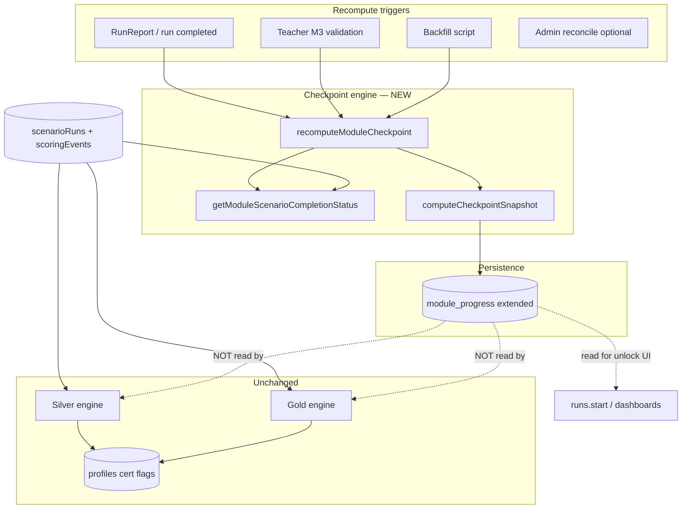

# Checkpoint Engine — Implementation Plan

**Date:** 2026-06-23  
**Status:** Proposal — **do not implement until approved**  
**Basis:** [CURRENT_CERTIFICATION_AND_CHECKPOINT_LOGIC_AUDIT.md](./CURRENT_CERTIFICATION_AND_CHECKPOINT_LOGIC_AUDIT.md)

---

## 1. Purpose and scope

### Goal

Introduce a **unified checkpoint progression engine** for TEC.WMS that:

- Aligns pedagogical truth with persisted state for **M2–M5**
- Supports **Cohorte Fondatrice** (existing data) and **future cohorts** without rewriting certification
- Fixes the current defect where `module_progress.passed` can become `true` from **one** passing scenario

### Pedagogical model (target)

| Layer | Modules | Meaning |
|-------|---------|---------|
| **Silver certification gate** | M1 | Quiz M1 + SCN-001…005 + compliance + blockers (unchanged) |
| **Pedagogical checkpoints** | M2, M3, M4, M5 | All official module SCNs completed at module threshold |
| **Gold certification** | M2–M5 pathway | Silver awarded + Quiz M5 + Gold eligibility gates (unchanged) |

### Explicit non-goals (this phase)

- Changing Silver or Gold eligibility predicates
- Tracking slides server-side or gating checkpoints on slides
- Including quizzes M2–M4 in checkpoint computation
- Modifying certificate registry JSON, PDF artifacts, or `profiles.silverCertified` / `profiles.goldCertified` during backfill
- Replacing in-run session `%` (`calculateProgressPctAllModules`) — that remains run-scoped

---

## 2. Design principles

1. **Certification engines stay pure** — `getSilverCertificationStatus` and `getGoldCertificationStatus` remain the authority for cert eligibility; they continue to read runs/quizzes directly, not `module_progress`.
2. **Checkpoint engine owns M2–M5 module rows** — single recompute function, same “latest non-demo completed run per SCN” rule as certification.
3. **One module = all official SCNs** — checkpoint `passed` requires every SCN in `OFFICIAL_SCN_BY_MODULE[moduleId]` to pass at threshold; partial completion updates `progressPct` only.
4. **Latest run wins** — a newer failing eval run revokes credit for that SCN (consistent with Silver/Gold).
5. **Cohort-safe** — computation is per `userId`; cohort-specific policy (e.g. M3 teacher gate) is configuration, not hard-coded student lists.
6. **Additive schema** — extend `module_progress`; avoid breaking existing API consumers during rollout.

---

## 3. Target architecture



---

## 4. Checkpoint computation rules

### 4.1 Modules in scope

| moduleId | Role | Official SCNs | Threshold | Teacher gate |
|----------|------|---------------|-----------|--------------|
| 1 | Silver gate (out of checkpoint engine) | SCN-001…005 | 60 | No |
| 2 | Checkpoint | SCN-006, 007, 008 | **60** | No |
| 3 | Checkpoint | SCN-009, 010, 011 | **70** | **Yes** — `teacherValidated` required for `passed` and for 100% `progressPct` |
| 4 | Checkpoint | SCN-012, 013, 014 | **70** | No |
| 5 | Checkpoint | SCN-015, 016, 017 | **70** | No |

Thresholds sourced from existing `getModuleScenarioPassThreshold(moduleId)` in `shared/moduleThresholds.ts`.

### 4.2 Per-SCN pass (same semantics as Gold path)

For each official SCN in the module:

1. Resolve canonical scenario row(s) via `scenarioIdsForScn` / `OFFICIAL_SCN_BY_MODULE`
2. Find **latest** `scenarioRuns` row where `status = completed`, `isDemo = false`
3. Score = `calculateTotalScore(scoringEvents)` clamped 0–100
4. SCN **passes** iff score ≥ module threshold
5. If no completed eval run → SCN **not complete**
6. If latest run exists but score < threshold → SCN **failed / blocks** module checkpoint

Optional future enhancement (not v1): also require compliance step + no blockers per SCN for `passed`. **v1 matches certification SCN score gates only** to avoid diverging checkpoint vs Gold SCN completion. Document as Phase 2 if pedagogical stakeholders require compliance in checkpoint `passed`.

### 4.3 Aggregated fields

```typescript
type ModuleCheckpointSnapshot = {
  moduleId: number;
  requiredScenarios: number;           // len(OFFICIAL_SCN_BY_MODULE[moduleId])
  completedScenarios: number;        // SCNs passing threshold
  progressPct: number;               // 0–100, see formula below
  scenarioStatus: Record<string, {   // e.g. SCN006: { passed, score, runId? }
    passed: boolean;
    score: number | null;
    runId: number | null;
  }>;
  bestScore: number;                 // max score across latest runs per SCN
  averageScore: number | null;       // mean of latest-run scores where run exists
  passed: boolean;                   // all SCNs pass AND M3 teacher rule
  completedAt: Date | null;          // set when passed first becomes true
  teacherValidated: boolean;         // preserved from existing row / teacher mutation
};
```

**`progressPct` formula**

| Module | Formula |
|--------|---------|
| M2, M4, M5 | `round(completedScenarios / requiredScenarios * 100)` |
| M3 | `round((completedScenarios + (teacherValidated ? 1 : 0)) / (requiredScenarios + 1) * 100)` |

Examples: M2 with 2/3 SCNs → 67%. M3 with 3/3 SCNs but no teacher validation → 75% (3/4). M3 with 3/3 + validated → 100%.

**`passed` formula**

```
passed =
  completedScenarios === requiredScenarios
  && every SCN latest-run score ≥ threshold
  && (moduleId !== 3 || teacherValidated)
```

**`bestScore` vs `averageScore`**

- Persist **`bestScore`** on `module_progress` (existing column) = max of latest-run scores across module SCNs (0 if no runs).
- Add **`averageScore`** (nullable int) = rounded mean of latest-run scores where a run exists; null if no runs.
- UI/OIL can show either; Gold/cert logic unaffected.

### 4.4 M1 handling

M1 remains the **Silver certification gate**, not a pedagogical checkpoint in this engine.

- **Do not** change Silver computation.
- **Optional alignment (Phase 1.5):** stop writing M1 `module_progress.passed` from single-scenario `recordModulePass`, or route M1 through the same all-SCN logic for unlock consistency. Default recommendation: **exclude M1 from checkpoint engine v1**; M1 unlock for M2 continues to use existing M1 row until a follow-up aligns M1 to five-SCN `passed`.

---

## 5. Proposed functions and module layout

### New file: `server/checkpointEngine.ts`

| Function | Responsibility |
|----------|----------------|
| `CHECKPOINT_MODULE_IDS` | `[2, 3, 4, 5]` constant |
| `scnKeysForModule(moduleId)` | Map `OFFICIAL_SCN_BY_MODULE[n]` → internal keys (`SCN006`, …) |
| `getModuleScenarioCompletionStatus(userId, moduleId)` | Per-SCN pass map + scores (extract shared logic from Gold/M1 patterns) |
| `computeModuleCheckpointSnapshot(userId, moduleId, existingRow?)` | Pure computation → `ModuleCheckpointSnapshot` |
| `recomputeModuleCheckpoint(userId, moduleId)` | Compute + upsert `module_progress` |
| `recomputeAllModuleCheckpoints(userId)` | Loop M2–M5; used by backfill |
| `isModuleCheckpointPassed(snapshot)` | Predicate helper for unlock gates |
| `getCheckpointProgressForUser(userId)` | Read model for API (join modules metadata) |

### Refactor (internal, no behavior change to cert)

| Function | Change |
|----------|--------|
| `goldCertification.getGoldScenarioCompletionStatus` | Optionally delegate per-module slices to shared helper in `checkpointEngine` to avoid drift (**refactor after checkpoint tests green**) |
| `db.getM1ScenarioCompletionStatus` | Unchanged in v1 |

### Modified: `server/db.ts`

| Function | Change |
|----------|--------|
| `upsertModuleProgress` | Accept new fields; or add `upsertModuleCheckpoint(snapshot)` |
| `getModuleProgressWithModules` | Return extended fields |
| `getModuleProgressRow` | Return extended fields |

### Modified: `server/routers.ts`

| Endpoint | Change |
|----------|--------|
| `warehouse.recordModulePass` | **Replace** single-score `computeModulePassResult` path for M2–M5 with `recomputeModuleCheckpoint(userId, moduleId)`. Keep M1 path for Silver unlock side-effect only (or deprecate M1 write). |
| `warehouse.validateTeacherModule` | After `setTeacherValidated`, call `recomputeModuleCheckpoint(userId, 3)` |
| `runs.start` | Optionally tighten unlock: M3 requires M2 checkpoint passed, M4 requires M3 checkpoint + teacher, M5 requires M4 checkpoint (feature-flagged `CHECKPOINT_STRICT_UNLOCK`) |
| `modules.progress` | Expose new fields to client |

### Modified: `shared/moduleThresholds.ts`

| Change |
|--------|
| Deprecate direct use of `computeModulePassResult` for M2–M5 checkpoint writes; keep function for tests documenting grandfather behavior until removed |

### Client (read-only display updates — Phase 1 UI)

| File | Change |
|------|--------|
| `Module3ScenarioList.tsx`, `Module4Dashboard.tsx`, `Module5SimulationPage.tsx` | Use `progressPct`, `completedScenarios` / `requiredScenarios` instead of inferring from single `passed` |
| `OperationalIntelligenceLayer.tsx` Panel E | Show checkpoint SCN breakdown when available |
| `TeacherDashboard.tsx` | Show M3 x/y SCNs + validation state |

---

## 6. Data model impact

### 6.1 `module_progress` table extensions

**Migration:** `drizzle/00XX_checkpoint_engine.sql` (new)

| Column | Type | Default | Notes |
|--------|------|---------|-------|
| `progressPct` | `INT NOT NULL` | `0` | 0–100 |
| `completedScenarios` | `INT NOT NULL` | `0` | |
| `requiredScenarios` | `INT NOT NULL` | `3` | M2–M5 always 3 today |
| `averageScore` | `INT NULL` | `NULL` | Rounded mean |
| `scenarioStatusJson` | `JSON NULL` | `NULL` | `{ "SCN006": { "passed", "score", "runId" }, ... }` |
| `engineVersion` | `VARCHAR(16) NULL` | `'ckpt-v1'` | Backfill / rollback marker |

**Unchanged columns:** `passed`, `bestScore`, `completedAt`, `teacherValidated`, `teacherValidatedAt`, unique `(userId, moduleId)`.

**Remove behavior (not column):** `passed` must no longer flip true from one scenario score.

### 6.2 Drizzle schema

Update `drizzle/schema.ts` `moduleProgress` definition to match migration.

### 6.3 No changes to

- `profiles.silverCertified`, `profiles.goldCertified`
- `shared/silverCertificationRegistry.ts`, `shared/certification/*` registry files
- `quizAttempts`, slides data

### 6.4 Cohort configuration (future-proofing)

Add optional table **`cohort_progress_policy`** (Phase 2 — can stub in code as constants v1):

| Field | Example |
|-------|---------|
| `cohortId` | `1` (Cohorte Fondatrice) |
| `m3TeacherGateEnabled` | `true` |
| `strictModuleUnlockChain` | `false` → `true` when ready |

v1: hard-code `m3TeacherGateEnabled = true` globally to match current production behavior.

---

## 7. Migration and backfill strategy

### 7.1 Migration phases

| Phase | Action | Downtime |
|-------|--------|----------|
| **M1** | Add nullable columns + deploy code that **writes and reads** new fields but still tolerates nulls | None |
| **M2** | Run backfill on staging → production | None |
| **M3** | Switch `recordModulePass` to checkpoint recompute for M2–M5 | None |
| **M4** | Enable strict unlock flag (optional, post-validation) | None |

### 7.2 Backfill script

**New file:** `scripts/backfill-cohorte-fondatrice-checkpoints.mjs`

**Mode flags:**

- `--dry-run` (default) — print diff only
- `--apply` — write `module_progress`
- `--user-email=<email>` — single student
- `--module=2|3|4|5|all`

**Target students (Cohorte Fondatrice):**

| Name | Email |
|------|-------|
| Darlin Campaz Paredes | `dcparedes2010@gmail.com` |
| Fredy Tamile Lola | `fredlolabio@gmail.com` |
| Prince Agbodjan Sewa Francis Ghislain | `sewafrancispa@gmail.com` |
| Aissata Soukeina Camara | `aissatasoukeinacamara@gmail.com` |

**Algorithm per student:**

1. Resolve `userId` by email (direct DB or admin API)
2. Load existing `module_progress` rows for M2–M5 (preserve `teacherValidated` / `teacherValidatedAt`)
3. For each module 2–5, call same logic as `computeModuleCheckpointSnapshot` against DB:
   - Query `scenarioRuns` + `scoringEvents` (no tRPC, no `silverStatus` / `goldStatus` — avoids cert side-effects)
4. Compare snapshot vs current row; log delta table
5. If `--apply`: upsert `module_progress` with new fields and corrected `passed` / `bestScore` / `completedAt`
6. **Never** UPDATE `profiles`, registry JSON, or certificate IDs

**Expected corrections:**

- Students with `passed=true` but only 1–2 SCNs → `passed=false`, `progressPct` adjusted
- Students with all SCNs pass but stale `bestScore` → `bestScore` / `averageScore` refreshed
- M3 rows with all SCNs pass but `progressPct` should reflect missing teacher validation

**Output artifact:** `.manus-logs/checkpoint-backfill-{timestamp}.json` with before/after per user/module.

### 7.3 Grandfather policy

Current `computeModulePassResult` grandfathered M3–M5 `passed` for legacy sub-70 scores. **Checkpoint engine does not grandfather SCN completion** — pedagogical truth requires each SCN ≥ threshold on latest run.

For Cohorte Fondatrice backfill:

- If a student was marked `passed` only due to grandfather but all SCNs now pass → remain passed
- If `passed` was true from one SCN only → **correct to false** unless all SCNs pass
- Document corrections in backfill JSON for instructor communication

---

## 8. Test matrix

### 8.1 New file: `server/checkpointEngine.test.ts`

Use fixture user IDs / mocked DB consistent with `gold.certification.test.ts` patterns.

| ID | Case | Input | Expected |
|----|------|-------|----------|
| **CK-M2-01** | M2 100% | SCN-006, 007, 008 latest runs ≥ 60 | `progressPct=100`, `passed=true`, `completedScenarios=3` |
| **CK-M2-02** | M2 partial | 006 ✓, 007 ✓, 008 ✗ | `progressPct=67`, `passed=false` |
| **CK-M2-03** | One scenario must not pass module | Only 006 ≥ 60 | `passed=false` (regression for audit gap) |
| **CK-M2-04** | Failed latest run blocks | 006 passed, then new 006 run < 60 | SCN-006 `passed=false`, module not passed |
| **CK-M3-01** | M3 SCNs only | 009–011 ≥ 70, not teacher validated | `progressPct=75`, `passed=false` |
| **CK-M3-02** | M3 100% + pass | 009–011 ≥ 70 + `teacherValidated=true` | `progressPct=100`, `passed=true` |
| **CK-M3-03** | Teacher alone insufficient | validated, 0 SCNs | `passed=false`, `progressPct=25` |
| **CK-M4-01** | M4 100% | 012–014 ≥ 70 | `progressPct=100`, `passed=true` |
| **CK-M4-02** | M4 one fail | 012 ✓, 013 ✓, 014 ✗ | `progressPct=67`, `passed=false` |
| **CK-M5-01** | M5 100% | 015–017 ≥ 70 | `progressPct=100`, `passed=true` |
| **CK-M5-02** | SCN-017 capstone fail | 015 ✓, 016 ✓, 017 < 70 | `passed=false` |
| **CK-ISO-01** | Cohort isolation | User A passes M2; User B no runs | B`s M2 snapshot all false; no bleed from A |
| **CK-ISO-02** | Demo runs ignored | Demo run score 100 | Does not count toward checkpoint |
| **CK-TRG-01** | Recompute on teacher validate | 3/3 SCNs + set validated | `progressPct` 75→100, `passed` false→true |
| **CK-TRG-02** | Recompute on run complete | Complete 3rd SCN | Idempotent upsert; `completedAt` set once |

### 8.2 Integration: `server/checkpoint.integration.test.ts` (optional)

- `recordModulePass` after mocked run completion triggers full module recompute
- Assert no calls to `unlockSilverCertification` / `unlockGoldCertification` from checkpoint path alone

### 8.3 Unchanged test suites (must stay green)

| File | Requirement |
|------|-------------|
| `server/silver.certification.test.ts` | Zero assertion changes |
| `server/gold.certification.test.ts` | Zero assertion changes; `teacherValidated` still not in Gold predicate |
| `server/certification.verification.test.ts` | Registry verification unchanged |
| `server/wave2.progression.test.ts` | Keep threshold tests; add note that M2–M5 `computeModulePassResult` is legacy for M1/ grandfather docs only |

### 8.4 Manual smoke (Cohorte Fondatrice)

After backfill `--apply` on staging:

1. Log in as each of the four students
2. Verify M2–M5 dashboards show x/3 SCNs and `progressPct` matches manual run audit
3. Verify `/student/certifications` Silver/Gold checklist **unchanged** vs pre-backfill
4. Verify certificate preview / registry IDs unchanged

---

## 9. Affected files summary

| File | Action |
|------|--------|
| `server/checkpointEngine.ts` | **Create** |
| `server/checkpointEngine.test.ts` | **Create** |
| `scripts/backfill-cohorte-fondatrice-checkpoints.mjs` | **Create** |
| `drizzle/00XX_checkpoint_engine.sql` | **Create** migration |
| `drizzle/schema.ts` | **Modify** `moduleProgress` columns |
| `server/db.ts` | **Modify** upsert/read helpers |
| `server/routers.ts` | **Modify** `recordModulePass`, `validateTeacherModule`, optional `runs.start` |
| `shared/moduleThresholds.ts` | **Modify** comments; optional `isCheckpointModule(moduleId)` |
| `server/goldCertification.ts` | **Optional refactor** to shared SCN helper (post-v1) |
| `client/src/pages/student/Module*Dashboard*.tsx` | **Modify** display |
| `client/src/components/operational-intelligence/OperationalIntelligenceLayer.tsx` | **Modify** display |
| `client/src/pages/teacher/TeacherDashboard.tsx` | **Modify** M3 monitor |
| `CURRENT_CERTIFICATION_AND_CHECKPOINT_LOGIC_AUDIT.md` | Reference only |
| `server/silver.certification.test.ts` | **No change** |
| `server/gold.certification.test.ts` | **No change** |

---

## 10. Rollout steps

| Step | Owner | Description |
|------|-------|-------------|
| 1 | Dev | Implement `checkpointEngine.ts` + unit tests (CK-* matrix) |
| 2 | Dev | Schema migration on staging |
| 3 | Dev | Wire `recordModulePass` / `validateTeacherModule` to recompute |
| 4 | Dev | Extend `modules.progress` API response |
| 5 | QA | Run full vitest + cert suites on CI |
| 6 | Ops | `--dry-run` backfill against staging DB |
| 7 | Pedagogy | Review backfill diff with instructor; confirm M3 teacher rows |
| 8 | Ops | `--apply` backfill staging → smoke four students |
| 9 | Dev | UI polish for progressPct / SCN counts |
| 10 | Ops | Production migration + `--dry-run` → `--apply` backfill |
| 11 | Ops | Monitor; keep `CHECKPOINT_STRICT_UNLOCK=false` until week 2 |
| 12 | Dev | Optional: enable strict module unlock chain |

**Feature flags (env):**

| Flag | Default | Purpose |
|------|---------|---------|
| `CHECKPOINT_ENGINE_ENABLED` | `true` after deploy | Kill-switch to old `recordModulePass` path |
| `CHECKPOINT_STRICT_UNLOCK` | `false` | Enforce M2→M3→M4→M5 chain on `runs.start` |

---

## 11. Rollback plan

| Scenario | Action |
|----------|--------|
| **Logic bug before backfill** | Set `CHECKPOINT_ENGINE_ENABLED=false`; redeploy previous `recordModulePass` |
| **Bad backfill** | Restore `module_progress` from pre-backfill SQL dump (columns `passed`, `bestScore`, `completedAt`, `teacherValidated` only); new columns can remain |
| **Schema issue** | Migration down drops new columns; code revert |
| **Cert regression** | Immediate revert — cert code must not be touched in v1; if detected, block rollout |

**Pre-backfill backup (required):**

```sql
CREATE TABLE module_progress_backup_20260623 AS SELECT * FROM module_progress;
```

**Rollback does not touch** certificate registry or `profiles` cert flags.

---

## 12. Acceptance criteria

- [ ] M2–M5 `passed` true **iff** all module SCNs pass at threshold (and M3 teacher validated)
- [ ] `progressPct` matches formulas in §4.3
- [ ] Single passing scenario cannot set `passed=true`
- [ ] Latest failing run revokes SCN credit
- [ ] Slides and quizzes M2–M4 do not affect checkpoint fields
- [ ] Quiz M5 remains Gold-only; not in checkpoint `passed`
- [ ] Silver and Gold test suites pass unchanged
- [ ] Backfill completes for four Cohorte Fondatrice students without cert/registry mutation
- [ ] API `modules.progress` exposes `completedScenarios`, `requiredScenarios`, `progressPct`

---

## 13. Open decisions (require approval before implementation)

| # | Question | Recommendation |
|---|----------|----------------|
| 1 | Should M1 `module_progress.passed` align to five-SCN rule in v1? | **Defer** — M1 stays Silver-driven; fix M2–M5 first |
| 2 | Should checkpoint `passed` require compliance steps per SCN? | **Defer to Phase 2** — score-only v1 aligns with Gold SCN map |
| 3 | Enable strict unlock chain at launch? | **No** — backfill + UI first; flag later |
| 4 | Store `scenarioStatusJson` vs normalized child table? | **JSON v1** — simpler; normalize if reporting needs grow |
| 5 | `bestScore` vs `averageScore` as primary display? | **Show both**; `bestScore` keeps column compat |

---

## 14. Implementation estimate

| Workstream | Effort |
|------------|--------|
| Engine + tests | 1.5–2 days |
| Schema + db layer | 0.5 day |
| Router wiring | 0.5 day |
| Backfill script + staging run | 1 day |
| Client display updates | 1 day |
| QA + Cohorte smoke | 1 day |
| **Total** | **~5 days** |

---

*End of plan — awaiting approval before any code changes.*
