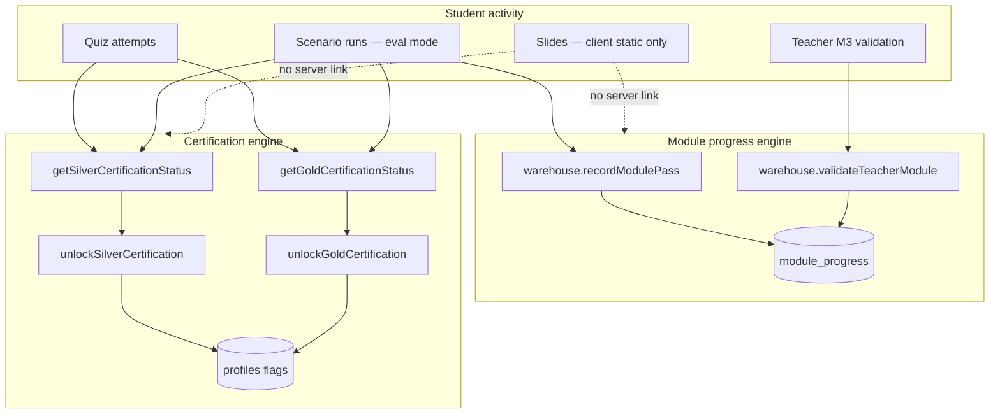

# Current Certification and Checkpoint Logic — Code Audit

**Date:** 2026-06-23  
**Scope:** Read-only inspection of the live certification engine (`server/db.ts`, `server/goldCertification.ts`) and progress engine (`module_progress` table, unlock gates, scenario/quiz flows).  
**No code was modified.**

---

## Executive Summary

The platform maintains **two parallel progress systems** that must not be conflated:

| System | Purpose | Primary storage |
|--------|---------|-----------------|
| **Certification engine** | Silver (M1) and Gold (M2–M5 pathway) eligibility and award | `profiles.silverCertified`, `profiles.goldCertified` + live recomputation |
| **Module progress engine** | Per-module unlock hints, teacher validation, best scenario score | `module_progress` table |

**Silver** requires four live gates on M1 (quiz + five SCNs + compliance + blockers).  
**Gold** requires Silver **awarded** (persisted flag), Quiz M5, all twelve Gold-path SCNs (SCN-006–017), M2–M5 compliance steps, module compliance validators (M3–M5), blockers, plus SCN-016 variance ordering and SCN-017 capstone gates.

**Slides are not tracked** anywhere in server logic and do not affect certification or `module_progress`.  
**Quizzes M2–M4 exist** in the database but are **not** inputs to certification or `module_progress`; only **Quiz M1** (Silver) and **Quiz M5** (Gold) matter for certification.

There is **no dedicated “checkpoint engine”** for M2–M5. The word “checkpoint” in the UI refers to static pedagogical `controlPoints` on mission briefings (OIL Panel F), not computed module state.

---

## Architecture



**Key source files**

| Area | File |
|------|------|
| Silver eligibility | `server/db.ts` — `getSilverCertificationStatus`, gate helpers |
| Gold eligibility | `server/goldCertification.ts` — `getGoldCertificationStatus` |
| Module pass thresholds | `shared/moduleThresholds.ts` — `computeModulePassResult`, `getModuleScenarioPassThreshold` |
| Module progress CRUD | `server/db.ts` — `upsertModuleProgress`, `setTeacherValidated` |
| Unlock / run gates | `server/routers.ts` — `runs.start`, `warehouse.recordModulePass` |
| In-run step progress | `server/rulesEngine.ts` — `calculateProgressPctAllModules`, `MODULE*_STEPS` |
| UI certification checklist | `client/src/pages/student/CertificationsPage.tsx` |
| Schema | `drizzle/schema.ts` — `module_progress`, `profiles` |

---

## 1. What Currently Triggers Silver Eligibility

**Function:** `getSilverCertificationStatus(userId)` in `server/db.ts`

**Predicate (all four must be true):**

```typescript
const silverEligible = quizPassed && allScenariosDone && complianceValidated && noBlockers;
```

### Gate 1 — Quiz M1 ≥ 60%

| Detail | Value |
|--------|-------|
| Function | `checkM1QuizPassed` |
| Source | Best `quizAttempts.score` for the M1 quiz row |
| Threshold | `QUIZ_PASS_THRESHOLD` = **60** (`shared/moduleThresholds.ts`) |

### Gate 2 — SCN-001 … SCN-005 each ≥ 60/100

| Detail | Value |
|--------|-------|
| Function | `getM1ScenarioCompletionStatus` |
| Scope | Latest **non-demo**, **completed** run per canonical SCN |
| Score | `calculateTotalScore(scoringEvents)` clamped 0–100 |
| Threshold | **60** per SCN (`M1_PASSING_SCORE`) |
| Rule | **Latest run wins** — a newer failing run revokes credit for that SCN |

### Gate 3 — M1 compliance validated

| Detail | Value |
|--------|-------|
| Function | `checkM1ComplianceValidated` |
| Rule | On each SCN’s latest eval run: `progress` row with `stepCode = "COMPLIANCE"` and `completed = true` |

### Gate 4 — No unresolved blockers

| Detail | Value |
|--------|-------|
| Function | `checkNoUnresolvedBlockers` |
| Rule | On each SCN’s latest eval run: no `transactions.posted = false`; no `cycleCounts.resolved = false` |

### Short-circuit when already awarded

If `profiles.silverCertified === true`, `getSilverCertificationStatus` **returns all gates as true without re-querying runs**. Eligibility is not re-validated on read for awarded students.

### Silver award (persisted), not just eligibility

Award writes `profiles.silverCertified = true` via `unlockSilverCertification`. Triggers:

| Trigger | Location | Notes |
|---------|----------|-------|
| Lazy on certifications query | `profiles.silverStatus` | If `silverEligible && !silverCertified` → unlock |
| After M1 run report | `warehouse.recordModulePass` when `moduleId === 1` | Re-checks all four gates |
| After M1 quiz submit | `quiz.submit` when `moduleId === 1` | Re-checks via `getSilverCertificationStatus` |
| **Not** on compliance finalize alone | `compliance.finalize` → `completeRun` | Does not unlock Silver directly |

There is **no instructor approval** for Silver. The flag is **write-once** in normal flows; admin paths can reset it (`resetStudentCertification`, `cleanupAndAudit`).

### What does **not** trigger Silver

- `module_progress.passed` for M1 (separate system; one passing scenario can set `passed=true` but Silver needs **all five** SCNs individually)
- Slides completion
- Quizzes M2–M5
- Demo runs (`scenarioRuns.isDemo = true`)

---

## 2. What Currently Triggers Gold Eligibility

**Function:** `getGoldCertificationStatus(userId)` in `server/goldCertification.ts`

**Prerequisite:** `profiles.silverCertified === true` (persisted Silver **award**, not merely live `silverEligible`). If Silver flag is false, all Gold gates are skipped/false and state is `LOCKED`.

**Predicate (all must be true):**

```typescript
const goldEligible =
  silverPrerequisite &&
  quizM5Passed &&
  allScenariosDone &&
  complianceValidated &&
  noBlockers &&
  moduleCompliancePassed &&
  scn016VarianceBeforeKpi &&
  scn017Gates.capstoneScore &&
  scn017Gates.decisionLinked;
```

### Requirement breakdown (18 checklist rows — `GOLD_REQUIREMENTS_TOTAL`)

| # | Gate | Function | Detail |
|---|------|----------|--------|
| 1 | Silver prerequisite | `silverPrerequisite` | `profiles.silverCertified` |
| 2 | Quiz M5 ≥ 60% | `checkM5QuizPassed` | Best M5 quiz attempt ≥ `QUIZ_PASS_THRESHOLD` (60) |
| 3–14 | SCN-006 … SCN-017 | `getGoldScenarioCompletionStatus` | Latest non-demo completed run per SCN; score vs module threshold |
| 15 | M2–M5 compliance steps | `checkGoldComplianceValidated` | Latest run per SCN has module compliance step completed (`COMPLIANCE_ADV`, `COMPLIANCE_M3`, `COMPLIANCE_M4`, `COMPLIANCE_M5`) |
| 16 | No blockers | `checkGoldNoUnresolvedBlockers` | Unposted txs / unresolved cycle counts on each Gold-path SCN’s latest run |
| 17 | Module compliance validators | `checkGoldModuleCompliance` | Deep validators on M3–M5 SCNs only; **M2 always returns true** in `checkModuleComplianceForRun` |
| 18a | SCN-016 variance before KPI | `checkScn016VarianceGate` | Variance resolved + if `M5_KPI` completed, `M5_ADJ` must appear before it |
| 18b | SCN-017 capstone | `checkScn017CapstoneGates` | Score ≥ **70** (`GOLD_CAPSTONE_THRESHOLD`) + KPI snapshot exists + `M5_DECISION` and `M5_KPI` completed |

### Per-SCN score thresholds (Gold path)

| Module | SCNs | Threshold |
|--------|------|-----------|
| M2 | SCN-006, SCN-007, SCN-008 | **60** |
| M3 | SCN-009, SCN-010, SCN-011 | **70** |
| M4 | SCN-012, SCN-013, SCN-014 | **70** |
| M5 | SCN-015, SCN-016 | **70** |
| M5 capstone | SCN-017 | **70** (explicit capstone floor) |

Same **latest run wins** rule as Silver.

### Gold award (persisted)

Writes `profiles.goldCertified = true` via `unlockGoldCertification`. Triggers:

| Trigger | Location | Notes |
|---------|----------|-------|
| Lazy on certifications query | `profiles.goldStatus` | Only if `goldEligible && !goldCertified && isGoldUnlockEnabled()` |
| After M5 run report | `warehouse.recordModulePass` when `moduleId === 5` | Same flag gate |
| Admin reconciliation | `admin.cleanupAndAudit` | Recalculates vs `goldEligible && isGoldUnlockEnabled()` |

**Feature flag:** `ENABLE_GOLD_UNLOCK === "true"` required for automatic award. Default (unset/false) → students can sit at `ELIGIBLE` indefinitely with `goldCertified = false`.

### What does **not** trigger Gold unlock

- M5 quiz submit (`quiz.submit` has Silver unlock for M1 only — **no Gold unlock on M5 quiz submit**)
- Completing SCN-017 / compliance finalize alone (until `goldStatus` or M5 `recordModulePass` fires)
- `module_progress.passed` or `teacherValidated`
- Quizzes M2–M4

### Gold state machine

| State | Condition |
|-------|-----------|
| `LOCKED` | `!silverCertified` |
| `IN_PROGRESS` | Silver awarded; requirements incomplete |
| `ELIGIBLE` | `goldEligible && !goldCertified` |
| `AWARDED` | `goldCertified === true` |

---

## 3. How M2, M3, M4 and M5 “Checkpoints” Are Calculated

There is **no server-side “checkpoint” aggregate** for modules 2–5. Three distinct notions exist:

### A. Pedagogical checkpoints (UI only)

In `OperationalIntelligenceLayer` Panel F, “Points de contrôle / Checkpoints” renders `mission.controlPoints` from static mission/cockpit data. These are **not computed**, not stored, and **do not gate** progression or certification.

### B. In-run session progress (%)

**Function:** `calculateProgressPctAllModules(completedSteps, moduleId, state)` in `server/rulesEngine.ts`

Measures **operational steps completed within the current scenario run**, not module certification or Gold checklist items.

| Module | Step definitions | Step count (base) | Notes |
|--------|------------------|-------------------|-------|
| M2 | `MODULE2_STEPS` | 5 | GR → PUTAWAY → FIFO_PICK → STOCK_ACCURACY → COMPLIANCE_ADV |
| M3 | `MODULE3_STEPS` | 5 | CC_LIST → CC_COUNT → CC_RECON → REPLENISH → COMPLIANCE_M3 |
| M4 | `MODULE4_STEPS` | 5 | KPI_DATA → KPI_ROTATION → KPI_SERVICE → KPI_DIAGNOSTIC → COMPLIANCE_M4 |
| M5 | `MODULE5_STEPS` (+ dynamic `M5_ADJ`) | 7 or 8 | SCN-016 inserts `M5_ADJ` after cycle count when variance contract applies |

Formula: `round(completedStepsInList / effectiveStepCount * 100)`, capped at 100.

This percentage appears in Mission Control / Run Report / OIL Panel E. It is **orthogonal** to Gold eligibility (which uses per-SCN scores and compliance validators).

### C. Module-level “checkpoint” = `module_progress` row + unlock gates

Each module’s persisted checkpoint state is the `module_progress` row for `(userId, moduleId)`:

| Field | Meaning |
|-------|---------|
| `passed` | At least one eval scenario in the module reached the module pass threshold (see below) |
| `bestScore` | Maximum total score across all recorded eval completions in that module |
| `completedAt` | Timestamp when `passed` first became true |
| `teacherValidated` | Instructor flag — **only used for M3 → M4 gate** |
| `teacherValidatedAt` | Timestamp of teacher validation |

#### How `passed` is computed

**Trigger:** `RunReport.tsx` calls `warehouse.recordModulePass({ moduleId, score })` when a non-demo run is `completed`.

**Logic:** `computeModulePassResult(moduleId, score, existingPassed)` in `shared/moduleThresholds.ts`:

| Module | Pass threshold | Grandfather rule |
|--------|----------------|------------------|
| M1, M2 | **60** | None |
| M3, M4, M5 | **70** | If `existingPassed === true`, sub-threshold scores still retain `passed=true` |

**Important:** `passed` reflects **any single scenario** in the module hitting threshold, **not** all scenarios in the module. Gold certification, by contrast, requires **every** official SCN in the module to pass individually.

#### Per-module unlock / gate behavior

| Module | Server run-start gate (`runs.start`) | Client UI gate | Gold per-SCN requirements |
|--------|--------------------------------------|----------------|---------------------------|
| **M2** | M1 must be in `getPassedModuleIds()` (i.e. M1 `module_progress.passed`) | Recommended prerequisite messaging only | SCN-006, 007, 008 ≥ 60 + COMPLIANCE_ADV + blockers |
| **M3** | Same as M2 (only checks M1 passed) | Soft note if M2 not passed | SCN-009, 010, 011 ≥ 70 + COMPLIANCE_M3 + `validateM3Compliance` + blockers |
| **M4** | M1 passed **and** `isModule3Unlocked(m3Progress)` → M3 `passed && teacherValidated` | Hard block if M3 not passed or not teacher-validated | SCN-012, 013, 014 ≥ 70 + COMPLIANCE_M4 + `validateM4Compliance` + blockers |
| **M5** | Same as M2 (only M1 passed on server) | Soft note if M4 not passed | SCN-015, 016, 017 ≥ 70 + COMPLIANCE_M5 + `validateM5Compliance` + SCN-016/017 special gates + blockers |

**Schema chain vs enforced chain:** `modules.unlockedByModuleId` in seed defines M2←M1, M3←M2, M4←M3, M5←M4, but `runs.start` **does not walk that chain** — it only enforces M1 passed for modules ≥ 2, plus the M3 teacher-validation gate for M4. M5 has no server enforcement of M4 passed.

#### Teacher validation (M3 only)

- **Mutation:** `warehouse.validateTeacherModule` (teacher role)
- **Precondition:** Student must already have `module_progress.passed === true` for module 3
- **Effect:** Sets `teacherValidated` / `teacherValidatedAt` on M3 row
- **Purpose:** Unlocks M4 eval runs (server) and M4 dashboard (client)
- **Not referenced** in Gold eligibility predicate (`gold.certification.test.ts` explicitly asserts this)

---

## 4. Are Slides, Quiz and Scenarios Part of Progression Logic?

### Slides

| Aspect | Status |
|--------|--------|
| Content | Static arrays in `client/src/data/modules.ts`; counts in `client/src/data/slideCounts.ts` |
| Server tracking | **None** — no table, no API, no progress field |
| Certification | **Not included** |
| `module_progress` | **Not included** |
| Module unlock | **Not included** |
| UI | Navigation links only (`/student/slides/{moduleId}`); appears on journey strip as pedagogical step |

**Verdict:** Slides are **presentation-only** and are **not** part of progression logic.

### Quizzes

| Quiz | Seeded | Affects `module_progress` | Affects certification | Affects unlock |
|------|--------|----------------------------|----------------------|----------------|
| M1 | Yes | **No** | **Yes — Silver gate 1** | No (M1 scenarios don't require quiz for run start) |
| M2 | Yes | **No** | **No** | No |
| M3 | Yes | **No** | **No** | No |
| M4 | Yes | **No** | **No** | No |
| M5 | Yes | **No** | **Yes — Gold gate 2** | No |

`checkQuizPassed(userId, moduleId)` exists in `server/db.ts` but is **not wired** into run-start gates or certification beyond the M1/M5-specific helpers.

Quiz attempts are stored in `quizAttempts`; they do not write to `module_progress`.

### Scenarios

| Aspect | Status |
|--------|--------|
| **Central to certification** | Yes — Silver (5 M1 SCNs), Gold (12 SCNs SCN-006–017) |
| **`module_progress`** | Yes — via `recordModulePass` on completed eval run report |
| **Unlock gates** | Partial — M1 pass for M2+ server start; M3 teacher validation for M4 |
| **Demo runs** | Excluded from certification scoring (`isDemo = false` required) |
| **In-run steps** | `progress` table per run drives session % and compliance gates |

**Verdict:** Scenarios are the **primary driver** of both certification and `module_progress`. Quizzes matter only for M1 (Silver) and M5 (Gold). Slides do not matter.

---

## 5. Is `module_progress` Derived From …?

| Source | Derived? | Mechanism |
|--------|----------|-----------|
| **Slides** | **No** | No server read/write path |
| **Quizzes** | **No** | Quiz attempts never call `upsertModuleProgress` |
| **Scenarios** | **Yes (partial)** | `recordModulePass` after eval run completion sets `passed`, `bestScore`, `completedAt` from scenario total score |
| **Teacher validation** | **Yes (M3 only)** | `setTeacherValidated` writes `teacherValidated` / `teacherValidatedAt`; can insert a row with `passed=false` if none exists |
| **Certification state** | **No (one-way)** | Certification reads scenario/quiz data directly; it does **not** read `module_progress`. Completing Silver/Gold does not update `module_progress`. Conversely, `module_progress.passed` does not imply Silver or Gold eligibility |

### `module_progress` write paths (complete list)

1. **`warehouse.recordModulePass`** — upserts `passed`, `bestScore`, `completedAt` from scenario score
2. **`warehouse.validateTeacherModule`** — sets `teacherValidated` on M3 (requires M3 already `passed`)
3. **`setTeacherValidated`** — can insert minimal row if missing

### `module_progress` read paths (representative)

- `modules.progress` / `warehouse.myProgress` — student dashboards, OIL Panel E
- `getPassedModuleIds` — `runs.start` unlock for M2+
- `getModuleProgressRow` — M4 server gate, teacher validation precondition
- `warehouse.allModuleProgress` — teacher monitor

### Deduping note

`getModuleProgressByUser` orders rows by `teacherValidated DESC, passed DESC, bestScore DESC, …` and dedupes by `moduleId`. Legacy duplicate rows prefer the “best” row by that ordering.

---

## Cross-System Consistency Gaps (Observed)

These are audit findings, not change proposals:

1. **`module_progress.passed` vs certification** — A student can have M1 `passed=true` from one strong SCN while failing Silver (needs all five SCNs). Gold requires every SCN individually, not `module_progress.passed`.

2. **Unlock chain mismatch** — DB seed defines linear `unlockedByModuleId` M1→M2→M3→M4→M5, but server only enforces M1 pass (+ M3 teacher validation for M4). M3/M5 access is largely open once M1 is passed.

3. **Silver short-circuit** — Awarded Silver skips live gate revalidation on read; stale awards possible if later runs fail gates (flag not auto-cleared).

4. **Gold lazy unlock gap** — Without visiting `/student/certifications` or completing an M5 run report (with flag on), Gold may remain `ELIGIBLE` but unawarded even when all gates are met.

5. **Quiz M5 submit** — Does not trigger Gold unlock (unlike M1 quiz → Silver unlock).

6. **Session % vs certification %** — `calculateProgressPctAllModules` (run steps) and CertificationsPage checklist % measure different things.

---

## Quick Reference — Thresholds (GOV-T01)

| Rule | Value | Source |
|------|-------|--------|
| Quiz pass (M1, M5) | 60% | `QUIZ_PASS_THRESHOLD` |
| M1/M2 scenario pass | 60/100 | `getModuleScenarioPassThreshold(1|2)` |
| M3/M4/M5 scenario pass | 70/100 | `getModuleScenarioPassThreshold(3+)` |
| SCN-017 Gold capstone | 70/100 | `GOLD_CAPSTONE_THRESHOLD` |

---

## Conclusion

- **Silver eligibility** = live conjunction of M1 quiz (≥60%), five M1 SCNs (≥60 each, latest eval run), M1 compliance step on each, and no blockers.
- **Gold eligibility** = persisted Silver + M5 quiz + twelve Gold-path SCNs at module thresholds + layered compliance/blocker/capstone gates; award gated by `ENABLE_GOLD_UNLOCK`.
- **M2–M5 “checkpoints”** in code = (1) static OIL mission control points, (2) in-run step %, and (3) `module_progress` row plus sparse unlock rules — **not** a unified checkpoint engine.
- **`module_progress`** is derived from **scenario scores** and **M3 teacher validation** only; it is **not** derived from slides, quizzes, or certification flags, and certification does **not** derive from `module_progress`.
