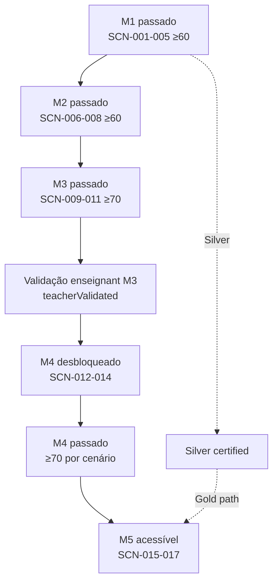
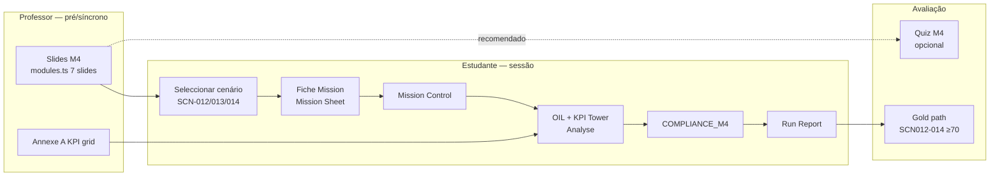

# TEC.WMS — Aula 9 · Plano Operacional de Execução

**Document type:** Operational execution plan (Class 9)  
**Programme:** TEC.WMS · TEC.LOG — Collège de la Concorde  
**Cohort:** Cohorte Fondatrice · Session 2025–2026 (ID 1)  
**Platform:** `https://tec-wms-simulator-production-production.up.railway.app`  
**Repository / branch:** `production-hotfix-rc13-pedagogy-class6` @ `cb1ca10` ou mais recente  
**RC13 status:** Estabilizado · M1/M2 GO · M3 estabilizado · M4/M5 auditados  
**Date:** 2026-06-17  
**Session mapping:** Aula 9 = **M4 — KPI Control Tower** (SCN-012, SCN-013, SCN-014)

---

## Executive Summary

A Aula 9 introduz o **Module 4 — Indicateurs de performance logistique**: cenários **analíticos** (sem movimentação física de stock) centrados na **KPI Control Tower**, interpretação de indicadores e decisão estratégica (S&OP capstone).

| Dimensão | Estado |
|----------|--------|
| Plataforma RC13 (M4 runtime) | **GO** — implementação + testes unitários completos |
| Cohorte Fondatrice (5 estudantes) | **GO** — contas, cohort, student numbers (4/4 Silver) |
| Silver Registry | **GO** — lookup compatível para Aissata, Darlin, Fredy, Prince |
| Smoke live S-10 (M4 E2E) | **PENDENTE** — bloqueado por gates de progressão em contas day-zero |
| Veredito operacional Aula 9 | **GO condicional** — sessão viável após pré-requisitos M1–M3 + validação M3 pelo professor |

**Ação crítica pré-aula:** Confirmar que **cada estudante** tem M1 e M2 passados, M3 passado (≥ 70/100) e **validação enseignant M3** activa — caso contrário, M4 permanece bloqueado em modo Évaluation.

---

## 1. Estado Actual de Cada Estudante

> **Fonte:** `Documentation/RC13_COHORTE_EXECUTION_REPORT.md` (2026-06-18) + bootstrap plan.  
> **Nota:** Progressão por módulo (`module_progress`, runs) deve ser **reconfirmada no Monitor Dashboard** na véspera da aula — os dados abaixo reflectem o cutover inicial.

### 1.1 Roster e bootstrap

| # | Estudante | Email | User ID | Student # | Certificado Silver (registry) | Conta / cohort |
|---|-----------|-------|---------|-----------|-------------------------------|----------------|
| 1 | Aissata Soukeina Camara | aissatasoukeinacamara@gmail.com | 184 | `2026-1806` | TEC-SIL-2026-001 | Pré-existente · cohort 1 |
| 2 | Darlin Campaz Paredes | dcparedes2010@gmail.com | 213 | `00-2004` | TEC-SIL-2026-002 | Criada RC13 · cohort 1 |
| 3 | Fredy Tamile Lola | fredlolabio@gmail.com | 216 | `1011-KF` | TEC-SIL-2026-003 | Criada RC13 · cohort 1 |
| 4 | Prince Agbodjan Sewa Francis Ghislain | sewafrancispa@gmail.com | 219 | `613-462` | TEC-SIL-2026-004 | Criada RC13 · cohort 1 |
| 5 | James Timothy | jamesnns3@gmail.com | 222 | *(null)* | *(sem slot registry)* | Criada RC13 · cohort 1 |

### 1.2 Estado pedagógico esperado vs. baseline RC13

| Estudante | Conta OK | Login OK | Student # | Silver lookup | Progressão M1–M3 (baseline) | Bloqueio M4 (baseline) |
|-----------|----------|----------|-----------|---------------|----------------------------|------------------------|
| Aissata | ✅ | ✅ | ✅ | ✅ COMPATIBLE | **Não confirmada** — smoke M4 falhou (M1 não passado) | Module 1 gate |
| Darlin | ✅ | ✅ | ✅ | ✅ COMPATIBLE | Day-zero | Module 1 gate |
| Fredy | ✅ | ✅ | ✅ | ✅ COMPATIBLE | Day-zero | Module 1 gate |
| Prince | ✅ | ✅ | ✅ | ✅ COMPATIBLE | Day-zero | Module 1 gate |
| James | ✅ | ✅ | N/A | N/A | Day-zero | Module 1 gate |

### 1.3 Interpretação para o professor

O contexto RC13 indica **M1 e M2 GO** e **M3 estabilizado** a nível de **plataforma** (conteúdo, validators, thresholds). Isso **não implica** que todos os estudantes já completaram M1–M3 em Railway.

**Perfil típico esperado no início da Aula 9** (se Aulas 1–8 foram cumpridas):

| Gate | Requisito | Threshold |
|------|-----------|-----------|
| M1 | Quiz M1 + SCN-001→005 (eval) + compliance + sem blockers | ≥ 60/100 · quiz ≥ 60% |
| M2 | SCN-006→008 completos | ≥ 60/100 |
| M3 | SCN-009→011 completos | ≥ 70/100 |
| M3 → M4 | **Validação enseignant M3** (`teacherValidated = true`) | Obrigatório (P0-07) |
| Silver | 4 gates M1 | Auto-unlock quando elegível |

**Checklist pré-aula (por estudante):** `/teacher/monitor` + Teacher Dashboard → secção **M3 awaiting validation**.

---

## 2. Progressão para Desbloqueio Natural de M4 e M5

### 2.1 Cadeia de desbloqueio (runtime)



### 2.2 Gates técnicos (`runs.start`, modo Évaluation)

| Módulo alvo | Gate servidor | Mensagem se bloqueado |
|-------------|---------------|------------------------|
| M2–M5 | M1 em `module_progress.passed` | *Module 2 verrouillé — complétez le Module 1 d'abord.* |
| M4 | M3 `passed` **e** `teacherValidated` | *Module 4 verrouillé — validation enseignant du Module 3 requise.* |
| M5 | Apenas M1 (sem gate M4 no servidor) | UI M5 pode mostrar alerta M4 advisory |

**Acção professor para M4:** `warehouse.validateTeacherModule` — botão no Teacher Dashboard para estudantes com M3 passado e `teacherValidated = false`.

### 2.3 O que desbloqueia M4 vs. M5

| Objectivo | Pré-requisitos naturais (sem bypass SQL) |
|-----------|------------------------------------------|
| **M4 — Aula 9** | M1 pass · M2 pass · M3 pass (≥70) · **M3 validado pelo professor** |
| **M5 — Aula 10** | M1 pass (gate servidor) · M4 pass recomendado (UI `unlockedByModuleId: 3` na seed) · Silver para Gold path |
| **Gold (Aula 10+)** | Silver + SCN-006→017 cada ≥ threshold + Quiz M5 ≥60% + compliance M2–M5 + gates SCN-016/017 |

### 2.4 Thresholds oficiais

Fonte: `shared/moduleThresholds.ts`

| Tipo | M1–M2 | M3–M5 | Quiz certificação |
|------|-------|-------|-------------------|
| Cenário (eval) | ≥ 60/100 | ≥ 70/100 | M1 e M5: ≥ 60% |
| M4 perfect score | — | max **75/100** (normal) | Quiz M4: pedagógico, **não** gate Silver/Gold |

---

## 3. Dependências Pedagógicas — Slides · Fiche · Scenario · Analyse · Quiz · Certification

### 3.1 Fluxo por camada (M4)



### 3.2 Matriz de dependências

| Camada | Artefacto | Função Aula 9 | Depende de | Alimenta |
|--------|-----------|---------------|------------|----------|
| **Slides** | `client/src/data/modules.ts` M4 slides 1–7 | Arco instructor: KPI overview → rotation → service/erreurs → RCA → Odoo → mapa SCN-012–014 | M3 concluído (conceitos stock) | Selecção de cenário; vocabulário Annexe A |
| **Fiche Mission** | `server/missionDataExtended.ts` SCN-012/013/014 | Briefing escrito (CFO Q3, SLA J-90, S&OP board) | Slide correspondente | Respostas KPI_DIAGNOSTIC + COMPLIANCE_M4 |
| **Scenario** | Eval run `runs.start` | Sessão avaliada; 5 steps M4 | M3 validado + M1 pass | Scoring, progress 100% |
| **Analyse** | KPI_DATA → KPI_ROTATION → KPI_SERVICE → KPI_DIAGNOSTIC | Interpretação na KPI Tower (OIL Panel B) | Fiche + Slides 2–5 | COMPLIANCE_M4 validator |
| **Quiz** | Quiz M4 (4 perguntas, pass 60%) | Reforço conceptual **fora** do gate cert | Slides 1–6 | *Não bloqueia* Silver/Gold |
| **Certification** | `goldCertification.ts` keys SCN012–014 | Cada SCN ≥ 70 no último run eval + COMPLIANCE_M4 | Silver pré-requisito Gold | Elegibilidade Gold (18 gates) |

### 3.3 Pipeline de steps M4 (todos os cenários)

```
KPI_DATA → KPI_ROTATION → KPI_SERVICE → KPI_DIAGNOSTIC → COMPLIANCE_M4
```

| Step | SCN-012 focus | SCN-013 focus | SCN-014 focus |
|------|---------------|---------------|---------------|
| KPI_DATA | Briefing tour | Briefing tour | Briefing tour |
| KPI_ROTATION | 6× = banda normal | Contexto normal | Multi-KPI |
| KPI_SERVICE | Excellent ≥95% | **Acknowledge excellent** + erros 4% | Excellent + erros |
| KPI_DIAGNOSTIC | Maintien / surveillance SKU | Lien picking-réception-OTIF + plan 90j | ≥3 domaines KPI + trade-off + ≥150 chars + délai 3,5j |
| COMPLIANCE_M4 | Anti-surstock @ 6× | Anti-destock lever | Anti mono-KPI capstone |

### 3.4 Mapa Slides → Cenários

| Slide M4 | Tema | Cenário |
|----------|------|---------|
| 1 | Dashboard KPI · moniteur vide = normal | Intro SCN-012–014 |
| 2 | Rotation 2400÷400=6× | **SCN-012** |
| 3 | Service 95% + erreurs 4% | **SCN-013** |
| 4 | Productivité / coût | Contexto transversal |
| 5 | Root Cause Analysis | **SCN-014** (capstone) |
| 6 | Odoo Reports (demo) | Reforço institucional |
| 7 | Application SCN-012–014 + Annexe A | Debrief + homework |

---

## 4. O Que Concluir Antes da Aula 10

### 4.1 Obrigatório (bloqueia ou degrada Aula 10)

| # | Requisito | Porquê |
|---|-----------|--------|
| 1 | **M1 pass + Silver elegível** (ideal: Silver earned) | Gold LOCKED sem Silver |
| 2 | **M2 pass** — SCN-006, 007, 008 ≥ 60 | Gold path SCN006–008 |
| 3 | **M3 pass + teacherValidated** | Gate M4; competências CC/ADJ/replenish |
| 4 | **SCN-012 completo** eval ≥ 70 + COMPLIANCE_M4 | Gold SCN012; fundação KPI |
| 5 | **SCN-013 completo** eval ≥ 70 + COMPLIANCE_M4 | Gold SCN013 |
| 6 | **SCN-014 completo** eval ≥ 70 + COMPLIANCE_M4 | Gold SCN014; capstone M4 |
| 7 | **M4 module pass** (via `recordModulePass`) | Desbloqueio UI M5 |

### 4.2 Fortemente recomendado antes da Aula 10

| # | Requisito | Notas |
|---|-----------|-------|
| 8 | Quiz M4 ≥ 60% | Reforço; não gate cert |
| 9 | Revisão Annexe A (valores canónicos partilhados M4/M5) | KPI seed idêntico em M5 |
| 10 | Run Report debrief SCN-014 (trade-offs) | Ponte narrativa Peak Week M5 |

### 4.3 Pode ficar para Aula 10 (M5)

| Item | Notas |
|------|-------|
| SCN-015, 016, 017 | Conteúdo principal Aula 10 |
| Quiz M5 ≥ 60% | Gate Gold |
| Gold award | Requer `ENABLE_GOLD_UNLOCK=true` + 18 gates |

---

## 5. Cenários Prioritários (Aula 9)

| Prioridade | SCN | Título | Tempo estimado | Razão |
|------------|-----|--------|----------------|-------|
| **P0 — Sessão** | SCN-012 | Normal Rotation / Complacency Trap | 45–55 min | Primeiro contacto M4; banda 6×; anti-surstock |
| **P0 — Sessão** | SCN-013 | Green Dashboard Trap | 45–55 min | Correlação erreurs ↔ OTIF; plano mensurável 90j |
| **P1 — Sessão ou homework** | SCN-014 | S&OP Multi-KPI Capstone | 50–60 min | Mais exigente; integra 012+013; **deadline antes Aula 10** |
| **P2 — Demo professor** | Qualquer SCN M4 modo Demo | 10 min | Mostrar scaffold completo (respostas demo-gated) |

**Sequência pedagógica obrigatória:** SCN-012 → SCN-013 → SCN-014 (validator SCN-014 assume competências das fases anteriores).

**Nota técnica:** Cenários analíticos — **moniteur de transacções vazio é comportamento correcto**. Reforçar desde Slide 1.

---

## 6. Checkpoints do Professor

### 6.1 Pré-aula (T−24h → T−30min)

| # | Checkpoint | Onde | Critério GO |
|---|------------|------|-------------|
| C0 | Plataforma online | `/login` | Sem erros JS; URL Railway correcta |
| C1 | Teacher auth | `/teacher` | Dashboard carrega |
| C2 | Cohort roster | `/teacher/students` cohort 1 | 5 estudantes visíveis |
| C3 | M3 validation queue | Teacher Dashboard | Lista vazia **ou** validar todos antes da aula |
| C4 | Student numbers | Monitor / profiles | 4/4 Silver numbers exactos |
| C5 | Scenario catalog | `/teacher/scenarios` | SCN-012, 013, 014 listados (M4) |
| C6 | Smoke opcional S-10 | Ver `RC13_FINAL_SMOKE_EXECUTION_GUIDE.md` | 1 conta com progressão M1–M3 |

### 6.2 Durante a aula (síncrono)

| # | Checkpoint | Acção |
|---|------------|-------|
| D1 | Modo Évaluation | Confirmar que estudantes **não** usam Demo para cert |
| D2 | Fiche Mission aberta | Cada run: Mission Sheet lida antes KPI_DATA |
| D3 | KPI Tower (OIL B) | Estudante classifica rotation/service antes diagnostic |
| D4 | COMPLIANCE_M4 | Monitor: step final verde; score ≥ 70 |
| D5 | False negatives texto | Se bloqueio: verificar vocabulário (prélèvement SCN-013; trade-off SCN-014; délai 3,5j) |
| D6 | Score ceiling | Expectativa **75/100 max** em run perfeito M4 — não penalizar por não atingir 100 |
| D7 | M3 stragglers | Estudante bloqueado → validar M3 ou assign homework M3 |

### 6.3 Pós-aula (T+0 → T+48h)

| # | Checkpoint | Acção |
|---|------------|-------|
| P1 | SCN-012/013 completed | Monitor: status completed, eval, score ≥ 70 |
| P2 | SCN-014 assigned | Homework se não concluído em sala |
| P3 | module_progress M4 | Pelo menos 1 cenário M4 passou threshold |
| P4 | Certifications page | Estudantes Silver: Gold IN_PROGRESS com SCN012–014 ticks |
| P5 | Debrief written | Trade-offs SCN-014 prepara SCN-017 (Aula 10) |

---

## 7. Objectivos da Aula

### 7.1 Objectivos de aprendizagem

1. **Ler** um tableau de bord KPI logístico (rotation, service OTIF, taux d'erreur, délai) usando Annexe A.
2. **Interpretar** a banda normal de rotation (6×) sem cair na armadilha surstock/complacency (SCN-012).
3. **Diagnosticar** o « green dashboard trap » — excelência de service com erros operacionais não tratados (SCN-013).
4. **Sintetizar** uma decisão S&OP multi-KPI com trade-offs explícitos e follow-up 90 dias (SCN-014).
5. **Distinguir** cenário analítico M4 (sem stock físico) de cenários operacionais M1–M3/M5.

### 7.2 Objectivos operacionais

1. 100% dos estudantes elegíveis lançam pelo menos **SCN-012** em Évaluation.
2. ≥ 80% completam **SCN-012 + SCN-013** com score ≥ 70 na sessão ou em homework imediato.
3. **SCN-014** iniciado ou assignado com deadline pré-Aula 10.
4. Zero bypass de progressão (sem SQL manual, sem `silverCertified` forçado).
5. Professor regista run IDs no log de aula (template §10).

---

## 8. Cronograma — 3 Horas

> M4 tem duração curricular de 6h; esta sessão comprime **introdução + 2 cenários completos + assign capstone**.

| Hora | Bloco | Duração | Professor | Estudantes |
|------|-------|---------|-----------|------------|
| **0:00–0:20** | Accueil + pré-requisitos | 20 min | Vérifier logins; validar M3 pendentes; apresentar objectivos Aula 9 | Login; confirmar `/student/module4` acessível |
| **0:20–0:35** | **Slides M4-1 a M4-3** | 15 min | KPI overview; moniteur vide; rotation 6×; service 95% + erreurs 4% | Prise de notes; Annexe A distribuída |
| **0:35–0:45** | Demo instructor (opcional) | 10 min | Demo mode SCN-012 — KPI Tower + scaffold | Observar fluxo 5 steps |
| **0:45–1:35** | **SCN-012 — Évaluation** | 50 min | Monitor; apoio rotação/diagnostic; debrief 5 min | Fiche → KPI_DATA → … → COMPLIANCE_M4 |
| **1:35–1:45** | Pause | 10 min | — | — |
| **1:45–1:55** | **Slide M4-3 recap** | 10 min | Green dashboard trap; picking/réception ↔ OTIF | Preparação SCN-013 |
| **1:55–2:45** | **SCN-013 — Évaluation** | 50 min | Monitor; alertar destock-as-lever; plano 90j | Run completo eval |
| **2:45–3:00** | **Slides M4-5/7 + assign SCN-014** | 15 min | Capstone S&OP; homework SCN-014; preview Aula 10 Peak Week | Anotar deadline; iniciar SCN-014 se tempo |

### 8.1 Variante — turma avançada (M3 validado, ritmo alto)

| Ajuste | Detalhe |
|--------|---------|
| Comprimir SCN-012/013 | 40 min cada |
| SCN-014 em sala | 2:30–3:00 + homework finish |
| Odoo Slide 6 | Mover para Aula 10 ou async |

### 8.2 Variante — turma com M3 incompleto

| Ajuste | Detalhe |
|--------|---------|
| 0:00–1:00 | Catch-up M3 (SCN-009–011) ou validação M3 |
| 1:00–3:00 | Cronograma base com SCN-012 only + homework 013/014 |

---

## 9. Actividades dos Alunos

### 9.1 Antes da aula (homework Aulas 1–8)

- [ ] Completar M1 (quiz + SCN-001→005) — **Silver path**
- [ ] Completar M2 (SCN-006→008)
- [ ] Completar M3 (SCN-009→011) ≥ 70/100
- [ ] Confirmar student number no perfil (Silver students)
- [ ] Testar login Railway + password inicial

### 9.2 Durante a aula

| Actividade | Detalhe |
|------------|---------|
| A1 | Navegar `/student/module4` → escolher cenário → **Évaluation** |
| A2 | Ler **Fiche Mission** antes de KPI_DATA |
| A3 | Percorrer KPI Tower (OIL): rotation, service, erreurs, délai |
| A4 | Redigir interpretações com vocabulário validator (FR) |
| A5 | Submeter COMPLIANCE_M4 apenas quando 4 steps KPI completos |
| A6 | Consultar Run Report; notar score (≥ 70 = pass) |
| A7 | (Opcional) Quiz M4 `/student/quiz/4` pós-sessão |

### 9.3 Após a aula (homework pré-Aula 10)

- [ ] Completar **SCN-014** eval ≥ 70 se não concluído
- [ ] Revisitar Run Reports 012–014; identificar trade-offs
- [ ] Verificar página Certifications — progresso Gold SCN012–014
- [ ] Ler slides M5-1 (preview Peak Week) se disponível

---

## 10. Actividades do Professor

| Fase | Actividades |
|------|-------------|
| **Pré** | Executar checkpoints C0–C6; validar M3 (`validateTeacherModule`); preparar Annexe A (print ou OIL Panel D); testar conta estudante smoke |
| **Intro** | Slides 1–3; enfatizar: sem transacções físicas em M4; threshold 70; max score 75 |
| **SCN-012** | Debrief: **maintien + surveillance SKU**, não destock global @ 6× |
| **SCN-013** | Debrief: excelência 95% **não** elimina risco OTIF; plano picking/réception mensurável |
| **SCN-014 assign** | Critérios: ≥3 KPI domains, trade-off, 150 chars, mention délai 3,5j |
| **Monitor** | `/teacher/monitor` — filtrar cohort; intervir se compliance blocked > 10 min |
| **Pós** | Registar scores; identificar estudantes < 70; planificar office hours M4 |

### 10.1 Log de sessão (template)

| Estudante | SCN-012 run/score | SCN-013 run/score | SCN-014 status | M3 validated | Notas |
|-----------|-------------------|-------------------|----------------|--------------|-------|
| Aissata | | | | ☐ | |
| Darlin | | | | ☐ | |
| Fredy | | | | ☐ | |
| Prince | | | | ☐ | |
| James | | | | ☐ | |

---

## 11. Critérios de Sucesso

### 11.1 Sucesso mínimo (aula realizada)

| Critério | Meta |
|----------|------|
| Estudantes presentes com login funcional | 5/5 |
| Estudantes elegíveis que iniciam SCN-012 eval | ≥ 4/5 |
| SCN-012 completed ≥ 70 | ≥ 3/5 |
| Professor validou todos M3 pendentes | 100% |
| Nenhum incidente de bypass / dados corrompidos | 0 |

### 11.2 Sucesso alvo (pronto para Aula 10)

| Critério | Meta |
|----------|------|
| SCN-012 + SCN-013 completed ≥ 70 | ≥ 4/5 |
| SCN-014 completed ≥ 70 | ≥ 3/5 (resto homework 48h) |
| Silver earned (cohort 1–4) | ≥ 3/4 registry students |
| Gold checklist SCN006–014 | Todos true para ≥ 3 estudantes |
| S-10 smoke documentado (opcional) | 3/3 SCN green numa conta teste |

### 11.3 Sucesso pedagógico (qualitativo)

- Estudantes explicam oralmente por que 6× é « normal » (SCN-012).
- Estudantes identificam green dashboard trap sem propor destock (SCN-013).
- Pelo menos 2 estudantes articulam trade-off multi-KPI (SCN-014 ou debrief).

---

## 12. Riscos

| ID | Risco | Prob. | Impacto | Mitigação |
|----|-------|-------|---------|-----------|
| R1 | Estudantes sem M1/M3 pass — M4 bloqueado | Alta (baseline day-zero) | Alto | Pré-check C3; slot catch-up; validar M3 antes 0:45 |
| R2 | M3 pass sem `teacherValidated` | Média | Alto | Teacher Dashboard queue; validar em batch T−30min |
| R3 | COMPLIANCE_M4 false negative (texto) | Média | Médio | Cheat sheet vocabulário; demo happy-path; referência smoke guide |
| R4 | Confusão moniteur vide = erro | Média | Médio | Slide 1 + OIL `emptyStockNote` |
| R5 | Expectativa score 100/100 | Média | Baixo | Anunciar tecto 75/100 M4 |
| R6 | SCN-014 não completado antes Aula 10 | Média | Alto | Homework obrigatório + deadline; office hours |
| R7 | James sem student number / Silver | Baixa | Baixo | Expectativa institucional clara; foco Gold opcional |
| R8 | Rede / Railway indisponível | Baixa | Alto | Plano contingência §13; slides offline + retry |
| R9 | S-10 live smoke nunca executado | Média | Médio | Professor smoke SCN-012 demo pré-aula |

---

## 13. Plano de Contingência

### 13.1 Estudante bloqueado em M4 (gate progressão)

| Situação | Resposta |
|----------|----------|
| M1 não pass | Assign SCN M1 pendentes; estudante trabalha M1 paralelo; rejoin quando pass |
| M3 não pass | Focus SCN-009–011; threshold 70 |
| M3 pass, sem validation | Professor clica **Validate M3** no dashboard — imediato |
| Bloqueio persiste após validation | Logout/login; verificar `module_progress` no monitor |

**Proibido:** SQL manual, flags `silverCertified`, demo runs para certificação.

### 13.2 COMPLIANCE_M4 rejeitada repetidamente

1. Abrir Fiche Mission + OIL compliance hint.
2. Comparar com happy-path em `RC13_FINAL_SMOKE_EXECUTION_GUIDE.md` (S-10-A/B/C).
3. SCN-012: incluir *maintien*, *surveillance*, *SKU*; evitar *surstock*.
4. SCN-013: *excellent* + *picking/réception/prélèvement* + *90 jours* ou *%*.
5. SCN-014: ≥150 chars, ≥3 domaines, *trade-off*, *délai* ou *3,5*.
6. Professor pode correr **demo mode** para mostrar scaffold (sem credit cert).

### 13.3 Indisponibilidade técnica (> 15 min)

1. Switch para **modo instructor-led demo** (conta professor, projector).
2. Slides M4 + walkthrough paper Annexe A.
3. Estudantes completam runs em homework quando plataforma volta.
4. Reportar incidente; referência `RAILWAY_DEPLOYMENT_RUNBOOK.md`.

### 13.4 Ritmo da turma — SCN-014 não cabe na sessão

| Plano B | Detalhe |
|---------|---------|
| Homework SCN-014 | Deadline 48–72h pré-Aula 10 |
| SCN-012/013 only in-class | Mínimo viável M4 |
| Aula 10 start | Adicionar 30 min recap M4 capstone antes SCN-015 |

### 13.5 Estudante absent

- Partilhar slides + link Fiche (Mission Sheet in-app após login).
- Assign SCN-012→014 sequencial com deadline.
- Validar M3 remotamente se M3 pass confirmado por email/screenshot monitor.

---

## 14. Referências e Evidências

| Documento | Uso |
|-----------|-----|
| `Documentation/RC13_COHORTE_EXECUTION_REPORT.md` | Estado cohort + gates M4/M5 |
| `Documentation/RC13_M4_VALIDATION_REPORT.md` | Validators SCN-012–014 |
| `Documentation/RC13_M5_VALIDATION_REPORT.md` | Ponte Aula 10 |
| `Documentation/RC13_FINAL_SMOKE_EXECUTION_GUIDE.md` | S-10 happy-paths |
| `Documentation/RC13_RELEASE_READINESS_REPORT.md` | Mapa Class 9 / Class 10 |
| `Documentation/PEDAGOGICAL_ALIGNMENT_AUDIT.md` | Matriz SCN-001→017 |
| `shared/moduleThresholds.ts` | Thresholds GOV-T01 |
| `server/rulesEngine.ts` | MODULE4_STEPS, validateM4Compliance |
| `client/src/data/modules.ts` | Slides M4 |

### 14.1 KPI seed canónico (Annexe A — partilhado M4/M5)

| KPI | Valor | Banda |
|-----|-------|-------|
| Rotation | 6× (2 400 ÷ 400) | Normal (4–12×) |
| Service (OTIF) | 95% (285/300) | Excellent (≥95%) |
| Taux d'erreur | 4% (12/300) | Acceptable (1–5%) |
| Délai | 3,5 jours | Normal (3–7 j) |
| Valeur stock | $48 000 | — |

---

## 15. Sign-off Pré-Aula

| Item | Responsável | GO / NO-GO | Data |
|------|-------------|------------|------|
| Cohort 5 estudantes + cohort ID 1 | Professor | ☐ | |
| M3 validated todos elegíveis | Professor | ☐ | |
| SCN-012–014 visíveis M4 hub | Professor | ☐ | |
| Annexe A preparada | Professor | ☐ | |
| Conta smoke SCN-012 demo OK | Professor / Ops | ☐ | |
| Log template §10 impresso | Professor | ☐ | |

**Veredito operacional Aula 9:** ☐ **GO** · ☐ **GO CONDICIONAL** (especificar: _______________) · ☐ **NO-GO**

---

*Plano derivado de auditoria RC13 estabilizado + Cohorte Fondatrice execution report. Revalidar progressão individual no Monitor Dashboard antes de cada sessão.*
