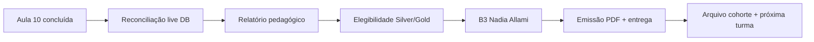

# TEC.WMS — Plano Executivo de Encerramento · Cohorte Fondatrice

**Document type:** Executive closure plan (planning only)  
**Programme:** TEC.LOG — Collège de la Concorde  
**Cohort:** Cohorte Fondatrice · Session 2025–2026  
**Repository:** `tec-wms-simulator-production`  
**Branch / HEAD (reference):** `production-hotfix-rc13-pedagogy-class6` @ `cb1ca10` / `711c822`  
**Platform (Railway):** `https://tec-wms-simulator-production-production.up.railway.app`  
**Date:** 2026-06-17  
**Mode:** No implementation · No deployment · No DB writes · Planning only  

---

## Executive Summary

A **Cohorte Fondatrice** é a primeira turma oficial do programa TEC.LOG. O bootstrap operacional está **GO** (5/5 estudantes provisionados, cohort ID 1, registry Silver compatível). O encerramento institucional depende de três eixos convergentes:

| Eixo | Estado | Bloqueador principal |
|------|--------|----------------------|
| **Pedagogia (Aulas 1–10)** | 🟡 YELLOW | Smoke S-10/S-11 não confirmado em contas com progressão completa |
| **Certificação Silver** | 🟡 YELLOW | Emissão institucional (B3) pendente; flags `silverCertified` dependem de conclusão M1 |
| **Certificação Gold** | 🟡 YELLOW | Engine completo; `ENABLE_GOLD_UNLOCK` + smoke S-11 + credencial oficial ausentes |

**Veredito de encerramento:** 🟡 **CONDITIONAL GO** — a turma pode ser encerrada pedagogicamente após Aula 10, mas o **pacote institucional completo** (certificados PDF assinados, registry VALID, relatório para direção) só fecha após reconciliação de elegibilidade + aprovação B3 (Nadia Allami).

---

## 1. Análise — Certificações Silver Emitidas

### 1.1 Registry pré-alocado (staging mirror)

Fonte: `shared/silverCertificationRegistry.ts` · autoridade de design: `Documentation/CERTIFICATION_PACKAGE_V1.md` §9.5

| Certificate ID | Estudante | N° étudiant | Status registry | Status simulador |
|----------------|-----------|-------------|-----------------|------------------|
| `TEC-SIL-2026-001` | Aissata Soukeina Camara | `2026-1806` | **PENDING** | Depende de gates M1 |
| `TEC-SIL-2026-002` | Darlin Campaz Paredes | `00-2004` | **PENDING** | Depende de gates M1 |
| `TEC-SIL-2026-003` | Fredy Tamile Lola | `1011-KF` | **PENDING** | Depende de gates M1 |
| `TEC-SIL-2026-004` | Prince Agbodjan Sewa Francis Ghislain | `613-462` | **PENDING** | Depende de gates M1 |
| `TEC-SIL-2026-005` | *(reservado — James Timothy)* | — | **Não alocado** | Sem registry entry |

**Distinção crítica (3 camadas):**

| Camada | O que significa | Evidência |
|--------|-----------------|-----------|
| **Registry staging** | Número pré-atribuído no código | Lookup 4/4 COMPATIBLE @ bootstrap |
| **Simulador (`silverCertified`)** | Elegibilidade M1 satisfeita + flag persistida | Auto-award via 4 gates; **não** set manual no bootstrap |
| **Credencial oficial (`VALID`)** | PDF assinado + QR + portal `verify.teclog.ca` | Requer B3 + workflow §4.4 de `CERTIFICATION_PACKAGE_V1.md` |

**Nenhum certificado Silver foi oficialmente emitido (`status = VALID`)** no momento deste plano. Os quatro IDs existem como **pool institucional** aguardando aprovação e export PDF.

### 1.2 Gates Silver (referência operacional)

| # | Gate | Função |
|---|------|--------|
| 1 | Quiz M1 ≥ 60 % | `checkM1QuizPassed` |
| 2 | SCN-001 → SCN-005 completos (eval, non-demo) | `checkAllM1ScenariosCompleted` |
| 3 | Compliance M1 validado por SCN | `checkM1ComplianceValidated` |
| 4 | Sem blockers (tx não postadas, CC abertos) | `checkNoUnresolvedBlockers` |

Checklist UI: **9 linhas** (1 quiz + 5 SCNs + compliance + blockers) → percentual arredondado (8/9 = 89 %, não 90 %).

### 1.3 Ação de encerramento Silver

- [ ] **S-ELIG-01** Exportar estado `profiles.silverCertified` + checklist live por estudante (Railway SQL ou teacher roster)
- [ ] **S-ELIG-02** Cruzar elegíveis com registry staging (nome + studentNumber)
- [ ] **S-ELIG-03** Nadia Allami: B3 approval → transição `PENDING` → `VALID` por recipiente
- [ ] **S-ELIG-04** Gerar PDF assinado (Nadia Allami + Thiago Gibran) + QR por certificado
- [ ] **S-ELIG-05** Entrega institucional ao estudante (canal Collège de la Concorde)
- [ ] **S-ELIG-06** Decisão sobre James Timothy: alocar `TEC-SIL-2026-005` ou certificado alternativo / participação sem Silver

---

## 2. Análise — Estudantes Elegíveis

### 2.1 Roster oficial (5 estudantes)

| # | Nome | Email | User ID | Cohort | N° étudiant | Certificado reservado |
|---|------|-------|---------|--------|-------------|----------------------|
| 1 | Aissata Soukeina Camara | aissatasoukeinacamara@gmail.com | 184 | 1 | `2026-1806` | TEC-SIL-2026-001 |
| 2 | Darlin Campaz Paredes | dcparedes2010@gmail.com | 213 | 1 | `00-2004` | TEC-SIL-2026-002 |
| 3 | Fredy Tamile Lola | fredlolabio@gmail.com | 216 | 1 | `1011-KF` | TEC-SIL-2026-003 |
| 4 | Prince Agbodjan Sewa Francis Ghislain | sewafrancispa@gmail.com | 219 | 1 | `613-462` | TEC-SIL-2026-004 |
| 5 | James Timothy | jamesnns3@gmail.com | 222 | 1 | *(null)* | *(slot 005 reservado)* |

**Bootstrap:** GO @ `Documentation/RC13_COHORTE_EXECUTION_REPORT.md` (2026-06-18).

### 2.2 Matriz de elegibilidade (framework)

| Estudante | Silver (M1) | Gold (M1–M5) | Notas |
|-----------|-------------|--------------|-------|
| Aissata | ☐ Confirmar live | ☐ Confirmar live | Conta mais antiga; probe M4/M5 smoke |
| Darlin | ☐ Confirmar live | ☐ Confirmar live | Criada session 2 bootstrap |
| Fredy | ☐ Confirmar live | ☐ Confirmar live | Idem |
| Prince | ☐ Confirmar live | ☐ Confirmar live | Email canônico: `sewafrancispa@gmail.com` |
| James | ☐ N/A registry | ☐ Parcial | Sem studentNumber; sem cert ID staging |

**Limitação de dados:** `RC13_LIVE_DB_ACCESS_AND_COUNTS.md` classifica contagens live como **INCONCLUSIVE** — não há snapshot de progressão/certificação por estudante neste workspace. A reconciliação live é **pré-requisito** do encerramento (ver §8).

### 2.3 Query de reconciliação (operador — read-only)

```sql
SELECT u.id, u.email, u.name, u.isActive,
       p.studentNumber, p.silverCertified, p.goldCertified, p.cohortId,
       c.name AS cohort_name
FROM users u
LEFT JOIN profiles p ON p.userId = u.id
LEFT JOIN cohorts c ON c.id = p.cohortId
WHERE u.email IN (
  'aissatasoukeinacamara@gmail.com',
  'dcparedes2010@gmail.com',
  'fredlolabio@gmail.com',
  'sewafrancispa@gmail.com',
  'jamesnns3@gmail.com'
)
ORDER BY u.email;
```

Complementar com teacher dashboard Gold roster + export checklist `/student/certifications` por estudante.

### 2.4 Progressão de módulos (gates de acesso)

| Módulo | SCNs | Gate adicional |
|--------|------|----------------|
| M1 | SCN-001–005 | — |
| M2 | SCN-006–008 | M1 passed |
| M3 | SCN-009–011 | M2 passed |
| M4 | SCN-012–014 | M1 passed + **validation enseignant M3** |
| M5 | SCN-015–017 | M1 passed (+ cadeia M2–M4 na prática) |

Smoke inicial falhou em contas fresh (0/3 M4, 0/7 M5) — **comportamento esperado**, não defeito.

---

## 3. Análise — Relatórios Existentes

### 3.1 Inventário documental (cohorte + RC13)

| Documento | Tipo | Relevância encerramento |
|-----------|------|-------------------------|
| `Documentation/RC13_COHORTE_FONDATRICE_BOOTSTRAP_PLAN.md` | Plano bootstrap | Roster, fluxos, student numbers |
| `Documentation/RC13_COHORTE_EXECUTION_REPORT.md` | Execução bootstrap | GO 5/5; smoke M4/M5 YELLOW |
| `Documentation/CERTIFICATION_PACKAGE_V1.md` | Arquitetura certificação | Schema oficial, B3, Nadia Allami |
| `Documentation/CERTIFICATION_INTELLIGENCE_AUDIT.md` | Audit certificação | Gates, UX gaps, unlock triggers |
| `Documentation/RC13_GOLD_READINESS_AUDIT.md` | Audit Gold | 18 gates, backlog P0–P2 |
| `Documentation/PEDAGOGICAL_ALIGNMENT_AUDIT.md` | Audit pedagógico | M1–M5 verdicts, gaps X-01–X-07 |
| `Documentation/RC13_RELEASE_READINESS_REPORT.md` | Readiness consolidado | Score 74/100, Class 9/10 mapping |
| `Documentation/RC13_FINAL_SMOKE_EXECUTION_GUIDE.md` | Guia smoke S-10/S-11 | **Checklist Aula 10 (S-11)** |
| `Documentation/RC13_M4_VALIDATION_REPORT.md` | Validação M4 | SCN-012–014 |
| `Documentation/RC13_M5_VALIDATION_REPORT.md` | Validação M5 | SCN-015–017 |
| `Documentation/RC13_FINAL_PEDAGOGICAL_POLISH_REPORT.md` | Polish RC13 | 10 fixes pedagógicos |
| `Documentation/RC13_SILVER_*` (4 docs) | Silver implementation | Registry fix, visual, hotfix |
| `RC13_LIVE_DB_ACCESS_AND_COUNTS.md` | Contagens live | INCONCLUSIVE — gap operacional |

### 3.2 Artefatos de execução (não versionados)

| Artefato | Conteúdo |
|----------|----------|
| `.manus-logs/rc13-cohorte-execution-results.json` | Session 1 — partial bootstrap |
| `.manus-logs/rc13-smoke-railway-results.json` | M4 smoke output |
| `.manus-logs/rc13-m5-smoke-railway.json` | M5 smoke output |

**Recomendação:** arquivar JSONs de smoke pós-Aula 10 como evidência de encerramento (fora do git ou commit documental explícito).

---

## 4. Análise — Estatísticas Disponíveis

### 4.1 Dados confirmados (bootstrap)

| Métrica | Valor | Fonte |
|---------|-------|-------|
| Estudantes cohorte | **5** | `students.list({ cohortId: 1 })` |
| Registry Silver lookup | **4/4 COMPATIBLE** | Bootstrap report |
| Student numbers set | **4/4** (+ James null) | Bootstrap report |
| Cenários catálogo | **17** | Scenario catalog |
| SCN IDs Railway M4/M5 | 12–17 (canonical 34–39) | Execution report |
| Unit tests RC13 | **405–425 PASS** | Release / Gold audits |
| Release confidence | **74/100** | Release readiness report |

### 4.2 Dados não disponíveis (gap)

| Métrica | Status | Impacto encerramento |
|---------|--------|----------------------|
| `silverCertified` por estudante | **Unavailable** | Bloqueia relatório final Silver |
| `goldCertified` / Gold checklist | **Unavailable** | Bloqueia relatório Gold |
| Quiz attempts / scores | **Unavailable** | Evidência pedagógica incompleta |
| Scenario runs completed | **Unavailable** | Taxa conclusão M1–M5 desconhecida |
| Smoke S-10 / S-11 live green | **0/3 M4, 0/7 M5** (fresh accounts) | Re-run pós-progressão obrigatório |

### 4.3 KPIs propostos para relatório institucional

Preencher após query live:

| KPI | Fórmula | Meta cohorte fondatrice |
|-----|---------|---------------------------|
| Taxa login ativo | estudantes ativos / 5 | 100 % |
| Taxa conclusão M1 (5 SCNs) | estudantes com 5 SCNs eval / 5 | ≥ 80 % |
| Taxa Silver elegível | `silverEligible` live / 4 registry | 100 % dos elegíveis |
| Taxa Silver obtida (simulador) | `silverCertified=true` / 4 | Alinhar com elegíveis |
| Taxa Gold elegível | `goldEligible` / 5 | Informativo (1ª cohorte) |
| Taxa Aula 10 (SCN-015–017 ≥70) | SCNs pass / (5×3) | ≥ 60 % por SCN |
| Smoke operacional | S-10 + S-11 PASS | 3/3 + 3/3 |

---

## 5. Análise — Evidências Pedagógicas Existentes

### 5.1 Verdicts por módulo (`PEDAGOGICAL_ALIGNMENT_AUDIT.md`)

| Módulo | SCNs | Verdict | Observação encerramento |
|--------|------|---------|-------------------------|
| M1 | 001–005 | **GO** | Silver path enforceable |
| M2 | 006–008 | **GO** | FIFO / capacity aligned |
| M3 | 009–011 | **YELLOW** | SCN-011 friction; copy gaps |
| M4 | 012–014 | **YELLOW** | S-10 live smoke open |
| M5 | 015–017 | **YELLOW** | S-11 live smoke open; Gold messaging mixed |

**Program-level:** nenhum módulo NO-GO; todos os 17 SCNs runnable em eval mode.

### 5.2 Evidências estáticas (engineering)

| Evidência | Status |
|-----------|--------|
| Constitution compliance (G1–G5) | Auditado por SCN |
| RC13 pedagogical polish (10 fixes) | Aplicado @ `711c822` |
| M4/M5 eval answer leakage | Gated to demo mode |
| Annexe A/B inlined in OIL Panel D | ✅ |
| Bilingual OIL FR/EN | ✅ |
| Gold 18-gate engine + tests | ✅ 21/21 |

### 5.3 Evidências operacionais (pendentes)

| Evidência | Status | Owner |
|-----------|--------|-------|
| S-10 smoke SCN-012–014 (Class 9) | ☐ Pendente pós-progressão | Instructor + QA |
| S-11 smoke SCN-015–017 (Class 10) | ☐ Pendente pós-progressão | Instructor + QA |
| Teacher monitor transcripts (runs) | ☐ Coletar por SCN | Instructor |
| Debrief notes Aulas 9–10 | ☐ Processo | Instructor |
| Student Run Reports (scores) | ☐ Export por estudante | Platform |

### 5.4 Gaps pedagógicos sistêmicos (registrar no encerramento)

| ID | Finding | Severidade |
|----|---------|------------|
| X-01 | Mission Sheet PDFs fora do repo | Process |
| X-06 | Smoke S-10/S-11 não gravado post-RC13 | Process |
| M5-01 | SCN-015 copy "stratégique" vs runtime TACTICAL | Low |
| M5-02 | Gold slide notes mixed signal | Low |
| PE-05 | Gold info strip ausente (vs Silver) | P2 |

---

## 6. Checklist Aula 10 (Class 10 · M5 · S-11)

**Referência canônica:** `Documentation/RC13_FINAL_SMOKE_EXECUTION_GUIDE.md` § S-11  
**Módulo:** `/student/module5` · **Modo:** Evaluation only · **Threshold:** ≥ 70/100  

### 6.1 Pré-aula (instrutor / operador)

- [ ] **P-A10-01** Estudantes completaram M1–M3; teacher validou M3 (`validateTeacherModule`)
- [ ] **P-A10-02** SCN-012–014 acessíveis e completáveis (Class 9 encerrada)
- [ ] **P-A10-03** URL produção confirmada (Railway ou Manus publicado @ `711c822+`)
- [ ] **P-A10-04** `ENABLE_M5_COMPLIANCE_VALIDATOR` ≠ `false`
- [ ] **P-A10-05** Se Gold auto-award desejado: `ENABLE_GOLD_UNLOCK=true` + briefing ELIGIBLE vs AWARDED
- [ ] **P-A10-06** Briefing RunReport: M5_DECISION step % pode mostrar 100 % com raw ≥30 — score total correto
- [ ] **P-A10-07** Monitor teacher `/teacher/monitor` operacional

### 6.2 S-11-A — SCN-015 · Nominal Integrated (Peak Week Day 1)

**Teacher**

- [ ] Slide M5-1: cadeia M1–M4
- [ ] Slide M5-2: SCN-015 GREEN; distribuir **Annexe B**
- [ ] Contrato: SKU-001 · 50 u. · REC-01 → B-01-R1-L1
- [ ] Lembrete: M5_KPI derivado do ledger — confirmar em eval

**Student**

- [ ] SCN-015 → Évaluation
- [ ] M5_RECEPTION: SKU-001 · qty 50 · PO-M5-001
- [ ] M5_PUTAWAY: REC-01 → B-01-R1-L1 · 50 · LOT-M5-A
- [ ] M5_CYCLE_COUNT: B-01-R1-L1 · variance 0
- [ ] M5_REPLENISH: suggestion · studentQty 0
- [ ] M5_KPI: ledger anchor · **confirmedFromLedger**
- [ ] M5_DECISION: tactical (keywords operacionais)
- [ ] COMPLIANCE_M5: submit

**Pass criteria**

- [ ] 7 steps (sem M5_ADJ) · score ≥ 70 · compliance green
- [ ] Run ID + score registrados

### 6.3 S-11-B — SCN-016 · Exception Variance (Peak Week Day 2)

**Teacher**

- [ ] Slide M5-3: variance −5 u. @ B-01-R1-L1
- [ ] Explicar **M5_ADJ (MI07)** antes de REPLENISH/KPI/DECISION
- [ ] Demo negativa opcional: replenish antes ADJ → block

**Student**

- [ ] SCN-016 → Évaluation
- [ ] RECEPTION + PUTAWAY (mesmo contrato SCN-015)
- [ ] M5_CYCLE_COUNT: variance −5 injetada
- [ ] Confirmar **8 steps** com M5_ADJ
- [ ] **Gate negativo:** REPLENISH/KPI antes ADJ → deve falhar
- [ ] M5_ADJ: −5 · justification ≥10 chars
- [ ] REPLENISH → KPI → DECISION → COMPLIANCE_M5

**Pass criteria**

- [ ] 8 steps · stock pós-ADJ = 45 · score ≥ 70
- [ ] Gold-path: ADJ antes M5_KPI (`scn-016-seq`)

### 6.4 S-11-C — SCN-017 · Strategic Capstone (Peak Week Day 3)

**Teacher**

- [ ] Slide M5-4: snapshot KPI · ≥2 citações numéricas
- [ ] Slide M5-5: Gold via SCN-017 (flag-dependent)
- [ ] Eval mode: requirements only — sem scaffold completo

**Student**

- [ ] SCN-017 → Évaluation
- [ ] Ops chain até REPLENISH (variance 0)
- [ ] **Gate negativo:** DECISION antes KPI → reject
- [ ] M5_KPI: confirmedFromLedger
- [ ] **Gate negativo:** decision genérica → reject
- [ ] M5_DECISION: ≥2 KPIs numéricos + trade-off + horizon 90–180 j
- [ ] COMPLIANCE_M5

**Pass criteria**

- [ ] 7 steps · score ≥ 70 · decision não rejeitada
- [ ] Capstone Gold gate: score ≥ 70 + KPI linkage

### 6.5 S-11 Summary Sign-Off

| Scenario | DB ID | Run ID | Score | Pass? |
|----------|-------|--------|-------|-------|
| SCN-015 | 37 | | /100 | ☐ |
| SCN-016 | 38 | | /100 | ☐ |
| SCN-017 | 39 | | /100 | ☐ |

**S-11 overall:** ☐ PASS (3/3) · ☐ FAIL  

**Tester:** _______________ **Date:** _______________ **URL:** _______________

### 6.6 Cross-check certificação (pós-S-11)

- [ ] `/student/certifications` — Silver + Gold cards load
- [ ] Gold checklist 18 rows atualizado
- [ ] SCN-016 sequence row visível se aplicável
- [ ] SCN-017 capstone rows (`scn017CapstoneScore`, decision linked)
- [ ] Se flag on: visit Certifications → possível AWARDED

---

## 7. Encerramento da Turma

### 7.1 Fases de encerramento



### 7.2 Checklist encerramento operacional

| Fase | Ação | Owner | Prazo relativo |
|------|------|-------|----------------|
| **E1** | Executar S-11 com estudantes ou conta representativa pós-progressão | Instructor | D0 (Aula 10) |
| **E2** | Coletar Run Reports + scores SCN-015–017 por estudante | Instructor | D0–D+3 |
| **E3** | SQL reconciliação §2.3 + teacher Gold roster | Operator | D+3 |
| **E4** | Debrief final Peak Week (3 dias narrativa M5) | Instructor | D+3 |
| **E5** | Desativar ou rotacionar passwords iniciais (política Collège) | Admin | D+7 |
| **E6** | Decisão James Timothy (studentNumber + cert 005 ou certificado participação) | Direction | D+7 |
| **E7** | Fechar cohorte no roster (`cohorts` — arquivar, não deletar) | Teacher | D+7 |
| **E8** | Export manifest cohorte (`entries.json` per CERTIFICATION_PACKAGE §9.4) | Operator + Nadia | D+14 |
| **E9** | Cerimónia / entrega certificados oficiais | Collège | D+14–D+30 |

### 7.3 Critérios de encerramento GO

| Critério | Required |
|----------|----------|
| 5/5 contas ativas e auditadas | ✅ |
| Aula 10 (S-11) executada ou justificativa documentada | ✅ |
| Elegibilidade Silver reconciliada por estudante | ✅ |
| B3 approval registrada para emissão | ✅ |
| Relatório institucional entregue à direção | ✅ |
| Manifest registry export arquivado 7 anos | ✅ |

**Veredito template:**

> **Encerramento Cohorte Fondatrice:** ☐ GO · ☐ CONDITIONAL GO · ☐ NO-GO  
> **Date:** ___________ **Sign-off:** Nadia Allami · Instructor · Operator  

---

## 8. Relatório Institucional

### 8.1 Estrutura proposta (documento separado pós-reconciliação)

| Secção | Conteúdo |
|--------|----------|
| **1. Identificação** | Cohorte Fondatrice · Session 2025–2026 · Collège de la Concorde |
| **2. Participantes** | Roster §2.1 + taxa presença/atividade |
| **3. Parcours pedagógico** | M1→M5 · 17 SCNs · 10 sessions |
| **4. Resultados simulador** | Scores por módulo · quiz pass rates · compliance |
| **5. Certificações** | Silver emitidos (VALID) · Gold elegíveis/obtidos · James exception |
| **6. Smoke / QA** | S-10, S-11 outcomes · platform URL · commit HEAD |
| **7. Incidents / workarounds** | Progression gates, RunReport UX, etc. |
| **8. Recomendações** | Ver §10 deste plano |
| **9. Anexos** | Run IDs, SQL export, smoke JSON, B3 approval record |

### 8.2 Template executive summary (1 página direção)

```
COHORTE FONDATRICE · SESSION 2025–2026 — RAPPORT DE CLÔTURE

Effectif: 5 étudiants · Plateforme: TEC.WMS (Railway RC13)
Parcours: Modules M1–M5 · Scénarios SCN-001–017 · Aulas 1–10

Résultats clés:
  • Taux complétion M1 (Silver path): ___/5 (___%)
  • Certificats Silver officiels émis: ___/4 (TEC-SIL-2026-001–004)
  • Étudiants Gold éligibles (simulateur): ___/5
  • Smoke opérationnel S-10/S-11: ☐ PASS ☐ PARTIAL ☐ FAIL

Verdict pédagogique: ☐ SUCCÈS ☐ SUCCÈS PARTIEL ☐ À REPRENDRE
Verdict plateforme: ☐ GO ☐ CONDITIONAL ☐ NO-GO

Prochaine cohorte: voir recommandations RC14 (§11)
```

---

## 9. Evidências para Direção

### 9.1 Pacote evidências (dossier)

| # | Evidência | Formato | Status |
|---|-----------|---------|--------|
| EV-01 | Bootstrap execution report | PDF/MD | ✅ Existe |
| EV-02 | Pedagogical alignment audit | PDF/MD | ✅ Existe |
| EV-03 | Release readiness (74/100) | PDF/MD | ✅ Existe |
| EV-04 | Certification package V1 | PDF/MD | ✅ Existe |
| EV-05 | Smoke S-11 sign-off preenchido | PDF | ☐ Pós-Aula 10 |
| EV-06 | SQL export profiles + runs | CSV | ☐ Operador |
| EV-07 | Screenshots certificados preview (watermarked) | PNG | ☐ Por estudante |
| EV-08 | B3 approval record (Nadia Allami) | PDF assinado | ☐ Institucional |
| EV-09 | Registry manifest `entries.json` | JSON | ☐ Pós-emissão |
| EV-10 | Teacher debrief Aulas 9–10 | MD/PDF | ☐ Instructor |

### 9.2 Narrativa para direção (talking points)

1. **Primeira cohorte oficial** validou parcours M1–M5 completo no simulador TEC.WMS — marco institucional TEC.LOG.
2. **Infraestrutura RC13** entregue com 17 cenários, engines Silver (4 gates) e Gold (18 gates), auditorias pedagógicas sem NO-GO module.
3. **Certificação oficial** segue governance Collège: simulador = elegibilidade; PDF assinado + QR = credencial verificável.
4. **Gaps honestos:** smoke live incompleto em contas fresh; contagens DB não reconciliadas neste workspace; Gold auto-award flag-dependent.
5. **Risco mitigado:** bootstrap GO; registry 4/4; runbooks e checklists S-10/S-11 prontos.

---

## 10. Dados para Nadia Allami

**Função:** Directrice de programme · Signataire certificats (§7 `CERTIFICATION_PACKAGE_V1.md`)

### 10.1 Pacote decisório B3

| Item | Dado a fornecer | Formato |
|------|-----------------|---------|
| **Lista elegíveis Silver** | Nome · email · studentNumber · checklist 9/9 · `silverCertified` | Tabela CSV |
| **Lista emissão** | Certificate ID · recipient · issue_date proposta | Tabela |
| **Status registry** | PENDING → VALID por ID | Manifest JSON |
| **Exceção James** | Participação sem registry / slot 005 | Memo 1 página |
| **Gold elegíveis** | Nome · 18/18 checklist · `goldCertified` | Tabela CSV |
| **Gold emissão** | *(V1.1 — structure only; no TEC-GLD-2026 yet)* | N/A |
| **Evidência pedagógica** | Scores SCN + quiz + compliance | Anexo runs |
| **Approval record** | Assinatura B3 antes 1º PDF | Formulário |

### 10.2 Campos registry por certificado Silver (§9.2)

Para cada `TEC-SIL-2026-00N` aprovado:

```
certificate_id, tier=SILVER, status=VALID,
recipient_display_name, student_number,
cohort_year=2026,
cohort_label="Collège de la Concorde · Session 2025–2026 · Inaugural Silver",
issue_date, issued_by="Nadia Allami",
simulator_user_id, eligibility_snapshot_hash (optional)
```

### 10.3 Checklist Nadia (sign-off)

- [ ] Revisar elegíveis Silver vs registry staging (4 recipients)
- [ ] Decidir James Timothy (005 ou alternative)
- [ ] Aprovar transição PENDING → VALID
- [ ] Autorizar geração PDF + QR (`verify.teclog.ca`)
- [ ] Validar assinaturas (Nadia Allami + Thiago Gibran)
- [ ] Confirmar arquivo retenção 7 anos
- [ ] Autorizar comunicação encerramento cohorte à direção Collège

---

## 11. Recomendações para Próxima Cohorte

### 11.1 Bootstrap (lições Cohorte Fondatrice)

| # | Recomendação | Rationale |
|---|--------------|-----------|
| R-01 | Pré-alocar registry Silver **antes** da 1ª aula (N+1 estudantes) | Evita James-type gap |
| R-02 | Teacher API/UI para `studentNumber` (eliminar Path C SQL) | Gap documentado bootstrap plan §2.3 |
| R-03 | Criar cohorte + 100 % roster **antes** handoff passwords | Session 1 partial failure |
| R-04 | Conta demo `JAMES STUDENT` para projeção instructor | RC13 release MN-4 |
| R-05 | Executar smoke S-01→S-16 **antes** day-1 estudantes | 0/16 live @ RC13 |
| R-06 | Single platform decision: Manus **ou** Railway — não dual ambíguo | C1/C2 confusion |

### 11.2 Pedagogia

| # | Recomendação |
|---|--------------|
| R-07 | Reconciliar Mission Sheet PDFs com repo proxies (X-01) |
| R-08 | Instructor briefing M3: pipeline REPLENISH shared (X-03) |
| R-09 | Briefing M5_DECISION RunReport step % antes Class 10 |
| R-10 | Gravar smoke S-10/S-11 in-repo como evidência standard |

### 11.3 Certificação

| # | Recomendação |
|---|--------------|
| R-11 | Deploy registry service (`verify.teclog.ca`) antes cohorte 2 |
| R-12 | Workflow B3 integrado no calendário (não post-hoc) |
| R-13 | Política clara Gold: flag on desde cohorte start se auto-award desejado |
| R-14 | Reservar bloco `TEC-GLD-2027-xxx` quando Gold cohort definida |

### 11.4 Operações

| # | Recomendação |
|---|--------------|
| R-15 | `pnpm bootstrap:verify` gate obrigatório CI/CD deploy |
| R-16 | Read-only dashboard cohorte (KPIs §4.3 automatizados) |
| R-17 | Restringir `auth.localRegister` ou enforce `STUDENT_ACCESS_CODE` |
| R-18 | Documentar HEAD commit no roster teacher view |

---

## 12. Backlog Gold Certification

**Fonte:** `Documentation/RC13_GOLD_READINESS_AUDIT.md` · `Documentation/CERTIFICATION_INTELLIGENCE_AUDIT.md`

### 12.1 Verdict atual

| Dimensão | Status |
|----------|--------|
| Gold engine (18 gates) | **GO** |
| Gold eligibility | **GO** |
| Gold persistence / auto-award | **YELLOW** |
| Gold Continue button | **NO-GO** |
| SCN-015 / SCN-016 | **GO** |
| SCN-017 | **YELLOW** |
| Institutional credential | **Out of scope RC13** |

### 12.2 Backlog P0 (antes Gold auto-award cohorte)

| ID | Item | Owner |
|----|------|-------|
| HB-01 | Set `ENABLE_GOLD_UNLOCK=true` on target env | Operator |
| HB-02 | Award trigger: Certifications visit ou M5 quiz re-submit | Engineering (RC14) |
| HB-03 | Execute S-11 live smoke @ deploy URL | QA |

### 12.3 Backlog P1 (RC14 engineering)

| ID | Item |
|----|------|
| P1-04 | `resolveGoldContinuePath()` — route first unmet gate |
| P1-05 | Surface `goldStatus.blockerSummary` on Certifications page |
| P1-06 | Fix Gold blockers row → first Gold-path module |
| P1-07 | Gold unlock hook on `submitComplianceM5` success |

### 12.4 Backlog P2 (polish)

| ID | Item |
|----|------|
| P2-08 | RunReport M5_DECISION denominator 80 vs 30 |
| P2-09 | trpc integration tests lazy Gold unlock |
| P2-10 | DB fixtures SCN-016 variance + SCN-017 capstone |
| P2-11 | SCN-015 tactical vs strategic copy alignment |
| P2-12 | Gold info strip on Certifications page |

### 12.5 Backlog institucional (pós-engineering)

| ID | Item |
|----|------|
| INST-01 | Gold registry `TEC-GLD-{YEAR}-{SEQ}` |
| INST-02 | Prerequisite link Silver → Gold certificate |
| INST-03 | Signed PDF + QR pipeline |
| INST-04 | B3 Gold cohort approval |
| INST-05 | `goldCertifiedAt` audit column |

### 12.6 Hidden blockers register (monitoring)

| ID | Severity | Description |
|----|----------|-------------|
| HB-04 | P1 UX | Continue always → `/student/module2` |
| HB-05 | P2 UX | Student no `blockerSummary` |
| HB-07 | P2 | Gold LOCKED if `silverCertified` stale |
| HB-10 | Info | No QR/PDF/registry — preview only |

---

## 13. Melhorias RC14

> **Nota:** RC14 não existe ainda no repositório. Este backlog deriva dos gaps RC13 consolidados para a **release candidate seguinte** pós-encerramento Cohorte Fondatrice.

### 13.1 RC14 — Escopo proposto

| Track | Objetivo | Itens |
|-------|----------|-------|
| **RC14-A Certification UX** | Gold parity com Silver | P1-04–07, P2-12, HB-04–05 |
| **RC14-B Institutional** | Registry + verification MVP | INST-01–03, `verify.teclog.ca` |
| **RC14-C Cohort Ops** | Teacher tools cohorte 2 | R-02, R-16, studentNumber admin |
| **RC14-D Pedagogy** | Close YELLOW modules | X-01 PDFs, M5-01 copy, PE-05 |
| **RC14-E Platform** | Deploy hygiene | R-15, `railway.toml`, `.env.example`, C2 gate |

### 13.2 RC14 acceptance criteria (draft)

| Gate | Criterion |
|------|-----------|
| G-RC14-01 | S-01→S-16 live smoke green on production URL |
| G-RC14-02 | Gold Continue routes to first unmet gate |
| G-RC14-03 | `ENABLE_GOLD_UNLOCK` documented in runbook |
| G-RC14-04 | Teacher can set studentNumber for any student |
| G-RC14-05 | Cohort KPI dashboard (5 metrics §4.3) |
| G-RC14-06 | Silver registry sync from institutional manifest (read-only) |
| G-RC14-07 | 425+ unit tests PASS · 0 P0 open |

### 13.3 RC14 — Out of scope (explicit)

- Manus independence full migration (ver `MANUS_INDEPENDENCE_*` plans)
- Gold PDF production pipeline complete (partial in RC14-B only)
- Schema migrations beyond `goldCertifiedAt` optional column

### 13.4 Sequenciamento sugerido

```
Pós-encerramento Fondatrice
    → RC14-A (2 sprints) — Gold UX blockers
    → RC14-C (1 sprint) — cohort ops before cohorte 2 bootstrap
    → RC14-B (parallel institutional track)
    → RC14-E — deploy gates
    → Tag rc14-smoke-green
    → Cohorte 2 bootstrap
```

---

## 14. Cronograma Executivo Consolidado

| Semana | Marco | Deliverable |
|--------|-------|-------------|
| **W0** | Aula 10 | S-11 checklist §6 completo |
| **W+1** | Reconciliação | SQL §2.3 + KPIs §4.3 preenchidos |
| **W+1** | Pedagógico | Debrief + Run Reports arquivados |
| **W+2** | Institucional | Pacote Nadia §10 + B3 approval |
| **W+2** | Direção | Relatório §8 entregue |
| **W+3** | Emissão | PDF Silver VALID + entrega estudantes |
| **W+4** | Arquivo | Manifest registry + encerramento formal |
| **W+4+** | RC14 kickoff | Backlog §13 priorizado |

---

## 15. Riscos de Encerramento

| ID | Risco | Mitigação |
|----|-------|-----------|
| RK-01 | Elegibilidade Silver desconhecida (no live DB) | Executar §2.3 imediato |
| RK-02 | Estudante elegível sem `silverCertified` flag (lazy unlock) | Visitar `/student/certifications` ou admin audit |
| RK-03 | James sem certificado gera inequidade | Decisão direction §10.2 |
| RK-04 | Smoke S-11 nunca executado pós-progressão | Bloquear relatório GO |
| RK-05 | Emissão PDF antes B3 | Governance CERTIFICATION_PACKAGE §4.4 |
| RK-06 | Gold ELIGIBLE sem AWARDED confunde estudantes | Briefing + flag policy |

---

## 16. Document Control

| Version | Date | Author | Change |
|---------|------|--------|--------|
| 1.0 | 2026-06-17 | TEC.LOG Planning | Initial closure plan — Cohorte Fondatrice |

**References:**

- `Documentation/RC13_COHORTE_FONDATRICE_BOOTSTRAP_PLAN.md`
- `Documentation/RC13_COHORTE_EXECUTION_REPORT.md`
- `Documentation/CERTIFICATION_PACKAGE_V1.md`
- `Documentation/RC13_FINAL_SMOKE_EXECUTION_GUIDE.md`
- `Documentation/RC13_GOLD_READINESS_AUDIT.md`
- `Documentation/PEDAGOGICAL_ALIGNMENT_AUDIT.md`
- `Documentation/RC13_RELEASE_READINESS_REPORT.md`

**Supersedes:** N/A (first closure plan)  
**Implementation:** **Explicitly out of scope**

---

*Collège de la Concorde · Programme TEC.LOG · Cohorte Fondatrice · Session 2025–2026*
