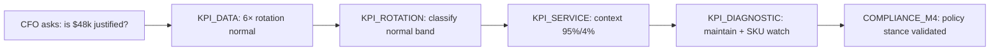

# TEC.WMS — M4 Pedagogical Intelligence Audit

**Audit type:** Read-only pedagogical intelligence analysis  
**Scope:** SCN-012, SCN-013, SCN-014 (Module 4 — Indicateurs de performance logistique)  
**Repository:** `tec-wms-simulator-production`  
**Branch:** `production-hotfix-rc13-pedagogy-class6` (RC13 stabilizado)  
**Date:** 2026-06-17  
**Constraints:** No code, database, scoring, or certification changes — audit only  

---

## Executive Summary

Module 4 marks a deliberate pedagogical pivot from **transactional WMS execution** (M1–M3) to **KPI-driven managerial decision-making**. The three scenarios form a coherent arc: capital/rotation judgment (012) → service excellence trap (013) → S&OP multi-KPI capstone (014).

Cross-source alignment (Fiche Mission, Guide Maître, Mission Control, OIL, Monitor, Slides M4) is **strong at the narrative level**. The canonical KPI bundle (6× rotation, 95% service, 4% errors, 3.5-day lead time, $48k capital) is consistent across seed, KPI tower, Annexe A, and step objectives.

The main pedagogical risks are **not missing content** but **structural friction**:

1. **Monitor paradigm shift** — empty transaction monitor is correct but requires prior instructor framing (M1–M3 habit).
2. **Shared step pipeline** — all three SCNs use identical `KPI_DATA → KPI_ROTATION → KPI_SERVICE → KPI_DIAGNOSTIC → COMPLIANCE_M4`; step form copy is generic and does not always mirror each scenario’s focal KPI.
3. **Compliance lexicon** — `validateM4Compliance` enforces pedagogically correct outcomes via keyword heuristics; correct reasoning with non-canonical vocabulary may fail (especially SCN-014).

| Scenario | DB ID | Pedagogical verdict | One-line rationale |
|----------|-------|---------------------|-------------------|
| **SCN-012** | 34 | **GREEN** | Complacency trap is clearly signaled; rotation/capital arc is exemplary across all sources |
| **SCN-013** | 35 | **YELLOW** | Green-dashboard narrative is strong; KPI_SERVICE step under-specifies error-rate analysis |
| **SCN-014** | 36 | **YELLOW** | Capstone integration is intentional; lead-time visibility and compliance vocabulary create student friction |

**Overall M4 pedagogical intelligence:** **YELLOW (conditional GREEN)** — design is sound and progression is coherent; instructor briefing on analytical mode and SCN-013/014 step focus recommended before unattended eval.

---

## Audit Method

### Primary sources (per mandate)

| # | Source | Repository location | Role in audit |
|---|--------|---------------------|---------------|
| 1 | Fiches de Mission | `server/missionDataExtended.ts` | Problem, role, control points, success/failure criteria |
| 2 | Guide Maître | `client/src/data/modules.ts` (M4 slides 1–7) | Instructor narrative, formulas, scenario mapping |
| 3 | Mission Control | `client/src/pages/student/MissionControl.tsx` | Cockpit UX, step rail, monitor, pedagogy hints |
| 4 | Operational Intelligence Layer | `client/src/components/operational-intelligence/OperationalIntelligenceLayer.tsx` + `client/src/data/scenarioCockpitPedagogy.ts` | Panels A–E, KPI tower, decision scaffold, Annexe A |
| 5 | Monitor | Mission Control Transaction Monitor + OIL Panel B empty-state | Evidence availability for student |
| 6 | Slides M4 | `modules.ts` module4 + `PremiumSlideVisual.tsx` variants | Pre-class conceptual scaffolding |

### Validation criteria (per mandate)

For each SCN:

- Does the student understand the problem?
- Does the monitor show sufficient evidence?
- Does the scenario lead naturally to the solution?
- Is there coherence across **Problème → Données → Analyse → Décision → Solution**?

### Analytical dimensions (per mandate)

- KPI Tower  
- Rotation (`KPI_ROTATION`)  
- Service Level (`KPI_SERVICE`)  
- Diagnostic (`KPI_DIAGNOSTIC`)  
- Compliance M4 (`COMPLIANCE_M4`)

### Classification scale

| Class | Meaning |
|-------|---------|
| **GREEN** | Pedagogical chain is clear, evidence sufficient, natural path to expected decision; minor copy gaps only |
| **YELLOW** | Core learning objective reachable but friction, ambiguity, or source mismatch may confuse unsupervised students |
| **RED** | Broken pedagogical chain; student cannot reasonably reach correct decision from available sources |

---

## Shared M4 Pedagogical Architecture

### Canonical data contract

| KPI | Raw data | Computed | Band (Annexe A) |
|-----|----------|----------|-----------------|
| Rotation | 2400 ÷ 400 | **6×** | Normal (4–12×) |
| Service (OTIF) | 285 ÷ 300 | **95%** | Excellent (≥95%) |
| Error rate | 12 ÷ 300 | **4%** | Acceptable (1–5%) |
| Lead time | — | **3.5 days** | Normal (3–7 days) |
| Capital | — | **$48,000** | Contextual (SCN-012) |

Sources: `CANONICAL_M4_KPI_DATA` (`server/rulesEngine.ts`), `m4KpiSeed` (`server/seed.ts`), OIL `ANNEXE_A_KPI_GUIDE`, Guide Maître slide 7.

### Step pipeline (all three SCNs)

```
KPI_DATA (briefing)
  → KPI_ROTATION (rotation interpretation + stock policy)
  → KPI_SERVICE (OTIF + error context)
  → KPI_DIAGNOSTIC (synthesis paragraph)
  → COMPLIANCE_M4 (scenario-specific text validation)
```

### Pedagogical paradigm: analytical-only

| Layer | Message | Alignment |
|-------|---------|-----------|
| Guide Maître slide 1 | "Moniteur vide = normal en M4 — lisez le tour de contrôle KPI" | ✓ |
| Fiche Mission (×3) | "Module analytique — aucune transaction physique" | ✓ |
| OIL `emptyStockNote` | "Pas de stock physique : scénario KPI uniquement — normal" | ✓ |
| OIL Panel B | KPI tower replaces transaction table when `m4Kpi` present | ✓ |
| Mission Control monitor hint | Per-SCN `transactionMonitorHint` banner | ✓ |

**Verdict:** The empty monitor is **pedagogically sufficient** when the student reads the KPI tower and Annexe A. It is **insufficient** if the student expects M1–M3-style transaction proof without instructor framing — classify as transition risk, not design failure.

### Eval vs Demo intelligence

| Mode | OIL decision scaffold | Pedagogical intent |
|------|----------------------|-------------------|
| **Demo** | Full expected decision text (`M4_DECISION_SCAFFOLD`) | Instructor rehearsal / learning |
| **Eval** | Process-only prompt ("justify with measured KPI values") | Preserves G2 — no answer leakage in OIL |

**Note:** `StepForm.tsx` `pedagogicalDeep.realErrorFr/En` on `KPI_ROTATION` states that 6× is in the normal band — visible during eval steps. This partially offsets OIL eval gating (see SCN-012 findings).

---

## Cross-Source Coherence Matrix

| Element | Guide Maître | Fiche Mission | OIL / KPI Tower | Monitor | Step forms | Compliance |
|---------|--------------|---------------|-----------------|---------|------------|------------|
| No physical stock | Slide 1 | ✓ all three | `emptyStockNote` | Empty + hint | KPI_DATA briefing | N/A |
| 6× normal / complacency | Slide 2 → 012 | SCN-012 | Tower focus + alert | KPI tower | KPI_ROTATION | Blocks surstock @ 6× |
| 95% + 4% green trap | Slide 3 → 013 | SCN-013 | Tower + operational problem | KPI tower | KPI_SERVICE (95% only) | Error↔OTIF link |
| Multi-KPI S&OP | Slides 5, 7 → 014 | SCN-014 | Integrates 012+013 | KPI tower | Generic diagnostic | ≥3 domains + trade-off |
| Annexe A bands | Slide 7 instructor ref | supervisorNotes | OIL Panel D collapsible | — | Referenced in deep tips | Engine bands |
| Lead time 3.5 j | Slide 5 RCA chain | SCN-014 context | SCN-014 evidence | Tower (014) | KPI_DIAGNOSTIC only | Required @ 014 |

**Alignment verdict:** Narrative layers are **consistent**. Step-form granularity is **generic** (same objectives for all SCNs) — primary source of YELLOW friction.

---

## SCN-012 — Normal Rotation (6×) / Complacency Trap

**Classification: GREEN**

### Problem understanding

| Source | Problem framing | Student clarity |
|--------|-----------------|-----------------|
| Fiche Mission | CFO Q3 review; $48k immobilized; 6× in normal band; avoid overstock hunt | **High** — objective is a finance committee recommendation |
| OIL | "Bande normale 6× — risque complaisance, pas crise surstock" | **High** — names the trap explicitly |
| Guide slide 2 | 2400÷400=6× → normal zone → SCN-012 | **High** — formula taught pre-scenario |
| KPI Tower | Misclassification @ 6× + complacency without SKU monitoring | **High** |

**Question: O aluno entende o problema?** **Yes.** The CFO capital question and complacency trap are repeated in four independent layers without contradiction.

### Monitor evidence

| Evidence type | Available? | Notes |
|---------------|------------|-------|
| Transaction monitor | Empty (by design) | Hint: "Aucune transaction attendue — utilisez les indicateurs KPI" |
| KPI Control Tower | ✓ Panel B | Rotation focus, $48k capital, expected output |
| Annexe A grid | ✓ Panel D | 4–12× normal band — student self-classifies |
| Step KPI_DATA | ✓ | Preloads 2400/400, 285/300, 12/300 |

**Question: O monitor mostra evidências suficientes?** **Yes**, provided the student accepts KPI tower as primary evidence (as Guide slide 1 teaches). Monitor alone (empty table) is **not** sufficient without OIL/tower — Mission Control mitigates via pedagogy banner.

### Natural path to solution

Expected pedagogical chain:



**Question: O cenário conduz naturalmente à solução?** **Yes.** Slide 2 → scenario → rotation step → diagnostic aligns with "maintain policy @ 6×, monitor SKUs, no blanket destock."

Demo scaffold (OIL Panel D): *"maintenir la politique stock @ 6× normal… Surveillez les SKU à faible rotation — pas de destock global."*

### Dimension analysis

| Dimension | Assessment | Notes |
|-----------|------------|-------|
| **KPI Tower** | GREEN | SCN-012 entry focuses rotation + capital judgment; alert names complacency |
| **Rotation** | GREEN | Central step; formula in step objective; tower + slide 2 reinforce |
| **Service Level** | GREEN (contextual) | Not primary focus; shared pipeline provides OTIF context without distracting |
| **Diagnostic** | GREEN | Mission expects stock policy + SKU surveillance; validator enforces maintain/monitor/SKU |
| **Compliance M4** | GREEN | Blocks surstock @ 6×, complacency ("rien à faire"), blanket destock |

### Problème → Données → Analyse → Décision → Solution

| Phase | SCN-012 expression | Coherence |
|-------|-------------------|-----------|
| Problème | $48k working capital — justified? | ✓ |
| Données | 6×, 95%, 4%, $48k via KPI_DATA + tower | ✓ |
| Analyse | Normal band — not overstock | ✓ |
| Décision | Maintain stock policy; SKU-level monitoring | ✓ |
| Solution | Finance committee recommendation without destock crusade | ✓ |

### Findings (non-blocking)

| ID | Severity | Finding |
|----|----------|---------|
| 012-F1 | Low | `StepForm` `kpi_rotation.pedagogicalDeep.realErrorFr` states 6× is normal — eval hint leakage |
| 012-F2 | Low | `KPI_DIAGNOSTIC` step objective is generic (all KPIs) rather than capital-policy focused |
| 012-F3 | Process | Live smoke S-10-A not recorded in-repo (operational, not pedagogical design) |

---

## SCN-013 — Green Dashboard Trap (95% + 4% errors)

**Classification: YELLOW**

### Problem understanding

| Source | Problem framing | Student clarity |
|--------|-----------------|-----------------|
| Fiche Mission | J-90 SLA renewal; green dashboard; recognize excellence; correlate errors→OTIF | **High** |
| OIL | "Piège tableau vert — investir budget formation oui/non, où ?" | **High** |
| Guide slide 3 | 95% excellent + 4% acceptable + picking/receiving correlation | **High** |
| KPI Tower | OTIF drift risk despite excellent headline | **High** |

**Question: O aluno entende o problema?** **Yes** — the "green dashboard trap" is one of the best-articulated pedagogical traps in M4.

### Monitor evidence

Same analytical pattern as SCN-012. OIL adds:

- Evidence: "OTIF au seuil ; erreurs picking/réception corrigeables"
- Monitor hint: "Focus sur indicateurs, pas sur transactions stock"

**Question: O monitor mostra evidências suficientes?** **Yes** for KPI tower + step data. **Gap:** error rate (12/300) appears in KPI_DATA briefing and KPI_DIAGNOSTIC objective but **not** as a dedicated interpretation field in KPI_SERVICE — student must carry error context forward without a structured prompt at the service step.

### Natural path to solution

Expected chain:

```
Dashboard vert (95% + 4%)
  → Reconnaître excellence @ 95%
  → Corréler erreurs picking/réception → risque OTIF
  → Plan chiffré (ex. 4%→2%) + suivi hebdo 90 jours
  → Destock n'est PAS le levier principal
```

**Question: O cenário conduz naturalmente à solução?** **Mostly yes** — OIL, mission, and Guide slide 3 lead clearly. **Friction:** KPI_SERVICE step asks only about 95% OTIF classification, not 4% error interpretation; the error→OTIF link is deferred to KPI_DIAGNOSTIC, where students who misread the trap may already have anchored on "improve service" instead of "fix execution errors."

### Dimension analysis

| Dimension | Assessment | Notes |
|-----------|------------|-------|
| **KPI Tower** | GREEN | Service + error dual focus; green trap alert explicit |
| **Rotation** | YELLOW | Pipeline forces KPI_ROTATION; mission says "si requis" — cognitive sidestep |
| **Service Level** | YELLOW | Step objective covers 95% only; error rate not interpreted at this step despite being core to SCN-013 |
| **Diagnostic** | GREEN | Must link erreurs + picking/réception/OTIF + numeric plan + 90j; demo scaffold models answer |
| **Compliance M4** | GREEN | Enforces excellent acknowledgment, error link, measurable plan; blocks destock-as-primary-lever |

### Problème → Données → Analyse → Décision → Solution

| Phase | SCN-013 expression | Coherence |
|-------|-------------------|-----------|
| Problème | J-90 SLA — green dashboard trap | ✓ |
| Données | 95%, 4%, rotation context | ✓ (errors under-prompted at SERVICE step) |
| Analyse | Excellence real but fragile via errors | △ Step pipeline splits service vs errors awkwardly |
| Décision | Fund picking/receiving program | ✓ |
| Solution | 90-day OTIF tracking plan | ✓ |

### Findings

| ID | Severity | Finding | Pedagogical impact |
|----|----------|---------|------------------|
| 013-F1 | **Medium** | `KPI_SERVICE` step form does not ask student to interpret 4% error rate | Students may skip error analysis until compliance rejection |
| 013-F2 | Low | Forced KPI_ROTATION step adds non-focal work | Minor distraction from service/error narrative |
| 013-F3 | Low | Generic KPI_DIAGNOSTIC objective identical to SCN-012/014 | Capstone diagnostic skills not pre-signaled per scenario |
| 013-F4 | Resolved | `prélèvement` accepted in compliance validator (RC13 Wave B) | FR vocabulary gap closed |

**Recommendation (documentation/instructor only — no implementation):** In class, instruct students at KPI_SERVICE: *"Classifiez aussi le taux d'erreur 4% avant le diagnostic"* — compensates pipeline gap without code change.

---

## SCN-014 — S&OP Multi-KPI Capstone

**Classification: YELLOW**

### Problem understanding

| Source | Problem framing | Student clarity |
|--------|-----------------|-----------------|
| Fiche Mission | S&OP monthly; CFO/Ventes/Ops conflict; one funded initiative; board paragraph | **High** |
| OIL | "Arbitrer capital / OTIF / exécution — paragraphe board requis" | **High** |
| Guide slides 5, 7 | RCA chain + multi-KPI trade-offs → SCN-014 | **High** |
| KPI Tower | Integrates capital lens (012) + execution lens (013) | **High** |

**Question: O aluno entende o problema?** **Yes**, assuming SCN-012 and SCN-013 completed — capstone explicitly references prior competencies.

### Monitor evidence

OIL evidence: "Rotation + service + erreurs + délai 3,5 j combinés."

**Question: O monitor mostra evidências suficientes?** **Mostly yes.** **Gap:** lead time (3.5 j) is prominent in mission and tower but absent from KPI_DATA step objective (lists consumption, stock, orders, errors — not lead time). Student may omit lead time until compliance feedback.

### Natural path to solution

Expected chain:

```
S&OP — budget for ONE initiative
  → Synthesize rotation (012) + execution (013) + lead time
  → Name funded lever + explicit trade-off (what is deferred)
  → ≥3 follow-up KPIs + 90-day horizon
  → Board-ready paragraph (≥150 chars)
```

**Question: O cenário conduz naturalmente à solução?** **Partially.** Narrative sources lead well; compliance gates require specific vocabulary (`trade-off`, `arbitrage`, `report`, `differ`, `maintien`, `sacrifi`, `priori`, `tradeoff`) and explicit lead-time tokens (`lead time`, `delai`, `3,5`, `3.5`). Pedagogically correct answers in natural prose may fail — creates **keyword friction** unrelated to managerial reasoning quality.

### Dimension analysis

| Dimension | Assessment | Notes |
|-----------|------------|-------|
| **KPI Tower** | GREEN | Multi-KPI diagnosis; integrates 012+013; names S&OP output |
| **Rotation** | GREEN | Reuses 6× normal — connects to SCN-012 |
| **Service Level** | GREEN | Reuses 95% excellent — connects to SCN-013 |
| **Diagnostic** | YELLOW | Highest cognitive load; generic step copy; 150-char + 3-domain + trade-off + lead time = dense compliance checklist |
| **Compliance M4** | YELLOW | Strictest M4 gate; pedagogically aligned but lexicon-sensitive |

### Problème → Données → Analyse → Décision → Solution

| Phase | SCN-014 expression | Coherence |
|-------|-------------------|-----------|
| Problème | S&OP — one funded initiative, stakeholder conflict | ✓ |
| Données | All four KPI domains in bundle | △ Lead time under-surfaced in early steps |
| Analyse | Multi-KPI synthesis (not mono-KPI) | ✓ |
| Décision | Named lever + trade-off | ✓ |
| Solution | 90-day KPI follow-up, board paragraph | △ Compliance vocabulary may feel like "gaming" |

### Findings

| ID | Severity | Finding |
|----|----------|---------|
| 014-F1 | **Medium** | Lead time 3.5 j not in KPI_DATA / KPI_SERVICE step objectives — only in diagnostic/compliance |
| 014-F2 | **Medium** | Compliance requires explicit trade-off tokens — correct reasoning without keywords fails |
| 014-F3 | Low | Guide slide 4 (productivity/cost) has no SCN mapping — orphan content in M4 arc |
| 014-F4 | Low | Diagnostic minimum 150 chars — may reject concise but valid board memos |
| 014-F5 | Resolved | `tradeoff` (no hyphen) accepted (RC13 Wave B) |

**Recommendation (instructor only):** Before SCN-014 eval, distribute checklist: *rotation + service + erreurs + délai 3,5 j + trade-off explicite + horizon 90 j* — mirrors compliance without changing validators.

---

## Comparative Analysis — M4 Step Dimensions

| Dimension | SCN-012 | SCN-013 | SCN-014 |
|-----------|---------|---------|---------|
| **KPI Tower focal KPI** | Rotation / capital | Service + errors | Multi-KPI |
| **KPI_DATA** | Briefing | Briefing | Briefing |
| **KPI_ROTATION** | **Primary** | Secondary (forced) | Context (012 link) |
| **KPI_SERVICE** | Context | **Primary (partial)** | Context (013 link) |
| **KPI_DIAGNOSTIC** | Stock policy | Error/OTIF plan | Board paragraph |
| **COMPLIANCE_M4** | Maintain/SKU | Error link + 90j plan | ≥3 domains + trade-off + lead time |
| **Bloom level** | Analyze | Evaluate | Evaluate |
| **Pedagogical trap** | Complacency @ normal 6× | Green dashboard | Mono-KPI sub-optimization |

---

## Monitor & Evidence Pedagogy (Cross-SCN)

### What the monitor shows in M4

| UI zone | SCN-012 | SCN-013 | SCN-014 |
|---------|---------|---------|---------|
| Transaction Monitor | Empty | Empty | Empty |
| Pedagogy banner | KPI indicators focus | Indicators not stock txns | Full KPI pipeline |
| Stock table | `emptyStockNote` | `emptyStockNote` | `emptyStockNote` |
| OIL Panel B | KPI tower + evidence block | Same + green trap problem | Same + multi-KPI evidence |
| OIL Panel D | Annexe A + demo/eval scaffold | Same | Same |

### Evidence sufficiency verdict

| Student profile | Monitor alone | Monitor + OIL + steps |
|-----------------|---------------|----------------------|
| Post-M3, no M4 briefing | **Insufficient** | Sufficient |
| After Guide slide 1 + scenario entry | N/A | **Sufficient** |
| Eval mode (no demo scaffold) | Insufficient alone | Sufficient with tower + Annexe A |

The pedagogical design **intentionally** shifts evidence from transactions to KPI tower. This is coherent with Module 4 learning objectives but constitutes a **module-level transition risk** (not SCN-specific RED).

---

## Guide Maître ↔ Scenario Pedagogical Sequence

Mandatory order documented in `modulePathway.ts` and Aula 9 plan:

```
SCN-012 (capital/rotation judgment)
  → SCN-013 (service trap + execution)
    → SCN-014 (S&OP capstone integrating 012+013)
```

| Slide | Maps to | Pedagogical function |
|-------|---------|---------------------|
| 1 | All | KPI tower paradigm; empty monitor normal |
| 2 | SCN-012 | Rotation formula + 6× normal |
| 3 | SCN-013 | 95% + 4% + picking/receiving |
| 4 | *(none)* | Productivity/cost — general context only |
| 5 | SCN-014 | RCA chain Problem→Data→Cause→Action→KPI |
| 6 | *(tooling)* | Odoo reports — instructor demo |
| 7 | All | Scenario recap + Annexe A reference |

**Sequence verdict:** GREEN — intentional skill stacking. Slide 4 is the only weak link (no scenario anchor).

---

## Gap Register (Pedagogical — No Implementation)

| Priority | ID | SCN | Gap | Mitigation (instructor / docs) |
|----------|-----|-----|-----|--------------------------------|
| P1 | PI-M4-01 | 013 | KPI_SERVICE omits error-rate interpretation prompt | Brief at step 3: classify 4% errors before diagnostic |
| P1 | PI-M4-02 | 014 | Lead time under-visible until diagnostic/compliance | Checklist before eval: cite délai 3,5 j explicitly |
| P2 | PI-M4-03 | 012–014 | Shared step form copy not scenario-differentiated | Use OIL tower + mission sheet as primary focal guides |
| P2 | PI-M4-04 | 012 | StepForm deep tip reveals 6× = normal in eval | Instructor: treat as band reference, not free answer |
| P2 | PI-M4-05 | 014 | Compliance trade-off lexicon sensitivity | Teach expected arbitration vocabulary pre-eval |
| P3 | PI-M4-06 | All | M4 quiz (`server/db.ts`) scaffolds OTIF/turnover/DSI/RCA but not complacency or green-trap traps | Optional pre-scenario micro-debrief |
| P3 | PI-M4-07 | All | Live smoke S-10 not logged | Instructor execution per `RC13_FINAL_SMOKE_EXECUTION_GUIDE.md` |

---

## Final Classification Summary

| Scenario | Understand problem? | Monitor sufficient? | Natural to solution? | P→D→A→D→S coherence? | **Verdict** |
|----------|:-------------------:|:-------------------:|:----------------------:|:----------------------:|:-----------:|
| SCN-012 | ✓ | ✓ (with tower) | ✓ | ✓ | **GREEN** |
| SCN-013 | ✓ | ✓ (with tower) | △ | △ | **YELLOW** |
| SCN-014 | ✓ | △ (lead time) | △ | △ | **YELLOW** |

### Overall Module 4 pedagogical intelligence

**YELLOW (conditional GREEN)**

- **GREEN elements:** Arc design, KPI bundle consistency, complacency and green-dashboard traps, eval scaffold gating, Annexe A reference, capstone integration narrative.
- **YELLOW elements:** Shared generic step pipeline, KPI_SERVICE/error split for SCN-013, lead-time visibility for SCN-014, compliance keyword sensitivity, M1–M3→M4 monitor paradigm shift.
- **RED elements:** None — no scenario has a broken pedagogical chain that prevents a prepared student from succeeding.

### Distinction from RC13_M4_VALIDATION_REPORT

| Report | Focus | SCN-012 | SCN-013 | SCN-014 |
|--------|-------|---------|---------|---------|
| `RC13_M4_VALIDATION_REPORT.md` | Implementation + unit tests + live smoke | YELLOW (S-10 pending) | YELLOW | YELLOW |
| **This audit** | Pedagogical intelligence across content sources | **GREEN** | **YELLOW** | **YELLOW** |

Implementation readiness and pedagogical design quality are **orthogonal**: code is complete (RC13); pedagogical friction remains in step copy and compliance lexicon (this audit).

---

## Sign-Off

| Scenario | Pedagogical intelligence | Delivery recommendation |
|----------|:------------------------:|-------------------------|
| SCN-012 | **GREEN** | Ready for eval with standard M4 analytical-mode briefing |
| SCN-013 | **YELLOW** | Ready with instructor emphasis on error rate at KPI_SERVICE |
| SCN-014 | **YELLOW** | Ready after SCN-012+013; pre-eval checklist for multi-KPI + trade-off |

**Auditor recommendation:** Module 4 is **pedagogically fit for RC13 cohort delivery** under instructor supervision. Unattended Gold-path eval is supported for SCN-012; SCN-013 and SCN-014 benefit from the mitigations above before unattended deployment.

---

*Audit only — no repository changes. Sources: `missionDataExtended.ts`, `modules.ts`, `scenarioCockpitPedagogy.ts`, `m4KpiControlTower.ts`, `OperationalIntelligenceLayer.tsx`, `MissionControl.tsx`, `StepForm.tsx`, `rulesEngine.ts`, `PEDAGOGICAL_ALIGNMENT_AUDIT.md`, `RC13_M4_VALIDATION_REPORT.md`.*
