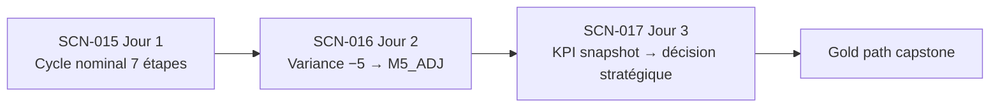
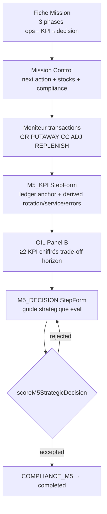

# TEC.WMS — M5 Pedagogical Intelligence Audit

**Document:** `Documentation/M5_PEDAGOGICAL_INTELLIGENCE_AUDIT.md`  
**Date:** 2026-06-17  
**Release context:** RC13 stabilizado  
**Scope:** SCN-015, SCN-016, SCN-017 (Module M5 — Peak Week)  
**Mode:** Audit only — no code, scoring, or certification changes  

---

## Executive summary

| Scenario | Peak Week | Primary competency | Bloom | Pedagogical verdict |
|----------|-----------|-------------------|-------|---------------------|
| **SCN-015** | Jour 1 — cycle nominal | Opérations intégrées | Évaluer | **GO** — chaîne ops→KPI→décision tactique claire |
| **SCN-016** | Jour 2 — variance injectée | Action corrective | Évaluer | **GO** — problème→ADJ→KPI le mieux cadré des trois |
| **SCN-017** | Jour 3 — capstone Gold | Décision stratégique | Créer | **YELLOW** — autonomie possible mais lacunes de scaffolding eval |

**Program-level M5:** Les trois scénarios forment une progression pédagogique cohérente (nominal → exception → synthèse exécutive). Le runtime enforce les gates critiques (variance, snapshot KPI, décision stratégique rejetée). Les lacunes restantes sont surtout de **clarté copy** (SCN-015 tactique vs « stratégique »), de **scaffolding eval SCN-017** (modèle complet demo-gated), et d’**Annexe A absente en M5** pour interpréter les bandes KPI.

**SCN-017 — autonomie sans professeur:** **OUI, conditionnellement.** Un étudiant discipliné peut atteindre une décision finale acceptée en s’appuyant uniquement sur Fiche Mission, Mission Control (cockpit + moniteur + stocks), étape M5_KPI (ancrage ledger) et OIL — **sans** intervention instructeur. Il doit toutefois **inférer** la structure board (trade-off, horizon 90–180 j) à partir de fragments dispersés ; le Guide Maître Annexe B (exemples acceptés/refusés) n’est **pas** exposé côté étudiant en mode évaluation.

---

## Methodology

### Sources audited (Constitution hierarchy)

| Rank | Source | In-repo proxy |
|------|--------|---------------|
| 1 | Guide Maître | `Documentation/Pedagogical_Framework/.../07-MODULE-M5-SCN-015-017/` + `09-APPENDICES/B-scn-017-decision-rubric.md` |
| 2 | Fiche Mission | `server/missionDataExtended.ts` (SCN-015/016/017) |
| 3 | Mission Control | `client/src/pages/student/MissionControl.tsx` |
| 4 | Moniteur | Transaction monitor + stock grid in Mission Control; ledger evidence in `StepForm` M5_KPI |
| 5 | Operational Intelligence Layer | `OperationalIntelligenceLayer.tsx`, `scenarioCockpitPedagogy.ts`, `m5KpiControlTower.ts` |
| 6 | Slides M5 | `client/src/data/modules.ts` (module5 slides 1–5) |

### Dimensions verified

- Clarté du raisonnement attendu  
- Qualité des données présentées  
- Relation **KPI → décision**  
- Relation **problème → action corrective**  
- Relation **décision → résultat** (conformité, score, certification)  

Runtime cross-check (read-only): `server/rulesEngine.ts`, `server/seed.ts`, `RC13_M5_VALIDATION_REPORT.md`.

---

## Common M5 pedagogical architecture

### Peak Week narrative

### Shared contract (seed)

| Field | Value |
|-------|-------|
| SKU | SKU-001 |
| Quantity | 50 u. |
| PO | PO-M5-001 |
| Route | REC-01 → B-01-R1-L1 |
| KPI seed (reference) | Rotation 6× · Service 95 % · Erreurs 4 % · Délai 3,5 j · Stock 48 000 $ |

### Step sequence

| SCN | Steps | M5_ADJ |
|-----|-------|--------|
| SCN-015 | 7 | Non |
| SCN-016 | 8 | Oui (injecté après M5_CYCLE_COUNT) |
| SCN-017 | 7 | Non |

**Chaîne ops:** `M5_RECEPTION → M5_PUTAWAY → M5_CYCLE_COUNT → [M5_ADJ] → M5_REPLENISH → M5_KPI → M5_DECISION → COMPLIANCE_M5`

---

## SCN-015 — Cycle opérationnel intégré (Peak Week Jour 1)

**Profile runtime:** `NOMINAL_INTEGRATED` · **Decision level:** TACTICAL · **Seuil:** 70/100

### O que o aluno vê

| Couche | Contenu observable |
|--------|-------------------|
| **Fiche Mission** | Objectif : cycle intégré fournisseur→entrepôt→client ; 7 étapes listées ; contrat SKU-001 · 50 u. · REC-01→B-01-R1-L1 ; critères de réussite (7 étapes, conformité, score ≥ 70) |
| **Mission Control** | Cockpit « PROCHAINE ACTION REQUISE » ; hint `expectedActionHint` (compléter chaque étape) ; stock vide avec `emptyStockNote` (« normal au départ ») ; moniteur vide puis transactions GR/PUTAWAY/CC… |
| **OIL Panel A** | Briefing mission (objectif, contexte, actions étudiant, critères/échec) |
| **OIL Panel B** | Preuves : chaîne RECEPTION→PUTAWAY→CC→REPLENISH→KPI→DECISION ; problème : « enchaîner 7 étapes sans incohérence » ; Tour de contrôle KPI M5 (cibles 6× · 95 % · 4 % · 3,5 j · 48 k$) |
| **OIL Panel D** | Annexe B — grille opérationnelle M5 (7 lignes, sans M5_ADJ) |
| **StepForm** | Formulaires par étape avec `pedagogicalDeep` (pourquoi, dépendances SAP, erreurs réelles) ; M5_KPI : bloc « Ancrage moniteur M5 » + checkbox confirmation ledger (eval) |
| **Slides M5-2** | Script classe : SKU-001 · 50 u. · REC-01→B-01-R1-L1 ; 7 étapes GREEN |

### O que deveria concluir

1. **Ordre causal :** chaque étape ops crée la preuve pour la suivante ; sauter CC ou REPLENISH fausse le snapshot KPI.  
2. **Stock vide initial = normal** — la première preuve apparaît après M5_RECEPTION.  
3. **Variance 0 au CC** confirme cohérence réception+putaway (nominal path).  
4. **KPI dérivés du moniteur** — pas de copier-coller Annexe A en eval.  
5. **M5_DECISION tactique** — action opérationnelle liée aux KPI (réappro, formation, procédures), pas synthèse board niveau SCN-017.  
6. **COMPLIANCE_M5** clôt le cycle seulement si toutes les étapes + snapshot KPI sont valides.

**Raisonnement attendu (Guide Maître):** « Ops alimente KPI final » — lien exécution → pilotage.

### Onde pode errar

| Erreur | Conséquence pédagogique |
|--------|-------------------------|
| Sauter M5_REPLENISH ou M5_CYCLE_COUNT | KPI snapshot skewed ; progression bloquée ou score réduit |
| Coller valeurs canoniques M4 (2400/400/285/300…) | Rejet eval : `isCanonicalM5KpiPaste` |
| Oublier checkbox « confirmé depuis moniteur » | M5_KPI bloqué en eval |
| Préparer une décision « board » type SCN-017 | Sur-investissement temps ; scoring tactique permissif (keywords, non rejeté) mais hors compétence Jour 1 |
| Clôturer COMPLIANCE avec étapes manquantes | Compliance rouge ; run incomplet |
| Confusion « décision stratégique » dans Fiche Mission context vs TACTICAL runtime | Préparation excessive au M5_DECISION |

### Como o sistema ajuda

| Mécanisme | Effet |
|-----------|-------|
| Prérequis stricts par étape | Impossible de poster KPI avant REPLENISH |
| `validateM5Putaway` / réception contract-bound | SKU, qty, bins enforceés |
| `deriveM5KpiFromRunEvidence` + tolérance ±5 % | KPI ancrés au ledger, anti-paste |
| OIL `alertRisk` SCN-015 | « Sauter une étape ops fausse le snapshot KPI » |
| Compliance `validateM5Compliance` | Liste étapes manquantes, snapshot absent |
| Cockpit next-action + hint pédagogique | Direction claire vers l’étape courante |

### Lacunas pedagógicas

| ID | Sévérité | Lacune | Impact |
|----|----------|--------|--------|
| P15-01 | Modérée | Fiche Mission context mentionne « décision stratégique » alors que `decisionLevel: TACTICAL` | Étudiant sur-prépare M5_DECISION |
| P15-02 | Faible | StepForm titre M5_DECISION = « Décision stratégique M5 » pour tous les SCN M5 | Nomenclature incohérente avec profil tactique |
| P15-03 | Faible | OIL affiche « Tour de contrôle KPI — Module 4 » pour entrées M5 | Label UI trompeur, contenu correct |
| P15-04 | Info | Annexe A (bandes critique/normal/excellent) visible M4 OIL seulement, pas M5 | Interprétation KPI en M5 repose sur M4 antérieur ou cibles OIL |
| P15-05 | Info | Guide Maître draft ~88 % ; exemples décision Gold finalisés instructeur-only | Pas bloquant pour SCN-015 (tactique) |

**Verdict SCN-015:** **GO** — progression ops→KPI→décision tactique pédagogiquement solide ; lacune principale = copy tactique/stratégique.

---

## SCN-016 — Gestion d’écarts et correction (Peak Week Jour 2)

**Profile runtime:** `EXCEPTION_VARIANCE` · **Variance:** −5 u. @ B-01-R1-L1 · **Decision level:** TACTICAL · **Seuil:** 70/100

### O que o aluno vê

| Couche | Contenu observable |
|--------|-------------------|
| **Fiche Mission** | Variance injectée au comptage ; « corriger via ADJ avant M5_KPI » ; specs : Système 50 u. · Physique 45 u. · Variance −5 |
| **Mission Control** | Même départ vide que SCN-015 ; écart **non visible** avant M5_CYCLE_COUNT ; après CC : variance dans formulaire + moniteur |
| **OIL Panel B** | Signal variance rouge (−5 u. @ B-01-R1-L1) ; focus : « Corriger via M5_ADJ avant réappro/KPI » ; alerte : KPI bloqué tant que variance non résolue |
| **OIL Annexe B** | 8 lignes incluant **M5_ADJ** (filtré SCN-016 uniquement) |
| **StepForm M5_ADJ** | Étape 4/8 ; champs variance + justification ≥10 chars ; `dependencyFr` explicite sur blocage REPLENISH/KPI/DECISION |
| **Slides M5-3** | Variance −5 annoncée ; M5_ADJ (MI07) requis avant REPLENISH/KPI/DECISION |

### O que deveria concluir

1. **Flux standard amont** identique à SCN-015 (RECEPTION + PUTAWAY).  
2. **L’écart n’apparaît qu’au M5_CYCLE_COUNT** — c’est le moment diagnostic (pas avant).  
3. **Règle « corriger avant de piloter »** : ADJ (MI07) obligatoire avant REPLENISH, KPI, DECISION.  
4. **Stock post-ADJ = 45 u.** — base fiable pour réappro et KPI.  
5. **KPI et décision post-correction uniquement** — piloter avec écart ouvert invalide l’analyse.  
6. **Parallèle M3/SCN-010** en contexte flux intégré M5.

**Raisonnement attendu:** Problème (écart physique) → action corrective (ADJ) → reprise flux → KPI fiables → décision tactique cohérente.

### Onde pode errar

| Erreur | Conséquence |
|--------|-------------|
| Passer à M5_REPLENISH ou M5_KPI sans ADJ | `assertM5VarianceGate` → BAD_REQUEST |
| Ignorer variance injectée (saisir 50 au lieu de 45) | Écart persistant ; gates actifs |
| COMPLIANCE_M5 avant ADJ | Compliance bloque : écart ouvert / M5_ADJ manquant |
| ADJ sans justification | Validation formulaire / score réduit |
| Traiter comme SCN-015 nominal (7 étapes) | Oublie M5_ADJ → 8/8 impossible |
| Annoncer l’écart trop tôt (instructeur) vs surprise au CC | Pédagogiquement : Guide Maître recommande annonce instructeur — **dépendance prof partielle à l’ouverture** |

### Como o sistema ajuda

| Mécanisme | Effet |
|-----------|-------|
| `getEffectiveM5Steps` injecte M5_ADJ dynamiquement | UI montre 8 étapes pour SCN-016 |
| `varianceInjection: -5` + `cycleCountTargets` | Server override counted qty |
| `assertM5VarianceGate` | Bloque REPLENISH/KPI/DECISION pre-ADJ |
| `isM5VarianceResolved` | Compliance + Gold gate `scn-016-seq` |
| OIL variance signal + alertRisk | Signal visuel au bon moment |
| StepForm pedagogicalDeep M5_ADJ | Règle « corriger avant piloter » explicite |

### Lacunas pedagógicas

| ID | Sévérité | Lacune | Impact |
|----|----------|--------|--------|
| P16-01 | Faible | Écart invisible avant CC — étudiant non averti par UI si instructeur ne annonce pas | Surprise possible ; atténuée par Fiche Mission + slide |
| P16-02 | Faible | Pastille amber OIL au CC non vérifiée browser post-G4 | Signal serveur confirmé ; UX monitor à valider live |
| P16-03 | Info | Fiche Mission expose déjà −5 u. — réduit discovery autonome | Acceptable en eval (compétence = correction, pas détection aveugle) |
| P16-04 | Info | Guide Maître recommande annonce instructeur variance | Légère dépendance prof à l’ouverture, pas à la résolution |

**Verdict SCN-016:** **GO** — meilleure chaîne problème→action→résultat du module ; gates runtime alignés avec Guide Maître et evidence matrix.

---

## SCN-017 — Décision stratégique capstone (Peak Week Jour 3)

**Profile runtime:** `STRATEGIC_CAPSTONE` · **Decision level:** STRATEGIC · **Bloom:** Créer · **Seuil:** 70/100 · **Gold gate**

### O que o aluno vê

| Couche | Contenu observable |
|--------|-------------------|
| **Fiche Mission** | Capstone décisionnel ; phases ops→KPI→DECISION ; critères : décision argumentée, KPI cohérents ; specs KPI snapshot (rotation 6× · service 95 % · erreurs 4 %) |
| **Mission Control** | `emptyStockNote` : « complétez d’abord le cycle M5_RECEPTION → mouvements → KPI » ; hint 3 phases ; moniteur + stocks comme SCN-015 |
| **OIL Panel B** | Snapshot M5_KPI obligatoire ; décision cite ≥2 KPI chiffrés ; problème : trade-off + horizon 90–180 j |
| **OIL Panel D (eval)** | « Décision stratégique : citez ≥2 KPI chiffrés de votre snapshot, arbitrage explicite, horizon 90–180 j » — **pas** le modèle complet |
| **OIL Panel D (demo)** | `M5_DECISION_SCAFFOLD` complet (Situation · Preuve KPI · Décision · Trade-off · Horizon · KPI suivi) |
| **StepForm M5_KPI** | Bloc ancrage moniteur avec rotation/service/erreurs dérivés ; checkbox ledger ; **pas** d’exemple Annexe A en eval |
| **StepForm M5_DECISION** | Guide stratégique inline (≥2 KPI, trade-off, horizon, rejet générique) |
| **Slides M5-4** | Snapshot requis ; ≥2 citations ; réponses génériques rejetées ; note instructeur « enseignant peut revoir justification » |

### O que deveria concluir

**Phase 1 — Ops (si requis):** Cycle complet SCN-015-like pour alimenter le ledger.  
**Phase 2 — KPI:** Consulter valeurs **de leur snapshot** (pas canoniques génériques) ; confirmer ancrage moniteur.  
**Phase 3 — Décision stratégique (Directeur Logistique):**

| Élément | Attendu |
|---------|---------|
| Preuve | ≥ 2 KPI **chiffrés du snapshot** (rotation, service, erreurs, délai, stock) |
| Niveau | Stratégique (politique, investissement, organisation) — **pas** opérationnel |
| Structure | Trade-off explicite (stock/service/coût) |
| Action | Recommandation + horizon 90–180 j |
| Exemples valides (Guide Maître B) | Qualité exécution · working capital · résilience capacité |

**Raisonnement attendu:** KPI mesurés → diagnostic multi-indicateur → arbitrage → recommandation exécutive mesurable.

### Onde pode errar

| Erreur | Conséquence système |
|--------|---------------------|
| M5_DECISION avant M5_KPI / sans snapshot | Rejet ou compliance bloquée |
| Réponse opérationnelle (« poster la réception ») | `OPERATIONAL_LEVEL` — score 0, rejected |
| Texte générique sans KPI chiffrés | `INSUFFICIENT_KPI_CITATIONS` — rejected |
| 1 seul KPI ou valeurs non issues du snapshot | Citations insuffisantes (< 2 matches tolérés) |
| KPI cités sans trade-off | `MISSING_TRADE_OFF` — rejected |
| Trade-off sans recommandation | `MISSING_RECOMMENDATION` — rejected |
| Recommandation sans horizon 90–180 j | `MISSING_HORIZON` — rejected |
| COMPLIANCE avant décision acceptée | `decisionRejected` bloque compliance |
| Copier exemple Annexe A sans ledger | Paste rejeté à M5_KPI |
| Mono-KPI extrême (ex. −50 % stock) ignorant service 95 % | Pédagogiquement faible ; peut passer scoring si ≥2 KPI + trade-off présents |

### Como o sistema ajuda

| Mécanisme | Effet |
|-----------|-------|
| `scoreM5StrategicDecision` | Rejet séquentiel avec feedback FR (KPI → trade-off → reco → horizon) |
| `countM5KpiNumericCitations` vs snapshot | Force lien données→décision |
| `validateM5Compliance` + `decisionRejected` | Impossible de clôturer sans décision valide |
| Gate KPI snapshot (`getKpiSnapshotByRun`) | Décision impossible sans preuve KPI enregistrée |
| OIL M5 Control Tower SCN-017 | Rappel ≥2 KPI, trade-off, horizon |
| StepForm guides inline | Requirements visibles à l’étape DECISION |
| Gold dual gate | `capstoneScore` ≥ 70 + `decisionLinked` |

### Lacunas pedagógicas

| ID | Sévérité | Lacune | Impact autonomie |
|----|----------|--------|------------------|
| P17-01 | **Modérée** | `M5_DECISION_SCAFFOLD` complet **demo-only** ; eval = requirements fragmentaires | Étudiant doit assembler structure board seul |
| P17-02 | **Modérée** | Annexe B Guide Maître (exemples A1–A3 / R1–R3) **instructeur-only** | Pas d’exemplar accepté/refusé côté étudiant |
| P17-03 | Modérée | Annexe A bandes KPI absente en OIL M5 | Interprétation « normal/excellent » repose sur M4 ou mémoire |
| P17-04 | Faible | Slide M5-4 : « enseignant peut revoir justification » | Signal implicite de validation prof |
| P17-05 | Faible | RunReport M5_DECISION % (max 30 vs scorer 80) | Auto-évaluation post-run trompeuse |
| P17-06 | Faible | Rejection patterns FR-only pour niveau opérationnel | Anglophones moins couverts (KPI gate reste) |
| P17-07 | Info | Guide Maître draft : rubrique 017 ~75 % annexes prof | Documentation institutionnelle incomplète |

---

## SCN-017 — Focus autonomie (sans professeur)

### Question audit

> L’étudiant peut-il atteindre la décision finale acceptée en utilisant **uniquement** Fiche Mission, Moniteur, Dashboard (Mission Control), KPI — sans dépendre du professeur ?

### Verdict: **OUI — avec effort de synthèse**

### Parcours autonome validé

### Ce que l’étudiant autonome **a**

| Ressource | Information actionable |
|-----------|------------------------|
| Fiche Mission | Phases 1-2-3 ; critères succès ; failure « décision sans lien KPI » |
| Cockpit stocks | Quantités par bin post-ops |
| Moniteur | Preuve transactionnelle complète |
| M5_KPI ledger box | `receivedQty`, `putawayQty`, variance, **rotation × service % errors %** dérivés |
| OIL expectedOutput SCN-017 | « Trade-off · recommandation · horizon 90–180 j » |
| StepForm M5_DECISION | Checklist ≥2 KPI · trade-off · horizon · rejet générique |
| Feedback serveur rejet | Messages séquentiels (ajoutez arbitrage, horizon, etc.) |

### Ce que l’étudiant autonome **n’a pas** (vs professeur)

| Ressource instructeur | Disponible étudiant eval |
|-----------------------|--------------------------|
| Annexe B exemples A1–A3 (décisions acceptées) | Non |
| Grille instructeur rapide M5_DECISION | Non |
| Annonce narrative « vous êtes Directeur Logistique au comité » | Partiel (Fiche Mission rôle + OIL compétence Panel E) |
| Débrief 5 questions post-scénario | Non (hors plateforme) |
| Validation subjective « qualité board » au-delà des gates | Non requise pour complétion — gates automatiques suffisent |

### Exemple de décision autonome acceptable (alignée Guide Maître A1)

> *Situation post-cycle : rotation 6× (normal), service 95 % (excellent), erreurs 4 % (acceptable), délai 3,5 j. **Arbitrage :** prioriser qualité d’exécution vs réduction stock immédiat. **Recommandation :** plan formation picking/réception 90 j avec revue hebdo erreurs, cible erreurs ≤ 2 % sans dégrader le taux de service.*

Cette réponse est constructible **uniquement** depuis snapshot M5_KPI + guides eval — sans prof.

### Risques d’échec autonome

1. **Sous-scaffolding eval** — étudiant faible en synthèse écritive échoue malgré bonnes ops.  
2. **Confusion ops vs stratégique** — tenter de « continuer le rangement » → rejet R1.  
3. **Citer KPI canoniques M4** sans snapshot run → citations non matchées ou paste rejeté en amont.  
4. **Ignorer feedback rejet séquentiel** — boucle DECISION sans lire messages.  

### Recommandation pédagogique (documentation only)

Pour renforcer l’autonomie **sans modifier scoring** : exposer en eval un **modèle structurel minimal** (Situation → Preuve KPI → Arbitrage → Recommandation → Horizon) — pas les exemples de contenu A1–A3 — et afficher Annexe A bandes en OIL M5.

---

## Cross-scenario intelligence matrix

### KPI → décision

| SCN | KPI source | Lien enforced | Clarté |
|-----|------------|---------------|--------|
| SCN-015 | Ledger-derived + checkbox | Souple (keywords tactiques) | Bon — focus ops alimente KPI |
| SCN-016 | Post-ADJ ledger | Souple tactique ; KPI bloqué pre-ADJ | Excellent |
| SCN-017 | Snapshot enregistré | **Strict** ≥2 citations numériques snapshot | Bon runtime ; scaffolding eval partiel |

### Problème → action corrective

| SCN | Problème | Action attendue | Gate |
|-----|----------|-----------------|------|
| SCN-015 | Enchaînement incohérent | Compléter 7 étapes ordonnées | Prérequis steps |
| SCN-016 | Variance −5 au CC | M5_ADJ (MI07) + justification | `assertM5VarianceGate` |
| SCN-017 | Décision sans preuve KPI | Compléter ops + M5_KPI puis synthèse | Snapshot + strategic rubric |

### Décision → résultat

| SCN | Décision type | Résultat observable |
|-----|---------------|---------------------|
| SCN-015 | Tactique (non rejetée) | COMPLIANCE_M5 → run completed ≥70 → Gold path SCN015 |
| SCN-016 | Tactique post-correction | + Gold gate ADJ before KPI (`scn-016-seq`) |
| SCN-017 | Stratégique acceptée | COMPLIANCE_M5 → capstone score ≥70 → `decisionLinked` → Gold eligible |

---

## Source alignment summary

| Source | SCN-015 | SCN-016 | SCN-017 |
|--------|---------|---------|---------|
| Guide Maître fiche | ✓ | ✓ | ✓ (draft partial annexes) |
| Fiche Mission | △ tactique/stratégique copy | ✓ | ✓ |
| Mission Control | ✓ | ✓ | ✓ |
| Moniteur | ✓ | ✓ | ✓ |
| OIL | ✓ | ✓ | △ eval scaffold réduit |
| Slides M5 | ✓ | ✓ | △ note revue prof |
| Runtime gates | ✓ | ✓ | ✓ |

---

## Issues register (pedagogical only)

| ID | SCN | Sévérité | Issue | Action recommandée (docs) |
|----|-----|----------|-------|---------------------------|
| M5-PI-01 | 015 | P2 | Copy « décision stratégique » vs TACTICAL | Aligner Fiche Mission + StepForm titre |
| M5-PI-02 | 017 | P1 | Scaffold décision demo-gated | Exposer structure minimale en eval (sans exemples) |
| M5-PI-03 | 017 | P2 | Annexe B exemples instructeur-only | Option : lien étudiant vers structure, pas contenu |
| M5-PI-04 | All M5 | P2 | Annexe A absente OIL M5 | Étendre table bandes KPI à moduleId 5 |
| M5-PI-05 | 017 | P3 | Slide « enseignant peut revoir » | Clarifier : gates auto suffisent pour complétion |
| M5-PI-06 | All | P3 | OIL label « Module 4 » sur tour M5 | Cosmétique UI |
| M5-PI-07 | GM | P3 | Guide Maître M5 annexes ~75 % | Finaliser rubrique + exemples PDF instructeur |

---

## Sign-off

| Item | Status |
|------|--------|
| Code modified | **No** |
| Scoring modified | **No** |
| Certification modified | **No** |
| SCN-015 pedagogical intelligence | **GO** |
| SCN-016 pedagogical intelligence | **GO** |
| SCN-017 pedagogical intelligence | **YELLOW** |
| SCN-017 autonomie sans professeur | **OUI (conditionnel)** |
| M5 module overall | **YELLOW** — autonomie capstone et copy tactique/stratégique |

*Audit complete — RC13 M5 pedagogical intelligence pass.*
