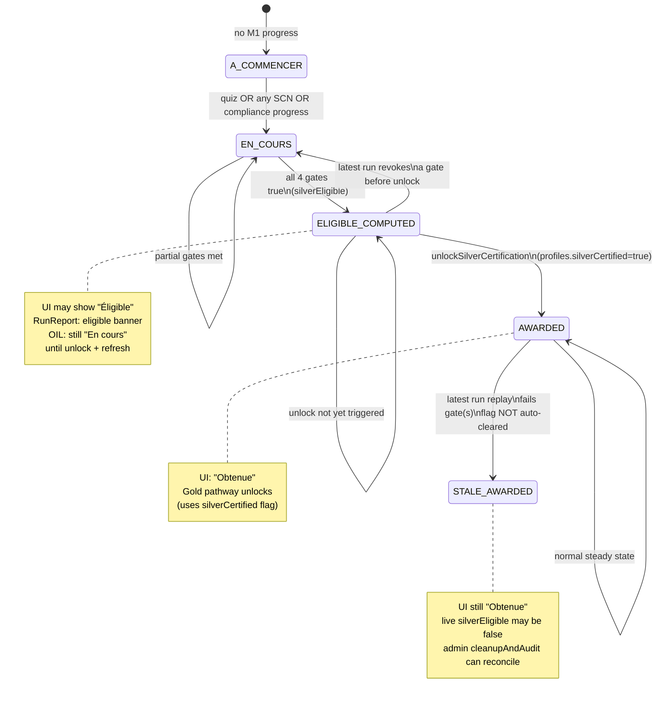
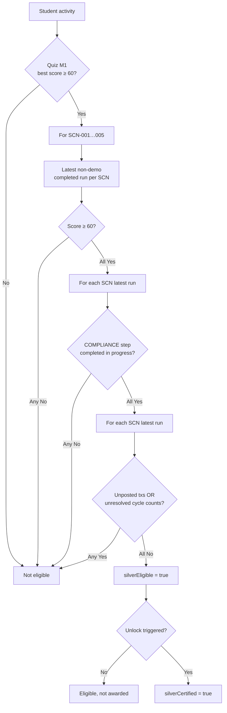
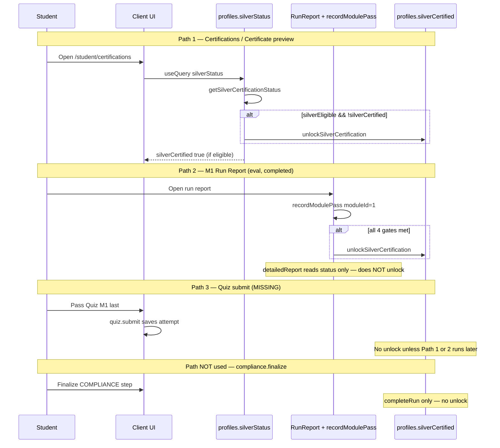
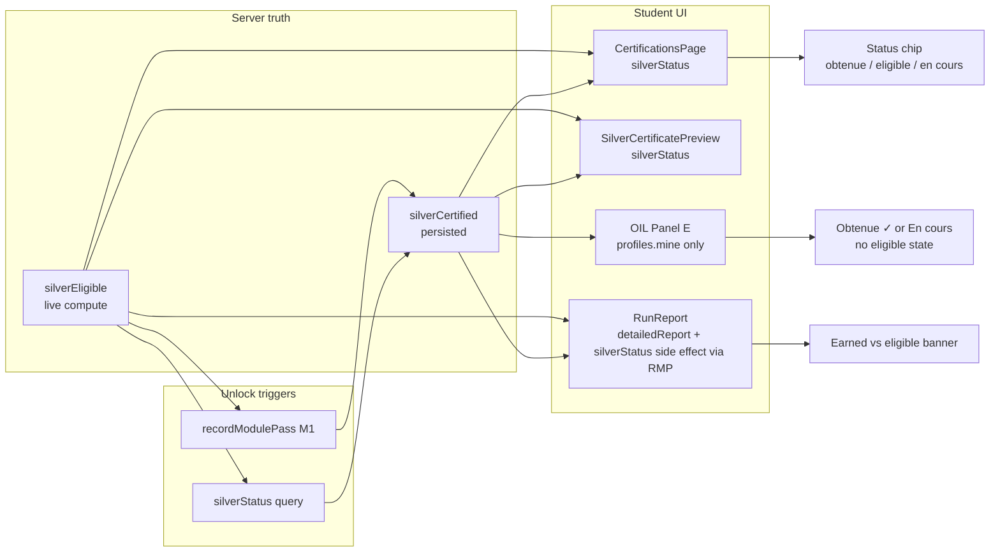

# TEC.WMS — RC13 Silver Certification Resolution Audit

**Audit type:** Read-only static code analysis (no code, DB, deploy, git, or migration changes)  
**Repository:** `tec-wms-simulator-production`  
**Branch:** `production-hotfix-rc13-pedagogy-class6`  
**Reference commit:** `711c822fa3781fd155fc97be886975323332669d` — `fix(rc13): finalize Manus pedagogical polish`  
**Auditor:** Cursor Agent  
**Date:** 2026-06-17  

---

## Executive Summary

Students who believe they have “completed M1” but do not see **Silver — Obtenue** are almost never blocked by a missing eligibility engine. The server computes Silver eligibility correctly from four live gates. The dominant failure mode is **semantic mismatch** (“M1 complete” ≠ Silver eligible) combined with **lazy persistence** (the `profiles.silverCertified` flag is only written when specific API endpoints run).

The second failure mode is **eligible-but-not-awarded**: all gates are true in live computation, but the student never triggered an unlock path (most commonly: Quiz M1 passed last, without visiting Certifications or opening an M1 Run Report afterward).

**Final verdict: YELLOW (conditional GO)** — Silver rules are production-correct; unlock timing and UI surfaces create avoidable student confusion. No critical engine defect blocks RC13 if instructors use the Certifications checklist as source of truth.

---

## A–E — Definitions and State Matrix

### A. What makes a student Silver **Eligible**?

Live computation in `getSilverCertificationStatus` (`server/db.ts`). **All four gates must be true:**

| Gate | Function | Rule |
|------|----------|------|
| 1 — Quiz M1 | `checkM1QuizPassed` | Best `quizAttempts.score` ≥ `QUIZ_PASS_THRESHOLD` (60) for module 1 quiz |
| 2 — SCN-001…005 | `getM1ScenarioCompletionStatus` | For each canonical SCN: latest **non-demo** completed run has `calculateTotalScore(events)` ≥ 60 |
| 3 — Compliance | `checkM1ComplianceValidated` | On each SCN’s latest eval run: `progress` row with `stepCode = "COMPLIANCE"` and `completed = true` |
| 4 — Blockers | `checkNoUnresolvedBlockers` | On each SCN’s latest eval run: no `transactions.posted = false`; no `cycleCounts.resolved = false` |

Additional constraints:

- **Evaluation only:** `scenarioRuns.isDemo = false`
- **Canonical SCN mapping:** duplicate M1 scenario rows deduped via `scenarioIdsForScn` / `OFFICIAL_SCN_BY_MODULE[1]`
- **Latest run wins per SCN:** newest `completedAt` overrides older passes; a later failing run revokes credit for that SCN

```typescript
// server/db.ts
const silverEligible = quizPassed && allScenariosDone && complianceValidated && noBlockers;
```

### B. What makes a student Silver **Awarded**?

**Awarded** (institutional “obtained” in product copy) means the persisted profile flag is set:

- `profiles.silverCertified = true`

There is **no** separate instructor approval step for Silver. Award is automatic when an unlock trigger fires while `silverEligible === true`.

Award is **not** the same as eligibility: a student can satisfy all gates in live computation without the flag being written yet.

### C. What makes a student Silver **Persisted**?

Persistence is a single boolean column:

```typescript
// drizzle/schema.ts — profiles
silverCertified: boolean("silverCertified").default(false).notNull()
```

Written only by `unlockSilverCertification(userId)`:

```typescript
// server/db.ts
await db.update(profiles).set({ silverCertified: true }).where(eq(profiles.userId, userId));
```

**There is no automatic revocation** when eligibility is later lost (e.g. poor replay). Only admin paths reset the flag (`resetStudentCertification`, `cleanupAndAudit`).

### D. What makes a student Silver **Displayed**?

Display uses **different inputs per surface:**

| Surface | “Obtenue / Obtained” source | “Éligible / Eligible” source |
|---------|----------------------------|------------------------------|
| **CertificationsPage** | `silverStatus.silverCertified` via `resolveSilverState` → `obtenue` | `allRequirementsMet \|\| silverEligible` when flag false → `eligible` |
| **SilverCertificatePreview** | `silverCertified` | Preview watermark when eligible but flag false |
| **RunReport** | `detailedReport.certificationUnlocked` (= `silverCertified`) | Banner when `silverEligible && !certificationUnlocked` |
| **OIL Panel E (M1)** | `profiles.mine.silverCertified` | Never shows “eligible” — only “En cours” vs “Obtenue ✓” |

Client state machine (`CertificationStatus.tsx`):

```typescript
if (input.silverEarned) return "obtenue";
if (input.allRequirementsMet || input.silverEligible) return "eligible";
if (input.hasAnyProgress) return "en_cours";
return "a_commencer";
```

**Important:** `obtenue` requires the **persisted flag**, not live eligibility alone.

### E. Can a student be in these split states?

| Split state | Possible? | Mechanism |
|-------------|-----------|-----------|
| **Eligible, not awarded** | **Yes** | All gates true; `silverCertified` still false because no unlock trigger ran (see §5) |
| **Awarded, not displayed as Obtenue** | **Yes (transient/stale UI)** | OIL reads `profiles.mine` without calling `silverStatus`; cache not invalidated after unlock via `recordModulePass` |
| **Displayed eligible, not persisted** | **No (steady state)** | `profiles.silverStatus` unlocks in the same request before returning data; Certifications page cannot stay “eligible” without eventually persisting on fetch |
| **Displayed Obtenue, not currently eligible** | **Yes (stale flag)** | `silverCertified` stays true after replaying a SCN below threshold / with blockers; engine does not auto-revoke |
| **Persisted, not eligible** | **Yes (stale flag)** | Same as above — flag is write-once unless admin reset |
| **Checklist 100%, not eligible** | **No** | Client checklist and server gates use the same booleans from one `silverStatus` response |

---

## 1. State Diagram



### UI chip mapping (Certifications page)

| Chip | Server condition |
|------|------------------|
| À commencer | No quiz, SCN, or compliance progress |
| En cours | Some progress; not all gates |
| Éligible | All gates met; `silverCertified === false` (briefly, until `silverStatus` unlock runs) |
| Obtenue | `silverCertified === true` |

---

## 2. Eligibility Flow



### Gate-by-gate investigation notes

#### Quiz M1

- Source: `checkM1QuizPassed` — best attempt by `desc(quizAttempts.score)`
- Threshold: `QUIZ_PASS_THRESHOLD = 60` (`shared/moduleThresholds.ts`)
- **Gap:** `quiz.submit` saves the attempt but **does not** call `unlockSilverCertification`

#### SCN-001 to SCN-005

- Per-SCN: `getLatestNonDemoCompletedRunForM1Scn` picks newest completed eval run across duplicate scenario rows
- Pass threshold: 60/100 on scoring events (not module step %)
- **Demo mode:** `isDemo = true` runs are excluded entirely

#### Compliance

- Requires `progress.stepCode = "COMPLIANCE"` completed on **each** SCN’s latest eval run
- Set during `compliance.finalize` (eval mode) via `markStepComplete(runId, "COMPLIANCE")`
- **Gap:** finalize calls `completeRun` only — **no** Silver unlock

#### Blockers

- Unposted transactions (`posted = false`) or unresolved cycle counts (`resolved = false`) on latest eval run per SCN
- SCN-002 (ghost GR) and SCN-004 (variance) are common real-world blockers

#### Evaluation vs Demo

| Aspect | Evaluation (`isDemo=false`) | Demo (`isDemo=true`) |
|--------|----------------------------|----------------------|
| Counts toward Silver | Yes | **No** |
| Compliance finalize | Hard block if non-compliant | Allowed with warning |
| `recordModulePass` | Fires from RunReport | Skipped |
| Score on Run Report | Official | Pedagogical label |

#### Latest-run logic (critical)

For each SCN independently, the engine uses **only the most recent** completed non-demo run. A student who passed SCN-003 yesterday but replayed today with score 45 **loses** SCN-003 credit even if an older run passed.

---

## 3. Persistence Flow



### Unlock triggers (Silver only)

| # | Trigger | Location | Condition |
|---|---------|----------|-----------|
| 1 | Lazy unlock on query | `server/routers.ts` → `profiles.silverStatus` | `silverEligible && !silverCertified` |
| 2 | Post run-report module pass | `warehouse.recordModulePass` when `moduleId === 1` | All four gates rechecked; unlock if met |
| — | **Not a trigger** | `compliance.finalize` | Completes run only |
| — | **Not a trigger** | `quiz.submit` | Saves attempt only |
| — | **Not a trigger** | `runs.detailedReport` | Read-only status for RunReport banner |

### Certification storage

| Store | Field | Meaning |
|-------|-------|---------|
| `profiles` | `silverCertified` | **Only** persisted Silver award flag |
| `module_progress` | `passed`, `bestScore` | Module unlock progression — **independent** of Silver |
| `quizAttempts` | `score`, `passed` | Quiz gate input |
| `scenarioRuns` + `scoring_events` | run status, score | SCN gate input |
| `progress` | step completion | Compliance gate input |
| `transactions`, `cycle_counts` | posted/resolved | Blocker gate input |

### Admin reconciliation

`admin.cleanupAndAudit` recalculates `shouldHaveSilver` from live gates and can set `silverCertified` to match (including **revoking** stale true when `shouldHaveSilver` is false). Official student emails are preserved in audit only; non-official stale flags can be corrected when `dryRun: false`.

---

## 4. Display Flow



### Certifications page rendering

- Data: `trpc.profiles.silverStatus.useQuery()` — **side-effect unlock**
- Progress ring: 9 checklist rows (1 quiz + 5 SCNs + compliance + blockers); `Math.round(metCount/9*100)` → 8/9 displays **89%**, not 90%
- Certificate button: visible when `silverEarned || silverState === "eligible"`
- Status banner: driven by `resolveSilverState`

### Continue button behavior (Silver section)

```tsx
// CertificationsPage.tsx — lines 331-335
{!silverEarned && (
  <Button variant="outline" onClick={() => navigate("/student/quiz/1")}>
    {t("Continuer le parcours", "Continue pathway")}
  </Button>
)}
```

| Control | Condition | Action | Issue |
|---------|-----------|--------|-------|
| Voir mon certificat / Aperçu | `silverEarned \|\| eligible` | `/student/certifications/silver` | OK — preview route also calls `silverStatus` |
| **Continuer le parcours** | `!silverEarned` (includes eligible) | **Always** `/student/quiz/1` | Does not route to next unmet gate; shown even when only compliance/blockers remain |
| Per-row links | Row not met | Quiz → quiz/1; SCNs/compliance/blockers → `/student/scenarios` | Generic hub; no SCN deep link |

Run Report actions: “Back to scenarios” / “Restart scenario” — **no** Continue-to-certifications unless eligible banner is shown.

---

## 5. Root Cause Analysis

### Primary root cause — “Completed M1” ≠ Silver eligible

Students and some UI surfaces conflate **module completion** with **Silver certification**. These are separate systems:

| Signal student sees | What it actually means | Silver? |
|---------------------|------------------------|---------|
| Run Report: “Module complété avec succès” | Current run finalized with compliance | Only this SCN; need all 5 + quiz + cross-SCN gates |
| OIL: “Module validé — meilleur score” | `module_progress.passed` from **any one** M1 eval run ≥ 60 via `recordModulePass` | **No** — Silver requires **all five** SCNs |
| Mission Control / Run Report **80–90%** | Operational step progress (`calculateProgressPctAllModules`) | **No** — one in-run step short (often COMPLIANCE or ADJ) |
| Certifications checklist 8/9 (**89%**) | One checklist row still open | **No** — commonly quiz, one SCN, compliance row, or blockers row |

### Secondary root cause — Lazy unlock gap (eligible, not awarded)

When all gates become true, **`silverCertified` stays false** until:

1. Student opens **Certifications** or **Silver certificate preview** (`silverStatus` query), **or**
2. Student opens an M1 **Run Report** for a completed eval run (`recordModulePass` with `moduleId === 1`)

**Highest-risk sequence:**

1. Student completes SCN-001…005 in evaluation (unlock checks run on each run report — but only if all gates already met at that moment).
2. Student passes **Quiz M1 last** via `quiz.submit`.
3. Student does not revisit Certifications or open another M1 run report.
4. Result: **`silverEligible === true`**, **`silverCertified === false`** indefinitely.

RunReport explicitly surfaces this split:

```tsx
// RunReport.tsx — eligible but not yet persisted
{safeDetail?.silverEligible && !safeDetail?.certificationUnlocked && (
  // "You are eligible — visit the Certifications page"
)}
```

Note: `detailedReport` sets `certificationUnlocked` from `silverStatus.silverCertified` **without** unlocking — so this banner is expected until Path 1 or 2 runs.

### Tertiary root causes

| ID | Cause | Impact |
|----|-------|--------|
| R-03 | **Latest run wins** | Replaying a SCN in eval with score &lt; 60 or open blockers silently revokes that SCN’s credit |
| R-04 | **Demo runs** | Practice sessions never count; student may believe demo completion satisfies Silver |
| R-05 | **Compliance / blockers rows** | All SCNs at ≥ 60 but COMPLIANCE step missing on latest run, or ghost GR / open CC on latest run |
| R-06 | **OIL uses stale profile** | After unlock via run report, Panel E may still show “En cours” until `profiles.mine` refetches |
| R-07 | **Continue button → quiz/1** | Eligible students with `!silverEarned` see misleading next step |
| R-08 | **No auto-revoke** | Opposite symptom: shows Obtenue while no longer eligible (stale flag) |

### What is NOT the root cause

- Missing Silver eligibility engine — **present and correct** at `711c822`
- Missing SCN catalog — canonical SCN-001…005 mapping is implemented
- Gold-style feature flag — Silver has **no** `ENABLE_SILVER_UNLOCK`; unlock is unconditional when triggered
- Checklist math bug — client checklist mirrors server booleans from the same API response

---

## 6. Recommended Minimal Fix

Documentation-only recommendation; **no implementation in this audit**.

### P0 — Close the unlock gap (single highest-impact change)

**Invoke the same Silver unlock block at the end of `quiz.submit` when `moduleId === 1` and live gates pass** (mirror `recordModulePass` M1 block):

```typescript
// Pseudocode — add to quiz.submit after saveQuizAttempt
if (input.moduleId === 1) {
  const status = await getSilverCertificationStatus(ctx.user.id);
  if (status.silverEligible && !status.silverCertified) {
    await unlockSilverCertification(ctx.user.id);
  }
}
```

**Alternative/complement:** Call unlock at end of `compliance.finalize` for eval runs (covers “quiz already done, last SCN finalized, never opened run report” if finalize is always followed by report — still add quiz path).

Estimated scope: ~10 lines in `server/routers.ts`; no schema migration.

### P1 — UI consistency (low scope)

1. **OIL Panel E:** Query `silverStatus` (or invalidate `profiles.mine` after unlock) so “Obtenue ✓” matches Certifications.
2. **Continue button:** Hide when `silverState === "eligible"` or navigate to `/student/certifications` instead of `/student/quiz/1`.
3. **RunReport:** Optionally call `silverStatus` invalidation after `recordModulePass` so earned banner appears without second navigation.

### P2 — Operational (no code)

- Direct students to **Mes Certifications** after M1; treat checklist as authoritative.
- Explain **Evaluation vs Demo** before scenario work.
- Run `admin.cleanupAndAudit` before reporting cohort Silver rates.

---

## 7. Risk Assessment

| Risk | Likelihood | Severity | Mitigation |
|------|------------|----------|------------|
| Student eligible indefinitely without award flag | **High** (quiz-last path) | Medium — Gold locked, roster shows no Silver | P0 unlock on quiz.submit |
| Student believes M1 module pass = Silver | **High** | Medium — support burden | Instructor messaging; OIL/checklist alignment |
| Latest-run replay revokes eligibility | Medium | Medium — confusion | P2 warning copy when new run &lt; 60 |
| Stale `silverCertified=true` after failed replay | Low–Medium | Low (over-award) | Admin `cleanupAndAudit` |
| Demo work counted mentally but not in engine | Medium | Medium | Mode labeling in ScenarioList |
| Continue button misroutes eligible students | Medium | Low | P1 button logic |
| Gold LOCKED despite Silver work complete | Medium (flag not persisted) | Medium | P0 + visit Certifications workaround |

**Regression risk of P0 fix:** Low — idempotent `UPDATE … silverCertified=true`; same guard as existing paths.

---

## 8. All Possible Silver States (Consolidated)

| # | silverEligible | silverCertified | UI (Certifications) | UI (OIL) | Interpretation |
|---|----------------|-----------------|---------------------|----------|----------------|
| 1 | false | false | À commencer / En cours | En cours | Working toward Silver |
| 2 | true | false | **Éligible** | En cours* | **Eligible, not awarded** — unlock gap |
| 3 | true | true | **Obtenue** | Obtenue ✓ | Fully awarded |
| 4 | false | true | **Obtenue** | Obtenue ✓ | **Stale award** — flag not revoked |
| 5 | true | true (then eligible false on recompute) | Obtenue | Obtenue ✓ | Stale award + live ineligibility |

\*OIL until profile refresh.

---

## 9. Key File Reference

| Concern | File |
|---------|------|
| Silver eligibility engine | `server/db.ts` — `getSilverCertificationStatus`, M1 gate functions |
| Unlock write | `server/db.ts` — `unlockSilverCertification` |
| Unlock triggers | `server/routers.ts` — `profiles.silverStatus`, `warehouse.recordModulePass` |
| Quiz submit (no unlock) | `server/routers.ts` — `quiz.submit` |
| Compliance finalize (no unlock) | `server/routers.ts` — `compliance.finalize` |
| Run report status | `server/routers.ts` — `runs.detailedReport` |
| Certifications UI | `client/src/pages/student/CertificationsPage.tsx` |
| Status chips | `client/src/components/certification/CertificationStatus.tsx` |
| Run report UI | `client/src/pages/student/RunReport.tsx` |
| OIL certification line | `client/src/components/operational-intelligence/OperationalIntelligenceLayer.tsx` |
| Thresholds | `shared/moduleThresholds.ts` |
| SCN catalog | `server/canonicalScenarios.ts` |
| Schema | `drizzle/schema.ts` — `profiles.silverCertified` |
| Tests | `server/silver.certification.test.ts` |

---

## 10. Final Verdict

| Criterion | Assessment |
|-----------|------------|
| Eligibility engine (4 gates, SCN-001…005, eval-only, latest run) | **GO** |
| Persistence model | **YELLOW** — correct but lazy; quiz-last gap |
| Display / student intelligence | **YELLOW** — split surfaces, misleading Continue, OIL stale |
| Data integrity (auto-revoke) | **YELLOW** — stale true possible; admin tooling exists |

### **RC13 Silver verdict: YELLOW (conditional GO)**

The Silver **rules engine** at `711c822` is correct and test-documented. Students who completed M1 but lack Silver **Obtenue** are explained by (1) stricter Silver gates vs module-pass/progress signals, and (2) missing unlock invocation on quiz completion and compliance finalize. **Safe for RC13** with instructor guidance to open Certifications after M1; **recommended P0 fix** before treating Silver persistence as fully self-serve.

---

*End of audit — no repository files were modified except this documentation artifact.*
