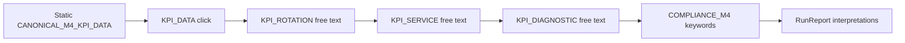
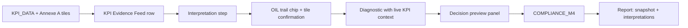
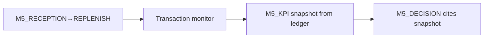

# TEC.WMS — RC14 M4 Premium Intelligence Gap Analysis

**Audit type:** Read-only premium intelligence / operational UX analysis  
**Scope:** Module 4 — SCN-012, SCN-013, SCN-014  
**Gold standard reference:** M1/M2 transactional intelligence (Mission Control + OIL + Monitor)  
**Bridge reference:** M5 integrated ops→KPI snapshot pattern  
**Repository:** `tec-wms-simulator-production`  
**Date:** 2026-06-18  
**Constraints:** No code changes · No implementation · Audit only  

---

## Executive Summary

M4 is **functionally correct**: SCN-012/013/014 execute, KPI logic is accurate, pedagogy is approved, and compliance validators enforce scenario-specific outcomes. The gap is **not correctness** but **premium intelligence feel** — students and instructors perceive a **monitor vazio** and **low dynamic operational evidence** compared to the M1/M2 gold standard.

| Dimension | M1/M2 gold | M4 current | Gap severity |
|-----------|------------|------------|:------------:|
| KPI Tower | N/A (OIL Panel B = transaction hub) | Text-only narrative tower | **HIGH** |
| Mission Control | Live state-driven cockpit | Shared shell; static analytical mode | **MEDIUM** |
| Monitor | Ledger + inventory proof | Always empty | **HIGH** (by design, poorly compensated) |
| Evidence Layer | Document + stock + compliance chain | Static KPI briefing + prose tower | **HIGH** |
| Decision Support | Panel D + server gates mid-run | End-of-run compliance only | **MEDIUM** |
| Compliance | Red/amber/green mid-pipeline | Green until COMPLIANCE_M4 | **MEDIUM** |
| KPI Snapshots | N/A (M5: ledger-derived snapshot) | None — static seed only | **HIGH** |
| Feedback Loops | Action → visible ledger/stock/score | Text submit → toast; cockpit unchanged | **HIGH** |

**Overall M4 premium intelligence verdict:** **YELLOW** — pedagogically sound analytical module that **under-delivers on operational aliveness** relative to M1/M2/M5. Students trained on transactional proof expect evidence they cannot find; the KPI tower compensates narratively but not dynamically.

**Strategic answer:** M4 does not need to become M1 (physical transactions), but it **must** adopt M5's *evidence anchoring* pattern in display-only form: live KPI tiles, interpretation trail, scenario alerts, and visible decision artifacts — without introducing ops simulation in RC14 scope.

---

## Audit Method

### Gold standard definition (M1/M2)

Premium intelligence in M1/M2 is defined by a closed loop:

```
Student action → rulesEngine → ledger/inventory/compliance → refetch → Mission Control + OIL update
```

Exiting elements that make M1/M2 feel "alive":**

| Pattern | Source | Effect |
|---------|--------|--------|
| SCN-keyed pedagogy | `scenarioCockpitPedagogy.ts` | Hints change per scenario |
| Transaction monitor | `MissionControl.tsx` | POSTED/PENDING rows; `animate-pulse` on PENDING |
| Ghost GR remediation | `UnpostedTransactionsPanel.tsx` | Deep-link to fix anomaly |
| Compliance as mid-run gate | `checkCompliance()` | Red border before finalize |
| Stock grid from ledger | `runs.state.inventory` | Physical proof of decisions |
| Panel F step chips | `OperationalIntelligenceLayer.tsx` | Active/completed/locked visual rail |
| Immediate refetch loop | `StepForm.handleSuccess` | Score, progress, compliance refresh |

Primary files: `MissionControl.tsx`, `OperationalIntelligenceLayer.tsx`, `UnpostedTransactionsPanel.tsx`, `rulesEngine.ts`, `scenarioCockpitPedagogy.ts`.

### M4 sources audited

| Layer | Path |
|-------|------|
| KPI Tower | `client/src/data/m4KpiControlTower.ts` |
| OIL integration | `client/src/components/operational-intelligence/OperationalIntelligenceLayer.tsx` |
| Mission Control | `client/src/pages/student/MissionControl.tsx` |
| Step pipeline | `client/src/pages/student/StepForm.tsx` |
| KPI engine & compliance | `server/rulesEngine.ts` (`CANONICAL_M4_KPI_DATA`, `validateM4Compliance`) |
| Mission authority | `server/missionDataExtended.ts` |
| Pedagogy | `client/src/data/scenarioCockpitPedagogy.ts` |
| Run report | `client/src/pages/student/RunReport.tsx` |
| M5 bridge (contrast) | `client/src/data/m5KpiControlTower.ts`, M5_KPI step |

### Prior audits cross-referenced

- `Documentation/M4_PEDAGOGICAL_INTELLIGENCE_AUDIT.md` — pedagogical chain (SCN-012 GREEN, 013/014 YELLOW)
- `Documentation/RC13_M4_VALIDATION_REPORT.md` — implementation + unit tests
- `Documentation/M5_PEDAGOGICAL_INTELLIGENCE_AUDIT.md` — ops→KPI snapshot gold pattern for M5

---

## Layer-by-Layer Comparison

### 1. KPI Tower

| Aspect | M1/M2 | M4 | Gap |
|--------|-------|-----|-----|
| Role | N/A — Panel B shows transactions | Primary evidence substitute | Paradigm shift |
| Data binding | Live `runs.state` | Static copy in `M4_KPI_CONTROL_TOWER` | **No run-state binding** |
| Visual bands | Green/red qty, pulse badges | Amber text block for `alertRisk` only | **No KPI gauge / band colors** |
| Scenario variance | Per-SCN pedagogy in evidence block | Per-SCN tower copy (good) | Copy OK; dynamics missing |
| Post-step update | Tower N/A; monitor updates | Tower unchanged after KPI_ROTATION etc. | **No interpretation trail in tower** |

**Finding:** KPI values (6×, 95%, 4%, 3.5d, $48k) appear in `KPI_DATA` StepForm and tower *narrative* but never as **live tiles with Annexe A band coloring** (critical / normal / excellent). M5 exposes numeric targets in tower (`6× · 95% · 4% · 3.5d · $48k`); M4 embeds them in prose only.

**Where KPI appears without operational evidence:**

| KPI | Where shown | Operational proof | Verdict |
|-----|-------------|-------------------|---------|
| Rotation 6× | KPI_DATA, tower, step hints | None — static formula text | **KPI without evidence** |
| Service 95% | KPI_DATA, KPI_SERVICE step | None — no SO/GI/OTIF rows | **KPI without evidence** |
| Errors 4% | KPI_DATA only | No error log, no interpretation step | **KPI without evidence** |
| Lead time 3.5d | KPI_DATA only | No PO→GR timestamps | **KPI without evidence** (SCN-014 critical) |
| Capital $48k | Tower + mission | No valuation ledger | Acceptable for analytical mode |

---

### 2. Mission Control

M4 correctly reuses the M1/M2 cockpit shell. Intelligence degradation occurs in the **left column operational focus**:

| Zone | M1/M2 behavior | M4 behavior | Static? |
|------|----------------|-------------|:-------:|
| Next Action Cockpit | Border color: green/primary/red by step state | Same — uses `expectedActionHint` | Partially dynamic |
| Stock grid | Live bins/qty | Always empty + `emptyStockNote` | **Static** |
| Transaction Monitor | Growing ledger | Always empty + hint banner | **Static** |
| Performance sidebar | Score/progress animate | Works | Dynamic |
| OIL (right) | Six panels | Five panels (A–E); tower in B | Mixed |

**Finding:** Mission Control does not surface **in-run interpretation results** (`kpiInterpretations` from backend) anywhere in the cockpit. After KPI_ROTATION submit, the tower still shows the same pre-run copy — no "your classification: normal ✓" chip. M1 would show a new POSTED row immediately.

---

### 3. Monitor

The empty transaction monitor is **architecturally correct** for analytical M4 (no physical WMS ops). It is ** experientially insufficient** versus gold standard:

| M1/M2 monitor signal | M4 equivalent | Present? |
|---------------------|---------------|:--------:|
| New POSTED row | — | ❌ |
| PENDING pulse animation | — | ❌ |
| UnpostedTransactionsPanel | — | ❌ |
| Per-SCN `transactionMonitorHint` | ✓ Banner text | ✓ (text only) |
| Inventory visibility (Panel B) | Hidden when `m4Kpi` | N/A |

**Missing events:** M4 has no **event stream** substitute. M5's monitor fills progressively (GR → PUTAWAY → CC); M4's monitor stays empty for the entire 5-step run. Students experience ~15–20 minutes of cockpit with zero row-level activity.

**Recommendation class:** Display-only **KPI Evidence Feed** (simulated SAP extract rows: MB52 consumption, VL06O delivery stats, ME2M lead times) — not transactions, but monitor-shaped proof. Classified **P1** (UI/data layer only, no rulesEngine change).

---

### 4. Evidence Layer

Gold standard evidence is **traceable and cumulative**:

```
M1 SCN-002: PO POSTED (monitor) + GR PENDING (pulse) + REC-01 empty (stock) = ghost GR proof
```

M4 evidence chain:

```
KPI_DATA static panel → free-text interpretation → stored in DB → visible only in RunReport
```

| Evidence mechanism | M1/M2 | M4 | M5 (target pattern) |
|--------------------|-------|-----|----------------------|
| Document ledger | ✓ | ❌ | ✓ |
| Inventory physical | ✓ | ❌ | ✓ |
| Narrative pedagogy block | ✓ | ✓ | ✓ |
| KPI tower | — | ✓ (static) | ✓ + varianceSignal |
| Interpretation storage | — | ✓ (hidden in cockpit) | ✓ |
| KPI snapshot artifact | — | ❌ | ✓ `M5_KPI` + DB row |
| Ledger anchor in step | — | ❌ | ✓ M5_KPI confirmation |

**Where decision proofs are missing:**

- No **board paragraph artifact** exported or previewed before COMPLIANCE_M4
- No **decision receipt** in Mission Control after KPI_DIAGNOSTIC (M5 shows snapshot confirmation checkbox)
- Run report replays interpretations but lacks a **KPI snapshot block** (M5 has `m5Report.kpiSnapshot`)

---

### 5. Decision Support (OIL Panel D)

| Capability | M1/M2 | M4 |
|------------|-------|-----|
| Recommended next step + navigate | ✓ | ✓ |
| Wrong-action consequences | ✓ mission prose | ✓ mission prose |
| Eval vs demo scaffold | N/A | ✓ `M4_DECISION_SCAFFOLD` (demo only) |
| Annexe reference grid | — | ✓ Annexe A collapsible |
| Mid-run wrong interpretation alert | Server rejects step | Toast on submit only; Panel D unchanged |
| Proactive trap warnings | Unposted panel, compliance red | Tower `alertRisk` text (static) |

**Missing alerts:**

- No alert when student classifies 6× as surstock (caught only at COMPLIANCE_M4 or rotation scoring)
- No SCN-013 alert linking 4% errors to OTIF fragility until diagnostic/compliance keywords checked
- No SCN-014 alert for mono-KPI diagnostic before compliance rejection

Panel D does not **react** to student input — unlike M1 where compliance flips red when variance opens.

---

### 6. Compliance

| Signal | M1/M2 | M4 |
|--------|-------|-----|
| Mid-run compliance | `checkCompliance()` — unposted, negative stock, variances | Always **green** (no tx/inventory) |
| Scenario compliance | Step gates via `canExecuteStep` | `validateM4Compliance` at COMPLIANCE_M4 only |
| Visual impact | Red Panel B border, sidebar issues list | Green until final step fail |
| Retry loop | Fix anomaly → refetch → green | Rewrite text → resubmit COMPLIANCE_M4 |

**Finding:** M4 compliance intelligence is **back-loaded**. Students receive no visual "SYSTEM BLOCK" equivalent when rotation interpretation is wrong — they see amber toast and continue. M1 would show red compliance and block progression semantics.

`checkCompliance()` in `rulesEngine.ts` only inspects transactions, inventory, and cycle counts — M4 runs always pass with `{ compliant: true }`.

---

### 7. KPI Snapshots

| Feature | M4 | M5 |
|---------|----|----|
| Dedicated snapshot step | ❌ | ✓ `M5_KPI` |
| DB persistence | Interpretations only | `kpi_snapshots` table |
| Derived from ops | ❌ Static `CANONICAL_M4_KPI_DATA` | ✓ `buildM5KpiLedgerEvidence` |
| Report section | Interpretations Q&A | Snapshot + variance trail |
| Decision gate | Text rubric | Snapshot required before `M5_DECISION` |

**Finding:** M4 shares the same canonical KPI numbers as M5 but **never materializes them as a snapshot artifact**. The student "confirms" KPI_DATA with one click — no ledger anchor, no "these are the numbers you are deciding on" receipt.

---

### 8. Feedback Loops

| Loop | M1/M2 | M4 |
|------|-------|-----|
| Submit → cockpit refresh | ✓ refetch | ✓ refetch (score/progress only) |
| Submit → evidence surface update | ✓ new tx row | ❌ tower unchanged |
| Submit → compliance color | ✓ may flip red/green | ❌ stays green |
| Submit → interpretation visible | N/A | ❌ not in OIL/monitor |
| Score animation | ✓ sidebar | ✓ sidebar |
| Step rail (Panel F) | ✓ chips update | ✓ chips update |

**Missing visual impact signals:**

- No band-color flip when interpretation matches Annexe A
- No "trap avoided" / "trap triggered" badge
- No progress-linked KPI highlight (e.g., SCN-013 emphasizes errors after KPI_SERVICE complete)
- No before/after comparison (4% → target 2% in SCN-013 decision scaffold)

---

## Per-Scenario Intelligence Matrix

| Intelligence question | SCN-012 | SCN-013 | SCN-014 |
|----------------------|:-------:|:-------:|:-------:|
| KPI without ops evidence | Rotation, capital | Service, errors | All four + lead time |
| Excessively static panels | Tower, monitor, steps | Tower, monitor, KPI_SERVICE | Tower, monitor, diagnostic |
| Missing alerts | Complacency mid-run | Error↔OTIF link | Mono-KPI, trade-off |
| Missing events | No monitor activity | Same | Same |
| Missing decision proof | Policy paragraph | 90-day plan artifact | Board paragraph preview |
| Missing impact signals | Band classification visual | Dual KPI correlation | Multi-KPI synthesis chip |
| **Intelligence grade** | **B** | **C+** | **C** |

SCN-012 scores highest because the complacency trap is **explicitly named** in tower + pedagogy — students can succeed from narrative alone. SCN-013/014 require correlating KPIs the UI does not dynamically connect.

---

## Gap Register — Six Diagnostic Questions

### 1. Where do KPIs appear without operational evidence?

| ID | Location | KPI | Issue |
|----|----------|-----|-------|
| GAP-E01 | KPI_DATA panel | All five KPIs | Static monospace block — no source system attribution |
| GAP-E02 | KPI Tower | Rotation, service | Prose targets — no numeric tiles |
| GAP-E03 | KPI_SERVICE step | Error rate 4% | Shown in KPI_DATA but **not interpreted** in dedicated step |
| GAP-E04 | SCN-014 tower | Lead time 3.5d | Mentioned in evidence copy; absent from step objectives until diagnostic |
| GAP-E05 | Run Report | All | Interpretations replayed without snapshot header |

### 2. Where are panels excessively static?

| ID | Panel | Issue |
|----|-------|-------|
| GAP-S01 | Transaction Monitor | Zero rows entire run |
| GAP-S02 | Stock grid | Permanent empty state |
| GAP-S03 | KPI Tower | No post-interpretation update |
| GAP-S04 | StepForm objectives | Identical copy for SCN-012/013/014 |
| GAP-S05 | OIL Panel B compliance | Permanent green badge |
| GAP-S06 | Premium slides | Decorative gauges (slide 4-1 shows OTIF 92% ≠ canonical 95%) |

### 3. Where are alerts missing?

| ID | SCN | Expected alert | Current state |
|----|-----|----------------|---------------|
| GAP-A01 | 012 | "6× = normal band — avoid surstock diagnosis" | Static tower amber row only |
| GAP-A02 | 012 | Complacency detector mid-diagnostic | COMPLIANCE_M4 keyword only |
| GAP-A03 | 013 | "4% errors threaten OTIF despite 95%" | Tower + pedagogy; not step-level |
| GAP-A04 | 013 | Destock-as-lever warning | Compliance keyword only |
| GAP-A05 | 014 | Mono-KPI decision warning | Compliance keyword only |
| GAP-A06 | All | Wrong rotation/service classification | Toast; no cockpit alert |

### 4. Where are events missing?

| ID | Gold pattern (M1/M2) | M4 gap |
|----|---------------------|--------|
| GAP-V01 | POSTED transaction event | No event stream |
| GAP-V02 | PENDING pulse | No urgency animation |
| GAP-V03 | Unposted remediation action | No analytical equivalent |
| GAP-V04 | Inventory movement | N/A by design — no substitute feed |
| GAP-V05 | Interpretation submitted event | Not surfaced in monitor/OIL |

### 5. Where are decision proofs missing?

| ID | Proof type | M4 state |
|----|------------|----------|
| GAP-D01 | KPI snapshot receipt | Absent |
| GAP-D02 | Board paragraph preview | Absent until report |
| GAP-D03 | Interpretation trail in cockpit | Stored server-side; not displayed |
| GAP-D04 | Decision→compliance causality | Student cannot see which phrase failed validator
 rule |
| GAP-D05 | Teacher monitor KPI view | `MonitorDashboard.tsx` — no M4-specific panel |

### 6. Where are visual impact signals missing?

| ID | Signal | M1/M2 equivalent |
|----|--------|------------------|
| GAP-I01 | Band color on KPI values | Stock qty red for negative |
| GAP-I02 | Compliance border flip mid-run | Red Panel B on variance |
| GAP-I03 | animate-pulse urgency | PENDING badge |
| GAP-I04 | Step-complete KPI highlight | New ledger row |
| GAP-I05 | Score penalty visual link | Penalty events visible in M2 |

---

## How to Make M4 More Alive

M4 aliveness does **not** require reintroducing physical transactions. It requires **simulating the evidence rhythm** of M1/M2 in analytical form:

### Principle: "Analytical Monitor" parity

Replace the empty monitor's **silence** with a **KPI Evidence Feed** — display-only rows that look like SAP extracts and populate progressively as steps complete:

| Step completed | Feed event (display-only) |
|----------------|---------------------------|
| KPI_DATA | MB52: consumption 2400, avg stock 400 loaded |
| KPI_ROTATION | MC$4: rotation computed 6× — band NORMAL |
| KPI_SERVICE | VL06O: OTIF 285/300 = 95% EXCELLENT |
| KPI_SERVICE | QM alert: 12/300 errors = 4% ACCEPTABLE |
| KPI_DIAGNOSTIC | SAC: diagnostic paragraph filed |
| COMPLIANCE_M4 | ISO gate: interpretation compliance PASS/FAIL |

This preserves the analytical paradigm while giving the monitor **motion and proof shape**.

### Principle: Interpretation trail in OIL Panel B

After each interpretation step, append a compact chip row under the tower:

```
[Rotation ✓ normal] [Service ✓ excellent] [Diagnostic ⏳ pending]
```

Mirrors M1's growing transaction list without faking GR/SO documents.

### Principle: Live KPI tiles with Annexe A bands

Render the five canonical KPIs as tiles with color borders:

- Rotation 6× → **green** (normal 4–12×)
- Service 95% → **green** (excellent)
- Errors 4% → **amber** (acceptable)
- Lead time 3.5d → **green** (normal)
- Capital $48k → **neutral** (context)

Static numbers, but **visual intelligence** matching M1's color semantics.

### Principle: Mid-run compliance hints (display-only)

When `scoreKpiInterpretation` returns incorrect, set a **soft alert** in Panel B (amber, not blocking) — analogous to M1 unposted warning. No rulesEngine change required if driven from latest interpretation row already returned by `runs.state`.

---

## KPI → Evidence → Decision Chain

### Current chain (weak)



**Break:** No evidence node between KPI numbers and decision. Student jumps from static briefing to prose.

### Target chain (RC14 — display/intelligence layer)



### Gold standard chain (M5 — for reference, not M4 scope)



M4 should mirror the **shape** (snapshot → decision) without the **ops ledger** — a **Canonical KPI Snapshot** artifact at KPI_DATA or post-diagnostic is sufficient.

---

## High-Impact, Low-Risk Improvements

Improvements ranked by **intelligence gain ÷ implementation risk** (all achievable without changing scoring, compliance rules, or certification logic):

| Rank | Improvement | Impact | Risk | Layer |
|:----:|-------------|:------:|:----:|-------|
| 1 | Live KPI tiles + Annexe A band colors in Panel B | HIGH | LOW | OIL |
| 2 | Interpretation trail chips in Panel B (from existing `kpiInterpretations`) | HIGH | LOW | OIL + state |
| 3 | SCN-differentiated StepForm copy (013: errors; 014: lead time) | HIGH | LOW | StepForm data |
| 4 | KPI Evidence Feed in monitor (display-only rows) | HIGH | LOW | MissionControl |
| 5 | Soft alert on wrong interpretation (amber Panel B) | MEDIUM | LOW | OIL + state |
| 6 | Run Report KPI snapshot header block | MEDIUM | LOW | RunReport |
| 7 | `varianceSignal`-style SCN alerts in tower (copy-only, like M5) | MEDIUM | LOW | m4KpiControlTower |
| 8 | Decision preview before COMPLIANCE_M4 (read diagnostic text) | MEDIUM | LOW | StepForm |
| 9 | Teacher monitor: M4 interpretation summary column | MEDIUM | LOW | MonitorDashboard |
| 10 | KPI_ERROR_RATE interpretation step | HIGH | **MEDIUM** | rulesEngine + pipeline |

**Avoid in RC14 (high risk):** Dynamic KPI recalculation, synthetic transaction injection, compliance rule changes, scoring budget changes.

---

## Prioritized Roadmap — P0 / P1 / P2

### P0 — Ship first (high impact, low risk, no backend rule changes)

| ID | Item | Addresses | Effort |
|----|------|-----------|--------|
| **P0-01** | KPI value tiles with Annexe A band colors in OIL Panel B | GAP-E02, GAP-I01, GAP-S03 | S |
| **P0-02** | Interpretation trail under tower (rotation/service/diagnostic status from `runs.state`) | GAP-D03, GAP-V05, feedback loop | S |
| **P0-03** | SCN-013 KPI_SERVICE copy: require 4% error classification alongside 95% OTIF | GAP-E03, GAP-A03, PI-M4-01 | S |
| **P0-04** | SCN-014 step hints: explicit lead time 3.5d visibility in KPI_DIAGNOSTIC objective | GAP-E04, GAP-A05, PI-M4-02 | S |
| **P0-05** | Soft amber alert in Panel B when latest interpretation `isCorrect === false` | GAP-A06, GAP-I02, compliance feel | S |
| **P0-06** | Run Report: canonical KPI snapshot header above interpretations | GAP-E05, GAP-D01 | S |

### P1 — Next wave (material aliveness, still low risk)

| ID | Item | Addresses | Effort |
|----|------|-----------|--------|
| **P1-01** | KPI Evidence Feed in Transaction Monitor (display-only, step-gated rows) | GAP-S01, GAP-V01–V04, monitor vazio | M |
| **P1-02** | SCN-specific `varianceSignal` blocks in tower (012 complacency, 013 green trap, 014 mono-KPI) | GAP-A01–A05, M5 parity | S |
| **P1-03** | Decision preview panel on COMPLIANCE_M4 step (show diagnostic + checklist) | GAP-D02, GAP-D04 | S |
| **P1-04** | Differentiate StepForm `objectiveFr/En` per SCN code (not shared generic) | GAP-S04, PI-M4-03 | M |
| **P1-05** | Teacher MonitorDashboard: M4 KPI interpretation column | GAP-D05 | M |
| **P1-06** | Mission Control: post-step tower highlight (which KPI was just interpreted) | GAP-I04, GAP-S03 | S |
| **P1-07** | Fix Premium slide 4-1 OTIF 92% → canonical 95% | GAP-S06 | S |

### P2 — Strategic (higher effort or pedagogical impact)

| ID | Item | Addresses | Effort |
|----|------|-----------|--------|
| **P2-01** | Dedicated `KPI_ERROR` interpretation step (engine already supports `errorRate` key) | GAP-E03, SCN-013 depth | L |
| **P2-02** | Canonical KPI Snapshot step (M4_KPI display-only, like M5 shape without ledger) | GAP-D01, snapshot parity | M |
| **P2-03** | What-if impact hints (display-only: "if errors → 2%, OTIF risk ↓") | GAP-I05, decision support | M |
| **P2-04** | Mid-run compliance preview (simulate `validateM4Compliance` messages in Panel D) | GAP-S05, compliance intelligence | M |
| **P2-05** | M4 quiz additions: complacency + green-dashboard trap questions | PI-M4-06 | S |
| **P2-06** | Full ops→KPI mini-simulation (converge M4 toward M5 model) | Architectural — out of RC14 | XL |

---

## Scenario Delivery Intelligence (Post-RC14)

| Scenario | Current | After P0 | After P0+P1 |
|----------|:-------:|:--------:|:-----------:|
| SCN-012 | Pedagogy GREEN / Intelligence B | **B+** | **A-** |
| SCN-013 | Pedagogy YELLOW / Intelligence C+ | **B** | **B+** |
| SCN-014 | Pedagogy YELLOW / Intelligence C | **B-** | **B+** |

P0 alone resolves the **monitor vazio sensation** partially (tiles + trail + feed planning). P1 completes the **M1/M2 rhythm transplant** into analytical mode.

---

## Comparison Summary — M1/M2 vs M4 vs M5

| Intelligence capability | M1/M2 | M4 | M5 |
|-------------------------|:-----:|:--:|:--:|
| Live monitor evidence | ✓✓ | — | ✓✓ |
| KPI tower | — | ✓ (static) | ✓ (dynamic) |
| KPI snapshot artifact | — | — | ✓ |
| Mid-run compliance signals | ✓✓ | — | ✓ |
| SCN-keyed pedagogy | ✓✓ | ✓ | ✓✓ |
| Interpretation storage | — | ✓ (hidden) | ✓ |
| Decision proof chain | ✓ ops | ✓ text | ✓ snapshot |
| Premium aliveness | **GOLD** | **YELLOW** | **GREEN** |

M4 sits between M1/M2 (transactional gold) and M5 (integrated gold). Its RC14 mission is to **borrow M5's anchoring** and **M1/M2's visual rhythm** without becoming either.

---

## Sign-Off

| Question | Answer |
|----------|--------|
| Is M4 functionally broken? | **No** — SCN-012/013/014 execute; KPI math and compliance validators are correct |
| Is M4 pedagogically approved? | **Yes** — per RC13/M4 pedagogical audit (conditional YELLOW) |
| Is M4 premium intelligence at gold level? | **No** — monitor empty, static tower, no snapshot, weak feedback loops |
| Can RC14 close the gap without ops simulation? | **Yes** — P0+P1 are display/state-surfacing only |
| Recommended RC14 scope | **P0 mandatory · P1 strongly recommended · P2 selective** |

**Auditor recommendation:** Proceed with RC14 intelligence polish as a **UI/evidence-layer sprint** — no changes to `validateM4Compliance`, scoring budgets, or certification gates. Execute P0 before next cohort M4 session; P1 before unattended Gold-path eval on SCN-013/014.

---

## Appendix — Key Code Anchors (read-only reference)

| Pattern | Location |
|---------|----------|
| M4 tower render | `OperationalIntelligenceLayer.tsx` → `M4KpiTowerView` |
| M5 variance signal (missing in M4) | `OperationalIntelligenceLayer.tsx` lines 209–214 |
| Static KPI briefing | `StepForm.tsx` → `kpi_data` auto-step panel |
| Canonical KPI data | `rulesEngine.ts` → `CANONICAL_M4_KPI_DATA` |
| M4 compliance (end-only) | `rulesEngine.ts` → `validateM4Compliance` |
| Always-green runtime compliance | `rulesEngine.ts` → `checkCompliance` (no M4 branch) |
| Interpretation report | `RunReport.tsx` → KPI Interpretations section |
| M5 snapshot report (target shape) | `RunReport.tsx` → `m5Report.kpiSnapshot` |

---

*Audit only — no repository changes. Supersedes intelligence sections of `Documentation/M4_PEDAGOGICAL_INTELLIGENCE_AUDIT.md` for RC14 premium UX scope; pedagogical verdicts therein remain valid.*
