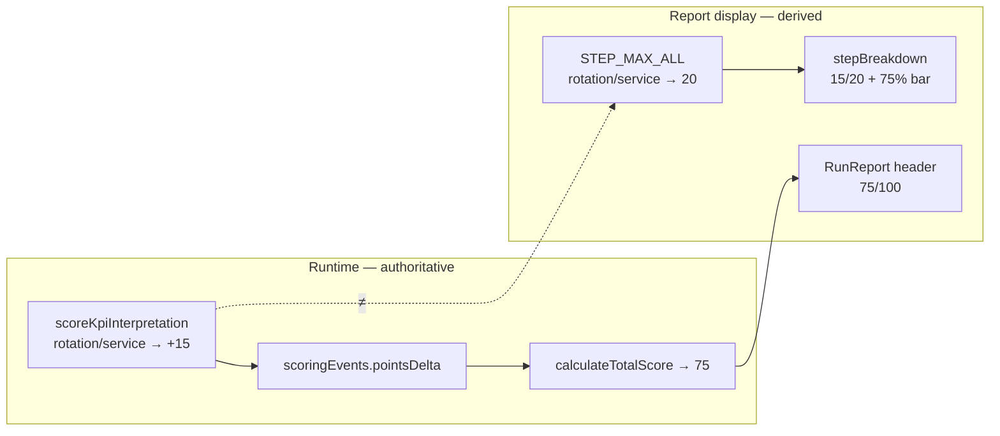

> **Superseded by RC16** — Alignment options and 75/100 ceiling analysis are historical. Official institutional policy (RC16): every scenario allows **100/100** perfect execution. Preserved for project history.

# RC14 — M4 Scoring Alignment Plan

**Mission:** RC14 M4 SCORING ALIGNMENT  
**Date:** 2026-06-18  
**Scope:** SCN-012, SCN-013, SCN-014 (Module 4 — all share identical scoring pipeline)  
**Mode:** Plan only — **no implementation**  
**Authority:** Builds on `RC14_M4_SCORING_FORENSIC_AUDIT.md` (2026-06-18)

---

## Executive Summary

Forensic audit confirmed a **display/runtime mismatch** on KPI_ROTATION and KPI_SERVICE:

| Layer | KPI_ROTATION max | KPI_SERVICE max | Perfect-run total |
|-------|------------------|-----------------|-------------------|
| **UI (report)** | 20 | 20 | 85 (step sum) / **100** (header scale) |
| **Engine (runtime)** | **15** | **15** | **75** |

This is **not a scoring defect** — the engine behaves consistently and tests codify +15 as correct. The mismatch is between `STEP_MAX_ALL` (report display) and `scoreKpiInterpretation` (event awards).

All three M4 scenarios use the same five steps (`MODULE4_STEPS`), the same router mutations, and the same point budget. SCN-specific logic lives only in `validateM4Compliance` (pass/fail gates), not in per-step point values.

**Recommended direction:** **Option A** (align UI to runtime) as the minimal, low-risk RC14 fix. Option B is viable if product owners want higher ceilings and are willing to accept certification score inflation and historical-run reconciliation.

---

## 1. Audit Findings

### 1.1 `rulesEngine.ts` — scoring authority

**File:** `server/rulesEngine.ts`

| Function | Role | M4 relevance |
|----------|------|--------------|
| `MODULE4_STEPS` | Step pipeline definition (5 steps) | Same for SCN-012/013/014 |
| `calculateKpis` | Derives rotation/service/error status from Annexe A data | Drives rubric correctness |
| `scoreKpiInterpretation` | **Authoritative per-step point awards** | Lines 1005–1039 |
| `validateM4Compliance` | COMPLIANCE_M4 pass/fail (not incremental scoring) | SCN-specific diagnostic gates |

**Authoritative awards in `scoreKpiInterpretation`:**

| `kpiKey` | Used in pipeline? | Correct | Incorrect | Notes |
|----------|-------------------|---------|-----------|-------|
| `rotationRate` | Yes (KPI_ROTATION) | **+15** | −5 | Keyword match to `rotationStatus` |
| `serviceLevel` | Yes (KPI_SERVICE) | **+15** | −5 | Keyword match to `serviceLevelStatus` |
| `errorRate` | **No** (dead branch) | +15 | −5 | No step calls this key |
| `diagnostic` | Yes (KPI_DIAGNOSTIC) | +20 | 0 | ≥50 chars + recommendation vocabulary |

```1007:1023:server/rulesEngine.ts
  if (kpiKey === "rotationRate") {
    ...
    return {
      isCorrect,
      pointsDelta: isCorrect ? 15 : -5,
      ...
    };
  }
  if (kpiKey === "serviceLevel") {
    ...
    return {
      isCorrect,
      pointsDelta: isCorrect ? 15 : -5,
      ...
    };
  }
```

**Perfect-run event sum (all SCNs):**

```
KPI_DATA (+10) + KPI_ROTATION (+15) + KPI_SERVICE (+15) + KPI_DIAGNOSTIC (+20) + COMPLIANCE_M4 (+15) = 75
```

### 1.2 `scoreKpiInterpretation` — invocation path

**File:** `server/routers.ts` — `m4` router

| Step | Procedure | Scoring call | Event type |
|------|-----------|--------------|------------|
| KPI_DATA | `submitKpiData` | Fixed +10 | `KPI_DATA_COMPLETED` |
| KPI_ROTATION | `submitKpiRotation` | `scoreKpiInterpretation("rotationRate", …)` | `KPI_ROTATION_COMPLETED` |
| KPI_SERVICE | `submitKpiService` | `scoreKpiInterpretation("serviceLevel", …)` | `KPI_SERVICE_COMPLETED` |
| KPI_DIAGNOSTIC | `submitKpiDiagnostic` | `scoreKpiInterpretation("diagnostic", …)` | `KPI_DIAGNOSTIC_COMPLETED` |
| COMPLIANCE_M4 | `submitComplianceM4` | Fixed +15 (after `validateM4Compliance`) | `COMPLIANCE_M4_COMPLETED` |

Points are persisted as immutable `scoringEvents` rows at submit time. `kpiInterpretations.pointsDelta` mirrors the same values for report detail.

**Test contract:** `server/module345.rules.test.ts` explicitly asserts `pointsDelta === 15` for correct rotation and service interpretations.

### 1.3 Step maximum definitions — dual sources

Two independent definitions exist; they are **not synchronized**:

| Source | Location | KPI_ROTATION | KPI_SERVICE | Purpose |
|--------|----------|--------------|-------------|---------|
| **Runtime awards** | `scoreKpiInterpretation` | 15 | 15 | Drives DB events and total score |
| **Display maxima** | `STEP_MAX_ALL` in `runs.detailedReport` | **20** | **20** | Drives step breakdown bars and `X / Y pts` labels |

```1060:1061:server/routers.ts
          // M4
          KPI_DATA: 10, KPI_ROTATION: 20, KPI_SERVICE: 20, KPI_DIAGNOSTIC: 20, COMPLIANCE_M4: 15,
```

**Stale third source (unused):** `server/scoringEngine.ts` → `MODULE1_SCORING` lists legacy M4 events (`KPI_ANALYSIS_COMPLETED` +15, `LEAN_ACTION_COMPLETED` +10, `COMPLIANCE_M4_COMPLETED` +5). These event types are **never emitted** by the current M4 router. No impact on live scoring but adds confusion for maintainers.

**Client-side step definitions** (`client/src/pages/student/StepForm.tsx`, `MODULE4_STEPS` labels) describe pedagogy only — **no point values** are declared in the UI step forms.

### 1.4 Report rendering

**File:** `client/src/pages/student/RunReport.tsx`

| Element | Source | M4 behavior |
|---------|--------|-------------|
| Total score | `calculateTotalScore(events)` via `detailedReport` | Shows **75/100** on perfect run |
| Step breakdown | `stepBreakdown[].pointsEarned / maxPoints` | Shows **15/20** on rotation and service despite `isCorrect: true` |
| Progress bars | `pct = completionPoints / maxPoints` | Rotation/service bars cap at **75%** when correct |
| Perfect-run banner | `isPerfect = safeScore >= 100` | **Never triggers** for M4 (ceiling 75) |
| Mode selection copy | `Module4ModeSelectionPage.tsx` | States "Score maximum : **100 points**" |

**Aggregation logic** (`server/routers.ts` ~1104–1128): step points are summed from completion events only; penalties appear in a separate errors section. Display max comes solely from `STEP_MAX_ALL`, not from `scoreKpiInterpretation`.

### 1.5 SCN-012 / SCN-013 / SCN-014 — shared vs distinct

| Aspect | SCN-012 | SCN-013 | SCN-014 |
|--------|---------|---------|---------|
| Step pipeline | Identical 5 steps | Identical | Identical |
| KPI data default | Annexe A (6×, 95%, 4%) | Same (may override via seed) | Same |
| Point budget | 75 ceiling | 75 ceiling | 75 ceiling |
| Display mismatch | 15/20 rotation & service | Same | Same |
| Compliance gates | Maintain/monitor policy | Error correlation / picking | Multi-KPI trade-off / S&OP |
| Pass threshold | ≥ 70/100 | ≥ 70/100 | ≥ 70/100 |

**Conclusion:** One alignment fix applies uniformly to all three scenarios.

### 1.6 Secondary mismatch (out of scope for A/B but documented)

Even after aligning rotation/service (15 vs 20), a **scale mismatch** remains:

| Metric | Value |
|--------|-------|
| Runtime perfect total | **75** |
| Sum of current display step maxes | **85** |
| Header scale in RunReport / mode selection | **100** |

Option A/B address the **15 vs 20 step gap** only. Full "100/100 achievable" requires a separate rebalance decision (Option C in §4).

---

## 2. Root Cause



**Hypothesis:** M4 was redesigned from an earlier 3-step model (`KPI_ANALYSIS`, `LEAN_ACTION`, low COMPLIANCE weight in `MODULE1_SCORING`) to the current 5-step pipeline. Runtime was updated (+15 interpretation steps); display maxima retained M3-style **20-point interpretation steps** without updating awards.

---

## 3. Correction Options

### Option A — Align UI to runtime (recommended)

**Intent:** Make report display reflect what the engine actually awards. Preserve all stored scores, pass thresholds, and certification logic.

#### Exact changes (when implemented)

| # | File | Change |
|---|------|--------|
| A1 | `server/routers.ts` | `STEP_MAX_ALL`: `KPI_ROTATION: 20 → 15`, `KPI_SERVICE: 20 → 15` |
| A2 | `client/src/pages/student/RunReport.tsx` | Optional: module-aware scale — show `/75` for M4 or label "75 points disponibles" |
| A3 | `client/src/pages/student/Module4ModeSelectionPage.tsx` | Replace "Score maximum : 100 points" with accurate M4 copy (e.g. "Score maximum : 75 points") |
| A4 | `server/scoringEngine.ts` | Optional cleanup: remove or annotate dead M4 entries in `MODULE1_SCORING` |
| A5 | Documentation | Update `RC14_M4_FINAL_ACCEPTANCE.md`, canonical response docs if they reference 20/20 |

**No change** to `scoreKpiInterpretation`, router mutations, or `shared/moduleThresholds.ts`.

#### Impact

| Area | Effect |
|------|--------|
| Step breakdown | Perfect runs show **15/15** rotation and service; bars reach **100%** |
| Total score | Unchanged (**75/100** on perfect run) |
| Pass/fail | Unchanged (threshold 70; +5 margin at ceiling) |
| Historical runs | **Improved UX retroactively** — re-fetching `detailedReport` shows 15/15 without DB migration |
| Teacher analytics | Best-score rankings unchanged (totals unchanged) |
| `isPerfect` banner | Still never triggers for M4 unless scale copy adjusted separately |

#### Risk

| Risk | Level | Mitigation |
|------|-------|------------|
| Regression in scoring logic | **None** | Display-only change |
| Student confusion ("only 75 points?") | **Low–Medium** | Pair A1 with A2/A3 scale honesty |
| Instructor materials cite 20/20 | **Low** | Update Fiche/slide copy in same RC14 wave |
| Duplicate `STEP_MAX_ALL` in `.staging/routers.head.ts` | **Low** | Apply same edit if staging mirror is deployed |

#### Migration effort

| Task | Effort |
|------|--------|
| Code change (A1) | **~30 min** — 2 integers in one map |
| Copy updates (A2, A3) | **~1–2 hrs** — FR/EN strings, design review |
| Tests | **~30 min** — add assertion that M4 step max equals runtime award |
| DB migration | **None** |
| Deploy | Standard Railway deploy; no env flags |
| **Total** | **~2–4 hrs** |

#### Certification impact

| System | Impact |
|--------|--------|
| **Gold** (`goldCertification.ts`) | **None** — uses `validateM4Compliance` + score ≥ 70; totals unchanged |
| **Silver** | **None** — M4 not a Silver gate |
| **Pass threshold** (`getModuleScenarioPassThreshold(4) = 70`) | **None** |
| **Grandfathering** (`computeModulePassResult`) | **None** |
| **Cohorte Fondatrice** | **None** on eligibility; improved report clarity |
| **RC14 acceptance** | **Reinforces** documented 75/100 ceiling in `RC14_M4_FINAL_ACCEPTANCE.md` |

---

### Option B — Align runtime to UI

**Intent:** Raise rotation and service awards from +15 to +20 so students can reach the displayed step maxima.

#### Exact changes (when implemented)

| # | File | Change |
|---|------|--------|
| B1 | `server/rulesEngine.ts` | `scoreKpiInterpretation`: rotation/service `pointsDelta: isCorrect ? 15 : -5` → `isCorrect ? 20 : -5` |
| B2 | `server/module345.rules.test.ts` | Update expectations: `toBe(15)` → `toBe(20)` for rotation/service |
| B3 | `client/src/data/m4KpiEvidenceFeed.test.ts` | Update fixture `pointsDelta: 15` → `20` if asserting report shape |
| B4 | Documentation | Update ceiling: 75 → **85** in acceptance docs and canonical responses |
| B5 | Historical runs (optional) | Backfill `scoringEvents` + `kpiInterpretations` for completed M4 eval runs |

**No change** to `STEP_MAX_ALL` (already 20).

#### Impact

| Area | Effect |
|------|--------|
| Step breakdown | Perfect runs show **20/20** rotation and service |
| Total score | Perfect-run ceiling **75 → 85** (+10) |
| Pass/fail | Easier to pass: margin at ceiling **+5 → +15**; one −5 error still passes (80 ≥ 70) |
| New runs | Immediately reflect new ceiling |
| Historical runs | **Stale** — stored events remain +15 unless B5 backfill |
| Rankings / bestScore | New runs score higher; cohort comparisons skewed until backfill or cutoff date |
| Header scale | Still **85/100** — 100/100 remains unreachable without further rebalance |

#### Risk

| Risk | Level | Mitigation |
|------|-------|------------|
| Score inflation / fairness | **Medium** | Students who ran before fix capped at 75; after fix can reach 85 |
| Certification equity | **Medium** | Same SCN, different max depending on run date |
| Penalty asymmetry | **Low** | −5 penalty unchanged; wrong answer costs 25% of step (5/20) vs 33% (5/15) |
| Test suite | **Low** | Explicit test updates required |
| Pedagogical calibration | **Medium** | Fiches and `supervisorNotes` document 75/100 ceiling — requires re-acceptance |
| Wave 1 spec conflict | **Low** | `RC14_M4_WAVE1_IMPLEMENTATION_SPEC.md` states "Score deltas unchanged (+15 correct)" |

#### Migration effort

| Task | Effort |
|------|--------|
| Code change (B1) | **~30 min** |
| Test updates (B2, B3) | **~1 hr** |
| Historical backfill (B5) | **~4–8 hrs** — script to update `scoringEvents` + `kpiInterpretations` + recompute `runs.score` / `bestScore` for moduleId=4 eval runs |
| Re-acceptance / doc | **~2–4 hrs** — Fiche, RC14 acceptance, instructor brief |
| Smoke validation (S-10 × 3 SCNs) | **~2 hrs** |
| **Total (without backfill)** | **~4–8 hrs** |
| **Total (with backfill)** | **~8–16 hrs** |

#### Certification impact

| System | Impact |
|--------|--------|
| **Gold pass (≥ 70)** | **Easier** — +10 headroom; students previously at 70–74 unchanged, 65–69 may pass on retry |
| **Gold compliance** | **None** — still `validateM4Compliance` |
| **Perfect-run semantics** | **Changed** — "Fiche-aligned perfect run" becomes 85 not 75 |
| **RC14 M4 acceptance** | **Requires re-sign** — `RC14_M4_FINAL_ACCEPTANCE.md` explicitly certifies 75/100 ceiling |
| **Analytics / cohort reports** | **Skew** unless backfill or effective-date policy |
| **Cohorte Fondatrice** | **Medium** — students who already submitted at 75 may perceive unfairness vs new 85 ceiling |

---

## 4. Option Comparison Matrix

| Criterion | Option A (UI → runtime) | Option B (runtime → UI) |
|-----------|-------------------------|---------------------------|
| Fixes 15/20 step display | ✅ Yes | ✅ Yes |
| Changes stored scores | ❌ No | ✅ Yes (new runs; optional backfill) |
| Perfect-run ceiling | 75 (unchanged) | 85 (+10) |
| Pass threshold impact | None | Inflated margin |
| DB migration | None | Optional backfill recommended |
| Certification re-acceptance | Not required | **Required** |
| Implementation risk | **Low** | **Medium** |
| RC14 wave compatibility | Aligns with forensic audit + final acceptance | Conflicts with documented 75 ceiling |
| Effort | **2–4 hrs** | **4–16 hrs** |

---

## 5. Option C — Full 100-Point Scale (future, not A or B)

Neither Option A nor B makes **100/100** achievable. Current gap to 100:

| After fix | Perfect total | Gap to 100 |
|-----------|---------------|------------|
| Option A | 75 | 25 |
| Option B | 85 | 15 |

Potential levers (require separate product decision):

| Lever | Points | Notes |
|-------|--------|-------|
| PERFECT_RUN_BONUS | +10 | Exists for M1/M2 only; not emitted for M4 |
| Rebalance all M4 steps to sum 100 | varies | e.g. 10+20+20+20+15+15 bonus |
| Normalize score display | N/A | Show percentage of achievable max, not /100 |
| Activate `errorRate` as 6th step | +15 | Dead code exists; pipeline change |

**Recommendation:** Defer Option C to RC15 unless cohort explicitly requires parity with M2/M5 "100 points" marketing copy.

---

## 6. Exact Correction Spec (for implementer)

### Option A — minimal patch

```typescript
// server/routers.ts — STEP_MAX_ALL (line ~1061)
KPI_DATA: 10, KPI_ROTATION: 15, KPI_SERVICE: 15, KPI_DIAGNOSTIC: 20, COMPLIANCE_M4: 15,
// Sum of display maxes = 75 (matches runtime)
```

```typescript
// server/rulesEngine.ts — NO CHANGE
pointsDelta: isCorrect ? 15 : -5,  // rotationRate, serviceLevel — keep as-is
```

### Option B — minimal patch

```typescript
// server/rulesEngine.ts — scoreKpiInterpretation (lines ~1012, ~1021)
pointsDelta: isCorrect ? 20 : -5,  // rotationRate AND serviceLevel
```

```typescript
// server/routers.ts — STEP_MAX_ALL — NO CHANGE
KPI_ROTATION: 20, KPI_SERVICE: 20,
```

### Verification checklist (either option)

| # | Check | Expected (A) | Expected (B) |
|---|-------|----------------|--------------|
| V1 | Perfect SCN-012 unit path (`module345.rules.test.ts`) | Total events = 75 | Total events = 85 |
| V2 | `detailedReport` rotation step | 15/15, pct=100 | 20/20, pct=100 |
| V3 | `detailedReport` service step | 15/15, pct=100 | 20/20, pct=100 |
| V4 | Wrong rotation answer | 10+(-5)+… | 10+(-5)+… |
| V5 | Pass at 70 | 75 ≥ 70 ✅ | 85 ≥ 70 ✅ |
| V6 | Gold compliance path | Unchanged | Unchanged |
| V7 | SCN-013, SCN-014 smoke | Same budget as SCN-012 | Same budget as SCN-012 |

---

## 7. Recommendation

**Ship Option A in RC14** unless product explicitly approves score inflation.

| Rationale | Detail |
|-----------|--------|
| Forensic verdict | Engine is correct; display is wrong |
| Acceptance docs | `RC14_M4_FINAL_ACCEPTANCE.md` certifies **75/100** ceiling |
| Certification stability | No threshold or cohort equity changes |
| Effort | Minimal, no backfill, retroactive report fix |
| Honesty | Pair A1 with M4-specific scale copy (75 not 100) to close secondary mismatch |

**Option B** is justified only if stakeholders decide the **20-point step weight** is pedagogically canonical and the **75 ceiling was an implementation error**, not an accepted design. That decision triggers re-acceptance and optional historical backfill.

---

## 8. Files Reference

| File | Role in alignment |
|------|-------------------|
| `server/rulesEngine.ts` | `scoreKpiInterpretation`, `MODULE4_STEPS`, `validateM4Compliance` |
| `server/routers.ts` | M4 mutations, `STEP_MAX_ALL`, `detailedReport` breakdown |
| `server/scoringEngine.ts` | `calculateTotalScore`, stale `MODULE1_SCORING` M4 entries |
| `server/module345.rules.test.ts` | Scoring contract tests (+15 assertions) |
| `shared/moduleThresholds.ts` | Pass threshold 70 (unchanged by A or B) |
| `client/src/pages/student/RunReport.tsx` | Score header, step bars, `isPerfect` |
| `client/src/pages/student/Module4ModeSelectionPage.tsx` | "100 points" marketing copy |
| `server/goldCertification.ts` | M4 Gold uses compliance, not step max |
| `RC14_M4_SCORING_FORENSIC_AUDIT.md` | Source audit |
| `RC14_M4_FINAL_ACCEPTANCE.md` | 75/100 certified ceiling |

---

## 9. Audit Metadata

| Item | Value |
|------|-------|
| Scenarios covered | SCN-012, SCN-013, SCN-014 |
| Code modified | **None** (plan only) |
| Tests executed | None (static analysis) |
| Recommended option | **Option A** |
| Blocked follow-up | Option C (full 100 scale) — separate RC15 decision |

---

*Plan completed 2026-06-18. Implementation requires explicit product approval and is out of scope for this deliverable.*
