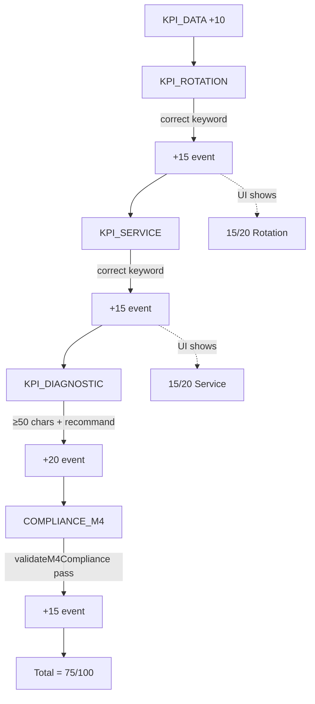

> **Superseded by RC16** — M4 scoring economics described here (75/100 ceiling) are obsolete. Official institutional policy (RC16): every scenario allows **100/100** perfect execution. Passing thresholds: M1=60, M2=60, M3=70, M4=70, M5=70. Preserved for project history.

# RC14 — M4 Scoring Forensic Audit

**Mission:** M4 SCORING FORENSIC AUDIT  
**Date:** 2026-06-18  
**Scope:** SCN-012 (Analyse de la rotation des stocks) — Module 4 scoring engine  
**Mode:** Audit only — no code changes  
**Observed symptom:** Perfect interpretations (rotationRate ✓, serviceLevel ✓, diagnostic ✓, compliance ✓, erreurs = 0) → **75/100** with Rotation **15/20** and Service **15/20**

---

## Executive Verdict

# **YELLOW — Score cap exists by design**

A student who completes SCN-012 with **all KPI interpretations marked correct**, **zero penalty events**, and **COMPLIANCE_M4 validated** achieves the **runtime maximum of 75/100**. This is **not a scoring defect** — it is the intended ceiling of the current M4 point budget.

**100/100 is not achievable** on Module 4 under the current scoring engine. The UI step breakdown displays **20/20 max** for KPI_ROTATION and KPI_SERVICE, but the engine awards **15 points maximum** for a correct answer on those steps. That display/runtime mismatch is the primary source of perceived “missing” points.

| Verdict | Meaning | Applies? |
|---------|---------|----------|
| GREEN | 100/100 achievable with perfect answers | **No** — ceiling is 75 |
| YELLOW | Score cap exists by design | **Yes** |
| RED | Scoring defect blocks maximum achievable score | **No** — observed 75/100 **is** the maximum |

---

## Observed vs Expected (SCN-012 Perfect Run)

| Step | UI label | Display max | Points awarded (correct) | Observed | Expected at ceiling |
|------|----------|-------------|--------------------------|----------|---------------------|
| KPI_DATA | Briefing | 10 | 10 | 10/10 | 10/10 |
| KPI_ROTATION | Rotation | 20 | **15** | 15/20 | 15/20 |
| KPI_SERVICE | Service | 20 | **15** | 15/20 | 15/20 |
| KPI_DIAGNOSTIC | Diagnostic | 20 | 20 | 20/20 | 20/20 |
| COMPLIANCE_M4 | Compliance | 15 | 15 | 15/15 | 15/15 |
| **Total** | | **85** (sum of display maxes) | **75** (sum of awards) | **75/100** | **75/100** |

**Pass threshold:** 70/100 (`shared/moduleThresholds.ts`, Fiche `supervisorNotes`). Perfect run margin: **+5 points**.

---

## 1. SCN-012 Scoring Engine

### Entry points (runtime)

| Step | Router | Procedure | Scoring function |
|------|--------|-----------|------------------|
| KPI_DATA | `server/routers.ts` | `m4.submitKpiData` | Fixed +10 |
| KPI_ROTATION | `server/routers.ts` | `m4.submitKpiRotation` | `scoreKpiInterpretation("rotationRate", …)` |
| KPI_SERVICE | `server/routers.ts` | `m4.submitKpiService` | `scoreKpiInterpretation("serviceLevel", …)` |
| KPI_DIAGNOSTIC | `server/routers.ts` | `m4.submitKpiDiagnostic` | `scoreKpiInterpretation("diagnostic", …)` |
| COMPLIANCE_M4 | `server/routers.ts` | `m4.submitComplianceM4` | Fixed +15 (after `validateM4Compliance`) |

### KPI data resolution (SCN-012)

**Source:** `server/routers.ts` → `resolveM4KpiDataForScenario`  
**Function:** delegates to `getM4KpiDataFromSeed` in `server/rulesEngine.ts`

SCN-012 uses the canonical Annexe A bundle (no scenario-specific override in seed):

```694:704:server/rulesEngine.ts
export const CANONICAL_M4_KPI_DATA: KpiData = {
  annualConsumption: 2400,
  averageStock: 400,
  ordersFulfilled: 285,
  totalOrders: 300,
  operationalErrors: 12,
  totalOperations: 300,
  avgLeadTimeDays: 3.5,
  stockValue: 48000,
};
```

**SCN-012 computed KPI statuses:**

| KPI | Formula | Value | Status |
|-----|---------|-------|--------|
| rotationRate | 2400 ÷ 400 | 6× | `normal` (4–12 band) |
| serviceLevel | 285 ÷ 300 | 95% | `excellent` (≥ 95%) |
| errorRate | 12 ÷ 300 | 4% | `acceptable` (1–5%) |

**Expected behavior:** Engine classifies 6× as normal; student must answer with “normal / optimal / équilibré” vocabulary.  
**Actual behavior:** Matches — `isCorrect: true` when keywords align with `rotationStatus`.

---

## 2. KPI_ROTATION Scoring Rules

**Source file:** `server/rulesEngine.ts`  
**Function:** `scoreKpiInterpretation` (branch `kpiKey === "rotationRate"`)  
**Invoked by:** `m4.submitKpiRotation` in `server/routers.ts`

```1007:1014:server/rulesEngine.ts
  if (kpiKey === "rotationRate") {
    const correct = kpiResult.rotationStatus;
    const isCorrect = correct === "surstock" && (answer.includes("surstock") || answer.includes("sur-stock") || answer.includes("excès")) || correct === "normal" && (answer.includes("normal") || answer.includes("optimal") || answer.includes("équilibr")) || correct === "sous-performance" && (answer.includes("sous") || answer.includes("rupture") || answer.includes("insuffisant"));
    return {
      isCorrect,
      pointsDelta: isCorrect ? 15 : -5,
      feedback: isCorrect ? `Correct — taux de rotation ${kpiResult.rotationRate}x → situation ${correct}` : `Incorrect — taux ${kpiResult.rotationRate}x indique une situation de ${correct}`
    };
  }
```

| Rule | Value |
|------|-------|
| Correct answer (SCN-012) | Must include `normal`, `optimal`, or `équilibr` when status is `normal` |
| Points if correct | **+15** |
| Points if incorrect | **−5** |
| Display max (`STEP_MAX_ALL`) | **20** |
| Maximum achievable on step | **15** (hardcoded) |

**Expected behavior (UI):** 20/20 when correct.  
**Actual behavior:** 15/20 when correct — **5-point display gap**.

**Classification thresholds** (`calculateKpis`):

```991:991:server/rulesEngine.ts
  const rotationStatus = rotationRate > 12 ? "sous-performance" : rotationRate < 4 ? "surstock" : "normal";
```

**Test evidence:** `server/module345.rules.test.ts` — `"awards +15 for correct rotation rate interpretation"`.

---

## 3. KPI_SERVICE Scoring Rules

**Source file:** `server/rulesEngine.ts`  
**Function:** `scoreKpiInterpretation` (branch `kpiKey === "serviceLevel"`)  
**Invoked by:** `m4.submitKpiService` in `server/routers.ts`

```1016:1023:server/rulesEngine.ts
  if (kpiKey === "serviceLevel") {
    const correct = kpiResult.serviceLevelStatus;
    const isCorrect = correct === "excellent" && (answer.includes("excellent") || answer.includes("très bon") || answer.includes("optimal")) || correct === "acceptable" && (answer.includes("acceptable") || answer.includes("moyen") || answer.includes("correct")) || correct === "insuffisant" && (answer.includes("insuffisant") || answer.includes("faible") || answer.includes("problème") || answer.includes("améliorer"));
    return {
      isCorrect,
      pointsDelta: isCorrect ? 15 : -5,
      feedback: isCorrect ? `Correct — taux de service ${(kpiResult.serviceLevel * 100).toFixed(1)}% → ${correct}` : `Incorrect — ${(kpiResult.serviceLevel * 100).toFixed(1)}% indique un niveau ${correct}`
    };
  }
```

| Rule | Value |
|------|-------|
| Correct answer (SCN-012 @ 95%) | Must include `excellent`, `très bon`, or `optimal` |
| Points if correct | **+15** |
| Points if incorrect | **−5** |
| Display max | **20** |
| Maximum achievable on step | **15** (hardcoded) |

**Service level bands:**

```992:992:server/rulesEngine.ts
  const serviceLevelStatus = serviceLevel >= 0.95 ? "excellent" : serviceLevel >= 0.85 ? "acceptable" : "insuffisant";
```

**Expected behavior (UI):** 20/20 when correct.  
**Actual behavior:** 15/20 when correct — **same 5-point gap as rotation**.

---

## 4. Maximum Score Achievable Per Step

### Runtime awards (authoritative — drives `calculateTotalScore`)

| Step | Event type | Perfect-run `pointsDelta` | Source |
|------|------------|----------------------------|--------|
| KPI_DATA | `KPI_DATA_COMPLETED` | +10 | `m4.submitKpiData` — fixed |
| KPI_ROTATION | `KPI_ROTATION_COMPLETED` | +15 | `scoreKpiInterpretation` |
| KPI_SERVICE | `KPI_SERVICE_COMPLETED` | +15 | `scoreKpiInterpretation` |
| KPI_DIAGNOSTIC | `KPI_DIAGNOSTIC_COMPLETED` | +20 | `scoreKpiInterpretation("diagnostic")` |
| COMPLIANCE_M4 | `COMPLIANCE_M4_COMPLETED` | +15 | `m4.submitComplianceM4` — fixed |
| **Perfect-run total** | | **75** | |

### Display maxima (`detailedReport` step breakdown)

**Source file:** `server/routers.ts`  
**Function:** `runs.detailedReport` → `STEP_MAX_ALL`

```1060:1061:server/routers.ts
          // M4
          KPI_DATA: 10, KPI_ROTATION: 20, KPI_SERVICE: 20, KPI_DIAGNOSTIC: 20, COMPLIANCE_M4: 15,
```

| Step | Display max | Runtime max | Delta |
|------|-------------|-------------|-------|
| KPI_DATA | 10 | 10 | 0 |
| KPI_ROTATION | 20 | 15 | **−5** |
| KPI_SERVICE | 20 | 15 | **−5** |
| KPI_DIAGNOSTIC | 20 | 20 | 0 |
| COMPLIANCE_M4 | 15 | 15 | 0 |
| **Sum** | **85** | **75** | **−10** |

**Note:** Sum of display maxes (85) also falls short of the **100-point scale** shown in `RunReport.tsx` (`{safeScore} / 100`). Module 4 was never budgeted to fill a 100-point bar even under display maxima.

---

## 5. Hidden Caps

| Cap | Location | Effect |
|-----|----------|--------|
| **+15 ceiling on rotation/service** | `scoreKpiInterpretation` lines 1012, 1021 | Prevents 20/20 on KPI_ROTATION and KPI_SERVICE regardless of answer quality |
| **Global score clamp** | `calculateTotalScore` in `server/scoringEngine.ts` | `Math.min(100, raw)` — irrelevant for M4 (never reaches 100) |
| **No PERFECT_RUN_BONUS on M4** | `PERFECT_RUN_BONUS` only in M1/M2 compliance paths (`routers.ts` ~1842) | Zero-error M4 runs receive no +10 bonus |
| **No partial credit on diagnostic** | `scoreKpiInterpretation("diagnostic")` | Binary: +20 or 0 (no −5 penalty branch) |
| **Compliance gate is non-scoring** | `validateM4Compliance` | Pass/fail only; failure adds −10 via `COMPLIANCE_M4_FAILED`, success adds fixed +15 |
| **Stale M4 rules in scoringEngine.ts** | `MODULE1_SCORING` entries `KPI_ANALYSIS_COMPLETED` (+15), `LEAN_ACTION_COMPLETED` (+10), `COMPLIANCE_M4_COMPLETED` (+5) | **Not used** by M4 runtime — dead configuration |

```81:84:server/scoringEngine.ts
export function calculateTotalScore(events: Array<{ pointsDelta: number }>): number {
  const raw = events.reduce((sum, e) => sum + e.pointsDelta, 0);
  return Math.max(0, Math.min(100, raw)); // Clamp between 0 and 100
}
```

---

## 6. Weighting System

M4 uses **event-summation scoring** (not percentage-normalized):

```
totalScore = Σ scoringEvents.pointsDelta   (clamped 0–100)
```

Per-step breakdown in reports uses **completion event points only**:

```1104:1111:server/routers.ts
        const stepBreakdown = stepCodesToReport.map(step => {
          const completed = state.completedSteps.includes(step as any);
          const completionEvent = STEP_EVENT_MAP_ALL[step];
          const completionPoints = completionEvent
            ? events.filter(e => e.eventType === completionEvent).reduce((s, e) => s + e.pointsDelta, 0)
            : 0;
          const maxPoints = STEP_MAX_ALL[step] ?? 0;
          const pct = maxPoints > 0 ? Math.round((completionPoints / maxPoints) * 100) : (completed ? 100 : 0);
```

**Asymmetric weighting within the 75-point budget:**

| Category | Share of 75 | Rationale (inferred) |
|----------|-------------|----------------------|
| KPI_DATA (acknowledgement) | 13.3% (10) | Low-stakes briefing gate |
| KPI_ROTATION + KPI_SERVICE | 40.0% (30) | Paired interpretation steps, **15 each** |
| KPI_DIAGNOSTIC (synthesis) | 26.7% (20) | Highest single-step weight — requires ≥50 chars + recommendation vocabulary |
| COMPLIANCE_M4 | 20.0% (15) | Final validation gate |

**Pass threshold weighting:** 70/100 = 93.3% of perfect-run ceiling (75), not 70% of a fully reachable 100.

---

## 7. Rubric Definitions

### A. Scoring rubric (`scoreKpiInterpretation`) — awards points

| kpiKey | Correctness logic | Points |
|--------|-------------------|--------|
| `rotationRate` | Keyword match to `rotationStatus` (surstock / normal / sous-performance) | +15 / −5 |
| `serviceLevel` | Keyword match to `serviceLevelStatus` (excellent / acceptable / insuffisant) | +15 / −5 |
| `errorRate` | Keyword match to `errorRateStatus` | +15 / −5 — **unused in M4 pipeline** |
| `diagnostic` | `answer.length > 50` AND contains one of: `recommand`, `action`, `améliorer`, `stratégie`, `décision` | +20 / 0 |

```1034:1039:server/rulesEngine.ts
  const hasRecommendation = answer.length > 50 && (answer.includes("recommand") || answer.includes("action") || answer.includes("améliorer") || answer.includes("stratégie") || answer.includes("décision"));
  return {
    isCorrect: hasRecommendation,
    pointsDelta: hasRecommendation ? 20 : 0,
    feedback: hasRecommendation ? "Bonne analyse stratégique — recommandation pertinente identifiée" : "Analyse incomplète — une recommandation stratégique justifiée est attendue"
  };
```

**Important:** `KPI_DIAGNOSTIC` step calls `scoreKpiInterpretation("diagnostic", …)` — **not** `errorRate`. The `errorRate` branch is dead code for the current 5-step M4 pipeline.

### B. Compliance rubric (`validateM4Compliance`) — gates COMPLIANCE_M4 only

**Source:** `server/rulesEngine.ts` → `validateM4Compliance`  
**Does not add incremental points** beyond the fixed +15 on pass.

**Global gates (all M4 SCNs):**
- All four prerequisite steps completed
- `rotationRate` interpretation exists and `isCorrect`
- SCN-012 extra: if rotation is `normal`, answer must not classify as surstock
- `serviceLevel` interpretation exists and `isCorrect`
- Diagnostic ≥ 50 characters + recommendation vocabulary

**SCN-012-specific gates:**

```787:808:server/rulesEngine.ts
    if (scn === "SCN-012") {
      if (input.kpiResult.rotationStatus === "normal") {
        if (!m4HasTerm(diag, ["mainten", "surveill", "monitor", "sku", "politique"])) {
          issues.push("SCN-012: missing maintain/monitor policy stance");
          ...
        }
        const blanketDestock =
          m4HasTerm(diag, ["destock", "surstock", "reduction massive"]) &&
          !m4HasTerm(diag, ["sku", "reference", "article"]);
        if (blanketDestock) { ... }
      }
      if (
        m4HasTerm(diag, ["rien a faire", "aucune action"]) ||
        (m4HasTerm(diag, ["excellent"]) &&
          !m4HasTerm(diag, ["surveill", "monitor", "mainten", "action", "recommand"]))
      ) { ... }
    }
```

**Expected behavior:** Compliance validates pedagogical coherence; scoring already frozen from prior steps.  
**Actual behavior:** Student can have `isCorrect: true` on all KPI steps and still fail compliance if diagnostic lacks SCN-012 policy vocabulary — but observed run passed compliance.

### C. Pedagogical rubric (UI — non-scoring)

**Source:** `client/src/pages/student/StepForm.tsx` — step objectives for `kpi_rotation`, `kpi_service`, `kpi_diagnostic`.  
These describe expected analysis but do **not** drive point allocation beyond keyword rubrics above.

---

## 8. Validation Logic

### Two-layer model

| Layer | Function | When | Affects score? |
|-------|----------|------|----------------|
| **Interpretation scoring** | `scoreKpiInterpretation` | Each KPI step submit | Yes — immediate `pointsDelta` event |
| **Compliance validation** | `validateM4Compliance` | COMPLIANCE_M4 submit | Yes — +15 pass / −10 fail; does not re-score prior steps |

### SCN-012 happy-path test fixture

**Source:** `server/module345.rules.test.ts`

```455:456:server/module345.rules.test.ts
  const diag012 =
    "Je recommande de maintenir la politique stock actuelle avec surveillance SKU par reference. Decision: monitor les faibles rotations sans destock global. Action: revue mensuelle des 48000 dollars immobilises.";
```

This diagnostic satisfies both scoring rubric (+20) and SCN-012 compliance gates.

### Compliance validator toggle

```2910:2910:server/routers.ts
        const enableValidator = process.env.ENABLE_M4_COMPLIANCE_VALIDATOR !== "false";
```

When disabled, COMPLIANCE_M4 awards +15 without validation — scoring ceiling unchanged.

---

## 9. Runtime Score Calculations

### Event emission flow (evaluation mode)

```
submitKpiData        → KPI_DATA_COMPLETED        (+10)
submitKpiRotation    → KPI_ROTATION_COMPLETED    (+15 or −5)
submitKpiService     → KPI_SERVICE_COMPLETED       (+15 or −5)
submitKpiDiagnostic  → KPI_DIAGNOSTIC_COMPLETED    (+20 or 0)
submitComplianceM4   → COMPLIANCE_M4_COMPLETED     (+15)
                       [or COMPLIANCE_M4_FAILED     (−10)]
```

**Router wiring (rotation example):**

```2860:2863:server/routers.ts
        const result = scoreKpiInterpretation("rotationRate", input.studentAnswer, kpiResult);
        await addKpiInterpretation({ runId: input.runId, kpiKey: "rotationRate", studentAnswer: input.studentAnswer, isCorrect: result.isCorrect, pointsDelta: result.pointsDelta, feedback: result.feedback });
        await markStepComplete(input.runId, "KPI_ROTATION");
        if (!run.isDemo) await addScoringEvent({ runId: input.runId, eventType: "KPI_ROTATION_COMPLETED", pointsDelta: result.pointsDelta, message: `Taux de rotation: ${result.isCorrect ? "correct" : "incorrect"}` });
```

### Total score aggregation

**Functions:** `calculateTotalScore` (`server/scoringEngine.ts`)  
**Used in:** `runs.detailedReport`, run list scores, `goldCertification.ts`, `db.ts` pass computation

**Perfect SCN-012 event sum:**

```
10 + 15 + 15 + 20 + 15 = 75
```

### UI rendering

**Source:** `client/src/pages/student/RunReport.tsx`  
Displays `{step.pointsEarned} / {step.maxPoints} pts` from `detailedReport.stepBreakdown` and total `{safeScore} / 100`.

**Expected behavior:** Total reflects sum of events.  
**Actual behavior:** Total = 75; step bars show 75% fill on rotation/service (15/20) despite correct answers.

---

## 10. Hardcoded Limits Preventing 20/20

### Primary blockers (confirmed in source)

| # | File | Function | Line | Limit | Prevents |
|---|------|----------|------|-------|----------|
| 1 | `server/rulesEngine.ts` | `scoreKpiInterpretation` | 1012 | `pointsDelta: isCorrect ? 15 : -5` | KPI_ROTATION 20/20 |
| 2 | `server/rulesEngine.ts` | `scoreKpiInterpretation` | 1021 | `pointsDelta: isCorrect ? 15 : -5` | KPI_SERVICE 20/20 |
| 3 | `server/routers.ts` | `STEP_MAX_ALL` | 1061 | `KPI_ROTATION: 20, KPI_SERVICE: 20` | UI implies unreachable max |
| 4 | `server/scoringEngine.ts` | `MODULE1_SCORING` | 32–34 | Legacy M4 events (unused) | No path to +25 from old design |

**No code path awards +20 for rotation or service interpretation.** Tests explicitly codify +15 as correct behavior:

```370:373:server/module345.rules.test.ts
  it("awards +15 for correct rotation rate interpretation (surstock)", () => {
    const result = scoreKpiInterpretation("rotationRate", "Le taux indique un surstock important", kpiResult);
    expect(result.isCorrect).toBe(true);
    expect(result.pointsDelta).toBe(15);
```

### Paths that do NOT unlock missing 25 points

| Hypothesis | Finding |
|------------|---------|
| PERFECT_RUN_BONUS (+10) | M1/M2 compliance only — not emitted for M4 |
| Re-submit KPI steps for extra points | `addScoringEvent` (not `addScoringEventOnce`) — potential double-count risk, but steps typically complete once |
| errorRate interpretation step | Not in `MODULE4_STEPS` — branch exists but unused |
| Compliance quality tiers | Binary +15 — no excellence bonus |
| Display max as scoring target | Display max ≠ runtime award |

---

## SCN-012 End-to-End Trace (Observed Symptom)



**Root cause of 75 vs 100 perception:** Engine budget = 75; UI scale = 100; rotation/service display max = 20 but award = 15.

---

## Cross-Reference: Prior Acceptance Documentation

`RC14_M4_FINAL_ACCEPTANCE.md` documents the same ceiling:

> Maximum achievable (Fiche-aligned perfect run): **75/100** (KPI_DATA +10, KPI_ROTATION +15, KPI_SERVICE +15, KPI_DIAGNOSTIC +20, COMPLIANCE_M4 +15)

The observed SCN-012 run is **consistent with accepted RC14 M4 design**, not a regression.

---

## Findings Summary

| # | Finding | Severity |
|---|---------|----------|
| F1 | M4 perfect-run ceiling is **75/100**, not 100/100 | Design (YELLOW) |
| F2 | KPI_ROTATION and KPI_SERVICE award **15** but display max **20** | UX mismatch |
| F3 | Sum of display step maxes = **85**, not 100 | UX mismatch |
| F4 | `scoreKpiInterpretation` keyword rubric is coarse (no quality gradient within “correct”) | Design |
| F5 | `errorRate` scoring branch unused in 5-step pipeline | Dead code |
| F6 | `MODULE1_SCORING` M4 entries unused | Stale config |
| F7 | Pass threshold 70/100 is reachable (+5 margin at ceiling) | OK |
| F8 | Observed run (75/100, all correct) matches engine — **not a defect** | OK |

---

## Recommendations (Informational — Out of Audit Scope)

No code changes were made per mission constraints. If product owners want GREEN (100/100 achievable), options include:

1. Align `STEP_MAX_ALL` KPI_ROTATION/KPI_SERVICE to **15** (honest UI), or  
2. Raise `scoreKpiInterpretation` awards to **20** and rebalance total budget to 85+, or  
3. Document M4 as a **75-point module** with explicit scale in RunReport.

---

## Audit Metadata

| Item | Value |
|------|-------|
| Files inspected | `server/rulesEngine.ts`, `server/routers.ts`, `server/scoringEngine.ts`, `server/module345.rules.test.ts`, `shared/moduleThresholds.ts`, `client/src/pages/student/RunReport.tsx`, `client/src/pages/student/StepForm.tsx`, `server/missionDataExtended.ts`, `RC14_M4_FINAL_ACCEPTANCE.md` |
| Code modified | None |
| Tests executed | None (static analysis + test fixture review) |
| Final verdict | **YELLOW** |
