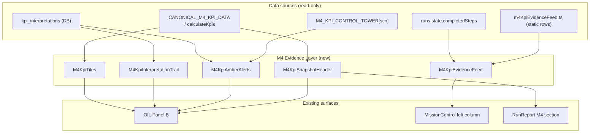

# TEC.WMS — RC14 Wave 1 · M4 Premium Operational Intelligence

## Implementation Specification (Evidence Layer Only)

**Programme:** Collège de la Concorde — TEC.LOG / TEC.WMS  
**Wave:** RC14 Wave 1 — Module 4  
**Scenarios:** SCN-012, SCN-013, SCN-014  
**Date:** 2026-06-18  
**Status:** Specification only — **no implementation, no commit** in this deliverable  

**Sources:**

- `RC14_PREMIUM_OPERATIONAL_INTELLIGENCE_MASTER_PLAN.md` (W1-03 → W1-05, W1-08; analytical monitor principle)
- `RC14_M4_PREMIUM_INTELLIGENCE_AUDIT.md` (gap register, P0/P1 evidence-layer items)

---

## 1. Executive Summary

### 1.1 Problem

M4 is **functionally correct** but experientially **dead**: the Transaction Monitor stays empty for the entire 5-step run (~15–20 min), the KPI Control Tower is static prose, and student interpretations (`kpi_interpretations` table) are **stored server-side but invisible** in Mission Control until Run Report.

This creates the **monitor vazio** sensation identified as **G-P0-03** and **G-P0-04** in the master plan.

### 1.2 Objective

Implement **only the Evidence Layer** — display/state-surfacing UI that makes the analytical cockpit **feel alive** without:

- Creating WMS transactions
- Altering KPI thresholds, compliance, scoring, scenario logic, or pedagogical sequence
- Touching Fiche Mission (`server/missionDataExtended.ts` mission authority)

### 1.3 Deliverables (5 components)

| # | Component | Master plan trace | Addresses |
|---|-----------|-------------------|-----------|
| 1 | **KPI Tiles** (Annexe A bands) | W1-03 | GAP-E02, GAP-I01, G-P1-07 |
| 2 | **KPI Interpretation Trail** | W1-04 | GAP-D03, GAP-V05, G-P0-04 |
| 3 | **KPI Amber Alerts** | W1-05 | GAP-A06, GAP-I02, G-P1-09 |
| 4 | **KPI Snapshot Header** | W1-08 | GAP-E05, GAP-D01, G-P1-12 |
| 5 | **KPI Evidence Feed** | W2-01 (pulled forward) | GAP-S01, GAP-V01–V04, G-P1-08 |

### 1.4 Expected outcome

Students running SCN-012/013/014 see **motion, color, and proof shape** comparable to M1/M2 monitor rhythm — but in **analytical mode** (SAP extract rows, not GR/SO documents).

---

## 2. Golden Rules (Non-Negotiable)

### 2.1 Intocável — do not modify

| Domain | Files / symbols |
|--------|-----------------|
| Fiche Mission | `server/missionDataExtended.ts` — objectives, studentActions, successCriteria, failureConditions |
| KPI thresholds | `ANNEXE_A_KPI_GUIDE` band definitions in `m4KpiControlTower.ts` |
| KPI calculation | `CANONICAL_M4_KPI_DATA`, `calculateKpis`, `getM4KpiDataFromSeed` in `rulesEngine.ts` |
| Scoring | `scoreKpiInterpretation`, `STEP_MAX` M4 budgets, `addScoringEvent` point deltas |
| Compliance | `validateM4Compliance`, `checkCompliance`, `canExecuteStep` M4 gates |
| Scenario logic | Seed contracts, `M4_KPI_CONTROL_TOWER` copy content (prose rows) |
| Pedagogical sequence | `MODULE4_STEPS` order and prerequisites |
| Certification | Pass thresholds 60/70, Silver/Gold gates |
| DB schema | No new tables, no migration |

### 2.2 Permitted

- New **client-side** display components and static data files
- **Read-only** extension of `runs.state` to surface existing `kpi_interpretations` rows during the run
- Client-side **display-only** band classification mirroring `calculateKpis` output (must not diverge from server thresholds)
- Bilingual FR/EN labels via existing `useLanguage` / `t()` patterns
- `data-testid` attributes for smoke validation

### 2.3 Explicitly out of scope (this wave)

| Item | Reason |
|------|--------|
| W1-06 SCN-013 StepForm copy (4% errors) | Copy change, not evidence layer |
| W1-07 SCN-014 lead time hints in StepForm | Copy change, not evidence layer |
| P1-02 `varianceSignal` tower blocks | Wave 2 diagnostic copy |
| P1-03 Decision preview COMPLIANCE_M4 | Wave 2 |
| P2-01 Dedicated `KPI_ERROR_RATE` step | rulesEngine + pipeline change |
| Synthetic transaction injection | Violates analytical paradigm |
| Dynamic KPI recalculation from ops | HIGH risk — RC15 |
| Teacher MonitorDashboard M4 column | Separate surface |
| Premium slide OTIF 92% → 95% fix | P2 cosmetic |

---

## 3. Current State (Code Anchors)

### 3.1 Canonical KPI bundle (immutable reference)

From `server/rulesEngine.ts` → `CANONICAL_M4_KPI_DATA`:

| Field | Value | Derived KPI |
|-------|-------|-------------|
| annualConsumption | 2400 | rotation = 6× |
| averageStock | 400 | |
| ordersFulfilled / totalOrders | 285 / 300 | service = 95% |
| operationalErrors / totalOperations | 12 / 300 | error = 4% |
| avgLeadTimeDays | 3.5 | lead time |
| stockValue | 48000 | capital (context) |

`calculateKpis` statuses for canonical data:

- `rotationStatus`: **normal** (4–12×)
- `serviceLevelStatus`: **excellent** (≥ 95%)
- `errorRateStatus`: **acceptable** (1–5%)

### 3.2 M4 step pipeline (unchanged)

```
KPI_DATA → KPI_ROTATION → KPI_SERVICE → KPI_DIAGNOSTIC → COMPLIANCE_M4
```

### 3.3 Interpretation persistence (exists, not surfaced in cockpit)

- Table: `kpi_interpretations` (`drizzle/schema.ts`)
- Keys written today: `rotationRate`, `serviceLevel`, `diagnostic` (not `errorRate` — no dedicated step)
- Exposed in: `runs.detailedReport` only
- **Not** exposed in: `runs.state` (Mission Control refetch target)

### 3.4 UI surfaces today

| Surface | M4 behavior | Gap |
|---------|-------------|-----|
| `MissionControl.tsx` Transaction Monitor | Empty + hint banner | No feed substitute |
| `OperationalIntelligenceLayer.tsx` Panel B | `M4KpiTowerView` prose only | No tiles, trail, alerts |
| `RunReport.tsx` | Interpretations Q&A block | No snapshot header |
| `StepForm.tsx` KPI_DATA | Static monospace block | OK — not in scope to change |

### 3.5 SCN-specific pedagogy (read-only context for UI emphasis)

From `scenarioCockpitPedagogy.ts` — used for **highlight order**, not copy changes:

| SCN | Focal KPI emphasis | Trap to surface in alerts (display-only) |
|-----|-------------------|------------------------------------------|
| SCN-012 | Rotation / capital | Complacency @ normal 6× |
| SCN-013 | Service + errors | Green dashboard / 4% errors vs 95% OTIF |
| SCN-014 | Multi-KPI + lead time | Mono-KPI diagnostic |

---

## 4. Architecture

### 4.1 Principle: Analytical Monitor Parity

M4 does not fake physical transactions. It **simulates the evidence rhythm** of M1/M2 using:

1. **Static canonical KPI tiles** with Annexe A band colors
2. **Progressive Evidence Feed rows** (SAP extract shape) gated by `completedSteps`
3. **Interpretation trail chips** driven by existing DB rows
4. **Soft amber alerts** when `isCorrect === false` — pedagogical, **non-blocking**



### 4.2 Module gate

All new UI renders **only when**:

```typescript
moduleId === 4 && scnCode in ["SCN-012", "SCN-013", "SCN-014"]
```

No impact on M1/M2/M3/M5 Mission Control or OIL.

### 4.3 New file layout (proposed)

```
client/src/
  data/
    m4KpiEvidenceFeed.ts          # Static feed row definitions + step gates
    m4KpiBandUtils.ts             # Display-only Annexe A band → Tailwind class map
  components/
    operational-intelligence/
      m4/
        M4KpiTiles.tsx
        M4KpiInterpretationTrail.tsx
        M4KpiAmberAlerts.tsx
        M4KpiSnapshotHeader.tsx
        M4KpiEvidenceFeed.tsx
        M4EvidenceLayer.tsx       # Composes tiles + trail + alerts + snapshot for Panel B
```

### 4.4 Minimal server change (read-only surfacing)

**Extend `runs.state`** (`server/routers.ts` ~L1338) when `moduleId === 4`:

```typescript
kpiInterpretations: (await getKpiInterpretationsByRun(input.runId)).map((r) => ({
  kpiKey: r.kpiKey,
  studentAnswer: r.studentAnswer,
  isCorrect: r.isCorrect,
  feedback: r.feedback ?? "",
  pointsDelta: r.pointsDelta,
})),
m4KpiSnapshot: {
  // Precomputed from CANONICAL_M4_KPI_DATA via calculateKpis — same as detailedReport would use
  rotationRate, serviceLevel, errorRate, averageLeadTime, stockImmobilizedValue,
  rotationStatus, serviceLevelStatus, errorRateStatus,
},
```

**Constraints:**

- No new mutations
- No change to scoring/compliance on submit
- `m4KpiSnapshot` is **derived display payload** — not persisted to `kpi_snapshots` table (M5-only)

**Alternative (if avoiding router change):** lightweight `m4.evidenceState` query — **not recommended** (extra round-trip; master plan prefers state-surfacing on existing refetch loop).

---

## 5. Component Specifications

### 5.1 KPI Tiles (Annexe A)

**ID:** `M4-EV-01`  
**Placement:** OIL Panel B — **above** existing `M4KpiTowerView` prose tower  
**Parent:** `M4EvidenceLayer` inside `OperationalIntelligenceLayer.tsx` → `PanelB`

#### 5.1.1 Tiles to render (4 primary + 1 context)

Per user mandate — show **Rotation, Service, Error Rate, Lead Time** with visual bands.

| Tile | Label FR | Label EN | Display value | Band source |
|------|----------|----------|---------------|-------------|
| Rotation | Rotation des stocks | Inventory Turnover | `6×` | `rotationStatus` → Annexe A |
| Service | Taux de service (OTIF) | Service Level (OTIF) | `95,0 %` | `serviceLevelStatus` |
| Error Rate | Taux d'erreur | Error Rate | `4,0 %` | `errorRateStatus` |
| Lead Time | Délai fournisseur | Supplier Lead Time | `3,5 j` | Client display rule (see §5.1.3) |
| Capital *(optional context row)* | Capital immobilisé | Tied-up capital | `48 000 $` | **Neutral** — no band (not in Annexe A grid) |

Capital tile: render as **muted/neutral** border (`border-slate-300`) below the 4-tile grid — supports SCN-012 capital judgment without inventing a threshold.

#### 5.1.2 Band → color mapping (display-only, must match Annexe A semantics)

Map engine status to Annexe A column colors already used in Panel D table:

| Band | Tailwind border/bg | Text accent | Annexe A column |
|------|-------------------|-------------|-----------------|
| critical / surstock / insuffisant / critique | `border-red-400 bg-red-50 dark:bg-red-950/20` | `text-red-700` | Critique |
| normal / acceptable | `border-amber-400 bg-amber-50 dark:bg-amber-950/20` | `text-amber-800` | Normal |
| excellent | `border-green-500 bg-green-50 dark:bg-green-950/20` | `text-green-700` | Excellent |

**Canonical run mapping (all SCN-012/013/014):**

| Tile | Value | Band label FR | Color |
|------|-------|---------------|-------|
| Rotation 6× | normal | Normal (4–12×/an) | amber |
| Service 95% | excellent | Excellent (≥ 95 %) | green |
| Errors 4% | acceptable | Normal (1–5 %) | amber |
| Lead time 3,5 j | normal | Normal (3–7 j) | amber |

#### 5.1.3 Lead time band (client-only, no rulesEngine change)

```typescript
function leadTimeBand(days: number): "critical" | "normal" | "excellent" {
  if (days > 7) return "critical";
  if (days < 3) return "excellent";
  return "normal";
}
```

Thresholds copied verbatim from `ANNEXE_A_KPI_GUIDE.rows[3]` — not invented.

#### 5.1.4 Layout

- Grid: `grid grid-cols-2 sm:grid-cols-4 gap-2` for primary tiles
- Each tile:
  - `data-testid={`m4-kpi-tile-${key}`}`
  - KPI name (9px uppercase)
  - Value (14px font-bold font-mono)
  - Band chip (8px): `Normal` / `Excellent` / etc. — bilingual
- Section header: `Indicateurs KPI — Annexe A` / `KPI Indicators — Annex A`
- Sub-label: `Valeurs contrat scénario (lecture seule)` / `Scenario contract values (read-only)`

#### 5.1.5 SCN emphasis (visual only)

Highlight border on focal tile per SCN — **no value change**:

| SCN | `emphasisKey` | Effect |
|-----|---------------|--------|
| SCN-012 | `rotation` | `ring-2 ring-primary/40` on rotation tile |
| SCN-013 | `service` + `errorRate` | ring on both tiles |
| SCN-014 | all four | subtle ring on all primary tiles |

#### 5.1.6 Acceptance criteria

- [ ] Tiles visible in Panel B for all three scenarios from run start
- [ ] Colors match canonical band table above
- [ ] Values match `StepForm` KPI_DATA block and `CANONICAL_M4_KPI_DATA`
- [ ] No tile values change after student submits interpretations
- [ ] Annexe A collapsible in Panel D remains unchanged

---

### 5.2 KPI Interpretation Trail

**ID:** `M4-EV-02`  
**Placement:** OIL Panel B — **below** KPI Tiles, **above** `M4KpiTowerView`

#### 5.2.1 Chip model

Three chips mapping to M4 interpretation steps:

| Chip | Step gate | `kpiKey` in DB | States |
|------|-----------|----------------|--------|
| Rotation | `KPI_ROTATION` completed | `rotationRate` | pending · ✓ correct · ⚠ incorrect |
| Service | `KPI_SERVICE` completed | `serviceLevel` | pending · ✓ · ⚠ |
| Diagnostic | `KPI_DIAGNOSTIC` completed | `diagnostic` | pending · ✓ · ⚠ |

**No chip for `errorRate`** — no dedicated interpretation step exists (out of scope).

#### 5.2.2 State derivation

```typescript
type TrailChipState = "pending" | "correct" | "incorrect";

function chipState(
  completedSteps: string[],
  stepCode: string,
  row: KpiInterpretationRow | undefined,
): TrailChipState {
  if (!completedSteps.includes(stepCode)) return "pending";
  if (!row) return "pending"; // step done but row missing — show ⚠ pending (edge case)
  return row.isCorrect ? "correct" : "incorrect";
}
```

#### 5.2.3 Visual design

```
[ Rotation ✓ normal ] [ Service ⏳ ] [ Diagnostic ⏳ ]
```

| State | Classes | Icon |
|-------|---------|------|
| pending | `bg-slate-100 text-slate-500 border-slate-200` | `⏳` or clock |
| correct | `bg-green-100 text-green-800 border-green-300` | `CheckCircle` |
| incorrect | `bg-amber-100 text-amber-900 border-amber-400` | `AlertTriangle` |

- Show **truncated classification** on correct chips when feedback contains engine status (parse from `feedback` or display generic `✓` only — **do not expose answer text** in chip)
- `data-testid="m4-interpretation-trail"`
- Expandable detail (optional): click chip → tooltip with first 80 chars of `studentAnswer` — **collapsed by default** to avoid answer leakage in eval

#### 5.2.4 Data dependency

Requires `kpiInterpretations` on `runs.state` (§4.4). Existing `StepForm.handleSuccess` → `refetch()` must populate trail without page reload.

#### 5.2.5 Acceptance criteria

- [ ] All chips `pending` before respective step complete
- [ ] After KPI_ROTATION submit with correct answer → Rotation chip green within one refetch
- [ ] Incorrect rotation → amber chip + triggers §5.3 alert
- [ ] Diagnostic chip updates after KPI_DIAGNOSTIC only
- [ ] Trail does not block step progression

---

### 5.3 KPI Amber Alerts

**ID:** `M4-EV-03`  
**Placement:** OIL Panel B — between Interpretation Trail and KPI Tower prose

#### 5.3.1 Behavior

**Soft pedagogical alerts** — analogous to M1 unposted warning tone but **non-blocking**:

| Trigger | Condition | Alert |
|---------|-----------|-------|
| Wrong rotation | Latest `rotationRate` row `isCorrect === false` | SCN-012-aware complacency hint |
| Wrong service | Latest `serviceLevel` row `isCorrect === false` | Generic service band hint |
| Wrong diagnostic | `diagnostic` row `isCorrect === false` | Incomplete analysis hint |
| SCN static trap | No incorrect interpretation yet | Scenario `alertRisk` paraphrase **only after KPI_DATA** |

**Priority:** Interpretation-based alerts **override** static trap alerts when both apply.

#### 5.3.2 Alert copy (bilingual, display-only — not Fiche Mission)

**Wrong rotation (all SCN):**

- FR: `Interprétation rotation à revoir — consultez la bande Annexe A (4–12×/an). Un taux de 6× se situe en zone normale.`
- EN: `Rotation interpretation needs review — see Annex A band (4–12×/yr). A rate of 6× is in the normal zone.`

**Wrong service:**

- FR: `Interprétation service à revoir — 95 % correspond au seuil excellent (≥ 95 %).`
- EN: `Service interpretation needs review — 95% meets the excellent threshold (≥ 95%).`

**SCN-013 static (after KPI_DATA, before KPI_SERVICE complete, no errors yet):**

- FR: `Rappel : le tableau affiche 95 % OTIF, mais le taux d'erreur de 4 % peut fragiliser le service — corrélation à documenter à l'étape Service.`
- EN: `Reminder: dashboard shows 95% OTIF, but 4% error rate can erode service — document the correlation at the Service step.`

**SCN-014 static (after KPI_SERVICE, before KPI_DIAGNOSTIC):**

- FR: `Capstone multi-KPI : intégrez rotation, service, erreurs et délai 3,5 j dans un même arbitrage — évitez une décision mono-indicateur.`
- EN: `Multi-KPI capstone: integrate turnover, service, errors, and 3.5-day lead time in one trade-off — avoid single-KPI decisions.`

**SCN-012 static (after KPI_DATA, before KPI_ROTATION complete):**

- FR: `6× = bande normale — évitez un diagnostic « surstock » par réflexe.`
- EN: `6× = normal band — avoid reflex « overstock » classification.`

#### 5.3.3 Visual

- Container: `bg-amber-50 border border-amber-300 border-l-4` (matches existing OIL amber patterns)
- Icon: `AlertTriangle`
- Badge: `Alerte pédagogique` / `Pedagogical alert` — **not** `NON-CONFORMITÉ`
- `data-testid="m4-kpi-amber-alert"`
- Max one alert box visible — stack messages with `·` if multiple triggers (rare)

#### 5.3.4 Non-goals

- Does **not** flip `compliance.compliant` to false
- Does **not** call `validateM4Compliance` mid-run
- Does **not** prevent `onExecuteStep` navigation

#### 5.3.5 Acceptance criteria

- [ ] Amber alert appears after incorrect KPI_ROTATION submission
- [ ] Alert persists across refetch until student resubmits correct interpretation (new row — show latest)
- [ ] No red compliance border introduced
- [ ] SCN-013 static correlation alert visible between KPI_DATA and KPI_SERVICE

---

### 5.4 KPI Snapshot Header

**ID:** `M4-EV-04`  
**Placements:**

1. **Mission Control** — compact sticky strip at top of left column (below breadcrumbs, above stock grid) when `moduleId === 4`
2. **Run Report** — block **above** existing `Interprétations KPI (Module 4)` section

#### 5.4.1 Content

Single-line executive summary + optional second line:

**Line 1 (always):**

```
Snapshot KPI · 6× · 95,0 % OTIF · 4,0 % erreurs · 3,5 j · 48 000 $
```

**Line 2 (contextual by SCN):**

| SCN | FR | EN |
|-----|----|----|
| SCN-012 | Lens : rotation & capital — bande normale 6× | Lens: turnover & capital — normal 6× band |
| SCN-013 | Lens : service & erreurs — corrélation OTIF / 4 % | Lens: service & errors — OTIF / 4% correlation |
| SCN-014 | Lens : arbitrage multi-KPI — S&OP board | Lens: multi-KPI trade-off — S&OP board |

#### 5.4.2 Visual

- Mission Control: `bg-slate-900 text-white text-[10px] font-mono px-4 py-2` — mirrors performance sidebar gravitas
- Run Report: `bg-blue-50 dark:bg-blue-950/20 border border-blue-200 rounded p-2.5` — **same shape as M5 snapshot** in `RunReport.tsx` L579–582
- Label: `Extrait analytique canonique` / `Canonical analytical extract`
- `data-testid="m4-kpi-snapshot-header"`

#### 5.4.3 Data source

- `runs.state.m4KpiSnapshot` during run
- `detailedReport` — reuse same snapshot shape; add `m4KpiSnapshot` to detailedReport return if not already present (parallel to `m5Report.kpiSnapshot`)

#### 5.4.4 Acceptance criteria

- [ ] Header visible from first Mission Control load for M4 runs
- [ ] Run Report shows snapshot **before** interpretation cards
- [ ] Values match KPI Tiles and `CANONICAL_M4_KPI_DATA`
- [ ] No persistence to `kpi_snapshots` table

---

### 5.5 KPI Evidence Feed

**ID:** `M4-EV-05`  
**Placement:** `MissionControl.tsx` — **replace empty-state body** of Transaction Monitor when `moduleId === 4`

#### 5.5.1 Concept

Display-only rows styled like SAP analytical extracts. **Not** transactions — label clearly:

- Monitor title becomes: `Moniteur d'évidence KPI` / `KPI Evidence Monitor` (subtitle keeps original for M1–M3/M5)
- Banner (replaces empty message): `Extracts analytiques (lecture seule) — pas de transactions WMS` / `Analytical extracts (read-only) — no WMS transactions`

#### 5.5.2 Row schema

```typescript
export type M4EvidenceFeedRow = {
  id: string;
  gateStep: string;           // MIN completedSteps includes this
  scnFilter?: string[];       // omit = all SCN; or ["SCN-013"]
  timestamp: string;          // display-only "simulated" time offset
  source: string;             // SAP tCode e.g. "MB52", "VL06O", "QM", "ME2M", "SAC"
  category: "STOCK" | "DELIVERY" | "QUALITY" | "PROCUREMENT" | "ANALYTICS" | "GATE";
  labelFr: string;
  labelEn: string;
  valueFr: string;
  valueEn: string;
  bandFr?: string;            // e.g. "NORMAL", "EXCELLENT"
  bandEn?: string;
  bandColor?: "red" | "amber" | "green" | "neutral";
  animate?: boolean;          // pulse on first appearance
};
```

#### 5.5.3 Step-gated row sequence (canonical)

Rows append cumulatively as steps complete:

| After step | Source | Row summary (FR) | Band |
|------------|--------|------------------|------|
| `KPI_DATA` | MB52 | Conso. annuelle 2 400 u. · Stock moyen 400 u. chargés | neutral |
| `KPI_DATA` | ME2M | Délai fournisseur moyen : 3,5 j | normal |
| `KPI_ROTATION` | MC$4 | Rotation calculée : 6× — bande NORMALE | amber |
| `KPI_SERVICE` | VL06O | OTIF : 285/300 = 95,0 % — EXCELLENT | green |
| `KPI_SERVICE` | QM | Alertes qualité : 12/300 = 4,0 % — ACCEPTABLE | amber |
| `KPI_DIAGNOSTIC` | SAC | Diagnostic étudiant déposé | neutral |
| `COMPLIANCE_M4` | ISO | Revue conformité interprétations — PASS/FAIL | green/red |

**COMPLIANCE_M4 row:** `bandColor` derived from **display-only** preview:

- If all interpretation rows `isCorrect` → green `PASS`
- Else → red `FAIL` — **does not block** (compliance gate unchanged on server)

#### 5.5.4 SCN-specific additional rows (optional, same file)

| SCN | Extra row after `KPI_DATA` |
|-----|---------------------------|
| SCN-012 | CO-PA: Capital immobilisé 48 000 $ — contexte CFO Q3 |
| SCN-013 | VL06O: Headline vert — corréler avec QM 4 % |
| SCN-014 | SAC: Pipeline S&OP — 4 lentilles KPI requises |

#### 5.5.5 Table columns

| Column | Content |
|--------|---------|
| Heure / Time | Simulated offset `T+0:00`, `T+0:15`, etc. |
| Source | tCode monospace |
| Événement / Event | labelFr/En |
| Valeur / Value | valueFr/En |
| Bande / Band | colored chip |

#### 5.5.6 Animation

- Newest row (first visible after step complete): `animate-pulse` for 3s once — mirrors M1 `PENDING` pulse
- Use `completedSteps` + `useEffect` to detect newly unlocked row ids

#### 5.5.7 Integration in MissionControl

```typescript
{moduleId === 4 && ["SCN-012","SCN-013","SCN-014"].includes(scnCode) ? (
  <M4KpiEvidenceFeed
    scnCode={scnCode}
    completedSteps={completedSteps}
    kpiInterpretations={kpiInterpretations}
    language={language}
  />
) : (
  /* existing transaction table */
)}
```

Keep `pedagogy.transactionMonitorHint` banner above feed.

#### 5.5.8 Acceptance criteria

- [ ] Feed non-empty after KPI_DATA (≥ 2 rows) — **monitor vazio eliminated**
- [ ] Row count grows monotonically with steps — never shrinks
- [ ] No `docType` PO/GR/SO/GI rows created in DB
- [ ] Clear read-only labeling — no student confusion with physical txs
- [ ] SCN-013 shows QM 4% row after KPI_SERVICE
- [ ] SCN-014 shows ME2M lead time row after KPI_DATA

---

## 6. Surface Integration Map

### 6.1 Files to modify

| File | Change |
|------|--------|
| `server/routers.ts` | `runs.state`: add `kpiInterpretations`, `m4KpiSnapshot` for moduleId 4 |
| `server/routers.ts` | `detailedReport`: add `m4KpiSnapshot` (if absent) for Run Report parity |
| `OperationalIntelligenceLayer.tsx` | Extend `IntelligenceRunState` + `PanelB` with `M4EvidenceLayer` |
| `MissionControl.tsx` | Pass new props; conditional Evidence Feed in monitor |
| `RunReport.tsx` | Insert `M4KpiSnapshotHeader` before interpretations |

### 6.2 Files to create

| File | Purpose |
|------|---------|
| `client/src/data/m4KpiEvidenceFeed.ts` | Feed row definitions |
| `client/src/data/m4KpiBandUtils.ts` | Band color helpers |
| `client/src/components/operational-intelligence/m4/*.tsx` | Five components + composer |

### 6.3 Files explicitly not modified

- `server/missionDataExtended.ts`
- `server/rulesEngine.ts` (scoring, compliance, `calculateKpis` thresholds)
- `server/canonicalScenarios.ts`
- `client/src/data/m4KpiControlTower.ts` prose content (tower rows unchanged)
- `drizzle/schema.ts`
- `MODULE4_STEPS` / step prerequisites

---

## 7. Props & Type Extensions

### 7.1 `IntelligenceRunState` extension

```typescript
export type M4KpiInterpretationRow = {
  kpiKey: string;
  studentAnswer: string;
  isCorrect: boolean;
  feedback: string;
  pointsDelta: number;
};

export type M4KpiSnapshot = {
  rotationRate: number;
  serviceLevel: number;
  errorRate: number;
  averageLeadTime: number;
  stockImmobilizedValue: number;
  rotationStatus: string;
  serviceLevelStatus: string;
  errorRateStatus: string;
};

// Add to IntelligenceRunState:
kpiInterpretations?: M4KpiInterpretationRow[];
m4KpiSnapshot?: M4KpiSnapshot;
```

### 7.2 MissionControl → OIL wiring

Pass through from `runs.state` query result after refetch.

---

## 8. Testing Plan

### 8.1 Unit tests (new file: `client/src/data/m4KpiEvidenceFeed.test.ts`)

- Row gating: each step unlocks expected row ids
- SCN filters include/exclude correct rows
- Band utils: canonical values → expected colors

### 8.2 Server test (extend `server/module345.rules.test.ts` or new `m4.evidence.test.ts`)

- `runs.state` for M4 run returns `kpiInterpretations` array (empty initially)
- `m4KpiSnapshot` matches `calculateKpis(CANONICAL_M4_KPI_DATA)`

### 8.3 Manual smoke (per `Documentation/RC13_FINAL_SMOKE_EXECUTION_GUIDE.md` S-10)

| Step | SCN-012 | SCN-013 | SCN-014 |
|------|---------|---------|---------|
| Load Mission Control | Tiles + snapshot header + empty trail | same | same |
| Complete KPI_DATA | Feed ≥ 2 rows | + SCN-013 hint row | + ME2M row |
| KPI_ROTATION wrong answer | Amber alert + trail ⚠ | — | — |
| KPI_ROTATION correct | Trail ✓ | — | — |
| KPI_SERVICE complete | VL06O + QM rows | correlation alert cleared | — |
| KPI_DIAGNOSTIC | SAC row | — | static multi-KPI alert was shown |
| COMPLIANCE_M4 | ISO PASS/FAIL row | — | — |
| Run Report | Snapshot above interpretations | — | — |

### 8.4 Regression guards

- M1/M2/M3/M5 monitors unchanged
- M4 compliance still only gates at COMPLIANCE_M4
- Score deltas unchanged (−5 wrong interpretation, +15 correct)
- Fiche Mission content byte-identical

---

## 9. Implementation Order

Recommended sequence (single sprint, ~3–5 dev days):

```
1. m4KpiBandUtils.ts + m4KpiEvidenceFeed.ts (data layer)
2. server runs.state extension (unblocks trail + alerts)
3. M4KpiTiles + M4KpiSnapshotHeader
4. M4EvidenceLayer composer → Panel B
5. M4KpiInterpretationTrail + M4KpiAmberAlerts
6. M4KpiEvidenceFeed → MissionControl
7. RunReport snapshot header
8. Tests + manual S-10 smoke
```

---

## 10. Risk Analysis

| Risk | Mitigation |
|------|------------|
| Students confuse feed with real transactions | Banner + source tCodes + no POSTED/PENDING badges |
| Amber alert perceived as blocking | Label « Alerte pédagogique »; compliance stays green |
| Eval answer leakage via trail tooltips | Default collapsed; no full answer in chips |
| Band colors diverge from Annexe A | Single `m4KpiBandUtils` source; snapshot tests |
| Router payload size | `kpiInterpretations` ≤ 3 rows per run — negligible |

---

## 11. Success Metrics (Post-Implementation)

| Metric | Before | Target |
|--------|--------|--------|
| Monitor empty duration (M4) | 100% of run | 0% after KPI_DATA |
| Interpretations visible in cockpit | 0% | 100% after submit |
| Premium intelligence grade (audit) | YELLOW / B–C+ | B+ / A− (per audit forecast P0+P1) |
| Instructor briefing dependency | High for monitor explanation | Low — self-explanatory extracts |

---

## 12. Traceability Matrix

| Spec ID | Master plan | Audit gap | Component |
|---------|-------------|-----------|-----------|
| M4-EV-01 | W1-03 | GAP-E02, GAP-I01 | KPI Tiles |
| M4-EV-02 | W1-04 | GAP-D03, GAP-V05 | Interpretation Trail |
| M4-EV-03 | W1-05 | GAP-A06, GAP-I02 | Amber Alerts |
| M4-EV-04 | W1-08 | GAP-E05, GAP-D01 | Snapshot Header |
| M4-EV-05 | W2-01 | GAP-S01, GAP-V01–04 | Evidence Feed |

---

## 13. Sign-Off Checklist (for implementer)

Before merging RC14 M4 Wave 1:

- [ ] Zero changes to `missionDataExtended.ts`
- [ ] Zero changes to `validateM4Compliance` / `scoreKpiInterpretation`
- [ ] Zero DB migrations
- [ ] Zero transaction inserts for M4
- [ ] All five components behind `moduleId === 4` gate
- [ ] Bilingual FR/EN complete
- [ ] `data-testid` on tiles, trail, alert, snapshot, feed
- [ ] S-10 smoke pass for SCN-012, SCN-013, SCN-014

---

*Specification document only. Produced from read-only audit of `RC14_PREMIUM_OPERATIONAL_INTELLIGENCE_MASTER_PLAN.md`, `RC14_M4_PREMIUM_INTELLIGENCE_AUDIT.md`, and repository code anchors. No code, database, or deployment changes included in this deliverable.*
