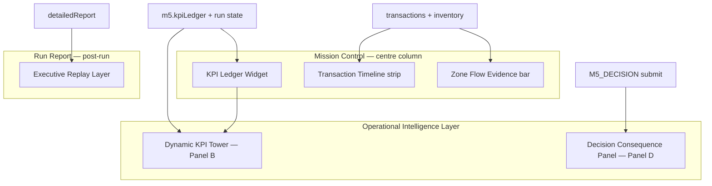

# TEC.WMS — RC14 Wave 1
# M5 Premium Operational Intelligence + Silver Premium Certification
## Implementation Specification

**Document:** `RC14_M5_AND_SILVER_PREMIUM_IMPLEMENTATION_SPEC.md`  
**Date:** 2026-06-18  
**Programme:** Collège de la Concorde — TEC.LOG / TEC.WMS  
**Platform:** Railway (production baseline RC13)  
**Mode:** Specification only — **no implementation, no commit, no deploy**

### Source documents

| Document | Role |
|----------|------|
| `RC14_PREMIUM_OPERATIONAL_INTELLIGENCE_MASTER_PLAN.md` | Wave 1/2 scope, golden rules, gap matrix |
| `RC14_M5_PREMIUM_INTELLIGENCE_AUDIT.md` | M5 gap analysis SCN-015→017 |
| `Documentation/CERTIFICATION_PACKAGE_V1.md` | Institutional certificate design authority |
| Production baseline | `SilverCertificatePreview.tsx`, `SilverBadgeSvg.tsx`, `shared/silverCertificationRegistry.ts` |

### Scope summary

| Objective | Deliverable |
|-----------|-------------|
| **A — M5 Premium Operational Intelligence** | Six display-layer surfaces in Mission Control / OIL / Run Report for SCN-015, SCN-016, SCN-017 |
| **B — Silver Premium Certificate Redesign** | Premium institutional layout spec for simulator certificate preview |

---

## 1. Frozen domains (non-negotiable)

The following **must not be modified** by any RC14 Wave 1 implementation derived from this spec:

| Domain | Frozen items |
|--------|--------------|
| **Silver logic** | `profiles.silverCertified`, `silverEligible`, gate checklist, auto-unlock |
| **Gold logic** | Gold gates, `decisionLinked`, capstone thresholds |
| **Scoring** | `scoreM5Decision`, `scoreM5StrategicDecision`, step point budgets, `calculateTotalScore` |
| **Thresholds** | Quiz ≥ 60 %, eval ≥ 70, M5 KPI ±5 % tolerance |
| **Eligibility** | `validateM5Compliance`, `assertM5VarianceGate`, keyword rubrics |
| **Registry** | `SILVER_REGISTRY_COHORT_2026`, `TEC-SIL-2026-00N` IDs, `lookupSilverRegistryByStudentNumber` |
| **Certification engine** | Issuance rules, registry lookup, Silver/Gold state resolution |
| **Pedagogy** | Fiche Mission objectives, step sequence, competences, Bloom targets, seed contracts |

RC14 Wave 1 is **display / state-surfacing / copy / layout only**. No new gates, no new scoring paths, no schema migrations for certification.

---

## 2. Objective A — M5 Premium Operational Intelligence

### 2.1 Problem statement (current production)

M5 runtime is pedagogically sound (ops→KPI→decision enforced server-side), but the cockpit does not **prove** the chain visually:

| Gap ID | Current behaviour | Target |
|--------|-------------------|--------|
| G-P0-05 | `trpc.m5.kpiLedger` consumed only in `StepForm.tsx` at `M5_KPI` | Ledger visible in Mission Control from first ops step |
| G-P0-06 | OIL Panel B shows static `M5_KPI_CONTROL_TOWER` targets via `M4KpiTowerView` | Dynamic tower fed by live ledger |
| G-P1-14 | `showTxTable = !m4Kpi && !m5Kpi \|\| …` hides transaction table when M5 tower active and ledger empty | Monitor never masked by static tower |
| G-P1-17 | `transactionTimeline` / `zoneFlow` computed in `routers.ts` `detailedReport` | Rendered in cockpit (live) and Run Report (post-run) |
| G-P0-07 | No post-`M5_DECISION` consequence loop | Decision Consequence Panel (simulated, non-scored) |
| G-P1-18 | Strategic decision text + rubric feedback not replayed | Executive Replay Layer in Run Report |

**Reference APIs (existing — reuse, do not rewrite logic):**

```typescript
// server/routers.ts — m5.kpiLedger
{ kpiData, kpiResult, evidence, canonicalExample, isDemo }

// server/rulesEngine.ts — deriveM5KpiFromRunEvidence
evidence: { receivedQty, putawayQty, cycleCountQty, varianceQty,
           varianceResolved, replenishmentQty, stockQtyAtBin, evidenceSource }

// server/routers.ts — detailedReport (M5 runs)
{ zoneFlow, transactionTimeline, m5Report: { kpiSnapshot, varianceTrail, adjustments } }
```

**Derived vs seed KPI fields (display contract):**

| KPI field | Source today | Wave 1 display rule |
|-----------|--------------|---------------------|
| Rotation, stock value, average stock | **Derived** from run ledger | Show live values + formula hint |
| Service %, error %, lead time | **Seed contract** (`CANONICAL_M4_KPI_DATA`) | Label **« KPI contextuels — contrat Peak Week »** until RC15 derivation |
| Variance, ADJ resolution | **Derived** | Highlight in ledger + timeline |

---

### 2.2 Architecture — six premium surfaces



| # | Surface | Primary location | Wave | SCN |
|---|---------|------------------|------|-----|
| 1 | KPI Ledger | Mission Control | 1 | 015, 016, 017 |
| 2 | Dynamic KPI Tower | OIL Panel B | 1 | 015, 016, 017 |
| 3 | Transaction Timeline | Mission Control + Run Report | 1–2 | 015, 016, 017 |
| 4 | Zone Flow Evidence | Mission Control + Run Report | 1–2 | 015, 016, 017 |
| 5 | Decision Consequence Panel | OIL Panel D + post-decision modal | 2 | 015 (tactical), 017 (strategic) |
| 6 | Executive Replay Layer | Run Report `m5Report` section | 2 | 015, 016, 017 |

---

### 2.3 Component 1 — KPI Ledger (Mission Control)

**Purpose:** Surface `m5.kpiLedger` in the cockpit so the student sees ops→KPI evolution **during** the 5+ ops steps, not only at `M5_KPI`.

**Placement:** Mission Control centre column, **below** the stock MMBE grid and **above** the transaction monitor. Visible when `moduleId === 5` and run is active.

**Data source:** `trpc.m5.kpiLedger.useQuery({ runId })` — poll/refetch on step completion (same pattern as monitor refresh).

**UI specification:**

```
┌─ KPI Ledger — Peak Week (live) ─────────────────────────────────────┐
│  Evidence row (mono 10px):                                          │
│  Réception: 50 · Putaway: 50 · CC: 45 · Variance: −5 · Stock: 45   │
│  [badge: variance résolue ✓]  (SCN-016 only, post-ADJ)             │
├─────────────────────────────────────────────────────────────────────┤
│  ┌──────────┐ ┌──────────┐ ┌──────────┐ ┌──────────┐ ┌──────────┐ │
│  │ Rotation │ │ Service  │ │ Erreurs  │ │ Délai    │ │ Stock $  │ │
│  │ 6.0×     │ │ 95.0%    │ │ 4.0%     │ │ 3.5 j    │ │ 48 000 $ │ │
│  │ [derived]│ │ [context]│ │ [context]│ │ [context]│ │ [derived]│ │
│  └──────────┘ └──────────┘ └──────────┘ └──────────┘ └──────────┘ │
│  Legend: derived = run ledger · context = contrat Peak Week         │
└─────────────────────────────────────────────────────────────────────┘
```

**Field binding:**

| Tile | Value source | Partial state |
|------|--------------|---------------|
| Rotation | `kpiResult.rotationRate` + `×` suffix | Show `—` until `receivedQty > 0` |
| Service | `kpiResult.serviceLevel × 100` | Always show with `[context]` badge |
| Errors | `kpiResult.errorRate × 100` | Always show with `[context]` badge |
| Lead time | `kpiData.avgLeadTimeDays` | Always show with `[context]` badge |
| Stock $ | `kpiResult.stockImmobilizedValue` or `kpiData.stockValue` | Partial until putaway posted |

**Bilingual labels:**

| FR | EN |
|----|-----|
| Registre KPI — Peak Week (direct) | KPI Ledger — Peak Week (live) |
| Dérivé du moniteur | Derived from monitor |
| KPI contextuels — contrat Peak Week | Contextual KPIs — Peak Week contract |
| Variance résolue | Variance resolved |

**SCN-specific behaviour:**

| SCN | Ledger notes |
|-----|--------------|
| **SCN-015** | Nominal cycle; tiles update after each ops step; no variance badge |
| **SCN-016** | Amber variance row at CC; green « variance résolue » after ADJ posts |
| **SCN-017** | Capstone: ledger reflects full prior cycle; executive framing label optional (P2) |

**Files to touch (implementation phase):**

- New: `client/src/components/m5/M5KpiLedgerWidget.tsx`
- Modify: `client/src/pages/student/MissionControl.tsx` (conditional render `moduleId === 5`)
- Reuse: existing `trpc.m5.kpiLedger` — **no server changes required**

**Acceptance criteria:**

- [ ] Ledger visible from run open (empty/partial state OK)
- [ ] Values refresh after each M5 step mutation without page reload
- [ ] Context KPIs carry visible non-derived badge
- [ ] No new blocking validation introduced

---

### 2.4 Component 2 — Dynamic KPI Tower (OIL Panel B)

**Purpose:** Replace static prose tower (`M5_KPI_CONTROL_TOWER` targets only) with a **live** tower that merges pedagogical framing (existing copy) + computed KPI values from ledger.

**Current defect:** `M4KpiTowerView` renders fixed `target` strings (e.g. `6× · 95% · 4% · 3.5d · $48k`) and uses label **« Tour de contrôle KPI — Module 4 »** for M5 entries.

**Specification:**

1. **Rename header** for M5: `Tour de contrôle KPI — Module 5` / `KPI Control Tower — Module 5`.
2. **Split tower into two stacked blocks:**
   - **Block A — Mission framing** (unchanged copy from `M5_KPI_CONTROL_TOWER[scnCode]`): `kpiEvaluated`, `diagnosticFocus`, `alertRisk`, `expectedOutput`, `varianceSignal` (SCN-016).
   - **Block B — Live readings** (new): five KPI tiles mirroring KPI Ledger, colour-coded by Annexe A bands (display-only thresholds from `CANONICAL_M4_KPI_DATA` / existing M4 band logic).
3. **Fix `showTxTable` logic:**

```typescript
// SPEC — replace current expression
const showTxTable =
  state.moduleId === 5
    ? true  // M5: monitor always visible; tower coexists
    : (!m4Kpi || pending.length > 0 || posted.length > 0);
```

4. **Annexe A bands (Wave 1 optional / Wave 2 full):** Expose band colours on live tiles — critical (red), normal (amber), excellent (green) — using existing M4 Annexe A thresholds. **Display only** — does not affect scoring.

**SCN-specific tower emphasis:**

| SCN | Block A focus | Block B live emphasis |
|-----|---------------|----------------------|
| **SCN-015** | « Cycle nominal — ops alimente le KPI final » | Rotation + stock $ track ops steps |
| **SCN-016** | Variance signal block (existing red banner) | Variance row + « résolu » state drives tile colours |
| **SCN-017** | « Décision stratégique — citez ≥2 KPI chiffrés » | All five tiles locked to snapshot values post-`M5_KPI` |

**Files to touch:**

- New: `client/src/components/m5/M5DynamicKpiTower.tsx` (or extend `M4KpiTowerView` with `mode: 'm4-static' | 'm5-dynamic'`)
- Modify: `client/src/components/operational-intelligence/OperationalIntelligenceLayer.tsx` (`PanelB`, `showTxTable`)
- Data: pass `m5KpiLedger` query result into Panel B when `moduleId === 5`

**Acceptance criteria:**

- [ ] Transaction table visible at M5 run start (empty state + `emptyStockNote` preserved)
- [ ] Live KPI values appear in tower when ledger has data
- [ ] Static seed targets remain as **reference line** below live values (not replaced — annotated « cible contrat »)
- [ ] Module 4 scenarios unaffected

---

### 2.5 Component 3 — Transaction Timeline

**Purpose:** Visualize causal ops chain `PO → GR → PUTAWAY → CC → ADJ → REPLENISH` as a horizontal stepper/timeline, not only as a flat monitor table.

**Data sources:**

| Context | Source |
|---------|--------|
| **Live cockpit** | Client-side projection from `state.transactions` + `completedSteps` |
| **Run Report** | Server `detailedReport.transactionTimeline` (already computed) |

**Live timeline specification:**

```
  PO        GR        PUTAWAY     CC        ADJ       REPLENISH
  ○ ─────── ● ─────── ● ──────── ● ─────── ◐ ─────── ○
  pending   posted    posted      posted    pending   —
```

- **Node states:** `empty` · `pending` (amber pulse) · `posted` (green) · `blocked` (red, SCN-016 pre-ADJ) · `skipped` (not used — all steps mandatory).
- **Click/hover:** Show latest tx for that doc type (ref, sku, bin, qty) from monitor.
- **Placement:** Compact strip directly above transaction monitor in Mission Control.

**Run Report specification:**

Render `transactionTimeline` array from `detailedReport` as a vertical chronological list:

| Column | Content |
|--------|---------|
| Step | `docType` |
| Reference | `docRef` |
| SKU / Bin / Qty | `sku`, `bin`, `qty` |
| Zone | `zone` (RÉCEPTION, STOCKAGE, …) |

**SCN-specific:**

| SCN | Timeline notes |
|-----|----------------|
| **SCN-015** | 7-step chain (no ADJ node greyed or hidden) |
| **SCN-016** | ADJ node **required**; show `blocked` on REPLENISH/KPI until ADJ posted |
| **SCN-017** | Ops chain read-only recap; decision phase adds non-tx node « DÉCISION » at end |

**Files to touch:**

- New: `client/src/components/m5/M5TransactionTimeline.tsx`
- Modify: `MissionControl.tsx`, `RunReport.tsx`
- Server: **no changes** (timeline already in `detailedReport`)

---

### 2.6 Component 4 — Zone Flow Evidence

**Purpose:** Show warehouse zone activity as evidence that goods moved through the physical flow — complements flat monitor.

**Data sources:**

| Context | Source |
|---------|--------|
| **Live** | Aggregate `state.transactions` by zone (same bin→zone mapping as server) |
| **Run Report** | `detailedReport.zoneFlow` |

**Zone palette (match server):**

| Zone | Colour | Bins (existing constants) |
|------|--------|---------------------------|
| RÉCEPTION | `#3b82f6` | REC-01, REC-02 |
| STOCKAGE | `#10b981` | B-01-*, A-01-* |
| PICKING | `#f59e0b` | PICK-* |
| EXPÉDITION | `#8b5cf6` | EXP-* |
| RÉSERVE | `#6b7280` | RES-* |

**UI — horizontal bar (live + report):**

```
┌ Zone Flow Evidence ─────────────────────────────────────────────┐
│ RÉCEPTION ████░░  2 tx   STOCKAGE ██████░░  4 tx   …           │
└─────────────────────────────────────────────────────────────────┘
```

- Bar fill proportional to `txCount` (max across zones = 100%).
- Zero zones shown grey with `0 tx`.
- Tooltip: list posted doc types in that zone.

**SCN-specific:**

| SCN | Expected pattern |
|-----|------------------|
| **SCN-015** | RÉCEPTION → STOCKAGE dominant |
| **SCN-016** | STOCKAGE activity includes ADJ adjustment evidence |
| **SCN-017** | Full zone bar as **proof recap** during decision phase |

**Files to touch:**

- New: `client/src/components/m5/M5ZoneFlowBar.tsx`
- Shared: extract bin→zone helpers to `shared/zoneMapping.ts` (client + server DRY) — **display helper only, no rule change**
- Modify: `MissionControl.tsx`, `RunReport.tsx`

---

### 2.7 Component 5 — Decision Consequence Panel

**Purpose:** Close the loop **Décision → Conséquence** with a **pedagogical simulation** — not scored, not a new gate.

**Placement:**

- **OIL Panel D** — persistent panel when `completedSteps` includes `M5_KPI` or student is on `M5_DECISION`.
- **Post-submit toast replacement** — expandable card after successful `M5_DECISION` mutation.

**Content structure:**

```
┌─ Conséquence pédagogique (simulation — non notée) ────────────────┐
│  Votre décision mentionne: [auto-detected themes from text]       │
│  Impact projeté (illustratif):                                    │
│    · Taux d'erreurs → tendance ↓ si formation citée               │
│    · Rotation → tendance ↑ si réappro optimisé cité               │
│  ⚠ Simulation pédagogique — n'affecte pas le score.               │
└───────────────────────────────────────────────────────────────────┘
```

**Rules (display-only heuristics — must NOT call scoring functions):**

| Detected theme (keyword match, same families as scorer) | Projected consequence copy |
|--------------------------------------------------------|------------------------------|
| formation / procédure / améliorer | « Erreurs opérationnelles — tendance à la baisse sur 90 j » |
| réappro / stock / rotation | « Rotation — tendance à l'amélioration si stock aligné » |
| service / OTIF / délai | « Niveau de service — stabilisation projetée » |
| (strategic SCN-017) trade-off + horizon | « Arbitrage enregistré — suivi KPI à 90–180 j recommandé » |
| No recognizable theme | « Decision enregistrée — reliez votre texte aux KPI du snapshot » |

**SCN-specific:**

| SCN | Panel mode |
|-----|------------|
| **SCN-015** | Tactical preview; shorter copy; no « comité de direction » framing |
| **SCN-016** | Emphasize post-variance correction path in consequence text |
| **SCN-017** | Full executive panel; optional empty structural board (Wave 2: Situation / Preuve / Arbitrage / Recommandation / Horizon — **titles only, no content**) |

**Explicit prohibitions:**

- Do **not** expose `M5_DECISION_SCAFFOLD` full content in eval (demo-only remains).
- Do **not** show numeric « correct » decision or A1–A3 exemplars.
- Do **not** write to `kpi_snapshots` or alter compliance state.

**Files to touch:**

- New: `client/src/components/m5/M5DecisionConsequencePanel.tsx`
- Modify: `OperationalIntelligenceLayer.tsx` (Panel D), `StepForm.tsx` (post-submit hook)
- Optional read: decision text from last `M5_DECISION` event in run state

---

### 2.8 Component 6 — Executive Replay Layer (Run Report)

**Purpose:** Post-run executive debrief — replay decision, rubric feedback, timeline, zone flow, and KPI snapshot linkage.

**Placement:** New subsection inside Run Report when `moduleId === 5`, below existing `m5Report` block.

**Sections:**

| Section | Content source |
|---------|----------------|
| **A — Executive summary** | Run score label + compliance outcome (existing) |
| **B — KPI snapshot replay** | `m5Report.kpiSnapshot` with Annexe A band labels |
| **C — Ops evidence replay** | `transactionTimeline` + `zoneFlow` (Components 3 & 4) |
| **D — Variance / ADJ trail** | Existing `varianceTrail` + `adjustments` |
| **E — Decision replay** | Submitted `M5_DECISION` text (from run events) |
| **F — Rubric feedback** | `scoreM5StrategicDecision` / `scoreM5Decision` feedback strings (**read-only display** of existing scorer output at submit time — store in event metadata if not persisted today) |
| **G — Consequence recap** | Same copy as Decision Consequence Panel |

**Server consideration (spec only):**

If decision feedback is not persisted on the event today, add **optional** `feedbackFr` / `feedbackEn` fields to the `M5_DECISION` completion event payload at submit time. This is **audit metadata** — not a scoring change.

**Display fix (P2 bundled):** Align Run Report `M5_DECISION` step `maxPoints` display with scorer ceiling (30 vs 80) — **label correction only**.

**SCN-specific replay emphasis:**

| SCN | Executive replay focus |
|-----|------------------------|
| **SCN-015** | Tactical decision + nominal ops chain |
| **SCN-016** | Variance trail + ADJ highlight + corrected KPI snapshot |
| **SCN-017** | Full board structure echo + strategic rubric feedback + snapshot citations |

**Files to touch:**

- Modify: `client/src/pages/student/RunReport.tsx`
- Possible: `server/routers.ts` — persist feedback on decision event (metadata only)

---

### 2.9 Per-scenario consolidated spec (SCN-015 / SCN-016 / SCN-017)

| Surface | SCN-015 Peak Week J1 | SCN-016 Peak Week J2 | SCN-017 Peak Week J3 |
|---------|----------------------|----------------------|----------------------|
| KPI Ledger | Live from GR onward | Variance + ADJ badges | Snapshot-locked post-KPI |
| Dynamic Tower | Nominal framing + live tiles | Variance signal + blocked states | Strategic framing + snapshot tiles |
| Transaction Timeline | 7-step nominal | ADJ gate visible | Ops recap + DECISION node |
| Zone Flow | REC→STOCKAGE | STOCKAGE + ADJ | Full recap bar |
| Decision Consequence | Tactical simulation | Post-correction emphasis | Executive simulation + structure |
| Executive Replay | Standard | Variance/ADJ section expanded | Decision + rubric prominent |

**Pedagogical profiles (unchanged):**

| SCN | Decision level | Steps |
|-----|----------------|-------|
| SCN-015 | TACTICAL | 7 + COMPLIANCE_M5 |
| SCN-016 | TACTICAL | 8 (incl. M5_ADJ) + COMPLIANCE_M5 |
| SCN-017 | STRATEGIC | 7 + COMPLIANCE_M5 |

---

### 2.10 Implementation sequencing (M5)

| Phase | Items | Effort |
|-------|-------|--------|
| **Wave 1a** | KPI Ledger widget, `showTxTable` fix, Dynamic Tower live block, context KPI labels | M |
| **Wave 1b** | Transaction Timeline (live), Zone Flow bar (live) | M |
| **Wave 2a** | Decision Consequence Panel | M |
| **Wave 2b** | Executive Replay Layer + Run Report timeline/zone | M |
| **Wave 2c** | Annexe A bands on tiles, SCN-017 structural board (titles only) | S–M |

**Regression test matrix (implementation phase):**

- [ ] `module345.rules.test.ts` — all existing tests pass unchanged
- [ ] M4 scenarios — Panel B unaffected
- [ ] M1/M2 Mission Control — no M5 widgets rendered
- [ ] SCN-016 variance gate still blocks pre-ADJ (server unchanged)
- [ ] Gold `decisionLinked` path unchanged

---

## 3. Objective B — Silver Premium Certificate Redesign

### 3.1 Problem statement (current production)

`SilverCertificatePreview.tsx` (Railway RC13) delivers a functional pedagogical preview but falls short of the institutional premium spec in `CERTIFICATION_PACKAGE_V1.md`:

| Element | Current (`SilverCertificatePreview.tsx`) | Premium target |
|---------|------------------------------------------|----------------|
| Silver seal | `SilverBadgeSvg` **100px** | **140px** screen / **100mm** print |
| Layout | Portrait card, `max-w-3xl` | Institutional landscape grid |
| Certificate ID | Shown when `silverEarned && registryEntry` | Prominent **Verification ID** block |
| QR | Copy: « Credential numérique · QR · à venir » | **QR Placeholder** (32mm spec) |
| Signature | Generic « Directeur de programme » | **Nadia Allami** + title + signature placeholder |
| Completion | Not shown | **Certification Completion 100%** (institutional, not academic grade) |
| Registry IDs | `TEC-SIL-2026-001` etc. | **Preserved unchanged** |

### 3.2 Design authority

Follow `Documentation/CERTIFICATION_PACKAGE_V1.md` §3–§7 with these RC14 Wave 1 overrides:

1. **Primary signatory placeholder (mandatory):** Nadia Allami — Directrice Générale — Collège de la Concorde.
2. **Secondary signatory:** Defer Thiago Gibran to Wave 2 / PDF pipeline — Wave 1 may show single-signatory layout **or** dual placeholder per V1 §3.5 (spec recommends dual row for parity with V1 grid).
3. **Certification Completion:** New field — **not** quiz score, **not** scenario score.

### 3.3 Certification Completion — semantic contract

**Critical:** This metric represents **Institutional Certification Completion** — the full Silver pathway requirements satisfied — **not** an academic grade or average score.

| Property | Rule |
|----------|------|
| **Label FR** | Achèvement de la certification |
| **Label EN** | Certification Completion |
| **Value when earned** | `100%` |
| **Value when eligible (preview)** | `100%` with preview banner (requirements met, issuance pending) |
| **Value when in progress** | Not shown on certificate face — gate page only |
| **Derivation** | Mirror existing `allRequirementsMet` boolean in `SilverCertificatePreview.tsx` — display-only |
| **Forbidden copy** | « Note », « Score », « Grade », « Résultat académique », « Average » |
| **Allowed subtext FR** | « Parcours M1 intégral validé selon les critères TEC.LOG » |
| **Allowed subtext EN** | « Full M1 pathway validated per TEC.LOG criteria » |

**Visual treatment:**

```
┌─────────────────────────────────────┐
│  ACHÈVEMENT DE LA CERTIFICATION     │
│           100%                      │
│  ─────────────────────────────────  │
│  Parcours M1 intégral validé        │
│  selon les critères TEC.LOG         │
└─────────────────────────────────────┘
```

- Progress ring or institutional bar — **not** a grade dial.
- Colour: institutional blue `#0070f2` accent, not gold/green score colours.

### 3.4 Verification ID block

**Purpose:** Elevate registry certificate number to a first-class verification surface.

| Property | Rule |
|----------|------|
| **Label FR** | Identifiant de vérification |
| **Label EN** | Verification ID |
| **Value** | `registryEntry.certificateId` e.g. `TEC-SIL-2026-001` |
| **Font** | Monospace, 9–11pt, tracking +0.05em |
| **Visibility** | Earned: always shown; Preview eligible: shown with « pré-attribution » sublabel |
| **Format** | Preserve `TEC-SIL-YYYY-NNN` pattern — **no new ID scheme** |

**Placeholder when registry miss:**

If `silverEarned` but no registry match (edge case), show ID slot with em dash and support message — **do not fabricate IDs**. Registry lookup logic unchanged.

### 3.5 QR Placeholder

Per `CERTIFICATION_PACKAGE_V1.md` §6 — implement **placeholder only** (no live `verify.teclog.ca` integration in Wave 1).

| Property | Spec |
|----------|------|
| **Size** | 32 × 32 mm print; 96px screen minimum |
| **Position** | Bottom-right of signature row |
| **Visual** | Dashed border box with QR icon silhouette + sample module grid (non-scannable) |
| **Label FR** | Vérifier · verify.teclog.ca |
| **Label EN** | Verify · verify.teclog.ca |
| **Payload (future)** | `https://verify.teclog.ca/c/{certificate_id}` |
| **Error correction** | Level M when live |

### 3.6 Signature Placeholder — Nadia Allami (mandatory)

```
┌──────────────────────────────┐
│  [signature line — 32mm]     │
│  Nadia Allami                │
│  Directrice Générale         │
│  Collège de la Concorde      │
└──────────────────────────────┘
```

| Property | Rule |
|----------|------|
| **Name** | Nadia Allami — fixed |
| **Title FR** | Directrice Générale |
| **Title EN** | General Director |
| **Institution** | Collège de la Concorde |
| **Signature graphic** | Placeholder italic line or SVG script placeholder — **not** a forged raster signature |
| **Required** | **Mandatory** in all earned and eligible preview states |

**Remove** generic « Directeur de programme / TEC.LOG » as primary signatory.

### 3.7 Premium layout specification

**Orientation:** Landscape institutional document (screen: responsive; print: A4 landscape per V1 §3.5).

**Grid (target):**

```
┌─────────────────────────────────────────────────────────────────────────────┐
│  [ornamental outer frame — 2pt + 0.5pt inset]                               │
│  ┌───────────────────────────────────────────────────────────────────────┐  │
│  │  Collège de la Concorde                    [Silver medallion 140px]   │  │
│  │  Programme TEC.LOG · Operational Competency Credential · TEC.WMS      │  │
│  │                                                                       │  │
│  │              CERTIFICATION SILVER / SILVER CERTIFICATION              │  │
│  │         ERP/WMS Foundation Operations · Module 1                      │  │
│  │  ───────────────────────────────────────────────────────────────────  │  │
│  │  [Certification Completion 100%]     [Verification ID: TEC-SIL-…]    │  │
│  │  ───────────────────────────────────────────────────────────────────  │  │
│  │                    Décerné à / Awarded to                             │  │
│  │                    [Recipient Name — serif 24–28pt]                   │  │
│  │                    [Issue date]                                     │  │
│  │  ───────────────────────────────────────────────────────────────────  │  │
│  │  Réalisations opérationnelles    │  Compétences certifiées           │  │
│  │  (6 items — unchanged list)      │  (8 items — unchanged list)       │  │
│  │  ───────────────────────────────────────────────────────────────────  │  │
│  │  [Nadia Allami signature]              [QR Placeholder 32mm]         │  │
│  └───────────────────────────────────────────────────────────────────────┘  │
└─────────────────────────────────────────────────────────────────────────────┘
```

**Silver seal (`SilverBadgeSvg`):**

| Context | Size |
|---------|------|
| Certificate face (screen) | **140px** (up from 100px) |
| Certifications list page | 140px (already used on `CertificationsPage`) |
| Print | 100mm diameter |
| Variant | `full` (ribbon `M1 · FONDEMENTS`) |

**Typography:** Per V1 §3.4 — institution sans, recipient serif, ID monospace.

**Colour tokens:** Silver slate gradient (existing badge), `tec-blue` `#0070f2`, paper gradient `from-white via-slate-50 to-slate-100`.

**Watermark rules (unchanged):**

| State | Watermark |
|-------|-----------|
| Preview (eligible, not earned) | `APERÇU` / `PREVIEW` diagonal + blue banner |
| Earned | No watermark |

### 3.8 Field schema delta (display layer only)

New display-only fields — **not** added to `SilverRegistryEntry` type:

| Field ID | FR | EN | Source |
|----------|----|----|--------|
| `certification_completion` | Achèvement de la certification | Certification Completion | Derived: `allRequirementsMet \|\| silverEarned` → 100% |
| `verification_id` | Identifiant de vérification | Verification ID | `registryEntry.certificateId` |
| `qr_placeholder` | — | — | Static SVG placeholder |
| `signatory_primary` | Nadia Allami | Nadia Allami | Fixed |
| `signatory_primary_title` | Directrice Générale | General Director | Fixed |

**Unchanged registry fields:** `certificateId`, `displayName`, `studentNumber`, `cohortYear`.

### 3.9 Files to touch (implementation phase)

| File | Change |
|------|--------|
| `client/src/pages/student/SilverCertificatePreview.tsx` | Premium layout, new fields |
| `client/src/components/certification/SilverBadgeSvg.tsx` | Optional: `size` default 140 for certificate context |
| `client/src/components/certification/SilverCertificateDocument.tsx` | **New** — extracted presentational component |
| `client/src/components/certification/CertificationCompletionBadge.tsx` | **New** |
| `client/src/components/certification/VerificationIdBlock.tsx` | **New** |
| `client/src/components/certification/QrPlaceholder.tsx` | **New** |
| `client/src/components/certification/SignaturePlaceholder.tsx` | **New** |

**Frozen — do not modify:**

- `shared/silverCertificationRegistry.ts` (IDs and entries)
- `trpc.profiles.silverStatus` logic
- Silver/Gold certification engine routes
- Eligibility thresholds

### 3.10 Silver acceptance criteria

- [ ] Silver seal ≥ 140px on certificate face
- [ ] Landscape institutional layout matches V1 grid
- [ ] Verification ID shows `TEC-SIL-2026-00N` for registry students when earned
- [ ] QR placeholder visible with verify.teclog.ca label
- [ ] Nadia Allami / Directrice Générale / Collège de la Concorde signature block present
- [ ] Certification Completion shows **100%** with institutional copy — no academic grade semantics
- [ ] Preview watermark + banner preserved for eligible-not-earned
- [ ] Print stylesheet (`@media print`) respects landscape A4
- [ ] No changes to Silver logic, scoring, eligibility, registry, or certification engine

---

## 4. Cross-objective constraints

| Constraint | M5 Intelligence | Silver Certificate |
|------------|-----------------|-------------------|
| No scoring changes | ✓ | ✓ |
| No new certification gates | ✓ | ✓ |
| Display / layout only | ✓ | ✓ |
| Bilingual FR/EN | ✓ | ✓ |
| Railway deploy compatible | ✓ (client-only) | ✓ (client-only) |
| Cohorte Fondatrice safe | ✓ | ✓ |

---

## 5. Deliverable checklist

| # | Item | Status |
|---|------|--------|
| 1 | M5 KPI Ledger Mission Control spec | ✓ This document §2.3 |
| 2 | Dynamic KPI Tower spec | ✓ §2.4 |
| 3 | Transaction Timeline spec | ✓ §2.5 |
| 4 | Zone Flow Evidence spec | ✓ §2.6 |
| 5 | Decision Consequence Panel spec | ✓ §2.7 |
| 6 | Executive Replay Layer spec | ✓ §2.8 |
| 7 | SCN-015 / SCN-016 / SCN-017 per-scenario matrix | ✓ §2.9 |
| 8 | Silver premium layout spec | ✓ §3.7 |
| 9 | Verification ID spec | ✓ §3.4 |
| 10 | QR Placeholder spec | ✓ §3.5 |
| 11 | Nadia Allami signature placeholder | ✓ §3.6 |
| 12 | Certification Completion 100% (institutional) | ✓ §3.3 |
| 13 | Frozen domains documented | ✓ §1 |
| 14 | Implementation **not** started | ✓ |
| 15 | Git commit **not** created | ✓ |

---

## 6. References

| Path | Relevance |
|------|-----------|
| `RC14_PREMIUM_OPERATIONAL_INTELLIGENCE_MASTER_PLAN.md` | W1-09→W1-12, W2-13→W2-15 |
| `RC14_M5_PREMIUM_INTELLIGENCE_AUDIT.md` | P0/P1 issue register |
| `Documentation/CERTIFICATION_PACKAGE_V1.md` | Certificate visual authority |
| `client/src/pages/student/SilverCertificatePreview.tsx` | Current Silver UI baseline |
| `server/routers.ts` (`m5.kpiLedger`, `detailedReport`) | M5 data contracts |
| `server/rulesEngine.ts` (`deriveM5KpiFromRunEvidence`) | KPI derivation rules |
| `client/src/components/operational-intelligence/OperationalIntelligenceLayer.tsx` | OIL Panel B/D baseline |
| `shared/silverCertificationRegistry.ts` | `TEC-SIL-2026-001` → `004` |

---

*RC14 Wave 1 implementation specification — documentation only. No code, registry, scoring, certification engine, or deploy changes included. Ready for engineering handoff.*
