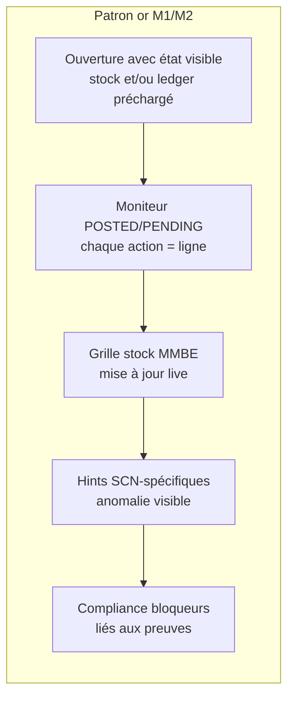
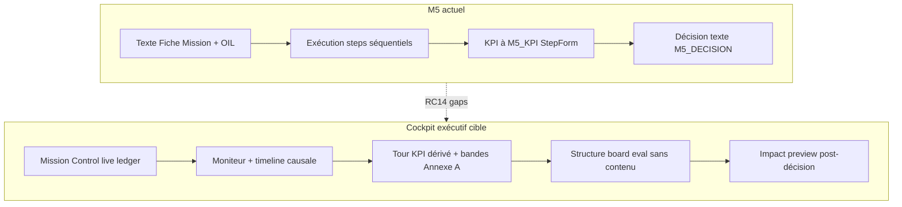

# TEC.WMS — RC14 M5 Premium Intelligence Gap Analysis

**Document:** `RC14_M5_PREMIUM_INTELLIGENCE_AUDIT.md`  
**Date:** 2026-06-18  
**Release context:** RC14 (pós-RC13 estabilizado)  
**Scope:** SCN-015, SCN-016, SCN-017 — Module M5 Peak Week  
**Référence or :** Modules M1 (SCN-001→005) et M2 (SCN-006→008) — patron cockpit opérationnel certifié  
**Mode:** Audit uniquement — aucune modification de code, scoring ou certification  

---

## Executive summary

M5 est **pédagogiquement solide** au niveau runtime : la chaîne ops→KPI→décision est enforceée, SCN-016 (variance→ADJ) et SCN-017 (capstone stratégique) fonctionnent, et la logique métier est alignée avec le Guide Maître.

En revanche, comparé au **patron or M1/M2**, M5 reste un **simulateur textuel et séquentiel** plutôt qu’un **cockpit exécutif dynamique**. L’étudiant exécute des étapes et lit des consignes ; il ne **voit pas** en temps réel comment chaque mouvement d’entrepôt alimente un tableau de bord décisionnel, ni comment sa décision stratégique produirait des conséquences mesurables.

| Dimension | M1/M2 (or) | M5 (actuel) | Écart |
|-----------|------------|-------------|-------|
| Mission Control | Stock + moniteur vivants dès l’ouverture | Stock/moniteur vides au départ ; pas de widgets exécutifs | **Élevé** |
| OIL Panel B | Preuves transactionnelles prioritaires | Tour KPI **statique** masque le moniteur au démarrage | **Élevé** |
| KPI Ledger | N/A (M1/M2) / dérivé ops (M3) | Ledger serveur existant mais **visible seulement à l’étape M5_KPI** | **Élevé** |
| Strategic Decision Support | N/A | Scaffolding eval fragmentaire ; modèle complet demo-only | **Modéré–élevé** |
| Monitors | Preuves POSTED/PENDING immédiates | Vide initial normal ; pas de chaîne causale visuelle | **Modéré** |
| Compliance | Bloqueurs actionnables dans cockpit | Gates serveur OK ; UI générique sans preview conséquence | **Modéré** |
| Run Reports | Détail par étape + erreurs pédagogiques | Section M5 post-run utile ; **pas de replay décision** ; timeline serveur non affichée | **Modéré** |
| Evidence Collection | Chaque tx = preuve visible | Preuves ops OK ; **lien visuel ops→KPI→décision** faible | **Élevé** |

**Verdict global M5 Premium Intelligence:** **YELLOW** — GO runtime, **NO-GO cockpit exécutif** tel que défini par le standard M1/M2/M4.

| Priorité | Count | Thème dominant |
|----------|-------|----------------|
| **P0** | 4 | KPI sans origine visuelle live ; ledger hors cockpit ; autonomie capstone ; ancrage décision→conséquence |
| **P1** | 7 | Moniteur/OIL ; historique ; feedback exécutif ; Run Report |
| **P2** | 6 | Copy, labels, Peak Week narrative, polish UI |

---

## Méthodologie

### Sources auditées (hiérarchie Constitution)

| Rang | Source | Proxy in-repo |
|------|--------|---------------|
| 1 | Guide Maître M5 | `Documentation/Pedagogical_Framework/.../07-MODULE-M5-SCN-015-017/` |
| 2 | Fiche Mission | `server/missionDataExtended.ts` (SCN-015/016/017) |
| 3 | Mission Control | `client/src/pages/student/MissionControl.tsx` |
| 4 | OIL | `OperationalIntelligenceLayer.tsx`, `scenarioCockpitPedagogy.ts`, `m5KpiControlTower.ts` |
| 5 | KPI Ledger | `trpc.m5.kpiLedger`, `deriveM5KpiFromRunEvidence` (`rulesEngine.ts`) |
| 6 | Run Report | `RunReport.tsx`, `runs.detailedReport` (`routers.ts`) |
| 7 | Runtime | `rulesEngine.ts`, `routers.ts` (m5 router), `RC13_M5_VALIDATION_REPORT.md` |

### Patron or M1/M2 — critères « Premium Intelligence »

Le standard M1/M2 n’est pas seulement « ça marche » ; c’est un **cockpit où la preuve précède la décision** :



| Capacité M1/M2 | Implémentation | Effet pédagogique |
|----------------|----------------|-------------------|
| Preuve immédiate | SCN-002 GR PENDING ; SCN-006 PO+GR postés ; SCN-008 lots préchargés | L’étudiant **voit** l’anomalie ou l’état sans lire un paragraphe |
| Moniteur = source de vérité | `MissionControl.tsx` + `UnpostedTransactionsPanel` | Chaque document a un statut observable |
| Stock = conséquence des txs | `calculateInventory` aligné moniteur (`m2.monitor.test.ts`) | Lien causal document→quantité |
| Hints opérationnels | `scenarioCockpitPedagogy.ts` par SCN | Direction sans livrer la réponse |
| Erreurs avec conséquence | `PENALTY_EXPLANATIONS` dans Run Report | Feedback pédagogique post-action |

M5 hérite du **shell** Mission Control M1 mais ajoute une couche KPI/décision **découplée visuellement** de l’exécution.

---

## Analyse par dimension

### 1. Mission Control

**État actuel**

- Même layout M1 : barre de commande, OIL, cockpit « PROCHAINE ACTION », grille stock MMBE, moniteur transactions, conformité, score.
- SCN-015/016/017 : stock vide + moniteur vide au départ (`emptyStockNote` pédagogique).
- Pas de panneau exécutif (S&OP, trade-off preview, Peak Week timeline).
- Pas d’intégration du `m5.kpiLedger` dans le cockpit — uniquement dans `StepForm` à M5_KPI.
- Colonne droite identique M1 : score/progression/compliance — **aucun indicateur KPI live**.

**vs M1/M2**

| Élément | M1/M2 | M5 |
|---------|-------|-----|
| État initial riche | SCN-008 lots ; SCN-002 GR pending ; SCN-007 600 u. au quai | Vide systématique |
| Alerte capacité / FIFO | SCN-007 overflow ; SCN-008 lot dates | Absent (cycle simplifié SKU-001) |
| Feedback immédiat sur anomalie | PENDING pulse, stock incohérent | Variance invisible avant M5_CYCLE_COUNT |
| Widgets métier dédiés | Unposted panel M1 | Idem, mais pas de « variance gate » visuel |

**Lacunes**

| ID | Description | SCN |
|----|-------------|-----|
| MC-01 | Pas de bandeau KPI live (rotation/service/erreurs) alimenté par le ledger pendant le cycle ops | Tous |
| MC-02 | Pas de visualisation « étape ops → impact KPI » dans le cockpit | 015, 017 |
| MC-03 | SCN-016 : signal variance uniquement à l’étape CC, pas d’indicateur amber anticipé dans le moniteur | 016 |
| MC-04 | Rôle « Directeur Logistique » (SCN-017) non matérialisé dans l’UI cockpit — reste gestionnaire ops | 017 |

---

### 2. Operational Intelligence Layer (OIL)

**État actuel**

- Panel A : briefing Fiche Mission — **texte riche**, aligné.
- Panel B : `M5_KPI_CONTROL_TOWER` via composant `M4KpiTowerView` — cibles **statiques** (6× · 95 % · 4 % · 3,5 j · 48 k$).
- Logique `showTxTable` :

```typescript
// OperationalIntelligenceLayer.tsx — Panel B
const showTxTable = !m4Kpi && !m5Kpi || pending.length > 0 || posted.length > 0;
```

Quand `m5Kpi` est actif et qu’aucune transaction n’existe encore, **le tableau transactions OIL est masqué** — l’étudiant voit le tour KPI statique au lieu du moniteur vide explicite.

- Panel D : Annexe B (grille ops M5) en eval ; **Annexe A (bandes KPI) absente** (réservée `moduleId === 4`).
- `M5_DECISION_SCAFFOLD` complet : **demo-only** ; eval = fragment requirements.

**vs M4 (référence KPI)**

M4 remplace intentionnellement le moniteur par le tour KPI — scénario **analytique pur**. M5 est un scénario **ops + KPI** : masquer le moniteur au démarrage **contredit** le message slides M5 (« Moniteur + stocks comme preuves »).

**Lacunes**

| ID | Description |
|----|-------------|
| OIL-01 | Label erroné « Tour de contrôle KPI — **Module 4** » pour les entrées M5 |
| OIL-02 | Tour KPI statique ≠ KPI dérivés du run (`deriveM5KpiFromRunEvidence`) |
| OIL-03 | Suppression du tableau tx OIL au démarrage M5 |
| OIL-04 | Annexe A (bandes critique/normal/excellent) non exposée en M5 |
| OIL-05 | Pas de panneau « conséquence si action incorrecte » dynamique (texte Fiche Mission statique seulement) |

---

### 3. KPI Ledger

**État actuel (points forts)**

- Endpoint `m5.kpiLedger` : dérive `receivedQty`, `putawayQty`, `cycleCountQty`, `varianceQty`, `stockQtyAtBin` depuis le ledger.
- `validateM5KpiSubmission` : tolérance ±5 %, rejet paste canonique M4 (`isCanonicalM5KpiPaste`).
- Checkbox eval « confirmé depuis moniteur » à M5_KPI.
- Snapshot persisté pour SCN-017 (`getKpiSnapshotByRun`).

**Limitation structurelle critique**

Dans `deriveM5KpiFromRunEvidence`, les champs **service, erreurs, délai** proviennent du **contrat seed canonique**, pas des transactions du run :

```typescript
// rulesEngine.ts — champs non dérivés du moniteur
ordersFulfilled: contractKpi.ordersFulfilled,      // 285/300 fixe
operationalErrors: contractKpi.operationalErrors,    // 12/300 fixe
avgLeadTimeDays: contractKpi.avgLeadTimeDays,        // 3,5 j fixe
```

Seuls **stock / rotation / capital** varient réellement selon les ops (réception, CC, ADJ, réappro). L’étudiant qui exécute mal le cycle ops **ne voit pas** d’impact sur service % ou taux d’erreurs — renforçant l’impression que les KPI sont « décoratifs ».

**vs M1/M2**

M1/M2 n’ont pas de KPI ledger — mais chaque erreur ops **change visiblement** stock et moniteur. M5 promet « ops alimente KPI » sans feedback visuel sur la moitié du portefeuille KPI.

**Lacunes**

| ID | Description | Priorité |
|----|-------------|----------|
| KL-01 | Ledger API non surfacé dans Mission Control (seulement StepForm M5_KPI) | P0 |
| KL-02 | Service / erreurs / délai non dérivés des preuves ops | P0 |
| KL-03 | Pas de formule visible (2400÷400, 285÷300) liée aux lignes moniteur | P1 |
| KL-04 | Pas de jauge « bande Annexe A » sur les KPI dérivés | P1 |

---

### 4. Strategic Decision Support

**État actuel**

- SCN-015 : décision **tactique** — scoring permissif (keywords).
- SCN-016 : idem post-correction.
- SCN-017 : `scoreM5StrategicDecision` — rejet séquentiel (KPI → trade-off → reco → horizon) ; **robuste côté serveur**.

**Gaps UX / autonomie**

| Mode | Contenu disponible |
|------|-------------------|
| **Demo** | `M5_DECISION_SCAFFOLD` complet (Situation · Preuve · Décision · Trade-off · Horizon · KPI suivi) |
| **Eval** | Fragment : « ≥2 KPI · trade-off · horizon 90–180 j » |
| **Instructeur only** | Annexe B exemples A1–A3 / R1–R3 (Guide Maître) |

L’étudiant autonome **peut** passer les gates — mais doit **assembler seul** la structure board sans modèle structurel ni exemplar de forme (pas de contenu).

**vs M4 capstone (SCN-014)**

M4 partage le même pattern eval/demo — mais M4 est 100 % analytique avec tour KPI omniprésent. M5 capstone exige **synthèse exécutive** sans couche « comité de direction » dans l’UI.

**Lacunes**

| ID | Description | SCN |
|----|-------------|-----|
| SDS-01 | Modèle structurel board absent en eval (demo-gated) | 017 |
| SDS-02 | Exemples acceptés/refusés non exposés (forme seulement, pas contenu) | 017 |
| SDS-03 | Copy « Décision stratégique » sur M5_DECISION pour SCN-015 (profil TACTICAL) | 015 |
| SDS-04 | Fiche Mission SCN-015 mentionne « décision stratégique » vs runtime TACTICAL | 015 |
| SDS-05 | Pas de framing S&OP / comité dans cockpit (contrairement SCN-014 narrative) | 017 |

---

### 5. Monitors

**État actuel**

- Moniteur Mission Control : liste plate Type/Ref/SKU/Bin/Qty/Status — **identique M1**.
- Compteurs Postées/Pending dans l’en-tête.
- Hint `transactionMonitorHint` par SCN dans la bannière.
- OIL Panel B : tableau tx tronqué (12 lignes max) quand visible.

**Moniteurs vides — analyse**

| Phase | Comportement | Pédagogiquement |
|-------|--------------|-----------------|
| Ouverture SCN-015/016/017 | Moniteur vide + stock vide | **Attendu** (comme SCN-001) |
| OIL Panel B démarrage | Table tx **masquée** ; tour KPI statique affiché | **Friction** — message contradictoire avec slides M5 |
| Post M5_RECEPTION | Lignes GR apparaissent | **OK** — preuve ops |
| SCN-016 pré-CC | Pas de ligne variance | **Attendu** (injection au CC) |
| SCN-017 post-ops | Moniteur ops complet mais **pas de vue KPI agrégée** dans le moniteur | **Lacune** |

**vs M2**

- SCN-006/007 : 2 lignes ledger dès l’ouverture — l’étudiant **travaille avec des preuves**.
- SCN-008 : 3 GR multi-bins + lots — traçabilité visible sans action préalable.

**Lacunes**

| ID | Description |
|----|-------------|
| MON-01 | Moniteur vide au démarrage sans équivalent « preuve initiale » (contrairement M2 preload) |
| MON-02 | OIL masque le moniteur quand tour KPI actif et ledger vide |
| MON-03 | Pas de vue chronologique causale (PO→GR→PUTAWAY→CC→ADJ→REPLENISH) dans le moniteur |
| MON-04 | Pas de surbrillance post-ADJ sur SCN-016 (stock 45 u. visible grille, mais pas de badge « variance résolue ») |
| MON-05 | `transactionTimeline` calculé serveur (`detailedReport`) **jamais rendu** dans `RunReport.tsx` |

---

### 6. Compliance

**État actuel (runtime — fort)**

- `assertM5VarianceGate` : bloque REPLENISH/KPI/DECISION pre-ADJ (SCN-016).
- `validateM5Compliance` : étapes manquantes, snapshot absent, variance ouverte, `decisionRejected` SCN-017.
- Gold gates : `scn-016-seq`, `decisionLinked`, capstone ≥ 70.

**UI Compliance (faible vs potentiel exécutif)**

- Panneau conformité Mission Control : binaire OK/alertes — **mêmes messages** que M1.
- Pas de checklist M5 spécifique (7 vs 8 étapes, snapshot KPI, décision liée).
- Pas de **preview conséquence** : « Si vous passez à M5_KPI sans ADJ → bloqué » avant tentative.
- `wrongActionConsequences` Fiche Mission présents mais **statiques** dans OIL Panel D.

**Lacunes**

| ID | Description |
|----|-------------|
| CMP-01 | Compliance UI ne distingue pas gates M5 (variance, snapshot, decision rejected) |
| CMP-02 | Pas de feedback anticipatif (« action X bloquera Y ») dans cockpit |
| CMP-03 | Messages rejet décision stratégique visibles seulement à la soumission M5_DECISION, pas en amont OIL |

---

### 7. Run Reports

**État actuel**

- Section `m5Report` : snapshot KPI, variance trail, ajustements MI07 — **utile post-run**.
- Step breakdown dynamique M5 (7 ou 8 étapes).
- Erreurs pédagogiques avec recommandations (pattern M1).
- Score evolution chart par scénario.

**Gaps exécutifs**

| Élément | Serveur | Client RunReport |
|---------|---------|------------------|
| `transactionTimeline` | Calculé | **Non affiché** |
| `zoneFlow` | Calculé | **Non affiché** |
| Texte M5_DECISION soumis | En base (events) | **Non rejoué** dans m5Report |
| Feedback stratégique | `scoreM5StrategicDecision.feedback` | Absent du rapport |
| Trade-off / horizon validés | Gates | Pas de synthèse « votre décision a satisfait… » |
| M5_DECISION maxPoints | Scorer jusqu’à 80 | RunReport `STEP_MAX_ALL` = **30** → % trompeur |

**Lacunes**

| ID | Description |
|----|-------------|
| RR-01 | Timeline transactions serveur non rendue |
| RR-02 | Pas de replay décision stratégique + feedback rubrique |
| RR-03 | Pas de section « conséquences de votre décision » (même simulée) |
| RR-04 | M5_DECISION step % incohérent (30 vs 80) — auto-évaluation fausse |
| RR-05 | Pas de narrative Peak Week cross-SCN (Jour 1→2→3) dans le rapport |

---

### 8. Evidence Collection

**État actuel**

- Panel E OIL : liste `completedSteps` + progression % — **minimal**.
- Preuves ops : transactions postées + grille stock — **aligné M1** une fois le cycle démarré.
- M5_KPI : bloc « Ancrage moniteur M5 » dans StepForm uniquement.
- Certification Gold : `decisionLinked` vérifie snapshot + M5_DECISION complété.

**Matrice preuves vs visibilité**

| Preuve | Collectée serveur | Visible cockpit | Visible OIL | Visible Run Report |
|--------|-------------------|-----------------|-------------|-------------------|
| GR / PUTAWAY / CC | ✓ | Après action | Si tx > 0 | Via step breakdown |
| Variance −5 | ✓ | Au CC | Signal rouge SCN-016 | varianceTrail |
| ADJ MI07 | ✓ | Moniteur | Si tx > 0 | adjustments |
| Réappro Q=Max−stock | ✓ | Stock | Partiel | Partiel |
| KPI snapshot | ✓ | **Non** (StepForm) | Tour statique | kpiSnapshot |
| Décision stratégique | ✓ | **Non** | Eval fragment | **Non** |
| Lien ops→KPI formule | Partiel | **Non** | **Non** | **Non** |

**Lacunes**

| ID | Description |
|----|-------------|
| EV-01 | Chaîne causale ops→KPI non visualisée (pas de graphe ni ledger live cockpit) |
| EV-02 | Moitié des inputs KPI (service/erreurs/délai) sans provenance moniteur |
| EV-03 | Evidence badges par étape absents (contrairement progression checklist M1 compliance) |
| EV-04 | Pas de « preuve requise pour prochaine étape » dynamique dans OIL Panel E |

---

## Taxonomie des écarts (mandat audit)

### 1. Moniteurs vides

| Finding | Détail | Class |
|---------|--------|-------|
| Ouverture M5 | Stock + moniteur vides — cohérent SCN-001, pas M2 | P2 (attendu) |
| OIL masque tx | `showTxTable` false quand m5Kpi && 0 tx | **P1** |
| SCN-017 hint | « pas de nouvelle transaction » — moniteur ops ignoré pour phase décision | P1 |
| Timeline morte | Données serveur non UI | **P1** |

### 2. Évidences absentes

| Finding | Class |
|---------|-------|
| KPI service/erreurs/délai non issus du ledger | **P0** |
| Formules KPI non liées aux lignes moniteur | **P1** |
| Décision stratégique absente du Run Report | **P1** |
| Exemplars forme (accepté/refusé) absents eval SCN-017 | **P1** |

### 3. KPI sans origine visuelle

| Finding | Class |
|---------|-------|
| Tour KPI OIL = cibles seed, pas valeurs dérivées | **P0** |
| kpiLedger uniquement StepForm M5_KPI | **P0** |
| Annexe A bandes absente M5 | **P1** |
| Label « Module 4 » sur tour M5 | P2 |

### 4. Manque d’historique opérationnel

| Finding | Class |
|---------|-------|
| Pas de timeline causale dans cockpit | **P1** |
| `transactionTimeline` / `zoneFlow` non affichés post-run | **P1** |
| Pas de journal Peak Week (J1→J2→J3) | P2 |
| SCN-016 : pas d’historique « avant/après ADJ » mis en évidence | **P1** |

### 5. Manque de feedback exécutif

| Finding | Class |
|---------|-------|
| Pas de bandeau « comité / Directeur Logistique » | **P1** |
| Feedback rejet décision seulement à la soumission | **P1** |
| Run Report sans synthèse board | **P1** |
| M5_DECISION % step breakdown trompeur | P2 |
| Slide « enseignant peut revoir » — signal validation humaine | P2 |

### 6. Manque d’ancrage décision ↔ conséquence

| Finding | Class |
|---------|-------|
| Décision stratégique n’entraîne aucune conséquence simulée (stock, budget, service projeté) | **P0** |
| `wrongActionConsequences` statiques, pas dynamiques selon run | **P1** |
| Compliance bloque mais n’explique pas l’impact KPI d’un skip ops | **P1** |
| Pas de debrief « si vous aviez choisi X → impact Y sur KPI Z » | **P1** |

---

## Réponses stratégiques

### Qu’est-ce qui manque pour que M5 ressemble à un véritable cockpit exécutif ?

1. **Couche « Control Tower » live** — KPI dérivés du ledger visibles dans Mission Control pendant le cycle, pas seulement à M5_KPI, avec jauges Annexe A.
2. **Moniteur comme colonne vertébrale** — ne jamais masquer le tableau tx au profit de cibles statiques ; ajouter une timeline causale ops.
3. **Deuxième écran décisionnel** — pour SCN-017 : framing board (rôle Directeur, trade-off canvas structurel, horizon) sans livrer le contenu de la réponse.
4. **Boucle conséquence** — même légère : après M5_DECISION, afficher un « impact simulé » sur 1–2 KPI de suivi (formation → erreurs ↓, etc.).
5. **Run Report exécutif** — replay décision, feedback rubrique, timeline, lien explicite snapshot→citations→score.
6. **Cohérence Peak Week** — indicateur Jour 1/2/3 et rappel des preuves des jours précédents (narratif, pas requis runtime).

Le runtime M5 est un **WMS intégré** ; le cockpit M5 est encore un **formulaire guidé**.

### Comment augmenter l’autonomie de l’étudiant ?

| Levier | Sans livrer les réponses | Impact |
|--------|--------------------------|--------|
| Exposer **structure** board en eval (titres Situation/Preuve/Arbitrage/Recommandation/Horizon) | ✓ | SCN-017 autonomie |
| Afficher **Annexe A** bandes en OIL M5 | ✓ | Interprétation KPI sans M4 mémoire |
| **Ledger live** dans cockpit + formules | ✓ | L’étudiant dérive les KPI lui-même |
| Checklist gates M5 dans compliance (« ADJ requis », « snapshot manquant ») | ✓ | Moins de tentatives aveugles |
| Exemples **R1/R2** (formes rejetées) sans A1/A2 (contenu) | ✓ | Calibrage niveau stratégique |
| Feedback rejet décision **dans OIL** dès M5_KPI complété | ✓ | Anticipation avant soumission |

**Autonomie actuelle SCN-017 :** OUI conditionnellement (cf. `M5_PEDAGOGICAL_INTELLIGENCE_AUDIT.md`) — mais **effort de synthèse élevé** faute de scaffolding structurel et de preuves KPI visuelles continues.

### Comment renforcer l’apprentissage sans livrer les réponses ?

| Principe G2 (Constitution) | Application M5 recommandée |
|----------------------------|----------------------------|
| Process not content | Modèle structurel vide, pas `M5_DECISION_SCAFFOLD` contenu |
| Evidence-first | Ledger + moniteur + formules — l’étudiant **calcule** |
| Consequence teaching | « Sauter CC → rotation faussée » avec preview chiffrée, pas la valeur correcte |
| Socratic rejection | Messages rejet séquentiels (déjà en place) + affichage dans OIL |
| Bandes pas valeurs | Annexe A pour classer ; pas d’exemple 2400/400 en eval |
| Form over exemplar | R1 « poster la réception » (rejet) vs A1 décision complète (demo/instructeur) |

**À éviter :** exposer A1–A3 en eval ; pré-remplir KPI canoniques ; afficher le texte décision attendu en demo dans eval.

---

## Matrice comparative M1/M2 vs M5 — Premium Intelligence

| Capacité cockpit | M1 (001) | M2 (006/008) | M5 (015/017) |
|------------------|----------|--------------|--------------|
| Preuve à l’ouverture | Stock vide | Ledger préchargé | Stock vide |
| Moniteur prioritaire | ✓ | ✓ | △ masqué OIL au départ |
| Stock live | ✓ | ✓ | ✓ (après GR) |
| Anomalie visible | SCN-002 PENDING | SCN-007 qty | SCN-016 variance @ CC only |
| KPI dynamique | — | — | △ partiel (stock only) |
| KPI visible cockpit | — | — | ✗ |
| Décision stratégique | — | — | △ texte + gates |
| Conséquence simulée | Via stock/compliance | Via FIFO/capacity | ✗ |
| Run report causal | Erreurs détaillées | Erreurs détaillées | + m5Report partiel |
| Autonomie sans prof | ✓ | ✓ | △ SCN-017 conditionnel |

---

## Registre des issues — classification P0 / P1 / P2

### P0 — Bloque l’expérience cockpit exécutif ou l’autonomie capstone

| ID | Issue | Dimension | SCN | Recommandation (docs/design) |
|----|-------|-----------|-----|------------------------------|
| RC14-P0-01 | `kpiLedger` absent de Mission Control — preuves KPI invisible pendant 5 étapes ops | KPI Ledger | Tous | Spécifier widget « Ledger M5 » cockpit alimenté par `m5.kpiLedger` |
| RC14-P0-02 | Service / erreurs / délai KPI non dérivés du moniteur — promesse « ops→KPI » rompue visuellement | KPI Ledger | 015–017 | Blueprint dérivation ou affichage « KPI contextuels seed » explicite |
| RC14-P0-03 | Tour KPI OIL statique (cibles seed) au lieu des valeurs run — KPI sans origine visuelle | OIL | Tous | Tour live ou basculer vers moniteur jusqu’à M5_KPI |
| RC14-P0-04 | Aucune boucle décision→conséquence (simulée ou pédagogique) post M5_DECISION | Decision / Report | 017 | Spécifier « impact preview » non noté, à des fins apprentissage |

### P1 — Écart significatif vs patron or

| ID | Issue | Dimension |
|----|-------|-----------|
| RC14-P1-01 | `showTxTable` masque moniteur OIL au démarrage M5 | Monitors / OIL |
| RC14-P1-02 | Annexe A bandes KPI absente OIL M5 | OIL |
| RC14-P1-03 | Scaffold décision structurel demo-only SCN-017 | Decision Support |
| RC14-P1-04 | `transactionTimeline` / `zoneFlow` serveur non rendus Run Report | Run Reports |
| RC14-P1-05 | Replay décision + feedback rubrique absents Run Report | Run Reports |
| RC14-P1-06 | Compliance UI générique — pas checklist gates M5 | Compliance |
| RC14-P1-07 | Pas de timeline causale ops dans cockpit | Historique |
| RC14-P1-08 | SCN-016 : highlight avant/après ADJ insuffisant | Evidence |
| RC14-P1-09 | Formules KPI (2400÷400, etc.) non ancrées visuellement au ledger | KPI Ledger |

### P2 — Polish, copy, friction mineure

| ID | Issue | Dimension |
|----|-------|-----------|
| RC14-P2-01 | Label « Tour de contrôle KPI — Module 4 » pour M5 | OIL |
| RC14-P2-02 | « Décision stratégique » StepForm / Fiche pour SCN-015 tactique | Copy |
| RC14-P2-03 | M5_DECISION RunReport maxPoints 30 vs scorer 80 | Run Reports |
| RC14-P2-04 | Slide SCN-017 « enseignant peut revoir » | Messaging |
| RC14-P2-05 | Narrative Peak Week J1/J2/J3 absente cockpit | Mission Control |
| RC14-P2-06 | Rôle « Directeur Logistique » non affiché SCN-017 | Mission Control |

---

## Synthèse par scénario

| SCN | Peak Week | Verdict Premium Intelligence | Force | Faiblesse principale |
|-----|-----------|------------------------------|-------|----------------------|
| **SCN-015** | Jour 1 nominal | **YELLOW** | Chaîne ops enforceée ; moniteur se remplit | KPI tour statique ; pas de cockpit pilotage live |
| **SCN-016** | Jour 2 variance | **YELLOW** | Meilleure chaîne problème→ADJ→KPI (gates) | Variance invisible jusqu’à CC ; historique ADJ faible |
| **SCN-017** | Jour 3 capstone | **RED** (cockpit seul) / **YELLOW** (runtime) | Gates stratégiques robustes | Texte + inférence ; pas de cockpit exécutif ; conséquence absente |

**Note :** SCN-017 **RED** uniquement sur la dimension « Premium Intelligence / cockpit exécutif » — le runtime pédagogique reste **YELLOW/GO** (cf. RC13).

---

## Architecture cible (vision — documentation seulement)



---

## Références croisées

| Document | Relation |
|----------|----------|
| `Documentation/M5_PEDAGOGICAL_INTELLIGENCE_AUDIT.md` | Audit pédagogique RC13 — base SCN-017 autonomie |
| `Documentation/M4_PEDAGOGICAL_INTELLIGENCE_AUDIT.md` | Patron tour KPI + Annexe A |
| `Documentation/RC13_M5_VALIDATION_REPORT.md` | Validation runtime GO/YELLOW |
| `Documentation/PEDAGOGICAL_ALIGNMENT_AUDIT.md` | M5 YELLOW programme-level |
| `Documentation/CERTIFICATION_INTELLIGENCE_AUDIT.md` | Gold gates SCN-016/017 |

---

## Sign-off

| Item | Status |
|------|--------|
| Code modified | **No** |
| Implementation | **No** |
| Scoring modified | **No** |
| M5 runtime / gates | **GO** (inchangé) |
| M5 Premium Intelligence vs M1/M2 | **YELLOW** — cockpit exécutif incomplet |
| SCN-017 cockpit autonome | **CONDITIONNEL** — gaps P0/P1 |
| Issues P0 | **4** |
| Issues P1 | **9** |
| Issues P2 | **6** |

*Audit complete — RC14 M5 Premium Intelligence gap analysis. Aucune implémentation requise pour clôture documentaire.*
