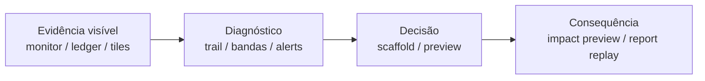

# TEC.WMS — RC14 Premium Operational Intelligence Master Plan

**Programme:** Collège de la Concorde — TEC.LOG / TEC.WMS  
**Plateforme:** Railway  
**Contexte:** RC13 operacionalmente estabilizado — RC14 é elevação de qualidade, não correção de bugs  
**Date:** 2026-06-18  
**Sources consolidadas:**

- `RC14_M3_PREMIUM_INTELLIGENCE_AUDIT.md` (SCN-009 → SCN-011)
- `RC14_M4_PREMIUM_INTELLIGENCE_AUDIT.md` (SCN-012 → SCN-014)
- `RC14_M5_PREMIUM_INTELLIGENCE_AUDIT.md` (SCN-015 → SCN-017)

**Mode:** Plano executivo — nenhuma implementação, código, banco, certificação ou deploy incluídos neste documento.

---

## 1. Executive Summary

RC13 entregou um runtime **funcional e certificável** em Railway: Cohorte Fondatrice, Silver Registry/Transition, autenticação, Mission Control, cenários M1–M5 executáveis. RC14 não corrige bloqueadores — eleva a **Operational Intelligence Layer** para que o cockpit **prove melhor a Fiche Mission**, sem alterá-la.

Os três audits M3/M4/M5 convergem num diagnóstico único:

| Módulo | Verdict Premium Intelligence | Natureza do gap |
|--------|------------------------------|-----------------|
| **M3** | YELLOW | Shell M1/M2 completo; falta profundidade operacional por cenário (monitor causal, overlays Min/Max, coerência Fiche) |
| **M4** | YELLOW | KPI logicamente correto; **monitor vazio** e torre KPI estática geram sensação de cockpit morto |
| **M5** | YELLOW (SCN-017 cockpit: RED) | Ops→KPI enforceado no servidor; **ledger KPI invisível no cockpit**, torre estática mascara moniteur, capstone sem consequência simulada |

**Padrão ouro de referência:** M1/M2 (cockpit transacional) para M3; M5 (ancoragem ops→KPI snapshot) como ponte para M4; M1/M2 + M4 Annexe A como alvo para M5.

**Recomendação executiva RC14:**

1. **Wave 1 (obrigatória antes da Cohorte 2):** Eliminar sensação de monitor/cockpit vazio e lacunas P0 de coerência documental — camada display/state-surfacing apenas.
2. **Wave 2 (fortemente recomendada):** Fechar cadeia Evidência → Diagnóstico → Decisão → Consequência em M4/M5; elevar M3 a paridade operacional com M1/M2.
3. **Wave 3 (RC15):** Polish premium, testes de regressão monitor, pipeline estrutural por cenário, simulação what-if.

**O que nunca tocar:** Objetivos de missão, sequência pedagógica, competências, Bloom, thresholds (60/70), scoring, Silver/Gold logic, `validateM*Compliance`, certificação, Guide Maître como autoridade canônica.

---

## 2. Current State Assessment

### 2.1 Estado pós-RC13

| Capacidade | Status |
|------------|--------|
| Railway migration | ✓ Operacional |
| Auth (teacher/student/certification) | ✓ |
| Mission Control shell (M1–M5) | ✓ Unificado |
| OIL Panels A–F | ✓ Populados |
| Compliance engines M3/M4/M5 | ✓ Production-grade |
| M4 KPI analytics (sem ops físicas) | ✓ Correto por design |
| M5 ops→KPI snapshot (servidor) | ✓ `deriveM5KpiFromRunEvidence` |
| Premium intelligence parity M1/M2 | ✗ M3 parcial; M4/M5 desalinhados |

### 2.2 Verdict por cenário (consolidado)

| SCN | Módulo | Runtime | Premium Intelligence | Gap dominante |
|-----|--------|---------|---------------------|---------------|
| 009 | M3 | GO | YELLOW | Fiche omite ADJ em CC_RECON; monitor fraco |
| 010 | M3 | GO | **GREEN** | Referência M3 — manter |
| 011 | M3 | GO | YELLOW | CC steps friction; sem overlay Min/Max |
| 012 | M4 | GO | B | Torre estática; monitor vazio |
| 013 | M4 | GO | C+ | KPI erro 4% não interpretado em step dedicado |
| 014 | M4 | GO | C | Lead time pouco visível; mono-KPI trap |
| 015 | M5 | GO | YELLOW | KPI tour estático; ledger oculto |
| 016 | M5 | GO | YELLOW | Variance só no CC; ADJ highlight fraco |
| 017 | M5 | GO | YELLOW runtime / **RED cockpit** | Capstone sem cockpit executivo |

### 2.3 Cadeia canônica (intacta — não alterar)

```
Guide Maître
    ↓
Fiche Mission (fonte de verdade)
    ↓
Scenario Logic (rulesEngine, seed contracts)
    ↓
Runtime Experience (Mission Control + OIL + StepForm + RunReport)
```

RC14 melhora **Runtime Experience** e **Operational Evidence** — nunca inverte a hierarquia.

---

## 3. Golden Rules

### 3.1 Fiche Mission Core Structure

- Toda melhoria RC14 **documenta ou visualiza** o que a Fiche Mission já exige — não redefine objetivos, competências ou sequência.
- Quando Fiche e runtime divergem (ex.: SCN-009 ADJ), a correção RC14 é **alinhar copy Fiche/Guide**, não mudar o validator.
- ADJ dentro de CC_RECON (MI07) é contrato pedagógico M3 — **não separar em step ADJ independente**.

### 3.2 Documentation First Principle

- Lacunas P0 de coerência (SCN-009 Fiche, Guide slide 7, SCN-011 CC context) são resolvidas **primeiro** via documentação/copy antes de overlays UI.
- Instructor briefing permanece válido até Wave 1 completa; RC14 reduz dependência do instrutor, não elimina o Guide Maître.

### 3.3 No Pedagogical Regression Rule

- Nenhuma melhoria RC14 altera: pass thresholds, scoring budgets, keyword compliance gates, Gold/Silver gates, Bloom targets, ERP learning objectives.
- Display-only layers (KPI Evidence Feed, interpretation trail, band colors) **não** introduzem novos gates de bloqueio.

### 3.4 No Competency Drift Rule

- Proibido: novas competências, novos cenários, novos módulos, reescrita Fiche/Guide, importar torre KPI M4 em M3 transacional.
- Permitido: badges, anotações, trails, previews, Run Report enrichment, scaffolding estrutural **sem conteúdo de resposta**.

---

## 4. Consolidated Gap Matrix

Legenda de classificação obrigatória em cada item:

| Dimensão | Valores |
|----------|---------|
| Prioridade | **P0** coerência / bloqueio percebido · **P1** premium parity · **P2** polish / backlog |
| Impacto | **HIGH** · **MEDIUM** · **LOW** |
| Risco | **LOW** · **MEDIUM** · **HIGH** |

### 4.1 Lacunas críticas (P0) — reais, não cosméticas

| ID | Módulo | Descrição | Impacto | Risco | Categoria |
|----|--------|-----------|---------|-------|-----------|
| **G-P0-01** | M3 | SCN-009: Fiche Mission + Guide slide 7 omitem ADJ (MI07) em CC_RECON para écart −3 — validator bloqueia sem explicação canônica | HIGH | LOW | Coerência documental |
| **G-P0-02** | M3 | SCN-011: pipeline CC_LIST/COUNT/RECON obrigatório na UI sem `cycleCountTargets` — fricção não pedagógica | HIGH | LOW | Resolution path |
| **G-P0-03** | M4 | Monitor transacional permanentemente vazio — zero substituto de evidência dinâmica durante 15–20 min de run | HIGH | LOW | Monitor vazio |
| **G-P0-04** | M4 | Interpretações KPI (`kpiInterpretations`) armazenadas mas **invisíveis** no cockpit — KPI sem evidência de decisão | HIGH | LOW | KPI sem evidência |
| **G-P0-05** | M5 | `m5.kpiLedger` disponível apenas em StepForm M5_KPI — promessa ops→KPI quebrada durante 5+ steps ops | HIGH | LOW | Cockpit vazio |
| **G-P0-06** | M5 | Tour KPI OIL estático (c targets seed) substitui moniteur quando ledger vazio — KPI sem origem visual live | HIGH | LOW | KPI sem evidência |
| **G-P0-07** | M5 | SCN-017: ausência de loop decisão→consequência (mesmo simulada/pedagógica) pós M5_DECISION | HIGH | MEDIUM | Decisão sem consequência |

### 4.2 Lacunas premium (P1) — impacto operacional significativo

| ID | Módulo | Descrição | Impacto | Risco |
|----|--------|-----------|---------|-------|
| G-P1-01 | M3 | Sem overlay Min/Max / below-Min na grid (SCN-011) | HIGH | LOW |
| G-P1-02 | M3 | Monitor SCN-009 receipt-only — cadeia causal fraca | MEDIUM | LOW |
| G-P1-03 | M3 | ADJ estudante não destacado no monitor | MEDIUM | LOW |
| G-P1-04 | M3 | REPLENISH auto-completado invisível (009/010) — Panel F incoerente | MEDIUM | LOW |
| G-P1-05 | M3 | SCN-009 decision support fino (sem alternativeActions) | MEDIUM | LOW |
| G-P1-06 | M3 | KPIs contextuais ausentes (accuracy %, variance %) no performance block | MEDIUM | LOW |
| G-P1-07 | M4 | KPI tiles + bandas Annexe A na torre (prosa only hoje) | HIGH | LOW |
| G-P1-08 | M4 | KPI Evidence Feed display-only no monitor (extractos SAP simulados) | HIGH | LOW |
| G-P1-09 | M4 | Alerta amber soft quando interpretação `isCorrect === false` | MEDIUM | LOW |
| G-P1-10 | M4 | SCN-013: classificação erro 4% alongside OTIF 95% no step KPI_SERVICE | HIGH | LOW |
| G-P1-11 | M4 | SCN-014: lead time 3.5d visível antes KPI_DIAGNOSTIC | HIGH | LOW |
| G-P1-12 | M4 | Run Report: header snapshot KPI canônico acima interpretações | MEDIUM | LOW |
| G-P1-13 | M4 | SCN-specific `varianceSignal` na torre (complacency, green trap, mono-KPI) | MEDIUM | LOW |
| G-P1-14 | M5 | `showTxTable` false esconde moniteur OIL no arranque | HIGH | LOW |
| G-P1-15 | M5 | Annexe A bandas KPI ausente em OIL M5 | MEDIUM | LOW |
| G-P1-16 | M5 | Scaffold estrutural board SCN-017 em eval (forma, não conteúdo) | HIGH | LOW |
| G-P1-17 | M5 | `transactionTimeline` / `zoneFlow` calculados servidor — não renderizados Run Report | MEDIUM | LOW |
| G-P1-18 | M5 | Replay decisão + feedback rubrique no Run Report | HIGH | LOW |
| G-P1-19 | M5 | Checklist gates M5 na compliance UI (variance, snapshot, decision) | MEDIUM | LOW |
| G-P1-20 | M5 | Timeline causal ops no cockpit; highlight pós-ADJ SCN-016 | MEDIUM | LOW |
| G-P1-21 | M5 | Formulas KPI (2400÷400) ancoradas visualmente ao ledger | MEDIUM | LOW |
| G-P1-22 | M5 | Service/erreurs/délai: derivar OU rotular explicitamente como « KPI contextuels contrat seed » | HIGH | MEDIUM |

### 4.3 Lacunas cosméticas / backlog (P2)

| ID | Módulo | Descrição | Impacto | Risco |
|----|--------|-----------|---------|-------|
| G-P2-01 | M3 | `m3.monitor.test.ts` ausente | LOW | LOW |
| G-P2-02 | M3 | `M3_DECISION_SCAFFOLD` demo/eval gated | LOW | LOW |
| G-P2-03 | M3 | Pipeline MODULE3_STEPS por cenário (refactor estrutural) | LOW | HIGH |
| G-P2-04 | M3 | Quiz EOQ vs eval Min/Max SCN-011 | LOW | LOW |
| G-P2-05 | M4 | Slide 4-1 OTIF 92% → 95% canônico | LOW | LOW |
| G-P2-06 | M4 | Step KPI_ERROR_RATE dedicado | MEDIUM | MEDIUM |
| G-P2-07 | M4 | M4_KPI snapshot step (forma M5 sem ledger) | MEDIUM | MEDIUM |
| G-P2-08 | M5 | Label « Module 4 » no tour M5 | LOW | LOW |
| G-P2-09 | M5 | Copy « décision stratégique » SCN-015 tactical | LOW | LOW |
| G-P2-10 | M5 | M5_DECISION maxPoints 30 vs scorer 80 no RunReport | LOW | LOW |
| G-P2-11 | M5 | Narrative Peak Week J1/J2/J3 no cockpit | LOW | LOW |
| G-P2-12 | M5 | Rôle Directeur Logistique não materializado SCN-017 | LOW | LOW |

### 4.4 Matriz cruzada por taxonomia de gap (mandato)

| Categoria de gap | M3 | M4 | M5 | Prioridade máxima |
|------------------|----|----|-----|-------------------|
| Monitor vazio | △ SCN-009 thin | **CRÍTICO** (design) | △ arranque + OIL mask | P0/P1 |
| Cockpit vazio | △ overlays | **CRÍTICO** (torre estática) | **CRÍTICO** (ledger oculto) | P0 |
| KPI sem evidência | △ score only | **CRÍTICO** | **CRÍTICO** (seed vs run) | P0 |
| Decisão sem consequência | △ static consequences | △ toast only | **CRÍTICO** SCN-017 | P0/P1 |
| Causalidade operacional | SCN-010 ✓ | N/A (analítico) | △ pós-GR OK | P1 |
| Coerência Fiche/Guide | **P0** SCN-009 | ✓ | △ SCN-015 copy | P0 |
| Histórico operacional | flat table | interpretation hidden | timeline server dead | P1/P2 |

---

## 5. Wave 1 — Mandatory Before Cohorte 2

**Objetivo:** Eliminar sensação de monitor vazio, cockpit vazio, KPI sem evidência, e lacunas P0 de coerência documental.

**Escopo:** Display/state-surfacing + copy Fiche/Guide — **sem** alterar rulesEngine gates, scoring ou certificação.

| # | Item | Módulo | Impacto | Risco | Esforço |
|---|------|--------|---------|-------|---------|
| W1-01 | Alinhar Fiche SCN-009 + Guide slide 7: ADJ MI07 em CC_RECON explícito | M3 | HIGH | LOW | S |
| W1-02 | SCN-011: next-action Mission Control + Panel F explicando CC confirmatório / REPLENISH foco | M3 | HIGH | LOW | S |
| W1-03 | KPI tiles + bandas Annexe A (valores canônicos estáticos, cores dinâmicas) em OIL Panel B | M4 | HIGH | LOW | S |
| W1-04 | Interpretation trail chips (rotation/service/diagnostic) de `runs.state` sob torre M4 | M4 | HIGH | LOW | S |
| W1-05 | Alerta amber Panel B quando última interpretação incorreta | M4 | MEDIUM | LOW | S |
| W1-06 | SCN-013 copy KPI_SERVICE: exigir classificação 4% erros + 95% OTIF | M4 | HIGH | LOW | S |
| W1-07 | SCN-014 hints: lead time 3.5d visível em KPI_DIAGNOSTIC | M4 | HIGH | LOW | S |
| W1-08 | Run Report M4: header snapshot KPI canônico | M4 | MEDIUM | LOW | S |
| W1-09 | Widget « Ledger M5 » live no Mission Control alimentado por `m5.kpiLedger` | M5 | HIGH | LOW | M |
| W1-10 | Tour KPI M5: valores derivados do run OU fallback moniteur até primeira tx | M5 | HIGH | LOW | M |
| W1-11 | Corrigir `showTxTable`: nunca esconder moniteur OIL M5 quando ledger vazio | M5 | HIGH | LOW | S |
| W1-12 | Rotular KPI service/erreurs/délai como « contexte contrat Peak Week » até derivação ops (G-P1-22) | M5 | HIGH | LOW | S |

**Resultado esperado Wave 1:**

- M3: instrutor pode largar SCN-009/011 com copy canônica alinhada ao validator.
- M4: torre KPI **parece viva**; interpretações visíveis; monitor deixa de ser silêncio total (trail + tiles).
- M5: estudante vê ledger evoluir no cockpit desde M5_RECEPTION; moniteur nunca substituído por torre morta.

---

## 6. Wave 2 — Premium Operational Intelligence

**Objetivo:** Conectar **Evidência → Diagnóstico → Decisão → Consequência** sem alterar lógica pedagógica.

| # | Item | Módulo | Cadeia | Impacto | Risco | Esforço |
|---|------|--------|--------|---------|-------|---------|
| W2-01 | KPI Evidence Feed display-only no monitor M4 (rows step-gated: MB52, VL06O, QM) | M4 | Evidência | HIGH | LOW | M |
| W2-02 | Decision preview COMPLIANCE_M4 (diagnostic + checklist keywords) | M4 | Diagnóstico→Decisão | MEDIUM | LOW | S |
| W2-03 | SCN-specific varianceSignal blocks na torre M4 | M4 | Diagnóstico | MEDIUM | LOW | S |
| W2-04 | StepForm objectives diferenciados por SCN code M4 | M4 | Diagnóstico | MEDIUM | LOW | M |
| W2-05 | Teacher MonitorDashboard: coluna interpretações M4 | M4 | Evidência | MEDIUM | LOW | M |
| W2-06 | M3 Panel B badges: variance threshold (010), below mark/projects below-Min (011), accuracy % (009/010) | M3 | Evidência | HIGH | LOW | M |
| W2-07 | Monitor M3: highlight txs estudante + anotações causais inline SCN-010/011 | M3 | Evidência | MEDIUM | LOW | M |
| W2-08 | Panel F M3: anotação REPLENISH auto-completado | M3 | Consequência | MEDIUM | LOW | S |
| W2-09 | SCN-009 alternativeActions + wrongActionConsequences expandidos | M3 | Decisão | MEDIUM | LOW | S |
| W2-10 | Annexe A bandas KPI expostas OIL M5 | M5 | Diagnóstico | MEDIUM | LOW | S |
| W2-11 | Scaffold board estrutural eval SCN-017 (Situation/Preuve/Arbitrage/Recommandation/Horizon — vazio) | M5 | Decisão | HIGH | LOW | M |
| W2-12 | Compliance checklist M5 (variance gate, snapshot, decision linked) | M5 | Diagnóstico | MEDIUM | LOW | M |
| W2-13 | Timeline causal ops no cockpit M5 | M5 | Evidência | MEDIUM | LOW | M |
| W2-14 | Run Report: transactionTimeline + zoneFlow + replay decisão + feedback rubrique | M5 | Consequência | HIGH | LOW | M |
| W2-15 | Impact preview pós M5_DECISION (simulado, não scored): 1–2 KPI suivi projetados | M5 | Consequência | HIGH | MEDIUM | M |
| W2-16 | SCN-016 highlight antes/après ADJ no moniteur + grid | M5 | Evidência→Consequência | MEDIUM | LOW | S |
| W2-17 | Formulas KPI ancoradas às linhas ledger (2400÷400, etc.) | M5 | Evidência→Diagnóstico | MEDIUM | LOW | M |
| W2-18 | Exemplars forma R1/R2 (rejeitados) em eval SCN-017 — demo/instructor A1–A3 | M5 | Decisão | MEDIUM | LOW | S |

**Cadeia alvo pós-Wave 2:**



---

## 7. Wave 3 — Future Enhancements (RC15+)

**Objetivo:** Elevar experiência premium sem alterar lógica pedagógica.

| # | Item | Módulo | Impacto | Risco | Esforço |
|---|------|--------|---------|-------|---------|
| W3-01 | `m3.monitor.test.ts` alinhamento ledger | M3 | LOW | LOW | M |
| W3-02 | `M3_DECISION_SCAFFOLD` demo/eval gated | M3 | LOW | LOW | M |
| W3-03 | Per-scenario MODULE3_STEPS variants | M3 | MEDIUM | HIGH | L |
| W3-04 | M4 step KPI_ERROR_RATE dedicado | M4 | MEDIUM | MEDIUM | L |
| W3-05 | M4_KPI snapshot step display-only (forma M5) | M4 | MEDIUM | MEDIUM | M |
| W3-06 | M4 what-if impact hints display-only | M4 | MEDIUM | LOW | M |
| W3-07 | M4 mid-run compliance preview (simulate messages) | M4 | MEDIUM | MEDIUM | M |
| W3-08 | Derivação ops real service/erreurs/délai M5 (se pedagogicamente justificável) | M5 | HIGH | HIGH | L |
| W3-09 | Peak Week narrative J1/J2/J3 cross-SCN | M5 | LOW | LOW | S |
| W3-10 | Full ops→KPI mini-simulation M4 (convergência arquitetural) | M4 | HIGH | HIGH | XL |

---

## 8. Implementation Priority Matrix

### 8.1 HIGH IMPACT · LOW EFFORT · LOW RISK (executar primeiro)

| Item | Wave | Módulo |
|------|------|--------|
| W1-01 SCN-009 Fiche/Guide ADJ | 1 | M3 |
| W1-03 KPI tiles Annexe A | 1 | M4 |
| W1-04 Interpretation trail M4 | 1 | M4 |
| W1-06 SCN-013 error rate copy | 1 | M4 |
| W1-07 SCN-014 lead time hints | 1 | M4 |
| W1-11 showTxTable fix M5 | 1 | M5 |
| W2-08 Panel F REPLENISH annotation | 2 | M3 |
| W2-03 varianceSignal M4 | 2 | M4 |
| W2-10 Annexe A M5 | 2 | M5 |

### 8.2 HIGH IMPACT · MEDIUM EFFORT · LOW–MEDIUM RISK

| Item | Wave | Módulo |
|------|------|--------|
| W1-09 Ledger widget Mission Control | 1 | M5 |
| W1-10 Tour KPI live M5 | 1 | M5 |
| W2-01 KPI Evidence Feed M4 | 2 | M4 |
| W2-06 M3 operational badges | 2 | M3 |
| W2-11 Board scaffold SCN-017 | 2 | M5 |
| W2-14 Run Report executive M5 | 2 | M5 |
| W2-15 Impact preview SCN-017 | 2 | M5 |

### 8.3 MEDIUM IMPACT · LOW EFFORT

| Item | Wave | Módulo |
|------|------|--------|
| W1-02 SCN-011 CC context | 1 | M3 |
| W1-05 Amber alert M4 | 1 | M4 |
| W1-08 Run Report snapshot header M4 | 1 | M4 |
| W2-02 Decision preview M4 | 2 | M4 |
| W2-16 SCN-016 ADJ highlight | 2 | M5 |
| G-P2-05 Fix slide OTIF | 3 | M4 |
| G-P2-08 Label Module 4 M5 | 3 | M5 |

### 8.4 LOW IMPACT · ou HIGH RISK — adiar RC15

| Item | Razão adiar |
|------|-------------|
| W3-03 Per-scenario M3 pipeline | HIGH RISK refactor estrutural |
| W3-10 M4 ops mini-simulation | HIGH RISK — fora escopo RC14 |
| W3-08 Derivação KPI service/erreurs M5 | HIGH RISK se alterar contrato seed |
| G-P2-04 Quiz EOQ | LOW IMPACT copy |
| G-P2-10 RunReport maxPoints | LOW IMPACT display |

---

## 9. Risk Analysis

### 9.1 O que pode quebrar?

| Risco | Módulo | Mitigação |
|-------|--------|-----------|
| Alterar `showTxTable` revela moniteur vazio sem pedagogy hint | M5 | Manter `emptyStockNote` + hint SCN; nunca remover torre — **adicionar** ledger live |
| KPI Evidence Feed M4 confundido com txs reais | M4 | Label explícito « Extract analytique (display-only) » |
| Widget ledger M5 mostra valores « errados » early-run | M5 | Mostrar campos derivados com estado « partial » até CC/ADJ |
| Copy Fiche SCN-009 revela demais a resposta | M3 | Documentar processo MI07, não quantidade física |
| Impact preview SCN-017 interpretado como scoring | M5 | Banner « simulation pédagogique — non notée » |

### 9.2 O que pode gerar regressão pedagógica?

| Ação proibida | Regressão |
|---------------|-----------|
| Importar torre KPI M4 em M3 | Confunde execução transacional com analytics |
| Novo gate mid-run M4 bloqueando steps | Altera certification path |
| Expor A1–A3 decisões exemplares em eval SCN-017 | Viola princípio « form not content » |
| Separar ADJ de CC_RECON em M3 | Quebra alinhamento SAP MI07 + validator |
| Dynamic KPI recalculation M4 | Altera scoring/compliance implicitamente |
| Remover auto-complete REPLENISH M3 | Muda outcome SCN-009/010 |

### 9.3 O que jamais deve ser tocado

| Domínio | Itens intocáveis |
|---------|------------------|
| **Pedagogia** | Objetivos missão, sequência resolução, competências, Bloom, caminho M1→M5, Guide Maître philosophy |
| **Certificação** | Thresholds 60/70, Silver/Gold logic, scoring budgets, keyword compliance rules |
| **Runtime gates** | `validateM3Compliance`, `validateM4Compliance`, `validateM5Compliance`, `assertM5VarianceGate`, `scoreM5StrategicDecision` |
| **Scenario logic** | Seed contracts, `CANONICAL_M4_KPI_DATA`, preloaded transactions design, MODULE3_STEPS structure (RC14) |
| **Contratos dados** | Schema DB, `inventory_counts`, `kpi_snapshots`, competency map |
| **Referências ouro** | SCN-010 M3, SCN-010 M1/M2 patterns, M5 server-side snapshot persistence |

---

## 10. Expected Student Experience Improvements

### 10.1 M3 — Inventaire avancé (SCN-009 → 011)

| Aspecto | Antes RC14 | Depois RC14 (Wave 1+2) |
|---------|------------|------------------------|
| SCN-009 ADJ | Validator bloqueia; Fiche silencioso | Fiche/Guide explicam MI07 em CC_RECON |
| SCN-011 CC steps | Fricção « passos fantasma » | Mission Control declara CC confirmatório; foco REPLENISH |
| Monitor | SCN-009 receipt-only; ADJ invisível | Causal hints; highlight txs estudante |
| Grid inventário | Números sem status Min/Max | Badges BELOW_MIN, VARIANCE_OPEN |
| Decisão | SCN-009 mínimo | alternativeActions nível M2 |
| Sensação geral | « Funciona mas não parece WMS vivo » | « Cockpit transacional M1/M2 parity » |

### 10.2 M4 — Indicateurs performance (SCN-012 → 014)

| Aspecto | Antes RC14 | Depois RC14 (Wave 1+2) |
|---------|------------|------------------------|
| Monitor | Vazio 100% do run | Evidence Feed populado por step |
| Torre KPI | Prosa estática | Tiles coloridos Annexe A + trail interpretações |
| Interpretação errada | Toast efémero | Amber alert persistente Panel B |
| SCN-013 | OTIF sem erro 4% no step | Dual KPI correlation explícita |
| SCN-014 | Lead time escondido | Visível em KPI_DIAGNOSTIC |
| Decisão | Texto → gate final | Preview diagnostic + checklist antes compliance |
| Run Report | Q&A interpretações | Snapshot header + interpretações |
| Sensação geral | « Monitor vazio / KPI decorativo » | « Analytical cockpit com ritmo M1/M2 » |

### 10.3 M5 — Simulation intégrée (SCN-015 → 017)

| Aspecto | Antes RC14 | Depois RC14 (Wave 1+2) |
|---------|------------|------------------------|
| Arranque cockpit | Torre estática esconde moniteur | Moniteur visível; ledger live widget |
| Durante ops | KPI invisível até M5_KPI step | Ledger evolui stock/rotation/capital live |
| KPI service/erreurs | Parecem decorativos | Rotulados como contexte contrat OU derivados |
| SCN-016 ADJ | Stock muda; moniteur neutro | Badge variance résolue |
| SCN-017 board | Texto livre sem estrutura eval | Scaffold forma + exemplars rejeitados |
| Pós-décision | Sem feedback consequência | Impact preview simulado + Run Report replay |
| Sensação geral | « Formulário sequencial » | « Cockpit exécutif Peak Week » |

---

## 11. Cohorte 2 Readiness Assessment

### 11.1 Wave 1 é suficiente?

**Sim, condicionalmente** — para Cohorte 2 com instrutor presente:

- Wave 1 resolve **P0 documental M3**, **sensação monitor vazio M4** (tiles + trail), e **ledger oculto M5**.
- Estudantes deixam de interpretar cockpit vazio como bug.
- SCN-010 M3 e SCN-012 M4 já funcionam com briefing mínimo.

**Não suficiente** para eval autônoma Gold-path em SCN-013/014/017 sem Wave 2 parcial.

### 11.2 Wave 2 é recomendada?

**Sim, fortemente recomendada** antes de sessões M4/M5 unattended ou certificação Gold ampliada:

| Cenário | Wave 1 alone | Wave 1 + Wave 2 |
|---------|--------------|-----------------|
| SCN-013 M4 | B | B+ |
| SCN-014 M4 | B− | B+ |
| SCN-017 M5 | YELLOW cockpit | YELLOW→GREEN cockpit |
| SCN-009 M3 | Coerente | Premium parity |
| SCN-011 M3 | Menos fricção | Full operational overlay |

**Prioridade Wave 2 pré-Cohorte 2 se calendar permitir:** W2-01 (Evidence Feed M4), W2-11 (board scaffold 017), W2-14 (Run Report M5).

### 11.3 Wave 3 é opcional?

**Sim — RC15.** Inclui refactors estruturais, derivação KPI avançada, testes monitor M3, convergência arquitetural M4→M5 ops simulation.

---

## 12. Final Executive Recommendation

### 12.1 Respostas obrigatórias consolidadas

#### 1. Quais lacunas são realmente críticas?

- **M3 P0:** SCN-009 Fiche/Guide omitem ADJ CC_RECON; SCN-011 CC pipeline friction.
- **M4 P0:** Monitor vazio sem substituto; interpretações KPI invisíveis no cockpit.
- **M5 P0:** Ledger KPI oculto no Mission Control; torre estática mascara moniteur; SCN-017 sem consequência pós-decisão.

#### 2. Quais lacunas são apenas cosméticas?

- Label « Module 4 » tour M5 (G-P2-08).
- Slide OTIF 92% vs 95% (G-P2-05).
- Peak Week J1/J2/J3 narrative (G-P2-11).
- RunReport maxPoints display 30 vs 80 (G-P2-10).
- Quiz EOQ vs Min/Max eval (G-P2-04).
- Rôle Directeur UI label SCN-017 (G-P2-12).

#### 3. Quais melhorias geram maior impacto pedagógico?

| Rank | Melhoria | Módulo | Porquê |
|------|----------|--------|--------|
| 1 | Fiche SCN-009 ADJ alignment | M3 | Elimina blocker inexplicado — coerência canônica |
| 2 | Interpretation trail + amber alerts M4 | M4 | Feedback imediato sobre classificação KPI |
| 3 | Ledger live cockpit M5 | M5 | Prova ops→KPI prometida no Guide Maître |
| 4 | Board scaffold estrutural SCN-017 | M5 | Autonomia capstone sem revelar conteúdo |
| 5 | KPI Evidence Feed M4 | M4 | Evidência antes de interpretação — BRIDGE « R » |

#### 4. Quais melhorias geram maior impacto operacional?

| Rank | Melhoria | Módulo |
|------|----------|--------|
| 1 | KPI Evidence Feed monitor M4 | M4 |
| 2 | Widget `m5.kpiLedger` Mission Control | M5 |
| 3 | M3 operational badges Panel B | M3 |
| 4 | Teacher MonitorDashboard M4 column | M4 |
| 5 | Run Report executive replay M5 | M5 |

#### 5. Quais melhorias aumentam a autonomia do aluno?

- M3: SCN-009 copy ADJ; SCN-011 CC context; SCN-009 alternativeActions (Wave 2).
- M4: Annexe A tiles; SCN-013 dual KPI step copy; decision preview COMPLIANCE_M4.
- M5: Ledger live + formulas; board scaffold eval; checklist gates M5; exemplars R1/R2 forma; impact preview.

#### 6.1. Quais melhorias reforçam a lógica do Guide Maître?

- Alinhar Fiche/Guide com MI07 ADJ (M3) — Guide slide 7 completude.
- Expor Annexe A bandas (M4/M5) — Guide Annexe A referenciada in-app.
- Materializar BRIDGE **R** (evidence before action) via monitor/ledger visível.
- SCN-017 scaffold « Situation/Preuve/Arbitrage » — espelha Guide capstone structure.
- De-emphasize ROP vs Min/Max eval SCN-011 — alinha Guide slide 6/7 com gate eval.

#### 7. Quais melhorias reduzem sensação de monitor vazio / cockpit vazio / KPI sem evidência / decisão sem consequência?

| Sensação | Wave 1 | Wave 2 |
|----------|--------|--------|
| Monitor vazio | M4 tiles+trail; M5 showTxTable fix | M4 Evidence Feed; M3 causal annotations |
| Cockpit vazio | M5 ledger widget | M3 badges; M5 timeline |
| KPI sem evidência | M4 Annexe A tiles; M5 ledger live | M5 formulas; M4 trail chips |
| Decisão sem consequência | M4 amber alerts | M5 impact preview; Run Report replay |

#### 8. O que implementar antes da Cohorte 2?

**Wave 1 completa (W1-01 → W1-12)** — estimativa: 1 sprint UI/copy, zero backend rule changes.

#### 9. O que pode ficar para RC15?

- Wave 3 integral.
- `m3.monitor.test.ts`, per-scenario MODULE3_STEPS, M4_KPI snapshot step.
- Derivação ops service/erreurs/délai M5 (se aprovada pedagogicamente).
- M4 ops mini-simulation arquitetural.

#### 10. O que NÃO alterar sob nenhuma circunstância?

Ver secção 9.3 — resumo: objetivos missão, sequência, competências, Bloom, thresholds, scoring, Silver/Gold, validators, seed contracts, schema DB, paradigma M3 transacional (sem torre KPI M4), ADJ-in-CC_RECON, auto-complete REPLENISH logic.

---

### 12.2 O que fazer primeiro

```
Semana 1–2 (Wave 1)
├── M3: W1-01, W1-02 (copy Fiche/Guide + SCN-011 context)
├── M4: W1-03 → W1-08 (tiles, trail, alerts, copy SCN-013/014, report header)
└── M5: W1-09 → W1-12 (ledger widget, tour live, showTxTable, KPI context labels)
```

### 12.3 O que fazer dep. depois

```
Semana 3–5 (Wave 2)
├── M4: Evidence Feed + decision preview + varianceSignal + teacher column
├── M3: operational badges + monitor highlights + SCN-009 decision depth
└── M5: board scaffold + compliance checklist + Run Report executive + impact preview
```

### 12.4 O que nunca fazer

- Reescrever Fiches Mission ou Guide Maître.
- Introduzir novos cenários, módulos ou competências.
- Alterar scoring, thresholds, certification gates ou compliance validators.
- Converter M3 em modo analítico KPI ou M4 em simulação ops física (RC14).
- Expor conteúdo de resposta capstone (A1–A3) em eval.
- Refactor pipeline MODULE3_STEPS sem aprovação RC15 explícita.

---

## Appendix A — Consolidated Item Register (Quick Reference)

| ID | Item | P | Impact | Risk | Wave |
|----|------|---|--------|------|------|
| G-P0-01 | SCN-009 Fiche/Guide ADJ | P0 | HIGH | LOW | 1 |
| G-P0-02 | SCN-011 CC friction | P0 | HIGH | LOW | 1 |
| G-P0-03 | M4 monitor vazio | P0 | HIGH | LOW | 1–2 |
| G-P0-04 | M4 interpretations hidden | P0 | HIGH | LOW | 1 |
| G-P0-05 | M5 ledger oculto cockpit | P0 | HIGH | LOW | 1 |
| G-P0-06 | M5 torre estática | P0 | HIGH | LOW | 1 |
| G-P0-07 | M5 decisão sem consequência | P0 | HIGH | MED | 2 |
| G-P1-07 | M4 KPI tiles Annexe A | P1 | HIGH | LOW | 1 |
| G-P1-08 | M4 Evidence Feed | P1 | HIGH | LOW | 2 |
| G-P1-14 | M5 showTxTable | P1 | HIGH | LOW | 1 |
| G-P1-16 | M5 board scaffold eval | P1 | HIGH | LOW | 2 |
| G-P1-18 | M5 Run Report replay | P1 | HIGH | LOW | 2 |

---

## Appendix B — Cross-Module Intelligence Comparison (Post-RC14 Target)

| Capacidade | M1/M2 | M3 target | M4 target | M5 target |
|------------|:-----:|:---------:|:---------:|:---------:|
| Live monitor evidence | ✓✓ | ✓✓ | ✓ (analytical feed) | ✓✓ |
| KPI contextual display | — | △ badges | ✓✓ tiles | ✓✓ ledger |
| Causal chain visible | ✓✓ | ✓ (010 gold) | ✓ trail | ✓ timeline |
| Decision scaffolding | ✓ | ✓ | ✓ | ✓ board forma |
| Consequence feedback | ✓ stock | ✓ ADJ visible | ✓ alerts | ✓ impact preview |
| Fiche coherence | ✓ | ✓ (009 fixed) | ✓ | ✓ |
| Premium verdict | GOLD | GREEN | GREEN | GREEN |

---

*Documento produzido por consolidação read-only dos audits RC14 M3/M4/M5. Nenhum código, banco, certificação ou deploy alterado. RC14 permanece um programa de elevação de qualidade operacional alinhado à Fiche Mission como fonte de verdade canônica.*
