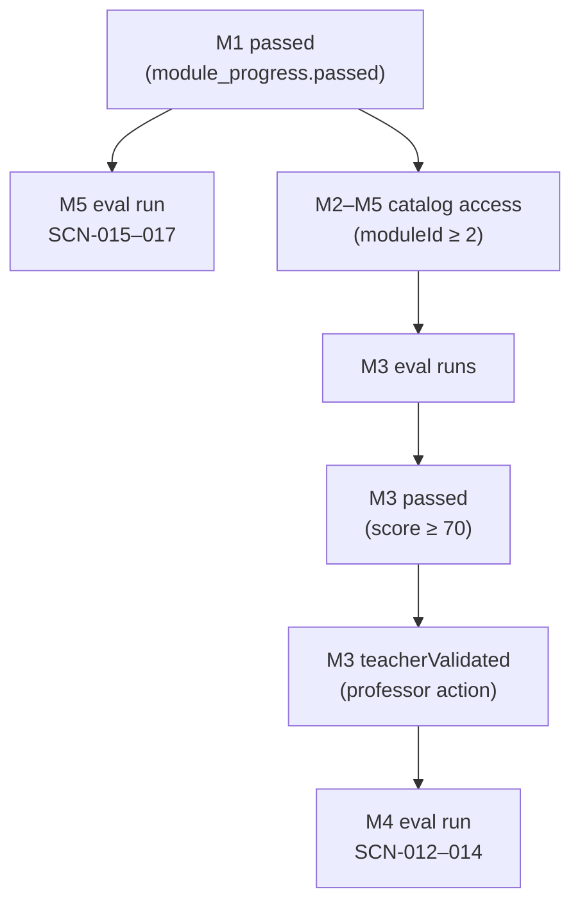

# TEC.WMS — S10 / S11 Execution Ready Report

**Programme:** TEC.WMS · TEC.LOG  
**Repository:** `tec-wms-simulator-production`  
**Branch:** `production-hotfix-rc13-pedagogy-class6`  
**HEAD:** `466b128` (2026-06-17)  
**Document type:** Preparation audit only — no code changes, no scoring changes, no certification changes, no scenario execution  
**Date:** 2026-06-17  
**Objective:** Prepare future execution of live smokes **S-10** (Class 9 / M4) and **S-11** (Class 10 / M5)

---

## Executive Summary

| Smoke | Module | Scenarios | Overall readiness |
|-------|--------|-----------|-------------------|
| **S-10** | M4 — KPI Control Tower | SCN-012, SCN-013, SCN-014 | **YELLOW** |
| **S-11** | M5 — Integrated Peak Week | SCN-015, SCN-016, SCN-017 | **YELLOW** |

**Interpretation:** Implementation, seed contracts, pedagogical layers, and automated tests are **complete**. Execution is blocked today by **account progression** (fresh Cohorte Fondatrice accounts) and by the absence of a **green live E2E smoke** on Railway. No structural RED defects were found in code or catalog data.

| Scenario | Verdict | One-line rationale |
|----------|---------|-------------------|
| SCN-012 | **YELLOW** | Code/seed ready; live S-10-A not run; M1 + M3 teacher gates block fresh accounts |
| SCN-013 | **YELLOW** | Same as SCN-012; keyword compliance slightly sensitive |
| SCN-014 | **YELLOW** | Same as SCN-012; strictest M4 capstone gate (≥3 KPI, trade-off, ≥150 chars) |
| SCN-015 | **YELLOW** | Local Wave 4 PASS; Railway blocked by M1 gate; S-11-A not run live |
| SCN-016 | **YELLOW** | Variance/ADJ gates verified locally; Railway blocked; negative-gate checks pending live |
| SCN-017 | **YELLOW** | Strategic capstone gates verified locally; RunReport step-% UX risk; live gates unchecked |

**Verdict scale**

| Color | Meaning (execution readiness) |
|-------|----------------------------|
| **GREEN** | Execute now — prerequisites satisfied, live smoke PASS recorded |
| **YELLOW** | Execute after documented prerequisites — implementation ready, operator/student/professor actions pending |
| **RED** | Cannot execute — missing catalog, broken endpoint, or seed contract absent |

---

## 1. Scope and Smoke Mapping

| Session | Smoke ID | Class | Route hub | Scenarios | Pass threshold |
|---------|----------|-------|-----------|-----------|----------------|
| Class 9 | **S-10** | M4 | `/student/module4` | SCN-012 → SCN-013 → SCN-014 | ≥ **70/100** each (perfect eval max **75/100**) |
| Class 10 | **S-11** | M5 | `/student/module5` | SCN-015 → SCN-016 → SCN-017 | ≥ **70/100** each (perfect eval max **100/100**) |

**Authoritative checklists:** `Documentation/RC13_FINAL_SMOKE_EXECUTION_GUIDE.md` (S-10-A/B/C, S-11-A/B/C)

**Static validation baselines:** `Documentation/RC13_M4_VALIDATION_REPORT.md`, `Documentation/RC13_M5_VALIDATION_REPORT.md`

**Latest Railway probe:** `Documentation/RC13_COHORTE_EXECUTION_REPORT.md` (2026-06-18) — catalog OK, launch blocked by progression

---

## 2. Progression Dependency Chain

### 2.1 Server gates (`runs.start`, eval mode, role = student)



| Gate | Enforced where | Condition | Error message (FR) |
|------|----------------|-----------|-------------------|
| **G-M1** | `server/routers.ts` · `runs.start` | `moduleId >= 2` and M1 ∉ `passedModuleIds` | *Module 2 verrouillé — complétez le Module 1 d'abord.* |
| **G-M3-TV** | `server/routers.ts` · `runs.start` | `moduleId === 4` and `!isModule3Unlocked(m3Progress)` | *Module 4 verrouillé — validation enseignant du Module 3 requise.* |
| **G-M5** | None at `runs.start` for M5 | M1 pass only (same as G-M1) | — |

**Important nuance:** `isModule3Unlocked()` reads the **Module 3** progress row (`passed && teacherValidated`). M2 pass is **not** a server gate for M4/M5 start — only pedagogically expected.

**Module pass recording:** `RunReport.tsx` calls `warehouse.recordModulePass` when a non-demo run reaches `status = completed`. Thresholds: M1/M2 **60**, M3–M5 **70** (`shared/moduleThresholds.ts`).

**Quiz gate:** Removed from scenario access (RC12 Wave 2). Quiz ≥ 60 % remains required for **Silver/Gold certification**, not for launching eval runs.

### 2.2 UI gates (informational / blocking display only)

| Module | UI component | Student-facing behavior |
|--------|--------------|-------------------------|
| M4 | `Module4Dashboard.tsx` | Amber alert when M3 not passed or not teacher-validated; mirrors server G-M3-TV |
| M5 | `Module5SimulationPage.tsx` | Amber **advisory** if M4 not passed — **does not block** server launch |

### 2.3 What blocks execution today (Railway, Cohorte Fondatrice)

| Blocker | Affects | Evidence |
|---------|---------|----------|
| **B-01** M1 not passed on probe account | SCN-012–017 | `.manus-logs/rc13-smoke-railway-results.json` — all six scenarios `launchable: false` |
| **B-02** M3 teacher validation not done | SCN-012–014 only | Would surface after B-01 cleared (`RC13_COHORTE_EXECUTION_REPORT.md` §5) |
| **B-03** Live S-10 / S-11 never green on Railway | All six | 0/3 M4, 0/7 M5 API smoke (`RC13_COHORTE_EXECUTION_REPORT.md`) |
| **B-04** No dedicated smoke account with staged progression | Operator efficiency | Cohort students are day-zero; smoke must wait or use pre-staged account |

**Not a blocker:** Scenario catalog — 17 scenarios listed, SCN-012–017 **accessible** on Railway (IDs **12–17** on current deploy; canonical resolver also supports IDs **34–39**).

---

## 3. Module Prerequisites

### 3.1 Pedagogical pathway (institutional)

| Module | SCN range | Prerequisite (pedagogy) | Server enforced? |
|--------|-----------|-------------------------|------------------|
| M1 | SCN-001–005 | None | — |
| M2 | SCN-006–008 | M1 mastery | M1 pass (G-M1) |
| M3 | SCN-009–011 | M2 mastery | M1 pass only |
| M4 | SCN-012–014 | M3 mastery + instructor sign-off | M1 pass + M3 pass + teacher validation |
| M5 | SCN-015–017 | M4 recommended (Peak Week arc) | M1 pass only |

### 3.2 Minimum progression to unlock smoke execution

| Actor | Action | Unlocks |
|-------|--------|---------|
| **Student** | Complete ≥1 M1 eval scenario ≥60/100 and open Run Report | G-M1 (M2–M5 launch) |
| **Student** | Complete ≥1 M3 eval scenario ≥70/100 and open Run Report | M3 `passed = true` |
| **Professor** | `warehouse.validateTeacherModule` · `{ moduleId: 3, validated: true }` on student | G-M3-TV → M4 launch |
| **Operator** | Pre-stage above on dedicated smoke student **or** wait for cohort natural progression | S-10 full pipeline |
| **Student** | (M5 only) M1 pass sufficient at server level | S-11 launch after G-M1 |

**Recommended for Class 9/10 fidelity:** Students complete M1 → M2 → M3 before S-10; complete S-10 before S-11 pedagogically (012/013 lenses feed 014 capstone; M4 KPI bands feed M5 ledger).

---

## 4. Pedagogical Gates (per scenario)

### 4.1 M4 — shared step pipeline

`KPI_DATA → KPI_ROTATION → KPI_SERVICE → KPI_DIAGNOSTIC → COMPLIANCE_M4`

**Shared KPI seed (Annexe A):** rotation 6×, service 95 %, errors 4 %, lead time 3,5 j, stock value $48 000 — from `server/seed.ts` / `CANONICAL_M4_KPI_DATA`.

| SCN | Pedagogical focus | Compliance gate highlights | Instructor slides |
|-----|-------------------|---------------------------|-------------------|
| **SCN-012** | Normal 6× band — avoid complacency / blanket destock | Maintain/monitor/SKU policy; reject surstock @ 6× | M4 Slide 2 |
| **SCN-013** | Green dashboard trap — 95 % + 4 % errors | Excellent service ack; error↔picking/réception/OTIF; 90-day measurable plan | M4 Slide 3 |
| **SCN-014** | S&OP capstone — one funded initiative | ≥3 KPI domains; trade-off; ≥150 chars; lead time mention | M4 Slides 5–7 |

**Eval mode:** Decision scaffolds hidden (demo-gated) — students must apply process guidance only (`RC13_FINAL_SMOKE_EXECUTION_GUIDE.md`).

### 4.2 M5 — step pipelines

**Base (SCN-015, SCN-017):**  
`M5_RECEPTION → M5_PUTAWAY → M5_CYCLE_COUNT → M5_REPLENISH → M5_KPI → M5_DECISION → COMPLIANCE_M5` (7 steps)

**SCN-016 adds:** `M5_ADJ` after cycle count (8 steps)

**Shared ops contract:** SKU-001 · 50 u. · PO-M5-001 · REC-01 → B-01-R1-L1 · LOT-M5-A

| SCN | Profile | Runtime gates to verify in S-11 | Instructor slides |
|-----|---------|--------------------------------|-------------------|
| **SCN-015** | NOMINAL_INTEGRATED / TACTICAL | Ledger-confirmed KPI; tactical decision not rejected | M5 Slides 1–2 |
| **SCN-016** | EXCEPTION_VARIANCE | Variance −5 injected; **REPLENISH/KPI blocked pre-ADJ**; stock 45 post-ADJ | M5 Slide 3 |
| **SCN-017** | STRATEGIC_CAPSTONE | **Decision before KPI rejected**; generic answer rejected; ≥2 numeric KPIs + trade-off + 90–180 j horizon | M5 Slides 4–5 |

**Certification note (audit only — not modified):** SCN-016 adds Gold requirement `scn-016-seq` (ADJ before KPI). SCN-017 adds capstone score + KPI linkage gates. Auto-award requires `ENABLE_GOLD_UNLOCK=true`.

---

## 5. Unlock Requirements Matrix

| Requirement | SCN-012 | SCN-013 | SCN-014 | SCN-015 | SCN-016 | SCN-017 |
|-------------|:-------:|:-------:|:-------:|:-------:|:-------:|:-------:|
| M1 `module_progress.passed` | ✅ | ✅ | ✅ | ✅ | ✅ | ✅ |
| M3 `passed` | ✅ | ✅ | ✅ | — | — | — |
| M3 `teacherValidated` | ✅ | ✅ | ✅ | — | — | — |
| M4 `passed` (pedagogy) | — | — | — | ⚠️ advisory | ⚠️ advisory | ⚠️ advisory |
| Prior SCN in module (server) | — | — | — | — | — | — |
| Eval mode (`isDemo: false`) | ✅ | ✅ | ✅ | ✅ | ✅ | ✅ |
| Compliance validator enabled | M4 default on | same | same | M5 default on | same | same |

---

## 6. Data Required for Execution

### 6.1 Environment / operator checklist (Pre-Smoke Gate)

From `RC13_FINAL_SMOKE_EXECUTION_GUIDE.md` — stop if any fails:

- [ ] Target URL loads (`/` and `/login`)
- [ ] Branch `production-hotfix-rc13-pedagogy-class6` deployed
- [ ] Database seeded — M4/M5 scenarios with `m4KpiSeed` / `m5Contract` in `initialStateJson`
- [ ] Smoke student account can log in (local auth)
- [ ] Teacher account can open `/teacher/monitor`
- [ ] `ENABLE_M4_COMPLIANCE_VALIDATOR` ≠ `"false"`
- [ ] `ENABLE_M5_COMPLIANCE_VALIDATOR` ≠ `"false"`
- [ ] Fresh eval run per scenario (no demo reuse for cert checks)

**Railway URL (current):** `https://tec-wms-simulator-production-production.up.railway.app`

### 6.2 Scenario DB ID note (operator-critical)

| Source | M4 IDs | M5 IDs |
|--------|--------|--------|
| Fresh seed layout (`CANONICAL_SCENARIO_ID_BY_SCN`) | 34, 35, 36 | 37, 38, 39 |
| **Current Railway deploy** (Cohorte probe) | **12, 13, 14** | **15, 16, 17** |

Both layouts resolve correctly via `resolveScenarioScnCode()`. Smoke scripts (`.manus-logs/rc13-smoke-railway.mjs`) use **12–17**. Use the IDs returned by `scenarios.list` on the target environment — do not assume 34–39 without verification.

### 6.3 Seed contract verification (static — PASS)

| Data element | SCN | Source | Status |
|--------------|-----|--------|--------|
| `m4KpiSeed` bundle | 012–014 | `server/seed.ts` L370–424 | ✅ Defined |
| M4 scenario contexts (6×, 95 %+4 %, S&OP) | 012–014 | seed names + `initialStateJson.context` | ✅ Defined |
| `m5BaseContract` (SKU-001, 50 u., bins, lot) | 015–017 | `server/seed.ts` L460–531 | ✅ Defined |
| `varianceInjection: -5` + cycle count targets | 016 only | seed L501–504 | ✅ Defined |
| `profile: STRATEGIC_CAPSTONE` | 017 | seed L525 | ✅ Defined |
| Master SKUs / bins / replenishment params | M5 ops | seed master data | ✅ Expected on Railway |

### 6.4 Accounts for smoke execution

| Role | Purpose | Railway default / cohort |
|------|---------|------------------------|
| **Smoke student** | S-10 + S-11 eval runs | Dedicated account with staged progression **or** cohort student after M1+M3+TV |
| **Teacher** | Monitor, M3 validation, debrief | `prof@teclog.ca` (bootstrap) |
| **Local reference** | Wave 4 local PASS evidence | `alice.martin@teclog.ca` (not verified on Railway in this audit) |

**Cohorte Fondatrice probe account:** `aissatasoukeinacamara@gmail.com` — catalog OK, **launch blocked** (B-01).

---

## 7. Per-Scenario Execution Readiness

### SCN-012 — Normal Rotation / Complacency Trap

| Dimension | Status | Detail |
|-----------|--------|--------|
| Code / unit tests | ✅ | `module345.rules.test.ts` — happy path + rejection cases |
| Catalog on Railway | ✅ | ID 12 accessible |
| Launch today | ❌ | B-01 progression |
| Pedagogical gates | ✅ documented | S-10-A checklist |
| Live E2E | ⏳ | Not executed on Railway |
| **Verdict** | **YELLOW** | Ready after progression + S-10-A run |

**Student must:** Use eval mode; rotation answer must classify 6× as normal; diagnostic must recommend maintain/monitor/SKU policy.  
**Professor must:** Present M4 Slides 1–2; validate M3 before class if using fresh accounts.

---

### SCN-013 — Green Dashboard Trap

| Dimension | Status | Detail |
|-----------|--------|--------|
| Code / unit tests | ✅ | `prélèvement` term accepted post-RC13 polish |
| Catalog on Railway | ✅ | ID 13 accessible |
| Launch today | ❌ | B-01 (+ B-02 for M4) |
| Pedagogical gates | ✅ documented | S-10-B; blocks destock-as-primary-lever |
| Live E2E | ⏳ | Not executed on Railway |
| **Verdict** | **YELLOW** | Slightly higher phrasing sensitivity than SCN-012 |

---

### SCN-014 — S&OP Multi-KPI Capstone

| Dimension | Status | Detail |
|-----------|--------|--------|
| Code / unit tests | ✅ | Strictest M4 validator (≥3 domains, trade-off, ≥150 chars) |
| Catalog on Railway | ✅ | ID 14 accessible |
| Launch today | ❌ | B-01 + B-02 |
| Pedagogical gates | ✅ documented | S-10-C; integrates 012 capital + 013 execution lenses |
| Live E2E | ⏳ | Not executed on Railway |
| **Verdict** | **YELLOW** | Highest M4 live-run friction risk (text gate); run last in S-10 sequence |

---

### SCN-015 — Nominal Integrated (Peak Week Day 1)

| Dimension | Status | Detail |
|-----------|--------|--------|
| Code / unit tests | ✅ | Wave 4 V4-M1 PASS local (`runId 31`, score 100) |
| Catalog on Railway | ✅ | ID 15 accessible |
| Launch today | ❌ | B-01 only (no M4 server gate) |
| Pedagogical gates | ✅ documented | 7-step chain; ledger-confirmed KPI |
| Live E2E | ⏳ | Railway 0/7 (`rc13-m5-smoke-railway.json`) |
| **Verdict** | **YELLOW** | Strongest M5 implementation confidence; blocked by M1 only |

---

### SCN-016 — Exception Variance (Peak Week Day 2)

| Dimension | Status | Detail |
|-----------|--------|--------|
| Code / unit tests | ✅ | V4-M2–M4 variance/ADJ/block gates PASS local |
| Catalog on Railway | ✅ | ID 16 accessible |
| Launch today | ❌ | B-01 |
| Pedagogical gates | ✅ documented | Must verify negative gate live (replenish/KPI before ADJ) |
| Live E2E | ⏳ | Negative gates not confirmed on Railway |
| **Verdict** | **YELLOW** | Run S-11-B after SCN-015; explicit ADJ gate checks required |

---

### SCN-017 — Strategic Capstone (Peak Week Day 3)

| Dimension | Status | Detail |
|-----------|--------|--------|
| Code / unit tests | ✅ | V4-M5–M7 KPI/decision/compliance gates PASS local |
| Catalog on Railway | ✅ | ID 17 accessible |
| Launch today | ❌ | B-01 |
| Pedagogical gates | ✅ documented | Strategic rubric; eval scaffold demo-only |
| Known UX risk | ⚠️ P2 | RunReport M5_DECISION step % uses max 30 vs scorer max 80 — totals correct |
| Live E2E | ⏳ | Strategic negative gates not confirmed on Railway |
| **Verdict** | **YELLOW** | Critical Gold-path capstone; run last in S-11; brief students on eval requirements |

---

## 8. What Impedes Execution Today

| ID | Impediment | Owner | Scenarios | Resolution |
|----|------------|-------|-----------|------------|
| **I-01** | Fresh cohort has no M1 `module_progress.passed` | Student + system | All | Complete ≥1 M1 eval scenario ≥60; open Run Report |
| **I-02** | M3 not passed / not teacher-validated | Student + Professor | M4 only | M3 eval ≥70; professor `validateTeacherModule(3)` |
| **I-03** | No green live S-10 / S-11 on Railway | Operator | All | Execute checklists after I-01/I-02 |
| **I-04** | DB ID documentation drift (12–17 vs 34–39) | Operator | All | Query `scenarios.list` on target URL before run |
| **I-05** | SCN-014 / SCN-017 text-rubric sensitivity | Student | 014, 017 | Use reference happy-path answers from smoke guide during first live run |

**Not impeding:** Missing seed scenarios, broken routes, compliance validators disabled by default, quiz gate on scenario access.

---

## 9. Responsibilities — Student vs Professor vs Operator

### 9.1 Before Class 9 (S-10)

| Who | Must complete |
|-----|---------------|
| **Students** | M1 pathway (≥1 scenario pass ≥60); M2–M3 eval work; M3 ≥70 on at least one scenario |
| **Professor** | Validate M3 for each student (`TeacherDashboard` → validate Module 3) |
| **Operator** | Pre-Smoke Gate checklist; confirm scenario IDs on Railway; optional dedicated smoke account |

### 9.2 Before Class 10 (S-11)

| Who | Must complete |
|-----|---------------|
| **Students** | M1 pass (minimum server gate); M4 completion recommended pedagogically |
| **Professor** | M5 slides 1–5; monitor `/teacher/monitor`; debrief variance (016) and capstone (017) gates |
| **Operator** | Re-run Pre-Smoke Gate; confirm M5 validators enabled |

### 9.3 During smoke execution (operator / QA)

| Step | Action |
|------|--------|
| 1 | Log in as smoke student (eval mode only) |
| 2 | Record environment URL, branch, HEAD, scenario DB IDs |
| 3 | Execute scenario steps per S-10/S-11 guide (field-level inputs documented) |
| 4 | Verify nine dimensions per scenario (teacher steps, student steps, scoring, compliance, completion, report, OIL, KPI tower / ledger) |
| 5 | Log run IDs, scores, timestamps in sign-off tables |
| 6 | Optional: certification cross-check on same account after 6/6 PASS |

---

## 10. Correct Sequence for Final Smoke

### 10.1 Operator preparation sequence

```
1. Pre-Smoke Gate (environment, seed, accounts, validators)
2. Confirm scenario DB IDs via scenarios.list
3. Ensure smoke account: M1 passed
4. For M4 only: M3 passed + teacherValidated
5. S-10 full matrix (012 → 013 → 014)
6. S-11 full matrix (015 → 016 → 017) + embedded negative gates
7. Sign-off + blocker log
8. (Optional) Certification cross-check
```

### 10.2 S-10 scenario order (Class 9)

| Order | ID | Scenario | Rationale |
|-------|-----|----------|-----------|
| 1 | S-10-A | SCN-012 | Rotation / capital lens — foundation for 014 |
| 2 | S-10-B | SCN-013 | Service / execution lens — foundation for 014 |
| 3 | S-10-C | SCN-014 | Capstone synthesizing 012 + 013 |

**Within each run:** `KPI_DATA → KPI_ROTATION → KPI_SERVICE → KPI_DIAGNOSTIC → COMPLIANCE_M4`

### 10.3 S-11 scenario order (Class 10)

| Order | ID | Scenario | Embedded gate checks |
|-------|-----|----------|---------------------|
| 1 | S-11-A | SCN-015 | 7 steps; ledger KPI confirmation |
| 2 | S-11-B | SCN-016 | Attempt REPLENISH/KPI **before** ADJ → must fail; then complete ADJ |
| 3 | S-11-C | SCN-017 | Attempt M5_DECISION **before** M5_KPI → must fail; generic decision → must fail |

**Peak Week narrative:** Day 1 nominal → Day 2 exception → Day 3 strategic capstone (`client/src/data/modules.ts` M5 slides).

### 10.4 Cohort class sequence (institutional)

If using Cohorte Fondatrice students rather than a dedicated smoke account:

1. **Weeks prior:** M1 → M2 → M3 completion + professor M3 validation  
2. **Class 9:** Live student runs SCN-012–014 (S-10 checklist as QA overlay)  
3. **Class 10:** Live student runs SCN-015–017 (S-11 checklist as QA overlay)  
4. **Do not** bypass progression via SQL, manual flags, or demo mode for certification validation  

---

## 11. Evidence Index

| Artifact | Relevance |
|----------|-----------|
| `Documentation/RC13_FINAL_SMOKE_EXECUTION_GUIDE.md` | S-10 / S-11 step-by-step execution |
| `Documentation/RC13_M4_VALIDATION_REPORT.md` | M4 static audit (YELLOW baseline) |
| `Documentation/RC13_M5_VALIDATION_REPORT.md` | M5 static audit (015/016 GO, 017 YELLOW) |
| `Documentation/RC13_COHORTE_EXECUTION_REPORT.md` | Railway progression blocker evidence |
| `Documentation/PEDAGOGICAL_ALIGNMENT_AUDIT.md` | Cross-layer pedagogical alignment |
| `.manus-logs/rc13-smoke-railway-results.json` | Railway readiness probe output |
| `.manus-logs/rc13-m5-smoke-railway.json` | M5 Railway smoke 0/7 |
| `.manus-logs/wave4-b01-rerun.json` | Local M5 eval reference (runIds 31–33) |
| `server/canonicalScenarios.ts` | SCN ↔ DB ID resolver |
| `shared/moduleThresholds.ts` | Pass thresholds (60 / 70) |
| `server/routers.ts` L883–903 | Progression gates P0-07 |

---

## 12. Sign-Off Summary

| Smoke | Scenarios green | Scenarios yellow | Scenarios red | Ready to schedule? |
|-------|-----------------|------------------|---------------|-------------------|
| **S-10** | 0/3 | **3/3** | 0/3 | **Yes — after I-01 + I-02 + operator prep** |
| **S-11** | 0/3 | **3/3** | 0/3 | **Yes — after I-01 + operator prep** |

**Overall program verdict:** **YELLOW — execution-ready pending progression and first live smoke pass.**

No code, scoring, or certification changes are required to **prepare** execution. The path to **GREEN** is: staged account progression → live S-10 (3/3) → live S-11 (3/3 + negative gates) → sign-off in `RC13_FINAL_SMOKE_EXECUTION_GUIDE.md`.

---

*Audit complete — preparation only. No repository code modified.*
