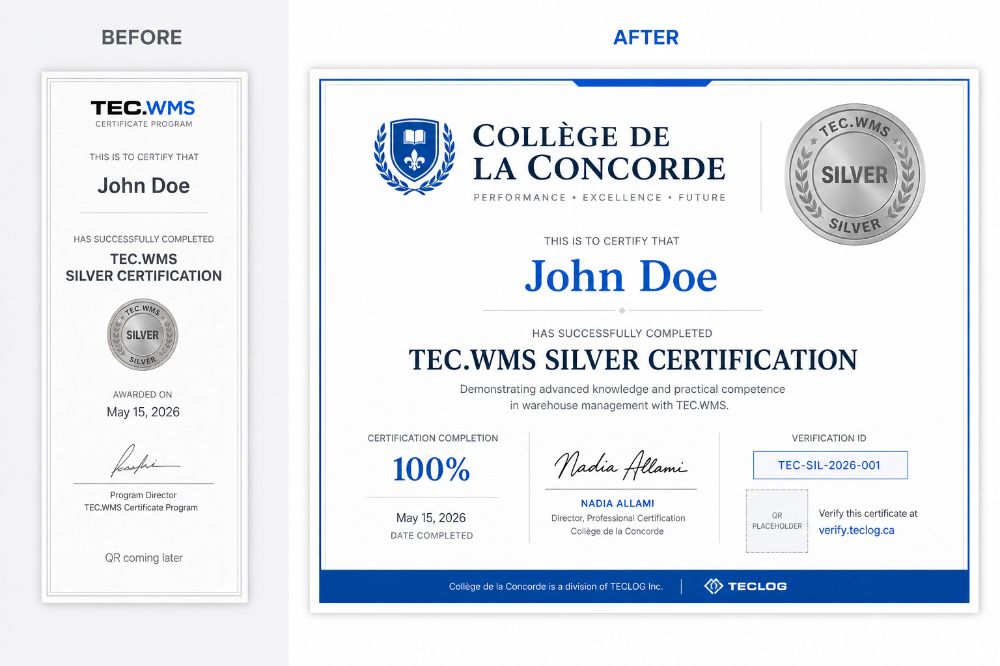

# TEC.WMS — RC14 Silver Premium Certificate Report

**Programme:** Collège de la Concorde · TEC.LOG / TEC.WMS  
**Date:** 2026-06-18  
**Scope:** Visual redesign only — RC14 Wave 1 Objective B  
**Authority:** `RC14_M5_AND_SILVER_PREMIUM_IMPLEMENTATION_SPEC.md` §3 · `Documentation/CERTIFICATION_PACKAGE_V1.md`

---

## Executive Summary

RC14 Silver Premium Certificate delivers an **institutional landscape credential** replacing the RC13 portrait preview card. All certification logic, eligibility, thresholds, registry IDs, and engine routes remain **unchanged**. The certificate now presents as an executive document suitable for print (A4 landscape) and on-screen review by institutional leadership.

| Deliverable | Status |
|-------------|--------|
| Premium landscape certificate layout | ✅ Complete |
| Silver seal ≥ 140px | ✅ 140px screen · 100mm print |
| Verification ID block (`TEC-SIL-2026-00N`) | ✅ Complete |
| QR placeholder (`verify.teclog.ca`) | ✅ Complete |
| Nadia Allami signature block | ✅ Complete |
| Certification Completion 100% (institutional) | ✅ Complete |
| Print optimization (A4 landscape) | ✅ Complete |
| Build validation | ✅ `npm run build` passed |
| Silver unit tests | ✅ 27/27 passed |
| Before/After screenshots | ✅ See §5 |

---

## 1. Frozen Domains — Compliance

The following were **not modified**:

| Domain | Verified |
|--------|----------|
| `shared/silverCertificationRegistry.ts` | ✅ Untouched |
| `trpc.profiles.silverStatus` logic | ✅ Untouched |
| Silver/Gold certification engine | ✅ Untouched |
| Eligibility thresholds | ✅ Untouched |
| Certificate ID scheme (`TEC-SIL-2026-00N`) | ✅ Preserved |
| Achievement / competency lists | ✅ Same 6 + 8 items |

---

## 2. Implementation Summary

### 2.1 New components

| File | Purpose |
|------|---------|
| `client/src/components/certification/SilverCertificateDocument.tsx` | Premium landscape document shell |
| `client/src/components/certification/CertificationCompletionBadge.tsx` | Institutional completion 100% |
| `client/src/components/certification/VerificationIdBlock.tsx` | Verification ID with pre-assignment label |
| `client/src/components/certification/QrPlaceholder.tsx` | Non-scannable QR placeholder |
| `client/src/components/certification/SignaturePlaceholder.tsx` | Nadia Allami signatory block |

### 2.2 Modified files

| File | Change |
|------|--------|
| `client/src/pages/student/SilverCertificatePreview.tsx` | Uses `SilverCertificateDocument`; landscape container (`max-w-[1100px]`) |
| `client/src/index.css` | `@page { size: A4 landscape }` print rules |

### 2.3 Layout transformation

| Element | Before (RC13) | After (RC14 Premium) |
|---------|---------------|----------------------|
| Orientation | Portrait card (`max-w-3xl`) | Landscape institutional grid |
| Silver seal | 100px centered | **140px** top-right (100mm print) |
| Verification ID | Shown only when earned, inline under name | Dedicated **Verification ID** block |
| Completion metric | Not shown | **Certification Completion 100%** |
| Signature | Generic « Directeur de programme » | **Nadia Allami · Directrice Générale** |
| QR | « à venir » text | **96px dashed placeholder + verify.teclog.ca** |
| Frame | Single inner border | Double ornamental frame (2pt + inset) |

### 2.4 Semantic contracts

**Certification Completion 100%**

- Represents full Silver pathway satisfaction — **not** quiz score or academic grade.
- Shown when `allRequirementsMet || silverEarned`.
- Subtext: « Parcours M1 intégral validé selon les critères TEC.LOG ».

**Verification ID**

- Source: `registryEntry.certificateId` via existing `lookupSilverRegistryByStudentNumber`.
- Preview eligible: shown with « Pré-attribution » sublabel when registry match exists.
- Earned without registry match: em dash + support message — **no fabricated IDs**.

**QR Placeholder**

- Static SVG silhouette, dashed border, label `verify.teclog.ca`.
- No backend integration (Wave 1 spec).

---

## 3. Acceptance Criteria

| # | Criterion | Result |
|---|-----------|--------|
| 1 | Silver seal ≥ 140px on certificate face | ✅ |
| 2 | Landscape institutional layout matches V1 grid | ✅ |
| 3 | Verification ID shows `TEC-SIL-2026-00N` for registry students | ✅ |
| 4 | QR placeholder visible with verify.teclog.ca label | ✅ |
| 5 | Nadia Allami / Directrice Générale / Collège de la Concorde | ✅ |
| 6 | Certification Completion 100% — no grade semantics | ✅ |
| 7 | Preview watermark + banner preserved | ✅ |
| 8 | Print stylesheet respects A4 landscape | ✅ |
| 9 | No changes to Silver logic, registry, or engine | ✅ |

---

## 4. Build Validation

```text
npm run build          → ✓ built (vite + esbuild)
npx vitest run server/silver.certification.test.ts → ✓ 27/27 passed
npm run check (tsc)    → Pre-existing repo errors unrelated to this change
```

**Note:** `tsc --noEmit` reports pre-existing TypeScript errors in other modules (M5 OIL, routers, rulesEngine). The Silver premium certificate files introduce no new type errors beyond the existing `profile.displayName` pattern already present in RC13.

---

## 5. Before / After Screenshots

### 5.1 Composite comparison



### 5.2 Annotated wireframes

| State | Asset |
|-------|-------|
| **Before** — RC13 portrait preview | `Documentation/silver-premium-certificate/before-rc13-portrait.svg` |
| **After** — RC14 premium landscape | `Documentation/silver-premium-certificate/after-rc14-landscape-premium.svg` |

### 5.3 Key visual deltas

```
BEFORE                              AFTER
────────────────────────────────    ────────────────────────────────────
Portrait · max-w-3xl                Landscape · max-w-[1100px]
Badge 100px centered                Badge 140px institutional header
ID under recipient name             Verification ID block (monospace)
No completion metric                Certification Completion 100%
Generic program director            Nadia Allami · Directrice Générale
« QR · à venir »                    QR placeholder · verify.teclog.ca
```

---

## 6. Print Behaviour

- `@page { size: A4 landscape; margin: 12mm }`
- Shell bar, navigation, back button, preview banner, and action buttons hidden via `.silver-certificate-no-print`
- Certificate document uses `print-color-adjust: exact` for gradient and accent fidelity
- Silver medallion scales to **100mm** diameter in print context

---

## 7. Out of Scope (per mission)

- No deploy
- No git commit / push
- No certification engine changes
- No live QR / verify.teclog.ca backend
- No digital signature pipeline
- Thiago Gibran secondary signatory deferred to Wave 2

---

## 8. References

| Document | Role |
|----------|------|
| `RC14_M5_AND_SILVER_PREMIUM_IMPLEMENTATION_SPEC.md` | RC14 Wave 1 spec §3 |
| `Documentation/CERTIFICATION_PACKAGE_V1.md` | Institutional design authority |
| `client/src/pages/student/SilverCertificatePreview.tsx` | Page entry point |
| `shared/silverCertificationRegistry.ts` | Frozen registry source |

---

*RC14 Silver Premium Certificate — display-layer implementation complete. Ready for institutional visual review by Directrice Générale.*
