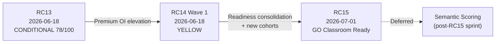

# TEC.WMS — Release History

**Programme:** TEC.LOG — Collège de la Concorde  
**Repository:** `tec-wms-simulator-production`  
**Production URL (Railway):** `https://tec-wms-simulator-production-production.up.railway.app`  
**Document type:** Institutional release governance index  
**Last updated:** 2026-07-01  
**Mode:** Documentation only — no production code changes  

---

## Governance structure

Institutional release documentation is organized under `docs/`:

| Folder | Purpose |
|--------|---------|
| [`docs/audits/`](audits/) | Read-only institutional audits (checkpoint, cohort, certification, production acceptance) |
| [`docs/releases/`](releases/) | Per-release reports, readiness verdicts, and sign-off artifacts |
| `docs/RELEASE_HISTORY.md` | **This document** — canonical index across RC13 → RC15 |

**Legacy location:** RC13 and RC14 primary audits and reports remain at the repository root and under `Documentation/` to preserve existing cross-references. Paths below point to authoritative sources regardless of folder.

---

## Release summary

| Release | Date | Production status | Release decision |
|---------|------|-------------------|------------------|
| **RC13** | 2026-06-18 | Railway **GREEN** (deploy reconciled); live smoke **RED** | **CONDITIONAL RELEASE READY** (78/100) |
| **RC14** | 2026-06-18 | Wave 1 **deployed** @ `496272e`; acceptance **YELLOW** | **RC14 Wave 1 — YELLOW** |
| **RC15** | 2026-07-01 | Platform **GO — Classroom Ready**; cohort provisioning **PENDING** | **GO — Classroom Ready** (operator gate) |

---

## RC13 — Publish Candidate (Cohorte Fondatrice)

| Field | Value |
|-------|-------|
| **Date** | 2026-06-18 |
| **Branch / HEAD** | `production-hotfix-rc13-pedagogy-class6` @ `03ec5529` |
| **Cohort** | Cohorte Fondatrice · Session 2025–2026 (ID 1) |
| **Production status** | Railway deployment **SUCCESS** / Online; `system.health` OK; 17 scenarios live; 5/5 founding students provisioned |
| **Release decision** | **CONDITIONAL RELEASE READY** — Score **78/100**. Certified for **controlled cohort launch** on Railway. **Not** certified for unconditional institutional release, unsupervised Class 9–10 (M4/M5), or institutional Silver/Gold issuance (PDF, QR, B3 workflow) until S-10/S-11 smokes and operator gates close. |

### Objective

Deliver the first **production-ready TEC.WMS Simulator** on Railway for the **Cohorte Fondatrice**: full M1–M5 scenario arc (SCN-001 → SCN-017), local authentication (Phase C), Silver and Gold certification engines, Mission Control with Operational Intelligence Layer (OIL), teacher dashboard, and founding-cohort bootstrap — enabling Classes 1–8 (M1–M3) immediately and preparing the pedagogical path for Class 9 (M4) and Class 10 (M5).

### Major changes

- **Platform migration:** Railway as primary runtime; Phase C local auth (student/professor login, Student Manager).
- **Scenario catalog:** 17 active scenarios across M1–M5; M4/M5 runtime validators and routers (`m4.*`, `m5.*`).
- **Certification engines:** Silver (4 gates, 25/25 tests); Gold (18 gates, 21/21 tests); static Silver registry (`TEC-SIL-2026-001`–`004`).
- **Mission Control + OIL:** Unified cockpit shell; Wave 4 operational intelligence baseline (7/7 local smoke).
- **Teacher dashboard:** Monitor, analytics, cohorts, slides, students (9 sub-routes).
- **Pedagogical assets:** 36 slides; 5 quizzes / 21 questions; canonical SCN contracts.
- **Cohorte Fondatrice bootstrap:** 5/5 student accounts; cohort ID 1 assigned; 4/4 Silver student numbers set.
- **Quality gate:** **425/425** unit tests PASS at certification HEAD.

### Audit documents

| Document | Focus |
|----------|-------|
| [`RC13_FINAL_RELEASE_CERTIFICATION_REPORT.md`](../RC13_FINAL_RELEASE_CERTIFICATION_REPORT.md) | **Authoritative** final QA and release certification (78/100) |
| [`RC13_EXECUTIVE_STATUS_SUMMARY.md`](../RC13_EXECUTIVE_STATUS_SUMMARY.md) | Executive consolidation for stakeholders |
| [`Documentation/RC13_RELEASE_READINESS_REPORT.md`](../Documentation/RC13_RELEASE_READINESS_REPORT.md) | Consolidated readiness (74/100) |
| [`RC13_FINAL_RELEASE_READINESS.md`](../RC13_FINAL_RELEASE_READINESS.md) | Prior consolidated assessment (72/100) |
| [`RC13_DEPLOYMENT_RECONCILIATION_REPORT.md`](../RC13_DEPLOYMENT_RECONCILIATION_REPORT.md) | Git ↔ origin ↔ Railway sync |
| [`RC13_DATA_INTEGRITY_AUDIT.md`](../RC13_DATA_INTEGRITY_AUDIT.md) | Live DB integrity |
| [`RC13_POST_PHASE_C_SMOKE_AUDIT.md`](../RC13_POST_PHASE_C_SMOKE_AUDIT.md) | Phase C auth smoke (10/10 static) |
| [`RC13_C2_RAILWAY_AUTH_BASELINE_REPORT.md`](../RC13_C2_RAILWAY_AUTH_BASELINE_REPORT.md) | Railway auth baseline (C2 gate) |
| [`RC13_WAVE3_COMPLETION_AUDIT.md`](../RC13_WAVE3_COMPLETION_AUDIT.md) | Wave 3 completion |
| [`RC13_FINAL_MANUS_RELEASE_AUDIT.md`](../RC13_FINAL_MANUS_RELEASE_AUDIT.md) | Manus publish readiness |
| [`Documentation/RC13_M4_VALIDATION_REPORT.md`](../Documentation/RC13_M4_VALIDATION_REPORT.md) | M4 validation |
| [`Documentation/RC13_M5_VALIDATION_REPORT.md`](../Documentation/RC13_M5_VALIDATION_REPORT.md) | M5 validation |
| [`Documentation/RC13_GOLD_READINESS_AUDIT.md`](../Documentation/RC13_GOLD_READINESS_AUDIT.md) | Gold readiness |
| [`Documentation/RC13_COHORTE_EXECUTION_REPORT.md`](../Documentation/RC13_COHORTE_EXECUTION_REPORT.md) | Founding cohort bootstrap execution |
| [`Documentation/RC13_COHORTE_FONDATRICE_BOOTSTRAP_PLAN.md`](../Documentation/RC13_COHORTE_FONDATRICE_BOOTSTRAP_PLAN.md) | Bootstrap plan |
| [`Documentation/RC13_SILVER_VISUAL_VALIDATION.md`](../Documentation/RC13_SILVER_VISUAL_VALIDATION.md) | Silver visual validation |
| [`Documentation/RC13_SILVER_CERTIFICATION_RESOLUTION_AUDIT.md`](../Documentation/RC13_SILVER_CERTIFICATION_RESOLUTION_AUDIT.md) | Silver certification resolution |
| [`RAILWAY_AUTH_AUDIT_RC13.md`](../RAILWAY_AUTH_AUDIT_RC13.md) | Railway auth audit |
| [`RAILWAY_GAP_AUDIT_RC13.md`](../RAILWAY_GAP_AUDIT_RC13.md) | Railway gap analysis |

### Residual gates (at RC13 close)

- Live end-to-end smoke **S-10** (M4) and **S-11** (M5) not completed on progression-unlocked accounts.
- Institutional certification workflow **B3** (registry PENDING → VALID) open.
- `ENABLE_GOLD_UNLOCK=false` by default — Gold auto-award disabled.
- `verify.teclog.ca` and signed PDF pipeline not deployed.

---

## RC14 — Premium Operational Intelligence (Wave 1)

| Field | Value |
|-------|-------|
| **Date** | 2026-06-18 |
| **Active deployment** | Railway ID `1352f181` @ commit `496272e` |
| **Production status** | Deploy reconciliation **GREEN**; feature bundle live (M3 tower, M4 evidence, M5 tower, Silver premium). Student/instructor acceptance **YELLOW** — visual fidelity gaps, deferred Wave 2 surfaces, no recorded live UI walkthrough. |
| **Release decision** | **RC14 Wave 1 — YELLOW**. **Deployed and technically present** in production. **Not fully accepted** until Silver institutional visuals signed off, SCN-011 friction accepted or remediated, Wave 2 M5 consequence surfaces scoped, and live production smoke recorded. Silver display-layer closure (`RC14_SILVER_FINAL_ACCEPTANCE.md`) achieved **CONDITIONAL GO** in code with **deploy held** pending institutional sign-off. |

### Objective

Elevate the **Operational Intelligence Layer** post-RC13 without altering pedagogical authority (Fiche Mission, scoring thresholds, certification rules). RC14 Wave 1 eliminates the “empty cockpit” sensation in M3/M4/M5 and ships the **Silver Premium Certificate** display layer — display/state-surfacing only, no changes to compliance engines or eligibility logic.

### Major changes

| Area | Deliverable |
|------|-------------|
| **M3 Wave 1** | Operational Control Tower + `m3Evidence` API; Mission Control enhancements (SCN-009/010/011); SCN-009 Fiche Mission ADJ (MI07) copy alignment |
| **M4 Wave 1** | KPI Evidence Layer — tiles, trail, alerts, snapshot, evidence feed; `m4KpiSnapshot` / `kpiInterpretations` surfacing |
| **M5 Wave 1** | Dynamic KPI Tower, Zone Flow Bar, Transaction Timeline, KPI Ledger widget; `showTxTable` fix; executive chain strip |
| **Silver Premium** | Landscape `SilverCertificateDocument` — seal, completion badge, verification ID, signature placeholder, QR placeholder, print CSS |
| **Quality** | Automated regression coverage per Wave 1 implementation reports |

**Explicitly deferred (Wave 2+):** M5 Decision Consequence Panel, Executive Replay Layer; functional QR / `verify.teclog.ca`; digital signature pipeline; instructor-dedicated intelligence mirrors.

### Audit documents

| Document | Focus |
|----------|-------|
| [`RC14_PRODUCTION_ACCEPTANCE_AUDIT.md`](../RC14_PRODUCTION_ACCEPTANCE_AUDIT.md) | **Authoritative** Wave 1 production acceptance (YELLOW) |
| [`RC14_DEPLOYMENT_RECONCILIATION_REPORT.md`](../RC14_DEPLOYMENT_RECONCILIATION_REPORT.md) | Deploy reconciliation (GREEN @ `0197f36` / superseded by `496272e`) |
| [`RC14_ACCEPTANCE_GAP_REPORT.md`](../RC14_ACCEPTANCE_GAP_REPORT.md) | Acceptance gap inventory |
| [`RC14_SILVER_FINAL_ACCEPTANCE.md`](../RC14_SILVER_FINAL_ACCEPTANCE.md) | Silver display-layer closure (CONDITIONAL GO; deploy held) |
| [`RC14_SILVER_PREMIUM_EXACT_VISUAL_ACCEPTANCE.md`](../RC14_SILVER_PREMIUM_EXACT_VISUAL_ACCEPTANCE.md) | Silver visual acceptance criteria |
| [`RC14_M4_FINAL_ACCEPTANCE.md`](../RC14_M4_FINAL_ACCEPTANCE.md) | M4 final acceptance |
| [`RC14_M4_SCORING_FORENSIC_AUDIT.md`](../RC14_M4_SCORING_FORENSIC_AUDIT.md) | M4 scoring economics (75/100 ceiling) |
| [`RC14_M3_PREMIUM_INTELLIGENCE_AUDIT.md`](../RC14_M3_PREMIUM_INTELLIGENCE_AUDIT.md) | M3 premium intelligence audit |
| [`RC14_M4_PREMIUM_INTELLIGENCE_AUDIT.md`](../RC14_M4_PREMIUM_INTELLIGENCE_AUDIT.md) | M4 premium intelligence audit |
| [`RC14_M5_PREMIUM_INTELLIGENCE_AUDIT.md`](../RC14_M5_PREMIUM_INTELLIGENCE_AUDIT.md) | M5 premium intelligence audit |
| [`RC14_PREMIUM_OPERATIONAL_INTELLIGENCE_MASTER_PLAN.md`](../RC14_PREMIUM_OPERATIONAL_INTELLIGENCE_MASTER_PLAN.md) | RC14 master plan (Waves 1–3) |
| [`RC14_M3_WAVE1_IMPLEMENTATION_SPEC.md`](../RC14_M3_WAVE1_IMPLEMENTATION_SPEC.md) | M3 Wave 1 spec |
| [`RC14_M4_WAVE1_IMPLEMENTATION_SPEC.md`](../RC14_M4_WAVE1_IMPLEMENTATION_SPEC.md) | M4 Wave 1 spec |
| [`RC14_M5_AND_SILVER_PREMIUM_IMPLEMENTATION_SPEC.md`](../RC14_M5_AND_SILVER_PREMIUM_IMPLEMENTATION_SPEC.md) | M5 + Silver implementation spec |
| [`Documentation/CERTIFICATION_PACKAGE_V1.md`](../Documentation/CERTIFICATION_PACKAGE_V1.md) | Certification package authority |

### Pedagogical scores (production acceptance)

| Module | Score | Classification |
|--------|-------|----------------|
| M3 | 78/100 | YELLOW |
| M4 | 85/100 | GREEN |
| M5 | 74/100 | YELLOW |

---

## RC15 — Classroom Readiness

| Field | Value |
|-------|-------|
| **Date** | 2026-07-01 |
| **Release report** | [`docs/releases/RC15_CLASSROOM_READINESS_REPORT.md`](releases/RC15_CLASSROOM_READINESS_REPORT.md) |
| **Production status** | **GO — Classroom Ready** on Railway. Production smoke **17/20 PASS** (residual items documented). **Pending:** operator must create two new production cohorts and assign students before class. |
| **Release decision** | **GO — Classroom Ready** — conditional on operational cohort provisioning (`Groupe A` / `Groupe B` or equivalent). Engineering and audit gates satisfied; semantic scoring remains **deferred**. |

### Objective

Prepare the TEC.WMS Simulator for **in-class delivery to two new independent student cohorts** while:

1. Preserving **Cohorte Fondatrice** roster, Silver/Gold certifications, and institutional Gold award metadata unchanged.
2. Enabling professors to **switch cohorts** and see isolated dashboards, rosters, monitoring, analytics, and certification summaries per cohort.
3. Confirming **checkpoint progression (M2–M5)** and **certification gating (Silver/Gold)** under the checkpoint engine, including the M3 teacher-validation pathway.
4. Validating **M3 scoring** (100/100 ceiling, 70 pass threshold) and **M4/M5 analytical step** copy consistency.
5. Executing a **final production smoke test** covering teacher login, cohort filtering, student progression, and founder-cohort integrity.

This release is a **readiness and remediation consolidation**, not a feature expansion.

### Major changes

| Agent / workstream | Deliverable |
|--------------------|-------------|
| **Agent 1 — M3 scoring** | Scaled step awards (80 → 100 pt pipeline for SCN-009/010); `M3_STEP_MAX_SCALED` in `server/rulesEngine.ts`; `m3.scoring.test.ts` |
| **Agent 2 — M4/M5 UX** | `analyticalStepQuestions.ts`; `AnalyticalResponseField` integration in `StepForm.tsx` |
| **Agent 3 — Cohort isolation** | `cohortScope.ts`; shell cohort switcher; filtered teacher APIs |
| **Agent 4 — Checkpoint / cert gating** | M3 teacher-validation deadlock fix (`isModuleReadyForTeacherValidation`); 86 certification unit tests |
| **Agent 5 — Final QA** | Production end-to-end smoke against Railway; Cohorte Fondatrice preservation checks |

**Out of scope (deferred):** Semantic scoring layer per [`RC15_SEMANTIC_SCORING_IMPLEMENTATION_PLAN.md`](../RC15_SEMANTIC_SCORING_IMPLEMENTATION_PLAN.md); M4 display/runtime point-budget realignment; RC14 Wave 2 premium intelligence parity.

### Audit documents

| Document | Focus |
|----------|-------|
| [`docs/releases/RC15_CLASSROOM_READINESS_REPORT.md`](releases/RC15_CLASSROOM_READINESS_REPORT.md) | **Authoritative** RC15 release report and sign-off |
| [`docs/audits/CHECKPOINT_CERTIFICATION_GATING_AUDIT.md`](audits/CHECKPOINT_CERTIFICATION_GATING_AUDIT.md) | Agent 4 — checkpoint progression & certification gating |
| [`docs/audits/COHORT_ISOLATION_PROFESSOR_DASHBOARD_AUDIT.md`](audits/COHORT_ISOLATION_PROFESSOR_DASHBOARD_AUDIT.md) | Agent 3 — cohort isolation & professor dashboard |
| [`RC15_SEMANTIC_SCORING_IMPLEMENTATION_PLAN.md`](../RC15_SEMANTIC_SCORING_IMPLEMENTATION_PLAN.md) | Deferred semantic layer (planning only) |
| [`GUIDE_M4_M5_FINAL_QA_REVIEW.md`](../GUIDE_M4_M5_FINAL_QA_REVIEW.md) | Student guide QA alignment |
| [`PRE_CLASS_FALLBACK_AND_RISK_PLAN.md`](../PRE_CLASS_FALLBACK_AND_RISK_PLAN.md) | Fallback procedures if platform unavailable |

### Decision matrix (RC15 close)

| Gate | Result |
|------|--------|
| M3 scoring aligned to 100/100 scale | ✅ |
| M4/M5 analytical UX standardized | ✅ |
| Cohort isolation verified (5/5 tests + production smoke) | ✅ |
| Checkpoint progression & cert gating (86/86 tests + M3 fix) | ✅ |
| Cohorte Fondatrice preserved | ✅ |
| Production smoke ≥ 85% with blocking M3 item remediated | ✅ |
| New cohorts created and students assigned | ⏸ **Operator — before class** |

---

## Release lineage

| Transition | Rationale |
|------------|-----------|
| RC13 → RC14 | RC13 delivered functional runtime; RC14 elevated cockpit intelligence and Silver display without touching certification logic |
| RC14 → RC15 | RC14 Wave 1 deployed but acceptance incomplete; RC15 closed classroom-blocking gaps (scoring, UX, cohort isolation, M3 validation deadlock) for multi-cohort delivery |
| RC15 → next | Semantic scoring Phase 1; RC14 Wave 2 (M5 consequence surfaces); institutional B3/PDF/QR workflow |

---

## Adding future releases

1. Place institutional **audit** artifacts in [`docs/audits/`](audits/).
2. Place **release report** and sign-off in [`docs/releases/`](releases/).
3. Add a section to this document with: objective, major changes, audit document links, production status, date, and release decision.
4. Do not relocate legacy RC13/RC14 root documents unless a formal migration is approved — update links here instead.

---

*Institutional release governance — TEC.WMS · Collège de la Concorde · 2026-07-01*
