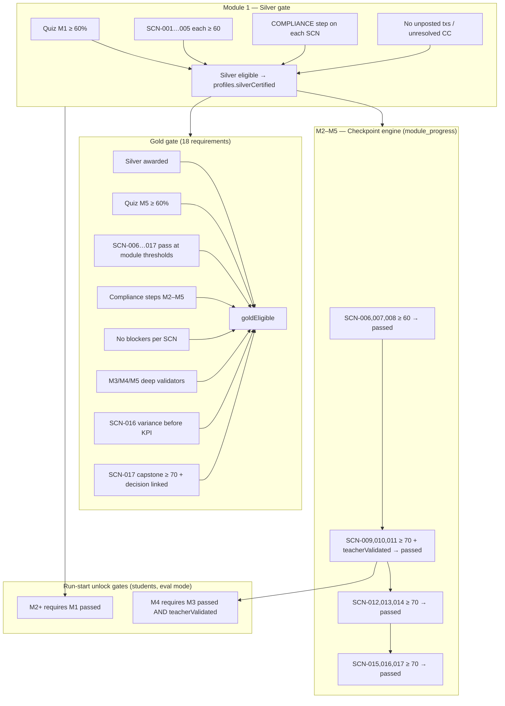

# Checkpoint Progression & Certification Gating Audit

**Project:** TEC.WMS Simulator — Production  
**Agent scope:** AGENT 4 — Checkpoint Progression and Certification Gating  
**Date:** 2026-07-01  
**Status:** Institutional audit artifact — review complete  

---

## Executive summary

Checkpoint progression (M2–M5) and certification gating (Silver/Gold) are **architecturally sound** and backed by **86 passing unit tests** at the time of this audit.

Three distinct progress: in-run session progress (%), persisted `module_progress` checkpoints (M2–M5), and live certification engines (Silver/Gold). Certification engines **do not** read `module_progress.passed`; they recompute eligibility from latest non-demo completed runs per canonical SCN.

One **production-blocking defect** was identified and fixed during this audit: the M3 teacher-validation endpoint created a circular dependency with the checkpoint engine (`passed` required teacher validation, but teacher validation required `passed` first). The fix adds `isModuleReadyForTeacherValidation()` and updates `validateTeacherModule` to accept a checkpoint-ready snapshot when all M3 SCNs pass at threshold.

**Overall verdict:** Progression is valid, ordered, and increasing. Certification gates reflect real completion. Cohort scoping is user-bound with no cross-cohort progress leakage. Residual observations (M1 unlock vs Silver split, loose run-start gates, Silver short-circuit) are documented and intentional or mitigated elsewhere.

---

## Checkpoint progression map (M1 → M5)

### Flow diagram



### Official SCN catalog (ordered, increasing)

| Module | SCNs | Pass threshold | Checkpoint `passed` rule |
|--------|------|----------------|--------------------------|
| **M1** | SCN-001 → 005 | 60 | Legacy: single-scenario `recordModulePass` (not checkpoint engine) |
| **M2** | SCN-006 → 008 | 60 | All 3 SCNs at threshold |
| **M3** | SCN-009 → 011 | 70 | All 3 SCNs **+ teacher validation** |
| **M4** | SCN-012 → 014 | 70 | All 3 SCNs at threshold |
| **M5** | SCN-015 → 017 | 70 (SCN-017 capstone also 70 for Gold) | All 3 SCNs at threshold |

**Sources:**

- `OFFICIAL_SCN_BY_MODULE` — `server/canonicalScenarios.ts`
- Thresholds — `shared/moduleThresholds.ts` (GOV-T01)
- Checkpoint engine — `server/checkpointEngine.ts` (`CHECKPOINT_MODULE_IDS = [2, 3, 4, 5]`)

### Three distinct progress layers

| Layer | Scope | Function / table | Used for |
|-------|-------|------------------|----------|
| **In-run session %** | Current run only | `calculateProgressPctAllModules` — `server/rulesEngine.ts` | Mission Control, Run Report, OIL Panel E |
| **`module_progress` row** | M2–M5 persisted checkpoint | `server/checkpointEngine.ts` → `drizzle/schema.ts` | Unlock hints, teacher monitor, M4 gate |
| **Certification engines** | Live recompute from runs | `getSilverCertificationStatus` — `server/db.ts`; `getGoldCertificationStatus` — `server/goldCertification.ts` | Silver/Gold eligibility and award |

Certification engines are **authoritative for certification** and do not depend on `module_progress.passed`.

### Module completion rules (M2–M5 checkpoint engine)

| Field | Formula / rule |
|-------|----------------|
| `requiredScenarios` | Count of official SCNs in `OFFICIAL_SCN_BY_MODULE[moduleId]` |
| `completedScenarios` | SCNs whose latest non-demo run score ≥ module threshold |
| `progressPct` | M2/M4/M5: `round(completed / required × 100)`; M3: `round((completed + teacherSlot) / (required + 1) × 100)` |
| `passed` | All SCNs pass **and** (M3 only) `teacherValidated === true` |
| `bestScore` | Max of latest-run scores across module SCNs |
| `averageScore` | Mean of latest-run scores where a run exists |
| Per-SCN credit | **Latest non-demo completed run wins**; demo runs excluded |

**Recompute triggers:** `warehouse.recordModulePass` (M2–M5 when `CHECKPOINT_ENGINE_ENABLED !== "false"`), `warehouse.validateTeacherModule` (M3 after teacher flag set).

### M1 (Silver pathway, not checkpoint engine)

- Silver eligibility uses **live** gates: quiz + all 5 SCNs + compliance + blockers.
- `module_progress.passed` for M1 can still become `true` from **one** passing scenario via legacy `computeModulePassResult` — this may unlock M2 but **does not** award Silver.

---

## Silver / Gold gating audit

### Silver certification

**Function:** `getSilverCertificationStatus(userId)` — `server/db.ts`

All four gates must be true for `silverEligible`:

| # | Gate | Implementation |
|---|------|----------------|
| 1 | Quiz M1 ≥ 60% | `checkM1QuizPassed` — best `quizAttempts.score` vs `QUIZ_PASS_THRESHOLD` (60) |
| 2 | SCN-001 → SCN-005 each ≥ 60 | `getM1ScenarioCompletionStatus` — latest non-demo completed run per canonical SCN |
| 3 | M1 compliance validated | `checkM1ComplianceValidated` — `COMPLIANCE` step completed on each SCN’s latest eval run |
| 4 | No unresolved blockers | `checkNoUnresolvedBlockers` — no unposted transactions or unresolved cycle counts per SCN |

```typescript
const silverEligible = quizPassed && allScenariosDone && complianceValidated && noBlockers;
```

**Award persistence:** `profiles.silverCertified = true` via:

- Lazy evaluation on `profiles.silverStatus`
- `warehouse.recordModulePass` when `moduleId === 1` and all gates met
- `quiz.submit` when `moduleId === 1` and all gates met (RC13 hotfix)

**Protections:**

| Risk | Mitigation |
|------|------------|
| Demo runs counting toward cert | `isDemo = false` filter on all run lookups |
| Duplicate scenario DB rows | `scenarioIdsForScn` + canonical ID map — five SCNs only for M1 |
| Stale passing run superseded | Latest run wins per SCN |
| Partial M1 completion | All five SCNs required individually |

**Known behavior:** When `profiles.silverCertified === true`, `getSilverCertificationStatus` short-circuits and returns all gates true without live revalidation. Admin `cleanupAndAudit` can reconcile stale flags.

---

### Gold certification

**Function:** `getGoldCertificationStatus(userId)` — `server/goldCertification.ts`

**Prerequisite:** `profiles.silverCertified === true`. Without Silver, state is `LOCKED` and all Gold gates are skipped.

**Predicate (all must be true):**

```typescript
const goldEligible =
  silverPrerequisite &&
  quizM5Passed &&
  allScenariosDone &&
  complianceValidated &&
  noBlockers &&
  moduleCompliancePassed &&
  scn016VarianceBeforeKpi &&
  scn017Gates.capstoneScore &&
  scn017Gates.decisionLinked;
```

**18 checklist rows (`GOLD_REQUIREMENTS_TOTAL = 18`):**

| # | Gate | Detail |
|---|------|--------|
| 1 | Silver prerequisite | `profiles.silverCertified` |
| 2 | Quiz M5 ≥ 60% | `checkM5QuizPassed` |
| 3–14 | SCN-006 … SCN-017 | Latest non-demo run per SCN; score vs module threshold (M2: 60; M3–M5: 70; SCN-017 capstone: 70) |
| 15 | M2–M5 compliance steps | Latest run per SCN has module compliance step completed |
| 16 | No blockers | Unposted txs / unresolved cycle counts on each Gold-path SCN’s latest run |
| 17 | Module compliance validators | Deep validators on M3–M5 SCNs; M2 always returns true in `checkModuleComplianceForRun` |
| 18a | SCN-016 variance before KPI | Variance resolved; if `M5_KPI` completed, `M5_ADJ` must appear before it |
| 18b | SCN-017 capstone | Score ≥ 70 + KPI snapshot exists + `M5_DECISION` and `M5_KPI` completed |

**Award persistence:** `profiles.goldCertified = true` only when `ENABLE_GOLD_UNLOCK === "true"` (lazy on `profiles.goldStatus` or after M5 `recordModulePass`). Default: students may reach `ELIGIBLE` without automatic award.

**Teacher validation:** Used for M3 checkpoint and M4 run-start unlock only. **Not referenced** in the Gold eligibility predicate (verified by test GT-TV-02).

**Founding cohort exception:** When `silverCertified && goldCertified && isFoundingCohortInstitutionalGoldAward(goldAwardSource)`, `buildInstitutionalGoldAwardStatus` returns full 18/18 AWARDED for display — governance-controlled institutional award, not a runtime student exploit path.

**Protections:** Same latest-run-wins and demo-exclusion rules as Silver; full SCN-006…017 set required; Silver prerequisite enforced.

---

## M3 teacher-validation defect and fix

### Defect

With the checkpoint engine enabled, M3 `passed` **requires** `teacherValidated`:

```typescript
// server/checkpointEngine.ts — computeCheckpointPassed
return (
  completedScenarios === requiredScenarios &&
  requiredScenarios > 0 &&
  allScnsPass &&
  (moduleId !== 3 || teacherValidated)
);
```

The pre-fix `validateTeacherModule` endpoint required `progress.passed === true` **before** allowing teacher validation:

```typescript
// server/routers.ts (pre-fix)
if (!progress?.passed) {
  throw new TRPCError({
    code: "BAD_REQUEST",
    message: "L'étudiant doit avoir réussi le Module 3 avant validation enseignant.",
  });
}
```

This created a **deadlock**:

1. Student completes all M3 SCNs → `passed = false`, `progressPct = 75%`
2. Teacher attempts validation → rejected (must pass M3 first)
3. M4 remains locked (`isModule3Unlocked` requires `passed && teacherValidated`)

The pre-check was valid under the **legacy** model where M3 could reach `passed = true` from a single scenario without teacher validation; it is incompatible with the checkpoint engine.

### Fix

| Change | Location | Description |
|--------|----------|-------------|
| `isModuleReadyForTeacherValidation()` | `server/checkpointEngine.ts` | Returns true when all M3 official SCNs pass at threshold, independent of `passed` |
| Updated precondition | `server/routers.ts` — `validateTeacherModule` | Accepts legacy `progress.passed` **or** checkpoint-ready snapshot when engine enabled |
| Test CK-M3-04 | `server/checkpointEngine.test.ts` | Asserts teacher validation is allowed when all SCNs pass but `passed` is still false |

**Corrected flow:**

1. Student completes SCN-009, 010, 011 at ≥ 70 → `progressPct = 75%`, `passed = false`
2. Teacher validates → `teacherValidated = true` → recompute → `progressPct = 100%`, `passed = true`
3. M4 unlock satisfied via `isModule3Unlocked({ passed: true, teacherValidated: true })`

---

## Cohort scoping conclusion

Progress and certification are **user-scoped**, not cohort-scoped. Cohort assignment is organizational metadata and does not partition or merge completion data.

| Data store | Scope key | Cohort involvement |
|------------|-----------|-------------------|
| `scenario_runs` | `userId` | None |
| `module_progress` | `(userId, moduleId)` unique index | None |
| `quiz_attempts` | `userId` | None |
| `profiles.silverCertified` / `goldCertified` | `userId` | `cohortId` on profile for roster/assignments only |
| `assignments` | `userId` OR `cohortId` | Cohort used for assignment delivery, not cert computation |

**Conclusions:**

- No student can receive certification from another cohort’s progress — runs and progress rows are bound to `userId`.
- Changing cohort preserves the same `userId` history (correct behavior).
- Duplicate scenario rows are deduped to canonical SCN codes; stale runs are superseded by latest eval run per SCN.
- Demo runs never contribute to checkpoint or certification credit.
- Institutional Gold for Cohorte Fondatrice is an explicit governance path with audit source, not cross-cohort leakage.

---

## Test evidence

Executed at audit time — all passed:

| Test file | Count | Scope |
|-----------|-------|-------|
| `server/checkpointEngine.test.ts` | 21/21 | CK-M2…M5, CK-ISO, CK-TRG, CK-M3-04 teacher-ready |
| `server/silver.certification.test.ts` | 29/29 | Silver 4-gate predicate, canonical SCN, demo exclusion, quiz unlock |
| `server/gold.certification.test.ts` | 21/21 | 18-gate thresholds, institutional award, ENABLE_GOLD_UNLOCK |
| `server/wave2.progression.test.ts` | 15/15 | GOV-T01 thresholds, M3→M4 teacher gate (V2.7) |
| **Total** | **86/86** | |

**Command:**

```bash
npx vitest run server/checkpointEngine.test.ts server/silver.certification.test.ts server/gold.certification.test.ts server/wave2.progression.test.ts
```

**Key matrices validated:**

- Partial vs full SCN completion; one passing scenario must not pass module (CK-M2-03)
- Failed latest run revokes SCN credit (CK-M2-04)
- M3: 75% without teacher, 100% with teacher; teacher-only insufficient (CK-M3-01…03)
- M3 teacher-ready before `passed` flips (CK-M3-04)
- Threshold alignment M2=60, M3–M5=70 (CK-ISO-02, GT-M2…M5)
- Silver: all five M1 SCNs required; demo excluded; quiz-last unlock path
- Gold: 18 requirements; Silver prerequisite; teacherValidated absent from Gold predicate
- M4 unlock: requires M3 `passed` AND `teacherValidated` (V2.7)

---

## Residual observations

No additional code changes recommended at audit time. The following are documented intentional or mitigated behaviors:

1. **M1 unlock vs Silver split** — M2 run-start unlock needs only `module_progress.passed` for M1 (possibly from one SCN). Silver requires all five SCNs, quiz, compliance, and blockers. Pedagogical separation by design.

2. **Loose run-start gates** — M3 and M5 eval runs require only M1 passed (except M4, which requires M3 passed + teacher validation). Certification still enforces full SCN completion for Silver/Gold.

3. **Silver short-circuit** — Persisted `silverCertified = true` skips live gate re-check on status query. Use admin `cleanupAndAudit` for reconciliation of stale flags.

4. **M1 outside checkpoint engine** — M1 remains on legacy `computeModulePassResult` in `recordModulePass`. Aligned with Phase 1 implementation plan deferral; Silver engine is the authoritative M1 cert gate.

5. **In-run session % vs certification %** — Mission Control progress (operational steps in current run) is orthogonal to certification checklist completion. Documented in `CURRENT_CERTIFICATION_AND_CHECKPOINT_LOGIC_AUDIT.md`.

6. **Gold auto-award flag** — Without `ENABLE_GOLD_UNLOCK=true`, eligible students remain at `ELIGIBLE` indefinitely. By design for institutional gate control.

---

## Files changed (audit remediation)

| File | Change |
|------|--------|
| `server/checkpointEngine.ts` | Added `isModuleReadyForTeacherValidation()` |
| `server/routers.ts` | Fixed M3 teacher validation precondition in `validateTeacherModule` |
| `server/checkpointEngine.test.ts` | Added test CK-M3-04 |

---

## Related documentation

- `CURRENT_CERTIFICATION_AND_CHECKPOINT_LOGIC_AUDIT.md`
- `CHECKPOINT_ENGINE_IMPLEMENTATION_PLAN.md`
- `CHECKPOINT_ENGINE_PHASE1_IMPLEMENTATION_REPORT.md`
- `CHECKPOINT_ENGINE_FINAL_ACCEPTANCE.md`
- `Documentation/CERTIFICATION_INTELLIGENCE_AUDIT.md`

---

*Institutional audit artifact — TEC.WMS Cohorte Fondatrice · Agent 4 · 2026-07-01*
