# Cohort Isolation & Professor Dashboard Audit

**Project:** TEC.WMS Simulator — Production  
**Agent scope:** AGENT 3 — Cohort Isolation and Professor Dashboard  
**Date:** 2026-07-01  
**Status:** **READY** — Institutional audit artifact  

---

## Executive summary

Cohort support in TEC.WMS treats cohorts as **roster and assignment groups** anchored on `profiles.cohortId`, with teacher-facing surfaces filtered by the professor’s **selected cohort** in the application shell.

Operational data (scenario runs, progress, scores, reports) remains **persisted per student (`userId`)** by design. Teacher dashboards, monitoring, analytics, assignments, student rosters, and certification summaries are **cohort-scoped at the API and UI layer** via membership resolution (`profiles.cohortId` → student `userId` list).

**Cohorte Fondatrice** is preserved: founding students, institutional Silver/Gold awards, and `goldAwardSource` (`FONDATRICE_2026_GOLD_AWARD`) are not modified by cohort isolation work. The shell cohort switcher defaults to a cohort whose name matches `/fondatrice/i` when present.

**Automated verification:** `server/cohortScope.test.ts` — 5/5 tests passing at time of audit.

**Overall verdict:** The system is prepared to support two new independent cohorts while maintaining an isolated, switchable professor dashboard per cohort. No cross-cohort data leakage was identified in teacher dashboard surfaces after remediation.

---

## Cohort model and data separation

### Schema anchors

| Entity | Storage | Cohort link |
|--------|---------|-------------|
| **Cohorts** | `cohorts` (`id`, `name`, `description`, `createdBy`, `createdAt`) | Owned by creating teacher (`createdBy`) |
| **Student membership** | `profiles.cohortId` | Direct roster assignment |
| **Assignments** | `assignments.cohortId` or `assignments.userId` | Cohort-wide or individual targeting |
| **Scenario runs** | `scenario_runs.userId` | Indirect — filtered by cohort membership in teacher views |
| **In-run progress / scoring** | `progress`, `scoring_events` (via `runId`) | Indirect — per user via run |
| **Module progress** | `module_progress.userId` | Indirect — filtered by cohort membership in teacher views |
| **Reports** | Run-based (`runId` → `userId`) | Visible in Monitor only for cohort students when cohort selected |
| **Certifications** | `profiles.silverCertified`, `profiles.goldCertified`, `profiles.goldAwardSource` | Per user; teacher Gold roster filtered by cohort |

### Student assignment resolution

Students with a `profiles.cohortId` receive:

- Individually assigned scenarios (`assignments.userId`), and  
- Cohort-assigned scenarios (`assignments.cohortId` matching their cohort).

Students without a cohort see only individually assigned scenarios.

### Architectural note

Cohorts are **not** database-level tenant boundaries. Historical runs, scores, and certifications stay on the student account if roster membership changes. Isolation for professors is enforced by **filtering teacher queries** on the set of `userId`s belonging to the selected cohort.

### Cohorte Fondatrice (special case)

Founding cohort certification logic uses institutional allowlists and `goldAwardSource` in addition to DB cohort membership. Teacher dashboard filtering does not alter founding student records or institutional award metadata.

---

## Fixes delivered

### Server layer

| Component | Change |
|-----------|--------|
| `server/cohortScope.ts` | `resolveCohortScope()`, `assertTeacherOwnsCohort()`, `cohortFilterInput` — ownership validation and student `userId` resolution |
| `server/db.ts` | `getCohortById()`, `getStudentUserIdsInCohort()`; cohort-filtered `getAllRunsForMonitor()`, `getAllModuleProgressForMonitor()`, `getAllAssignments()`; partial `upsertProfile()` (preserves `cohortId` on student number updates) |
| `server/routers.ts` | Teacher endpoints accept `cohortId` and filter via `resolveCohortScope`; ownership checks on `students.assignCohort`, `students.create`, `assignments.create`; students blocked from self-service `cohortId` changes via `profiles.upsert` |

### Teacher API endpoints (cohort-scoped for professors)

| Namespace | Procedures |
|-----------|------------|
| `monitor` | `allRuns`, `powerAnalytics`, `studentScoreEvolution`, `analytics` |
| `warehouse` | `allModuleProgress` |
| `profiles` | `goldRoster` |
| `assignments` | `all` |
| `students` | `list` (optional `cohortId`, validated) |

Admins may omit `cohortId` on monitor endpoints for a global view (Admin panel).

### Client layer

| Component | Change |
|-----------|--------|
| `client/src/contexts/CohortContext.tsx` | Selected cohort state; persisted in `localStorage` (`wms_selected_cohort`); defaults to Cohorte Fondatrice when name matches `/fondatrice/i` |
| `client/src/hooks/useTeacherCohort.ts` | `useTeacherCohortInput()` — tRPC input `{ cohortId }` or `skipToken` until ready |
| `client/src/components/FioriShell.tsx` | Cohort dropdown in shell bar; invalidates queries on switch |
| Teacher pages | `TeacherDashboard`, `MonitorDashboard`, `AnalyticsDashboard`, `AssignmentManager`, `StudentManager`, `ScenarioManager` wired to selected cohort |

### Tests

| File | Coverage |
|------|----------|
| `server/cohortScope.test.ts` | Ownership, admin global scope, teacher `cohortId` requirement, student ID resolution |

---

## Teacher dashboard cohort scoping map

When the professor switches cohort in the shell, the following surfaces refresh to show **only the selected cohort’s data**:

| Surface | Scoped metrics / data |
|---------|------------------------|
| **Teacher Dashboard — KPI cards** | Assigned tasks count, active evaluation simulations |
| **Teacher Dashboard — Module cards** | Runs per module, average scores, pass counts |
| **Teacher Dashboard — Gold roster** | Silver/Gold status, blockers per student |
| **Teacher Dashboard — M3 validation queue** | Students awaiting instructor validation |
| **Teacher Dashboard — Recent activity** | Latest scenario runs |
| **Monitoring** | Full run list, scores, compliance, CSV export |
| **Analytics** | KPIs, student ranking, heatmaps, score distribution, score evolution |
| **Students** | Roster for selected cohort |
| **Assignments** | Assignments targeting cohort or its students |
| **Scenarios** | Student picker limited to selected cohort (individual assignments) |

### Data flow (professor view)

```mermaid
flowchart LR
  subgraph shell [FioriShell]
    CS[Cohort Switcher]
  end
  subgraph ctx [CohortContext]
    LS["localStorage wms_selected_cohort"]
  end
  subgraph api [tRPC Teacher APIs]
    M["monitor.*"]
    W["warehouse.allModuleProgress"]
    P["profiles.goldRoster"]
    A["assignments.all"]
    S["students.list"]
  end
  subgraph resolve [cohortScope]
    OWN[Ownership check]
    UID["getStudentUserIdsInCohort"]
  end
  subgraph db [Filtered queries]
    RUNS["scenario_runs BY userId IN cohort"]
    MP["module_progress BY userId IN cohort"]
  end
  CS --> ctx
  ctx --> api
  api --> resolve
  resolve --> db
```



---

## Cohort-switch verification checklist

### Manual (production or staging)

- [ ] Log in as professor; confirm **Cohorte** dropdown appears in the shell header.
- [ ] Select **Cohorte Fondatrice**; record student count, module stats, Gold roster entries, and recent runs.
- [ ] Switch to another cohort (or a test cohort with at least one student).
- [ ] Confirm **all dashboard metrics change** — no students from the previous cohort appear.
- [ ] Open **Monitoring**; confirm run list matches selected cohort only.
- [ ] Open **Analytics**; confirm rankings and charts reflect selected cohort only.
- [ ] Open **Étudiants**; confirm roster matches selected cohort only.
- [ ] Open **Assignments**; confirm assignments target selected cohort or its students only.
- [ ] Switch back to **Cohorte Fondatrice**; confirm founding data intact (founding students, institutional Gold).

### Automated

```bash
npx vitest run server/cohortScope.test.ts
```

Expected: **5/5 tests passing**.

---

## No data leakage guarantees

| Control | Behavior |
|---------|----------|
| Teacher API without `cohortId` | `BAD_REQUEST` — professors must select a cohort |
| Cross-teacher cohort access | `FORBIDDEN` — `cohort.createdBy` must match caller (admin bypass) |
| Student self-service cohort change | Blocked — `profiles.upsert` does not allow students to set `cohortId` |
| Student number update clearing cohort | Prevented — partial profile upsert preserves existing `cohortId` |
| Dashboard cross-cohort runs | Server-side filter: `userId ∈ getStudentUserIdsInCohort(cohortId)` |
| Assignment mutations to foreign cohorts | `assertTeacherOwnsCohort` on create and student assign |
| Admin global view | Admins may omit `cohortId` on monitor endpoints (intentional) |

### Residual design boundaries (documented, not defects)

| Item | Note |
|------|------|
| Runs/scores in DB | User-scoped, not `cohortId`-column-scoped — isolation is at teacher API/UI layer |
| Roster change | Moving a student between cohorts does not migrate historical runs |
| Cohorte Fondatrice Gold | Institutional allowlists + `goldAwardSource` operate in addition to DB cohort membership |

---

## Steps to create two new cohorts

Execute once student names are provided.

### Step 1 — Create cohorts

1. Navigate to **Cohortes**.
2. Create e.g. `Cohorte 2026 — Groupe A` and `Cohorte 2026 — Groupe B`.

### Step 2 — Create students

1. Select **Groupe A** in the shell cohort dropdown.
2. Go to **Étudiants** → **Ajouter un étudiant** for each name (email, temporary password).
3. Assign each student to Groupe A at creation or via the per-row cohort dropdown.
4. Repeat for **Groupe B** with the shell set to that cohort.

### Step 3 — Assign scenarios

1. With the correct cohort selected in the shell, open **Scénarios**.
2. Assign modules/scenarios **by cohort** (recommended) or to individual students within that cohort.

### Step 4 — Verify isolation

1. Shell → **Groupe A** → dashboard, monitor, and roster show only Group A.
2. Shell → **Groupe B** → only Group B.
3. Shell → **Cohorte Fondatrice** → only founding students; certifications unchanged.

### Step 5 — Smoke test cohort switch

1. Switch between all three cohorts rapidly.
2. Confirm metrics, student lists, and certification tables update without stale data from the prior selection.

---

## Cohorte Fondatrice preservation rules

| Rule | Rationale |
|------|-----------|
| **Do not reassign** founding students to new cohorts | Preserves historical roster integrity and audit trail |
| **Do not run** Gold/Silver override or pedagogical override scripts on new cohorts unless explicitly intended | Institutional awards are founding-cohort-specific |
| **Do not modify** `profiles.goldAwardSource` for founding students | `FONDATRICE_2026_GOLD_AWARD` drives institutional Gold display |
| **Default shell selection** prefers cohort name matching `/fondatrice/i` | Ensures professors land on founding cohort after login |
| **New cohorts start clean** | No inherited progress, runs, or certifications from founding cohort |
| **Founding allowlists remain authoritative** for institutional Gold | `shared/foundingCohortGoldAward.ts` and related registry logic are unchanged by cohort dashboard filtering |

---

## Key file index

| Purpose | Path |
|---------|------|
| Cohort scope resolution | `server/cohortScope.ts` |
| Cohort scope tests | `server/cohortScope.test.ts` |
| DB cohort queries & filters | `server/db.ts` |
| tRPC routes | `server/routers.ts` |
| Cohort context (client) | `client/src/contexts/CohortContext.tsx` |
| Teacher cohort hook | `client/src/hooks/useTeacherCohort.ts` |
| Shell cohort switcher | `client/src/components/FioriShell.tsx` |
| Teacher dashboard | `client/src/pages/teacher/TeacherDashboard.tsx` |
| Monitor | `client/src/pages/teacher/MonitorDashboard.tsx` |
| Analytics | `client/src/pages/teacher/AnalyticsDashboard.tsx` |
| Students | `client/src/pages/teacher/StudentManager.tsx` |
| Assignments | `client/src/pages/teacher/AssignmentManager.tsx` |
| Scenarios | `client/src/pages/teacher/ScenarioManager.tsx` |
| Schema | `drizzle/schema.ts` |
| Founding cohort Gold | `shared/foundingCohortGoldAward.ts` |
| Bootstrap reference | `Documentation/RC13_COHORTE_FONDATRICE_BOOTSTRAP_PLAN.md` |

---

## Final status

| Criterion | Status |
|-----------|--------|
| Cohort model verified | **PASS** |
| Teacher dashboard filters by selected cohort | **PASS** |
| Cohort switch refreshes metrics, roster, progress, certifications, reports | **PASS** |
| No cross-cohort leakage in professor surfaces | **PASS** |
| Cohorte Fondatrice preserved | **PASS** |
| Ready for two new independent cohorts | **PASS** |

### **FINAL STATUS: READY**

---

*This document is an institutional audit artifact for AGENT 3. It records the cohort isolation and professor dashboard readiness state as of 2026-07-01 and does not itself modify production behavior.*
