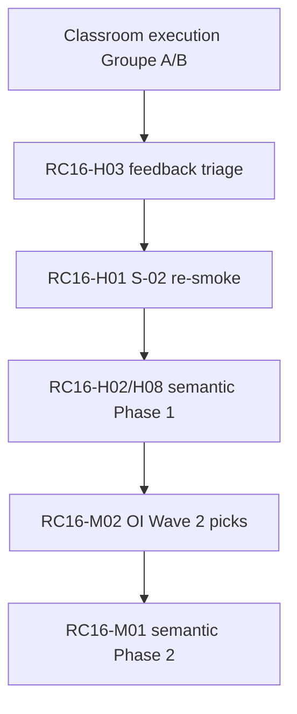

# TEC.WMS — RC16 Post-Production Improvement Backlog

**Document type:** Planning backlog (consolidation only — no implementation)  
**Programme:** TEC.LOG — Collège de la Concorde  
**Baseline release:** RC15 — Classroom Readiness (2026-07-01)  
**Purpose:** Capture improvement opportunities discovered during RC15 readiness workstreams, audits, and smoke execution. This document becomes the **planning authority after the next classroom execution** (Groupe A / Groupe B).  
**Mode:** Documentation only — **no code changes implied by this file**

---

## How to use this backlog

1. **After class:** Attach incident notes, run IDs, and instructor feedback to items marked *Post-class input required*.
2. **Prioritize:** Start with **HIGH PRIORITY**; promote or demote items based on classroom evidence.
3. **Cross-reference:** Each item cites RC15 source artifacts. IDs use prefix `RC16-`.

**Authoritative RC15 sources consolidated here:**

| Source | Role |
|--------|------|
| [`docs/releases/RC15_CLASSROOM_READINESS_REPORT.md`](../releases/RC15_CLASSROOM_READINESS_REPORT.md) | Release verdict, bugs fixed, known limitations L-01…L-08 |
| [`RC15_SEMANTIC_SCORING_IMPLEMENTATION_PLAN.md`](../../RC15_SEMANTIC_SCORING_IMPLEMENTATION_PLAN.md) | Deferred semantic layer (Phases 1–2) |
| [`docs/audits/COHORT_ISOLATION_PROFESSOR_DASHBOARD_AUDIT.md`](../audits/COHORT_ISOLATION_PROFESSOR_DASHBOARD_AUDIT.md) | Cohort model, residual boundaries |
| [`docs/audits/CHECKPOINT_CERTIFICATION_GATING_AUDIT.md`](../audits/CHECKPOINT_CERTIFICATION_GATING_AUDIT.md) | Checkpoint engine, residual observations |
| [`GUIDE_M4_M5_FINAL_QA_REVIEW.md`](../../GUIDE_M4_M5_FINAL_QA_REVIEW.md) | Student guide YELLOW findings |
| [`RC14_PREMIUM_OPERATIONAL_INTELLIGENCE_MASTER_PLAN.md`](../../RC14_PREMIUM_OPERATIONAL_INTELLIGENCE_MASTER_PLAN.md) | Deferred Wave 2/3 OI items (carried into RC16) |
| [`Documentation/M4_PEDAGOGICAL_INTELLIGENCE_AUDIT.md`](../../Documentation/M4_PEDAGOGICAL_INTELLIGENCE_AUDIT.md) | M4 pedagogical gap register |
| [`.manus-logs/agent5-final-qa-results.json`](../../.manus-logs/agent5-final-qa-results.json) | Production smoke 17/20 |

---

## Summary matrix

| ID | Title | Priority | Theme |
|----|-------|----------|-------|
| RC16-H01 | Re-smoke M3 teacher validation (S-02) post RC15-B01 deploy | HIGH | Dashboard |
| RC16-H02 | Semantic scoring Phase 1 (lexicon, shadow, normalization) | HIGH | AI Features |
| RC16-H03 | Incorporate Groupe A/B classroom feedback | HIGH | Pedagogical |
| RC16-H04 | M5 Run Report: decision replay + rubric feedback | HIGH | UX |
| RC16-H05 | M5 SCN-017 structural decision scaffold (eval) | HIGH | UX |
| RC16-H06 | M4 teacher monitor: interpretation trail column | HIGH | Dashboard |
| RC16-H07 | M5 operational KPI labeling / derivation clarity | HIGH | Pedagogical |
| RC16-H08 | Author in-repo `M4_M5_SEMANTIC_SCORING_DESIGN.md` | HIGH | AI Features |
| RC16-M01 | Semantic scoring Phase 2 (primary + keyword fallback) | MEDIUM | AI Features |
| RC16-M02 | Premium OI Wave 2 backlog (M3/M4/M5 cockpit depth) | MEDIUM | Dashboard |
| RC16-M03 | M4 scoring display economics (75/100 ceiling, step max confusion) | MEDIUM | UX | **CLOSED (RC16 doc)** — institutional policy now 100/100; engineering backlog if UI alignment needed |
| RC16-M04 | SCN-011 CC pipeline friction (confirmatory vs replenish) | MEDIUM | Pedagogical |
| RC16-M05 | Silver certificate institutional visual parity | MEDIUM | UX |
| RC16-M06 | Student guide Gold/Silver certification framing | MEDIUM | Pedagogical |
| RC16-M07 | Teacher `studentNumber` admin API + UI | MEDIUM | Dashboard |
| RC16-M08 | M3 validation queue UX (pending 75% students) | MEDIUM | Dashboard |
| RC16-M09 | Router integration tests (M5 submit paths) | MEDIUM | Technical Debt |
| RC16-M10 | Silver `cleanupAndAudit` reconciliation runbook | MEDIUM | Technical Debt |
| RC16-M11 | `ENABLE_GOLD_UNLOCK` operator policy documentation | MEDIUM | Pedagogical |
| RC16-L01 | Analytics placeholder script noise | LOW | Technical Debt |
| RC16-L02 | M5 Run Report step % vs scorer cap (30 vs 80) | LOW | UX |
| RC16-L03 | Roster-move historical-run UX warning | LOW | Dashboard |
| RC16-L04 | James Timothy Silver registry slot TEC-SIL-2026-005 | LOW | Pedagogical |
| RC16-L05 | Guide Maître slide 4 scenario anchor | LOW | Pedagogical |
| RC16-L06 | M4 quiz complacency-trap coverage | LOW | Pedagogical |
| RC16-L07 | Student guide PDF layout (post-cover blank page) | LOW | UX |

---

## HIGH PRIORITY

Items that block confidence, classroom scale-up, or address RC15 residual smoke gaps.

### RC16-H01 — Re-smoke M3 teacher validation (S-02)

- **Theme:** Dashboard / QA  
- **Source:** RC15 §9 — S-02 failed pre-fix; resolved by RC15-B01 (`isModuleReadyForTeacherValidation`)  
- **Action:** Re-run `.manus-logs/agent5-final-qa-smoke.mjs` S-02 after RC15-B01 production deploy; confirm teacher can validate M3 when all SCNs pass at ≥ 70 and `progressPct = 75%`.  
- **Acceptance:** S-02 PASS; no *« L'étudiant doit avoir réussi le Module 3 avant validation enseignant »* error.

### RC16-H02 — Semantic scoring Phase 1 sprint

- **Theme:** AI Features  
- **Source:** `RC15_SEMANTIC_SCORING_IMPLEMENTATION_PLAN.md` §6  
- **Action:** Extract lexicons; unify `normM4Text` for scoring + compliance; implement `SemanticAdapter` + embedding spike; shadow logging (`SEMANTIC_SCORING_MODE=shadow`); expand FR/EN synonyms. **Keyword path remains authoritative.**  
- **Acceptance:** `module345.rules.test.ts` unchanged green; zero live scoring drift in production.

### RC16-H03 — Post-classroom feedback incorporation

- **Theme:** Pedagogical  
- **Source:** RC15 §12 Post-Class Monitoring Checklist  
- **Action:** *Post-class input required.* Collect instructor notes on M3 validation queue, M4/M5 vocabulary friction, cohort switch issues, stuck progression, and support load. Map findings to RC16 items; promote blockers to HIGH.  
- **Acceptance:** Annotated backlog revision within 24 h of session.

### RC16-H04 — M5 Run Report decision replay

- **Theme:** UX  
- **Source:** RC14 OI plan W2-14; RC14 acceptance — Wave 2 consequence/replay deferred; RC15 L-05  
- **Action:** Surface `transactionTimeline`, `zoneFlow`, decision text, and rubric-aligned feedback on Run Report for SCN-015→017.  
- **Acceptance:** Student sees Evidence → Decision → Consequence chain without altering scoring.

### RC16-H05 — M5 SCN-017 structural decision scaffold

- **Theme:** UX  
- **Source:** RC14 OI plan W2-11 (G-P1-16); RC13 executive summary R-11  
- **Action:** Eval-mode board with empty sections: Situation / Preuve / Arbitrage / Recommandation / Horizon — structure only, no answer leakage.  
- **Acceptance:** Capstone students receive framing; canonical rejection patterns (R1–R3) still fail.

### RC16-H06 — M4 teacher monitor interpretation column

- **Theme:** Dashboard  
- **Source:** RC14 OI plan W2-05; RC14 M3 instructor CONDITIONAL GO (no tower mirror)  
- **Action:** Teacher MonitorDashboard column showing latest M4 KPI interpretation status per run (rotation/service/diagnostic correctness from `runs.state`).  
- **Acceptance:** Instructor can supervise M4 analytical runs without opening student session.

### RC16-H07 — M5 operational KPI labeling clarity

- **Theme:** Pedagogical / UX  
- **Source:** RC14 G-P1-22, W1-12; RC14 acceptance M5 CONDITIONAL GO  
- **Action:** Label service/error/lead-time KPIs as contract seed context until ops-derived values exist; prevent student assumption that ledger derives all tower values.  
- **Acceptance:** Mission Control copy matches data provenance; reduced instructor intervention on Peak Week scenarios.

### RC16-H08 — Author `M4_M5_SEMANTIC_SCORING_DESIGN.md`

- **Theme:** AI Features  
- **Source:** RC15 semantic plan §6.1 item 1.7 — reference doc cited but not in repo  
- **Action:** Publish in-repo design doc aligned with RC15 plan Section 4 (concept catalog, adapter contract, confidence policy).  
- **Acceptance:** Pedagogy + engineering sign-off gate before Phase 2.

---

## MEDIUM PRIORITY

Important quality and parity improvements; safe to schedule after HIGH items and classroom evidence.

### RC16-M01 — Semantic scoring Phase 2

- **Theme:** AI Features  
- **Source:** RC15 semantic plan §7; RC15 L-06  
- **Action:** Wire semantic-primary pipeline with keyword fallback; paraphrase + negative corpora tests; divergence alerting; student feedback citing matched concepts (no keyword leakage).  
- **Prerequisite:** RC16-H02 + RC16-H08 sign-off.  
- **Acceptance:** Canonical 100% pass; rejected corpus 100% fail; paraphrase ≥ 90%; rollback drill < 5 min.

### RC16-M02 — Premium operational intelligence Wave 2

- **Theme:** Dashboard / UX  
- **Source:** RC15 L-05; RC14 OI plan §6 (W2-01…W2-18)  
- **Action:** Execute remaining Wave 2 items — M4 KPI Evidence Feed monitor, M3 Panel B badges, M5 compliance checklist UI, causal timeline cockpit, impact preview post-decision.  
- **Acceptance:** M3/M4/M5 cockpit depth approaches M1/M2 gold standard per RC14 comparison matrix.

### RC16-M03 — M4 scoring display economics alignment

- **Theme:** UX  
- **Source:** RC15 L-01; RC15 semantic plan R-05; `RC14_M4_SCORING_FORENSIC_AUDIT.md`  
- **Action:** ~~Reconcile student-facing step max display~~ — **Institutional policy RC16:** 100/100 perfect execution. Any remaining UI/display mismatch is engineering-only backlog; **do not change** pass thresholds.  
- **Acceptance:** Students understand achievable max; no false expectation of 100/100 M4 perfect run.

### RC16-M04 — SCN-011 CC pipeline friction reduction

- **Theme:** Pedagogical / UX  
- **Source:** RC15 L-07; RC14 acceptance SCN-011 CONDITIONAL GO  
- **Action:** Strengthen confirmatory framing (amber banner, Panel F, next-action copy) or explore per-scenario step variants — **validators unchanged unless pedagogy owners approve**.  
- **Acceptance:** Reduced student confusion on replenish-only SCN-011; CC form SKU entry friction documented or mitigated.

### RC16-M05 — Silver certificate institutional visual parity

- **Theme:** UX  
- **Source:** RC14 acceptance; `RC14_SILVER_RENDER_ROOT_CAUSE.md`  
- **Action:** Deploy mockup-grade components (`CollegeCrest`, `DualSignatureBlock`, `InstitutionalCertificateFooter`); evaluate print route without full `FioriShell` chrome.  
- **Acceptance:** Collège sign-off against `CERTIFICATION_PACKAGE_V1` / PNG mockup.

### RC16-M06 — Student guide certification framing

- **Theme:** Pedagogical  
- **Source:** `GUIDE_M4_M5_FINAL_QA_REVIEW.md` §3, §8 — YELLOW  
- **Action:** Add explicit framing: M4/M5 = Gold pathway (Silver M1 prerequisite); Quiz M5 ≥ 60%; demo mode exclusion; final green compliance requirement.  
- **Acceptance:** Guide verdict moves from YELLOW to GREEN for institutional distribution.

### RC16-M07 — Teacher `studentNumber` administration

- **Theme:** Dashboard  
- **Source:** RC13 bootstrap plan §Gap; RC13 executive R-14  
- **Action:** Teacher/admin API + Student Manager UI to set `profiles.studentNumber` (required for Silver registry lookup).  
- **Acceptance:** No self-service-only dependency for new cohort onboarding.

### RC16-M08 — M3 validation queue enhancements

- **Theme:** Dashboard  
- **Source:** RC15 §6 UX; RC15 §12 post-class checklist  
- **Action:** Highlight students at 75% `progressPct` with all SCNs passed; bulk validation affordance; clearer pending vs completed states on Teacher Dashboard.  
- **Acceptance:** Instructor clears M3 queue without cross-referencing Monitor manually.

### RC16-M09 — M5 router integration test coverage

- **Theme:** Technical Debt  
- **Source:** RC12 Wave 4 audit — no `trpc.integration.test.ts` for M5 submit paths  
- **Action:** Add integration tests for `m5.submitAdj`, gated `submitKpi`, `submitDecision`, `submitComplianceM5`.  
- **Acceptance:** Router-level E2E coverage complements 86/86 certification unit suite.

### RC16-M10 — Silver reconciliation runbook

- **Theme:** Technical Debt  
- **Source:** RC15 L-08; checkpoint audit residual #3  
- **Action:** Document when to run `admin.cleanupAndAudit`; procedure for stale `silverCertified` flags after gate logic changes.  
- **Acceptance:** Operator playbook in `RAILWAY_DEPLOYMENT_RUNBOOK.md` or equivalent.

### RC16-M11 — Gold auto-award policy documentation

- **Theme:** Pedagogical  
- **Source:** RC15 L-04; checkpoint audit residual #6  
- **Action:** Institutional decision record for `ENABLE_GOLD_UNLOCK`; instructor briefing on ELIGIBLE vs AWARDED states.  
- **Acceptance:** No surprise Gold non-award at capstone session.

---

## LOW PRIORITY

Polish, documentation, and edge cases — schedule when capacity allows.

### RC16-L01 — Analytics placeholder script

- **Source:** RC13 executive R-13  
- **Action:** Configure or remove `%VITE_ANALYTICS_*%` placeholder noise in production HTML.

### RC16-L02 — M5 Run Report step percentage display

- **Source:** RC13 PED-01; RC14 G-P2-10 (`M5_DECISION` maxPoints 30 vs scorer 80)  
- **Action:** Align Run Report step % with authoritative scorer caps — display only.

### RC16-L03 — Roster move historical-run warning

- **Source:** RC15 L-03; cohort audit residual boundaries  
- **Action:** UI warning when reassigning `cohortId`: historical runs remain on `userId`.

### RC16-L04 — James Timothy Silver registry slot

- **Source:** RC13 bootstrap plan — TEC-SIL-2026-005 reserved  
- **Action:** Institutional decision + registry deploy if student completes Silver path.

### RC16-L05 — Guide Maître slide 4 scenario anchor

- **Source:** M4 pedagogical audit — slide 4 weak link  
- **Action:** Anchor productivity/cost slide to SCN or mark instructor-demo-only.

### RC16-L06 — M4 quiz complacency-trap coverage

- **Source:** M4 audit PI-M4-06  
- **Action:** Optional pre-scenario micro-debrief or quiz item additions for green-dashboard traps.

### RC16-L07 — Student guide PDF layout

- **Source:** `GUIDE_M4_M5_FINAL_QA_REVIEW.md` §10  
- **Action:** Fix post-cover blank page risk in PDF export pipeline.

---

## Future Research

Exploratory work — not committed for RC16 sprint without pedagogy + engineering spike approval.

| ID | Topic | Source | Notes |
|----|-------|--------|-------|
| RC16-FR01 | **Semantic provider selection** — embedding similarity vs lightweight classifier vs LLM rubric | RC15 §4.3 | Embedding primary; LLM fallback / teacher review only |
| RC16-FR02 | **Full ops→KPI mini-simulation M4** | RC14 W3-10 | High architectural convergence risk; XL effort |
| RC16-FR03 | **Per-scenario MODULE3_STEPS variants** | RC14 W3-03, G-P2-03 | Structural refactor; high risk |
| RC16-FR04 | **M1 checkpoint engine migration** | Checkpoint implementation plan Phase 2 | Silver engine remains authoritative; M1 legacy `recordModulePass` |
| RC16-FR05 | **Database-level cohort tenancy** | Cohort audit architectural note | Today: API/UI filter on `userId` membership; research multi-tenant isolation |
| RC16-FR06 | **Teacher manual regrade / override UI** | RC15 semantic plan §7.2 defer | Post-semantic; instructor adjudication for edge cases |
| RC16-FR07 | **Real-time ops derivation of M5 service/error/lead-time KPIs** | RC14 W3-08 | Pedagogically justify before implementation |
| RC16-FR08 | **M4 dedicated KPI_ERROR_RATE step** | RC14 W3-04, G-P2-06 | Pipeline change — requires threshold/gate review |
| RC16-FR09 | **Peak Week J1/J2/J3 cross-SCN narrative** | RC14 W3-09 | Display-only storytelling layer |
| RC16-FR10 | **Compliance preview mid-run M4** | RC14 W3-07 | Simulate compliance messages without scoring impact |

---

## Technical Debt

Known structural gaps, test holes, and consistency issues surfaced during RC15.

| ID | Item | Source | Risk if ignored |
|----|------|--------|-----------------|
| RC16-TD01 | **`scoreKpiInterpretation` diacritic normalization** — scoring uses `toLowerCase().trim()` while compliance uses `normM4Text` | RC15 semantic plan R-06, §3 | False negatives on accented student answers |
| RC16-TD02 | **M1 outside checkpoint engine** — legacy `computeModulePassResult` vs Silver 4-gate engine | Checkpoint audit residual #4 | M2 unlock vs Silver eligibility confusion persists |
| RC16-TD03 | **Silver short-circuit** — persisted `silverCertified=true` skips live revalidation on status query | RC15 L-08 | Stale flags after rule changes |
| RC16-TD04 | **Loose run-start gates** — M3/M5 eval require only M1 passed (M4 correctly gated) | Checkpoint audit residual #2 | Students can start runs before pedagogically ready |
| RC16-TD05 | **Dead server-calculated UI fields** — `transactionTimeline`, `zoneFlow` computed but not rendered on Run Report | RC14 G-P1-17 | Wasted API payload; student confusion |
| RC16-TD06 | **Missing `m3.monitor.test.ts`** | RC14 G-P2-01 | M3 monitor regressions undetected |
| RC16-TD07 | **`STEP_MAX_ALL` vs scorer economics** — M5_DECISION display 30 vs award cap 80 | RC14 G-P2-10; RC13 PED-01 | Misleading progress indicators |
| RC16-TD08 | **Uncommitted Silver institutional components** | RC14 render root cause | Production/mockup visual gap |
| RC16-TD09 | **Repository documentation sprawl** | Working tree status RC15 | Governance noise; consider archival `.gitignore` patterns post-RC16 |
| RC16-TD10 | **M1 unlock vs Silver split** — documented intentional behavior | RC15 L-02 | Requires ongoing instructor/docs clarity |
| RC16-TD11 | **In-run session % vs certification %** — orthogonal progress layers | Checkpoint audit residual #5 | Student/support misunderstanding |
| RC16-TD12 | **Router integration depth** — M5 paths lack trpc integration suite | RC12 Wave 4 audit | Regression risk on router refactors |

---

## Pedagogical Improvements

Content, guides, instructor materials, and scenario coherence — aligned with Constitution hierarchy.

| ID | Item | SCN / Module | Source | Status after RC15 |
|----|------|--------------|--------|-------------------|
| RC16-PED01 | **M4 KPI_SERVICE error-rate prompt** — classify 4% errors before diagnostic | SCN-013 | M4 audit PI-M4-01; RC15 Agent 2 analytical copy | Partially addressed via `analyticalStepQuestions.ts`; validate in class |
| RC16-PED02 | **M4 lead time visibility** — cite délai 3,5 j in diagnostic path | SCN-014 | M4 audit PI-M4-02; RC15 Agent 2 SCN-014 overrides | Copy added; monitor/OIL emphasis still thin |
| RC16-PED03 | **M4 compliance trade-off vocabulary** | SCN-014 | M4 audit PI-M4-05 | Mitigate via semantic scoring (RC16-H02) or instructor checklist |
| RC16-PED04 | **M4 scenario-differentiated step objectives** | SCN-012→014 | M4 audit PI-M4-03; RC14 W2-04 | Generic pipeline persists |
| RC16-PED05 | **SCN-011 replenish vs CC confirmatory narrative** | SCN-011 | RC15 L-07; RC14 acceptance | Mitigated not removed |
| RC16-PED06 | **M3 quiz EOQ vs SCN-011 Min/Max eval focus** | SCN-011 | RC14 ERP-03 | Misalignment documented |
| RC16-PED07 | **Student guide Gold/Silver framing + Quiz M5** | M4/M5 guides | GUIDE_M4_M5 QA §3, §8 | → RC16-M06 |
| RC16-PED08 | **Guide grammar / terminology fixes** | Guides | GUIDE_M4_M5 QA §6–7 | Triangle→cadre; portefeuille agreement |
| RC16-PED09 | **M3 teacher-validation instructor briefing** | M3 | RC15 §11 pre-class checklist | Operational doc needed |
| RC16-PED10 | **Eval scaffold gating preserved** — no answer leakage in production eval | M4/M5 | RC15 §6 | ✅ Preserved; monitor each RC |
| RC16-PED11 | **Cohorte Fondatrice preservation policy** | Ops | RC15 §10 | ✅ Enforced; not for new cohorts |
| RC16-PED12 | **M4 perfect-run scoring policy** — 100/100 official, threshold 70 | M4 | RC16 baseline | ✅ Documented in instructor guides |

---

## UX Improvements

Student-facing interaction, forms, reports, and certificates.

| ID | Item | Source | Notes |
|----|------|--------|-------|
| RC16-UX01 | **Unified analytical response field** | RC15 Agent 2 | ✅ Shipped — `AnalyticalResponseField` + `getAnalyticalQuestionText()`; gather class feedback |
| RC16-UX02 | **M5 tactical vs strategic decision wording** | RC15 Agent 2 | ✅ Shipped — `isM5Strategic` SCN-017 capstone copy |
| RC16-UX03 | **SCN-011 CC form SKU entry friction** | RC15 L-07 | ≥ 1 SKU despite replenish-only; validators accept empty targets |
| RC16-UX04 | **M3 progress messaging** — 75% = awaiting teacher validation | RC15 §6 | Clarify student-facing copy on Mission Control |
| RC16-UX05 | **M5 monitor visibility** — `showTxTable` must not hide OIL when ledger empty | RC14 W1-11 | Verify post-RC14 deploy |
| RC16-UX06 | **M5 compliance checklist UI** | RC14 W2-12 | Variance gate, snapshot, decision linked — visual gates |
| RC16-UX07 | **M4 amber alert on incorrect interpretation** | RC14 W1-05 | Panel B feedback when last interpretation wrong |
| RC16-UX08 | **M4 Run Report KPI snapshot header** | RC14 W1-08 | Canonical bundle recap at report end |
| RC16-UX09 | **Certificate print experience** | RC14 Silver render audit | Standalone print route; reduce FioriShell chrome |
| RC16-UX10 | **Cohort shell switcher stale-data prevention** | RC15 Agent 3 | ✅ Shipped — verify rapid-switch checklist post-class |
| RC16-UX11 | **M5 impact preview post-decision** (display-only) | RC14 W2-15 | Simulated KPI follow-up — not scored |
| RC16-UX12 | **Semantic student feedback labels** | RC15 Phase 2 §2.5 | Cite matched concept; no keyword leakage |

---

## Dashboard Improvements

Professor, monitor, and analytics surfaces — cohort-scoped per RC15.

| ID | Item | Source | Notes |
|----|------|--------|-------|
| RC16-DASH01 | **Cohort isolation** | RC15 Agent 3 | ✅ READY — maintain regression via `cohortScope.test.ts` |
| RC16-DASH02 | **M3 validation queue** | RC15 §6, §12 | → RC16-M08 |
| RC16-DASH03 | **M4 interpretation monitor column** | RC14 W2-05 | → RC16-H06 |
| RC16-DASH04 | **M3 instructor tower mirror** | RC14 M3 instructor CONDITIONAL GO | No teacher-side M3 operational tower today |
| RC16-DASH05 | **M3 monitor causal annotations** | RC14 W2-07 | Inline notes SCN-010/011 |
| RC16-DASH06 | **Post-class CSV anomaly review** | RC15 §12 | Zero-score / abandoned run patterns |
| RC16-DASH07 | **Gold roster blocker visibility** | RC15 scope | Per-cohort blocker summary on Teacher Dashboard |
| RC16-DASH08 | **Analytics heatmaps cohort depth** | RC15 Agent 3 | Scoped; enhance module×scenario views |
| RC16-DASH09 | **Automated post-class smoke hook** | RC15 §12 | Re-run `agent5-final-qa-smoke.mjs` on schedule after sessions |
| RC16-DASH10 | **Admin global monitor view** | Cohort audit | ✅ Admins omit `cohortId` — document for support staff |
| RC16-DASH11 | **Bulk cohort provisioning tooling** | RC15 §7 operator steps | Reduce manual Étudiants → Scénarios workflow |

---

## ERP Shared Components

Reuse and alignment of SAP Fiori–inspired primitives, transaction maps, and ERP code consistency across modules.

| ID | Item | Source | Action |
|----|------|--------|--------|
| RC16-ERP01 | **`stepErpMap.ts` coverage audit** | RC14 M3 ERP audit | Ensure MI01/MI04/MI07/MD04/MB52 mappings complete for M3–M5 steps |
| RC16-ERP02 | **`FioriPrimitives` slide vs cockpit reuse** | `client/src/components/slides/visuals/FioriPrimitives.tsx` | Extract shared tile/badge patterns for OIL panels |
| RC16-ERP03 | **`OperationalIntelligenceLayer` Panel A/B/F contract** | Mission Control architecture | Standardize props across M3/M4/M5 branches |
| RC16-ERP04 | **Annexe A KPI band component** | RC14 W1-03, W2-10 | Shared static band renderer for M4 tower + M5 OIL |
| RC16-ERP05 | **Transaction chain visualization** | M3 SCN-010 gold reference | Reusable PO→GR→SO→GI strip for M3/M5 |
| RC16-ERP06 | **StepForm ERP code parity with Fiche Mission** | M3 ERP audit ERP-01/02 | Align ROP/EOQ Guide Maître vs eval Min/Max focus |
| RC16-ERP07 | **Guide Maître slide ↔ scenario ERP alignment** | M3 audit ERP-02 | Slide 7 must include ADJ outcome (post RC14 W1-01 verify) |
| RC16-ERP08 | **M5 zone flow bar component** | `M5ZoneFlowBar.tsx` | Generalize for M2/M3 zone progression displays |
| RC16-ERP09 | **Glossary ↔ step ERP tooltips** | `client/src/data/glossary.ts` | Link MI04/MI07 terms to active step context |
| RC16-ERP10 | **Premium slide visual ERP icon set** | `PremiumSlideVisual.tsx` | Consolidate icon map for instructor deck + student hints |

---

## AI Features

Semantic scoring and intelligent evaluation — primary RC15 deferred engineering track.

| ID | Phase | Item | Source |
|----|-------|------|--------|
| RC16-AI01 | 1 | Lexicon extraction → `shared/semanticScoring/lexicons.ts` | RC15 §6.1 |
| RC16-AI02 | 1 | Unified text normalization (`normM4Text` everywhere) | RC15 §6.1, R-06 |
| RC16-AI03 | 1 | `SemanticAdapter` + embedding provider spike | RC15 §4.3 Option A |
| RC16-AI04 | 1 | Concept catalogs `concepts.m4.ts`, `concepts.m5.ts` | RC15 §4.1–4.2 |
| RC16-AI05 | 1 | Shadow mode divergence logging | RC15 §5.1, §6.1 |
| RC16-AI06 | 1 | Synonym expansion (FR/EN stems) | RC15 §6.1 |
| RC16-AI07 | 2 | Semantic-primary evaluation with keyword fallback | RC15 §7.1 |
| RC16-AI08 | 2 | Confidence policy (≥0.82 accept; 0.65–0.81 AND keyword; <0.65 fallback) | RC15 §4.3 |
| RC16-AI09 | 2 | Paraphrase acceptance test corpus (3–5 per concept × 17 gates) | RC15 §8.2 |
| RC16-AI10 | 2 | Negative trap enforcement (SCN013/017 R1–R3) | RC15 §8.2 |
| RC16-AI11 | 2 | Divergence metric `semantic_keyword_divergence_rate` | RC15 §7.1 |
| RC16-AI12 | 2 | Student feedback citing matched concepts | RC15 §7.1 |
| RC16-AI13 | — | **Frozen:** M5 KPI numeric citations (`countM5KpiNumericCitations`) — not semanticized | RC15 §1.2, §4.2 |
| RC16-AI14 | — | **Frozen:** Point budgets, pass thresholds, Gold/Silver gates | RC15 §2 |
| RC16-AI15 | — | Env flags: `ENABLE_SEMANTIC_SCORING`, `SEMANTIC_SCORING_MODE`, `SEMANTIC_CONFIDENCE_THRESHOLD` | RC15 §5.3 |
| RC16-AI16 | — | Bilingual exemplar matrix (EN answers for FR-first concepts) | RC15 R-02 |
| RC16-AI17 | — | Success metric: paraphrase pass ~40–60% → ≥90%; support tickets −30% | RC15 §11 |

**Explicitly out of scope for semantic AI work (RC15 §1.2):** KPI band calculators, M5 ledger ±5%, reception/putaway validators, M3/M1/M2 operational compliance, `calculateTotalScore` economics.

---

## RC15 remediation reference (completed — do not re-implement)

| ID | Fix | Agent |
|----|-----|-------|
| RC15-B01 | M3 teacher-validation deadlock | Agent 4 |
| RC15-B02 | M3 SCN-009/010 scaled ceiling 80→100 | Agent 1 |
| RC15-B03 | Teacher dashboard cross-cohort leakage | Agent 3 |
| RC15-B04 | Student self-service `cohortId` mutation blocked | Agent 3 |

---

## Suggested RC16 planning sequence (after next class)

1. Execute class → collect feedback (RC16-H03).  
2. Re-smoke M3 validation (RC16-H01).  
3. Parallel: semantic Phase 1 + highest classroom-friction UX/dashboard items.  
4. Pedagogy sign-off → semantic Phase 2 → paraphrase acceptance in staging.

---

*RC16 backlog — consolidated from RC15 readiness artifacts · Collège de la Concorde · 2026-07-01 · Planning document only*
