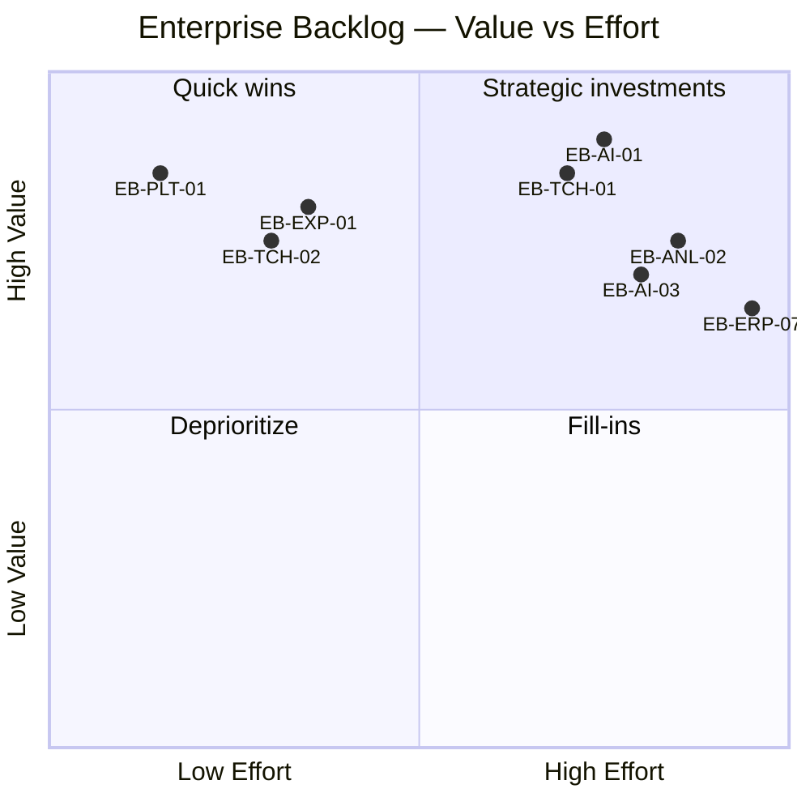

# TEC.WMS — Enterprise Backlog

**Document type:** Product backlog — business value authority  
**Programme:** TEC.LOG — Collège de la Concorde  
**Product:** TEC.WMS → TEC.ERP ecosystem  
**Baseline release:** RC19.1  
**Last updated:** 2026-07-06  
**Ordering principle:** Business value to learners, instructors, and institutional operators

---

## Backlog conventions

| Field | Definition |
|-------|------------|
| **ID** | `EB-{category}-{nn}` — category prefix + sequence |
| **Value** | Primary beneficiary and outcome |
| **Priority** | P0 Must · P1 Should · P2 Could · P3 Won't (this cycle) |
| **Effort** | T-shirt: S · M · L · XL |
| **Release** | Target governance release |

**Categories:** Experience · Teacher Experience · AI · Analytics · Platform · ERP

---

## Portfolio summary

| Category | Items | P0/P1 count | Strategic theme |
|----------|-------|-------------|-----------------|
| Experience | 12 | 5 | Enterprise learning immersion |
| Teacher Experience | 10 | 4 | Classroom operations at scale |
| AI | 8 | 3 | Intelligent evaluation and mentoring |
| Analytics | 6 | 2 | Institutional intelligence |
| Platform | 9 | 4 | Reliability, scale, governance |
| ERP | 7 | 2 | Process literacy and TEC.ERP bridge |

---

## Experience

*Student-facing enterprise immersion, debrief quality, and certification presentation.*

| ID | Title | Value | Priority | Effort | Release |
|----|-------|-------|----------|--------|---------|
| EB-EXP-01 | Activate Enterprise Debrief on Run Report | Students receive mission debrief with career signals post-scenario | P0 | M | RC20 |
| EB-EXP-02 | M5 Decision Replay on Run Report | Capstone students see Evidence → Decision → Consequence chain | P0 | L | RC21 |
| EB-EXP-03 | M5 SCN-017 structural decision scaffold | Eval-mode framing without answer leakage | P1 | M | RC21 |
| EB-EXP-04 | Silver certificate institutional visual parity | Certification artifacts match Collège brand standards | P1 | M | RC20 |
| EB-EXP-05 | M4 amber alert on incorrect KPI interpretation | Real-time feedback during analytical runs | P2 | S | RC21 |
| EB-EXP-06 | M5 compliance checklist UI | Visual gates for variance, snapshot, decision linkage | P2 | M | RC21 |
| EB-EXP-07 | M5 impact preview post-decision (display-only) | Simulated KPI follow-up reinforces consequences | P2 | M | RC21 |
| EB-EXP-08 | SCN-011 CC pipeline friction reduction | Reduced student confusion on replenish-only scenario | P2 | M | RC20 |
| EB-EXP-09 | M3 progress messaging — 75% awaiting validation | Clear student copy on teacher-validation gate | P2 | S | RC20 |
| EB-EXP-10 | Student guide Gold/Silver certification framing | Institutional clarity on M4/M5 Gold pathway | P2 | S | RC20 |
| EB-EXP-11 | Certificate print experience (standalone route) | Professional PDF output without FioriShell chrome | P2 | M | RC20 |
| EB-EXP-12 | Peak Week J1/J2/J3 cross-SCN narrative | Display-only storytelling for M5 capstone arc | P3 | L | RC24 |

---

## Teacher Experience

*Professor dashboard, cohort operations, supervision, and classroom workflow.*

| ID | Title | Value | Priority | Effort | Release |
|----|-------|-------|----------|--------|---------|
| EB-TCH-01 | Multi-instructor shared cohort access | Second professor operates assigned cohorts without admin login | P0 | L | RC18 |
| EB-TCH-02 | M3 validation queue enhancements | Bulk validation; highlight 75% ready students | P0 | M | RC20 |
| EB-TCH-03 | M4 interpretation monitor column | Supervise analytical runs without opening student session | P1 | M | RC21 |
| EB-TCH-04 | Teacher `studentNumber` admin API + UI | Onboard new cohorts without manual DB intervention | P1 | M | RC20 |
| EB-TCH-05 | M3 instructor operational tower mirror | Teacher-side M3 OIL parity with student cockpit | P2 | L | RC21 |
| EB-TCH-06 | Gold roster blocker visibility per cohort | Instructor sees ELIGIBLE vs AWARDED blockers at a glance | P2 | M | RC21 |
| EB-TCH-07 | Post-class CSV anomaly review tooling | Zero-score and abandoned run pattern detection | P2 | M | RC24 |
| EB-TCH-08 | Bulk cohort provisioning tooling | Reduce manual Étudiants → Scénarios workflow | P2 | L | RC20 |
| EB-TCH-09 | Roster-move historical-run warning | Prevent silent confusion when reassigning `cohortId` | P3 | S | RC20 |
| EB-TCH-10 | Automated post-class smoke hook | Scheduled `agent5-final-qa-smoke.mjs` after sessions | P3 | M | RC24 |
| EB-TCH-11 | Configurable duration per assessment release/cohort | Allow Class 7–style timed sessions for one cohort without changing the shared Eval1 untimed contract | P1 | M | RC22 |

---

## AI

*Semantic evaluation, AI Mentor, and future TEC.AI capabilities.*

| ID | Title | Value | Priority | Effort | Release |
|----|-------|-------|----------|--------|---------|
| EB-AI-01 | Semantic scoring Phase 1 (lexicon, shadow, normalization) | Paraphrase-tolerant M4/M5 evaluation without scoring drift | P0 | L | RC21 |
| EB-AI-02 | Author `M4_M5_SEMANTIC_SCORING_DESIGN.md` | Engineering + pedagogy sign-off gate before Phase 2 | P0 | S | RC21 |
| EB-AI-03 | AI Mentor live provider integration | Context-aware mentoring beyond dry-run scaffold | P1 | L | RC23 |
| EB-AI-04 | Semantic scoring Phase 2 (primary + keyword fallback) | Production semantic evaluation with rollback drill | P1 | XL | RC22 |
| EB-AI-05 | Semantic student feedback (matched concepts) | Actionable debrief without keyword leakage | P2 | M | RC22 |
| EB-AI-06 | AI Mentor reflection mode on completed runs | Post-mission learning conversation | P2 | M | RC22 |
| EB-AI-07 | Divergence alerting (`semantic_keyword_divergence_rate`) | Ops visibility when semantic and keyword paths disagree | P2 | S | RC22 |
| EB-AI-08 | Teacher manual regrade / override UI | Instructor adjudication for semantic edge cases | P3 | L | RC24 |

**Frozen for AI work (non-negotiable):** Point budgets, pass thresholds, Gold/Silver gates, M5 KPI numeric citations, M3/M1/M2 operational compliance validators.

---

## Analytics

*Operational intelligence, cohort analytics, and institutional reporting.*

| ID | Title | Value | Priority | Effort | Release |
|----|-------|-------|----------|--------|---------|
| EB-ANL-01 | Cohort analytics module×scenario heatmaps | Instructors identify struggling SCNs per cohort | P1 | M | RC24 |
| EB-ANL-02 | Learning analytics pipeline (event capture) | Foundation for institutional outcome measurement | P1 | XL | RC24 |
| EB-ANL-03 | Mission Control OIL Wave 2 depth (M3/M4/M5) | Cockpit intelligence approaches M1/M2 gold standard | P2 | L | RC21 |
| EB-ANL-04 | M4 KPI Evidence Feed on teacher monitor | Instructor sees evidence trail without student login | P2 | M | RC21 |
| EB-ANL-05 | Certification intelligence dashboard | Silver/Gold funnel, blocker taxonomy, cohort comparison | P2 | L | RC24 |
| EB-ANL-06 | Configure or remove analytics placeholder noise | Clean production HTML; optional telemetry hook | P3 | S | RC24 |

---

## Platform

*Infrastructure, reliability, auth, deployment, and enterprise scale.*

| ID | Title | Value | Priority | Effort | Release |
|----|-------|-------|----------|--------|---------|
| EB-PLT-01 | Server-side checkpoint recompute on `completeRun` | Consistent progression state for monitor and API consumers | P0 | S | RC20 |
| EB-PLT-02 | M5 router integration test suite | Regression safety on capstone submit paths | P1 | M | RC21 |
| EB-PLT-03 | Silver `cleanupAndAudit` operator runbook | Stale certification flag reconciliation procedure | P1 | S | RC20 |
| EB-PLT-04 | `ENABLE_GOLD_UNLOCK` institutional policy record | No surprise Gold non-award at capstone session | P1 | S | RC20 |
| EB-PLT-05 | External verify DNS (`verify.teclog.ca`) | Public institutional verification branding | P2 | M | Platform |
| EB-PLT-06 | M1 checkpoint engine migration | Unified progression model across all modules | P2 | L | RC21 |
| EB-PLT-07 | Database-level cohort tenancy research | Multi-tenant isolation for future institutional scale | P3 | XL | TEC.ERP |
| EB-PLT-08 | Repository governance archival | Reduce audit sprawl; canonical paths under `/governance` | P3 | M | RC24 |
| EB-PLT-09 | Hosting independence feasibility execution | Reduce Railway single-vendor dependency | P3 | XL | Platform |

---

## ERP

*Process literacy, ERP Explorer, and TEC.ERP product bridge.*

| ID | Title | Value | Priority | Effort | Release |
|----|-------|-------|----------|--------|---------|
| EB-ERP-01 | ERP Explorer interactive depth (Process Mapping Part IX) | Students connect WMS steps to enterprise process families | P1 | M | RC21 |
| EB-ERP-02 | `stepErpMap.ts` coverage audit M3–M5 | Complete MI01/MI04/MI07/MD04/MB52 mappings | P2 | S | RC21 |
| EB-ERP-03 | Shared FioriPrimitives → OIL panel reuse | Visual consistency across cockpit and slides | P2 | M | RC21 |
| EB-ERP-04 | Annexe A KPI band shared component | Unified static band renderer M4 tower + M5 OIL | P2 | M | RC21 |
| EB-ERP-05 | Transaction chain visualization reuse | PO→GR→SO→GI strip generalized M3/M5 | P2 | M | RC22 |
| EB-ERP-06 | Glossary ↔ step ERP tooltip linkage | Contextual MI04/MI07 terms during active steps | P3 | S | RC22 |
| EB-ERP-07 | TEC.ERP process ribbon prototype | Bridge from WMS simulator to full ERP learning product | P3 | XL | TEC.ERP |

---

## Value prioritization matrix

---

## Suggested delivery waves

| Wave | Releases | Focus |
|------|----------|-------|
| **Wave A — Classroom hardening** | RC19.1 → RC20 | SCN fixes, debrief activation, teacher queue, platform sync |
| **Wave B — Enterprise intelligence** | RC21 → RC22 | Semantic scoring, OI Wave 2, decision replay, AI Mentor live prep |
| **Wave C — Institutional scale** | RC23 → RC24 | OpenAI integration, learning analytics, multi-product bridge |
| **Wave D — Product expansion** | TEC.ERP · TEC.AI · TEC.SCM | Full ERP simulator, AI product line, supply chain module |

---

## Post-classroom input required

The following items require **Summer 2026 Groupe A/B classroom evidence** before promotion:

- EB-EXP-08 (SCN-011 friction)
- EB-EXP-09 (M3 validation messaging)
- EB-TCH-02 (validation queue UX)
- EB-EXP-10 (student guide framing)

**Action:** Instructor debrief within 24 h of session → annotate backlog → promote blockers to P0.

---

## Cross-references

| Artifact | Location |
|----------|----------|
| Technical Debt Register | [`../TechnicalDebt/TECHNICAL_DEBT_REGISTER.md`](../TechnicalDebt/TECHNICAL_DEBT_REGISTER.md) |
| Vision Roadmap | [`../VisionRoadmap/VISION_ROADMAP.md`](../VisionRoadmap/VISION_ROADMAP.md) |
| RC16 legacy backlog | `docs/backlog/RC16_BACKLOG.md` |
| Enterprise Manifesto | `Documentation/TEC_ENTERPRISE_EXPERIENCE_MANIFESTO_V1.md` |

---

*TEC.WMS Enterprise Backlog · Product Governance · 2026-07-06*
